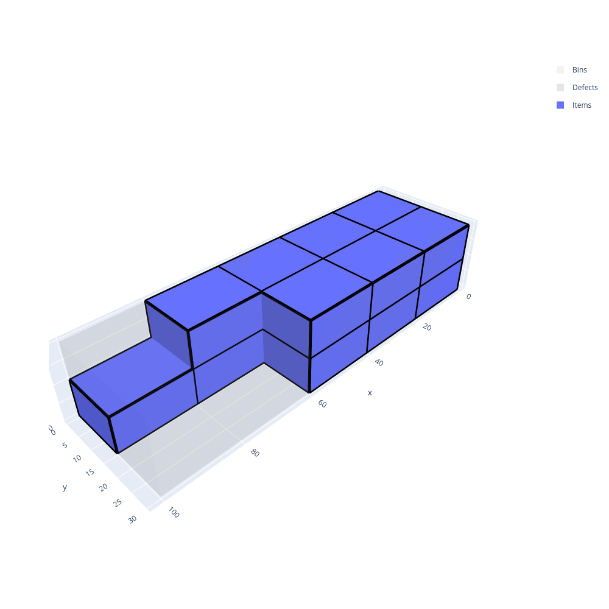

.. _box:

Box solver
==========

The Box solver solves three-dimensional bin packing problems where items are rectangular parallelepipeds (boxes) that must be packed into rectangular bins without overlapping. Unlike the :ref:`BoxStacks<boxstacks>` solver, items are placed freely in 3D space — they are not restricted to vertical stacks and do not need to share a footprint.

.. image:: ../img/box.png
   :width: 512pt
   :align: center

These problems occur for example in container loading, truck loading, and warehouse picking.

Features:

* Objectives:

  * Knapsack
  * Bin packing
  * Bin packing with leftovers
  * Open dimension X
  * Open dimension Y
  * Variable-sized bin packing

* Item types

  * 3D rotations (up to 6 orientations per item)
  * Weight

* Bin types

  * Maximum weight

Usage
-----

The Box solver takes as input:

* an item CSV file; option: ``--items items.csv``
* a bin CSV file; option: ``--bins bins.csv``
* optionally a parameter CSV file; option: ``--parameters parameters.csv``

It outputs:

* a solution CSV file; option: ``--certificate solution.csv``

The **item file** contains:

* The X dimension of the item type (**mandatory**)

  * column ``X``
  * **Integer value**

* The Y dimension of the item type (**mandatory**)

  * column ``Y``
  * **Integer value**

* The Z dimension of the item type (**mandatory**) — the vertical dimension in the default orientation

  * column ``Z``
  * **Integer value**

* The number of copies of the item type

  * column ``COPIES``
  * default value: ``1``

* The profit of an item of this type (for a knapsack objective)

  * column ``PROFIT``
  * default value: item volume (``X * Y * Z``)

* The weight of the item

  * column ``WEIGHT``
  * default value: ``0``

* The allowed orientations, encoded as a bitmask

  * column ``ROTATIONS``
  * default value: ``1`` (default orientation only)
  * See `Rotations`_ below

The **bin file** contains:

* The X dimension of the bin type (**mandatory**)

  * column ``X``
  * **Integer value**

* The Y dimension of the bin type (**mandatory**)

  * column ``Y``
  * **Integer value**

* The Z dimension of the bin type (**mandatory**) — the height of the bin

  * column ``Z``
  * **Integer value**

* The number of copies of the bin type

  * column ``COPIES``
  * default value: ``1``

* The minimum number of copies that must be used

  * column ``COPIES_MIN``
  * default value: ``0``

* The cost of a bin of this type (for a variable-sized bin packing objective)

  * column ``COST``
  * default value: bin volume

* The maximum total weight allowed in a bin of this type

  * column ``MAXIMUM_WEIGHT``
  * default value: no limit

The **parameter file** has two columns: ``NAME`` and ``VALUE``. The possible entries are:

* The objective; name: ``objective``; possible values:

  * ``knapsack``
  * ``bin-packing``
  * ``bin-packing-with-leftovers``
  * ``open-dimension-x``
  * ``open-dimension-y``
  * ``variable-sized-bin-packing``

Basic example
-------------

Inputs:

.. literalinclude:: examples/box/items.csv
   :caption: items.csv

.. literalinclude:: examples/box/bins.csv
   :caption: bins.csv

.. literalinclude:: examples/box/parameters.csv
   :caption: parameters.csv

Solve:

.. code-block:: shell

    packingsolver_box \
            --items items.csv \
            --bins bins.csv \
            --parameters parameters.csv \
            --certificate solution.csv

.. literalinclude:: examples/box/output.txt

Visualize:

.. code-block:: shell

    python3 scripts/visualize_box.py solution.csv

Rotations
---------

The six possible 3D orientations of a box are:

.. list-table::
   :header-rows: 1

   * - Rotation id
     - X direction
     - Y direction
     - Z direction (vertical)
   * - 0
     - x
     - y
     - z
   * - 1
     - y
     - x
     - z
   * - 2
     - z
     - y
     - x
   * - 3
     - y
     - z
     - x
   * - 4
     - x
     - z
     - y
   * - 5
     - z
     - x
     - y

The ``ROTATIONS`` column is a **bitmask**: bit *k* (value 2^k) is set if rotation *k* is allowed. Common values:

* ``1`` (= 2^0): only the default orientation
* ``3`` (= 2^0 + 2^1): Z face always on top; both XY rotations allowed
* ``15`` (= 2^0 + 2^1 + 2^2 + 2^3): Y face cannot be on top
* ``51`` (= 2^0 + 2^1 + 2^4 + 2^5): X face cannot be on top
* ``63`` (= all 6 bits): all six orientations allowed

Comparison with BoxStacks
--------------------------

The Box and :ref:`BoxStacks<boxstacks>` solvers both handle 3D rectangular bin packing. The key difference is in how items are arranged vertically:

* **Box**: items can be placed anywhere in 3D space; any item can rest on top of any other item regardless of their footprints.
* **BoxStacks**: items are organized into vertical stacks; an item can only be placed on top of another item if they share the same footprint and stackability identifier.

Use **Box** when items can be placed freely in 3D and there are no stacking-compatibility constraints. Use **BoxStacks** when items must be organized into vertical stacks with matching footprints, or when stacking constraints (maximum weight above, nesting height, etc.) are needed.
