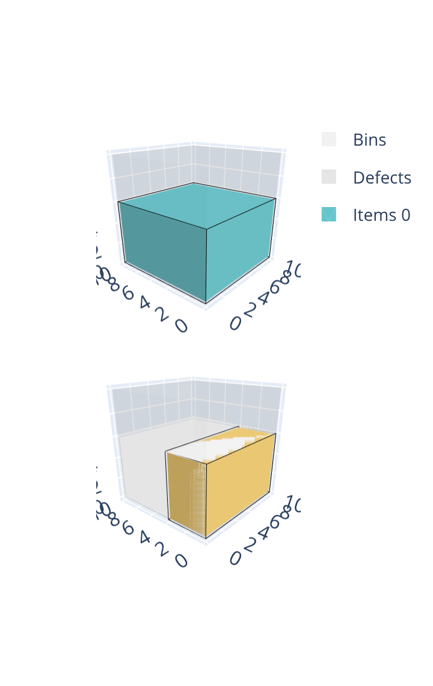
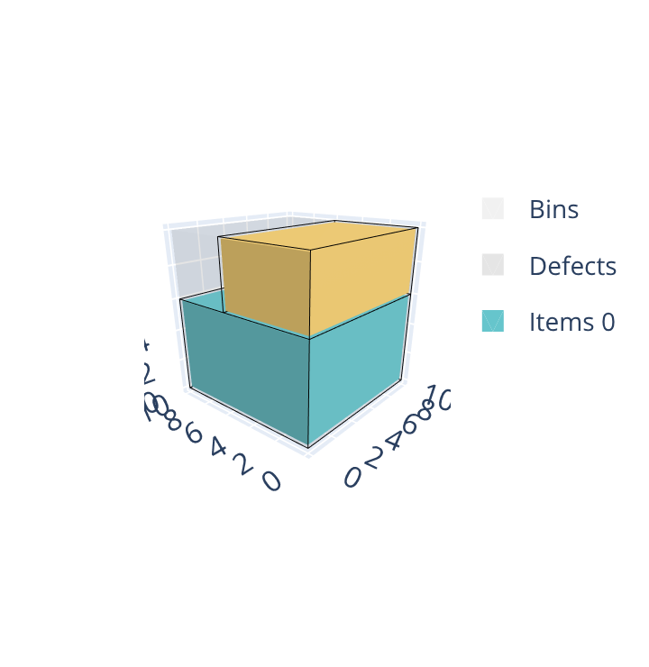
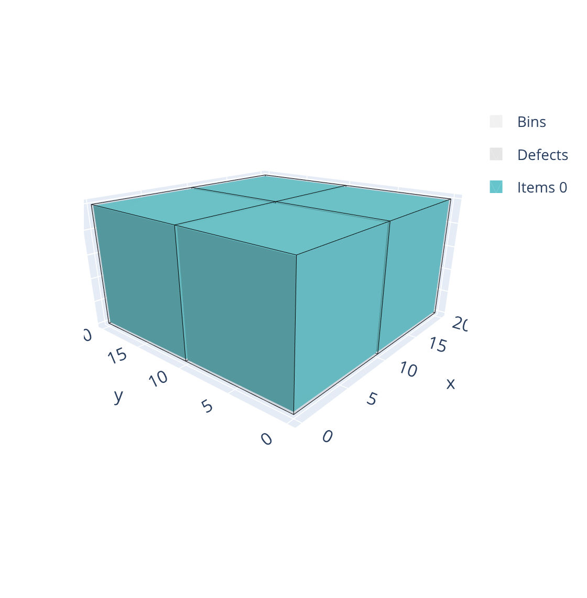
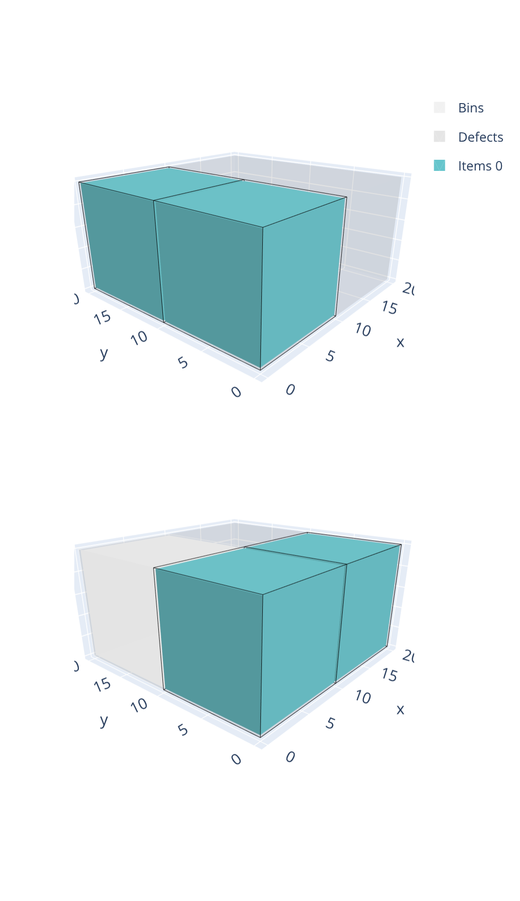

.. _box:

:code:`box` solver
==================

The :code:`box` solver solves three-dimensional bin packing problems where items are rectangular parallelepipeds (boxes) that must be packed into rectangular bins without overlapping. Unlike the :ref:`box-stacks<boxstacks>` solver, items are placed freely in 3D space — they are not restricted to vertical stacks and do not need to share a footprint.

.. image:: ../img/box.png
   :width: 512pt
   :align: center

These problems occur for example in container loading, truck loading, and warehouse picking.

Features:

* Objectives:

  * Knapsack
  * Bin packing
  * Bin packing with leftovers
  * Open dimension X
  * Open dimension Y
  * Variable-sized bin packing

* Select allowed item rotations (among the 6 possible rotations)

* Maximum weight in bins

Basic usage
--------------

The :code:`box` solver takes as input:

* an item CSV file; option: ``--items items.csv``
* a bin CSV file; option: ``--bins bins.csv``
* optionally a parameter CSV file; option: ``--parameters parameters.csv``

It outputs:

* a solution CSV file; option: ``--certificate solution.csv``

The **item file** contains:

* The X dimension of the item type (**mandatory**)

  * column ``X``
  * **Integer value**

* The Y dimension of the item type (**mandatory**)

  * column ``Y``
  * **Integer value**

* The Z dimension of the item type (**mandatory**) — the vertical dimension in the default orientation

  * column ``Z``
  * **Integer value**

* The number of copies of the item type

  * column ``COPIES``
  * default value: ``1``

* The profit of an item of this type (for a knapsack objective)

  * column ``PROFIT``
  * default value: item volume (``X * Y * Z``)

The **bin file** contains:

* The X dimension of the bin type (**mandatory**)

  * column ``X``
  * **Integer value**

* The Y dimension of the bin type (**mandatory**)

  * column ``Y``
  * **Integer value**

* The Z dimension of the bin type (**mandatory**) — the height of the bin

  * column ``Z``
  * **Integer value**

* The number of copies of the bin type

  * column ``COPIES``
  * default value: ``1``

* The minimum number of copies that must be used

  * column ``COPIES_MIN``
  * default value: ``0``

* The cost of a bin of this type (for a variable-sized bin packing objective)

  * column ``COST``
  * default value: bin volume

The **parameter file** has two columns: ``NAME`` and ``VALUE``. The possible entries are:

* The objective; name: ``objective``; possible values:

  * ``knapsack``
  * ``bin-packing``
  * ``bin-packing-with-leftovers``
  * ``open-dimension-x``
  * ``open-dimension-y``
  * ``variable-sized-bin-packing``

Inputs:

.. literalinclude:: examples/box/items.csv
   :caption: items.csv

.. literalinclude:: examples/box/bins.csv
   :caption: bins.csv

.. literalinclude:: examples/box/parameters.csv
   :caption: parameters.csv

Solve:

.. code-block:: shell

    packingsolver_box \
            --items items.csv \
            --bins bins.csv \
            --parameters parameters.csv \
            --certificate solution.csv \
            --time-limit 5

.. literalinclude:: examples/box/output.txt

Visualize:

.. code-block:: shell

    python3 scripts/visualize_box.py solution.csv

.. image:: img/box_example_solution.png
   :width: 512pt
   :align: center

Rotations
---------

* The allowed orientations

  * columns ``ROTATION_XYZ``, ``ROTATION_YXZ``, ``ROTATION_ZYX``, ``ROTATION_YZX``, ``ROTATION_XZY``, ``ROTATION_ZXY``
  * ``1``: this orientation is allowed; ``0`` or omitted: not allowed
  * default: if none of these columns is set to ``1``, only ``ROTATION_XYZ`` (the default orientation) is used

The six possible 3D orientations of a box are:

.. list-table::
   :header-rows: 1

   * - Column
     - X direction
     - Y direction
     - Z direction (vertical)
   * - ``ROTATION_XYZ``
     - x
     - y
     - z
   * - ``ROTATION_YXZ``
     - y
     - x
     - z
   * - ``ROTATION_ZYX``
     - z
     - y
     - x
   * - ``ROTATION_YZX``
     - y
     - z
     - x
   * - ``ROTATION_XZY``
     - x
     - z
     - y
   * - ``ROTATION_ZXY``
     - z
     - x
     - y

Each rotation is enabled independently via its own boolean column (``1`` to allow it, ``0`` or omitted to disallow it). If none of the ``ROTATION_*`` columns is set, only ``ROTATION_XYZ`` (the default orientation) is used. Common combinations:

* Only ``ROTATION_XYZ``: only the default orientation
* ``ROTATION_XYZ`` and ``ROTATION_YXZ``: Z face always on top; both XY rotations allowed
* ``ROTATION_XYZ``, ``ROTATION_YXZ``, ``ROTATION_ZYX`` and ``ROTATION_YZX``: Y face cannot be on top
* ``ROTATION_XYZ``, ``ROTATION_YXZ``, ``ROTATION_XZY`` and ``ROTATION_ZXY``: X face cannot be on top
* All six columns set to ``1``: all six orientations allowed

The following example packs a 10×10×6 item and a 10×4×6 item into 10×10×10 bins (:code:`bin-packing` objective). The first item fills the bottom of a bin exactly, leaving a 10×10×4 gap on top. Without rotation, the second item keeps its 6-high default orientation, which does not fit in that gap, so it needs a second bin. Allowing ``ROTATION_XZY`` for the second item lets it be turned on its side (effectively 10×6×4), which fits exactly into the remaining gap, so both items pack into a single bin.

.. list-table::
   :widths: 1 1
   :header-rows: 1
   :align: center

   * - Without rotation
     - With rotation
   * - .. literalinclude:: examples/box/rotation_no/items.csv
          :caption: items.csv
     - .. literalinclude:: examples/box/rotation_yes/items.csv
          :caption: items.csv
   * - .. literalinclude:: examples/box/rotation_no/bins.csv
          :caption: bins.csv
     - .. literalinclude:: examples/box/rotation_yes/bins.csv
          :caption: bins.csv
   * - .. literalinclude:: examples/box/rotation_no/parameters.csv
          :caption: parameters.csv
     - .. literalinclude:: examples/box/rotation_yes/parameters.csv
          :caption: parameters.csv
   * - .. code-block:: shell

            packingsolver_box \
                    --items items.csv \
                    --bins bins.csv \
                    --parameters parameters.csv \
                    --certificate solution.csv
     - .. code-block:: shell

            packingsolver_box \
                    --items items.csv \
                    --bins bins.csv \
                    --parameters parameters.csv \
                    --certificate solution.csv
   * - |box_rotation_no|
     - |box_rotation_yes|

Maximum weight
--------------

Each bin type may have a maximum weight limit: the total weight of items placed in any bin must not exceed its maximum weight.

* The weight of the item

  * column ``WEIGHT``
  * default value: ``0``

* The maximum total weight allowed in a bin of this type

  * column ``MAXIMUM_WEIGHT``
  * default value: no limit

The following example packs 4 items of size 10×10×10 with weight 100 each into 20×20×10 bins. Without a weight limit, all 4 items (total weight 400) fit in a single bin arranged as a 2×2 grid. With ``MAXIMUM_WEIGHT=200``, at most 2 items can share a bin, so 2 bins are required.

.. list-table::
   :widths: 1 1
   :header-rows: 1
   :align: center

   * - Without maximum weight
     - With maximum weight
   * - .. literalinclude:: examples/box/maximum_weight_no/items.csv
          :caption: items.csv
     - .. literalinclude:: examples/box/maximum_weight_yes/items.csv
          :caption: items.csv
   * - .. literalinclude:: examples/box/maximum_weight_no/bins.csv
          :caption: bins.csv
     - .. literalinclude:: examples/box/maximum_weight_yes/bins.csv
          :caption: bins.csv
   * - .. literalinclude:: examples/box/maximum_weight_no/parameters.csv
          :caption: parameters.csv
     - .. literalinclude:: examples/box/maximum_weight_yes/parameters.csv
          :caption: parameters.csv
   * - .. code-block:: shell

            packingsolver_box \
                    --items items.csv \
                    --bins bins.csv \
                    --parameters parameters.csv \
                    --certificate solution.csv
     - .. code-block:: shell

            packingsolver_box \
                    --items items.csv \
                    --bins bins.csv \
                    --parameters parameters.csv \
                    --certificate solution.csv
   * - |box_maximum_weight_no|
     - |box_maximum_weight_yes|
