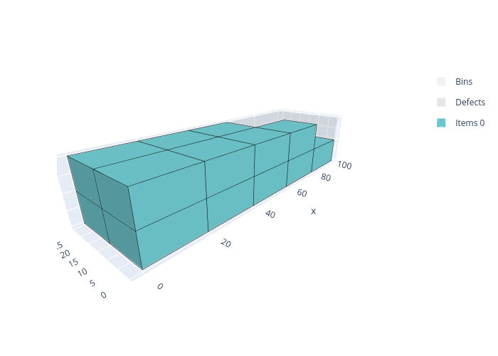
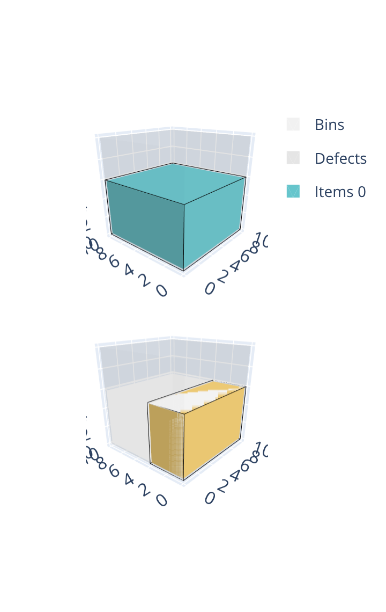
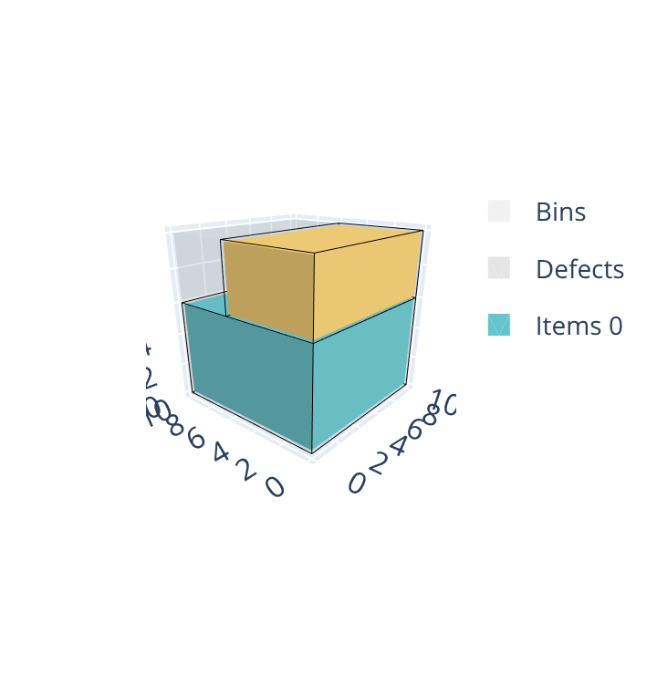
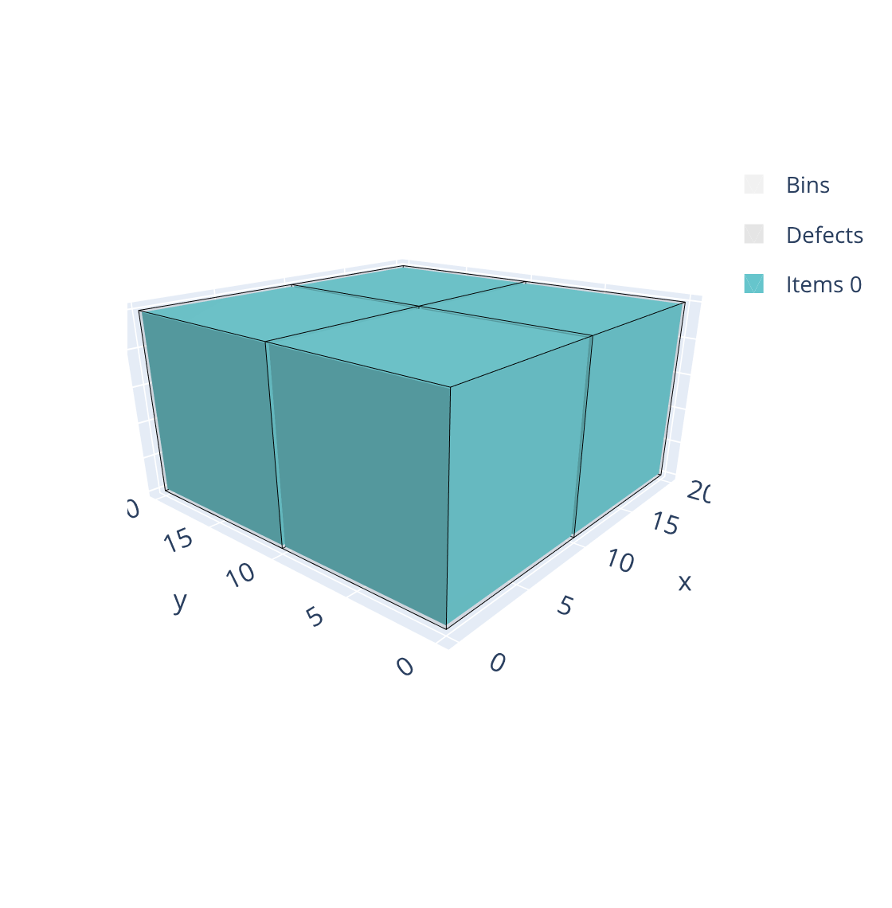
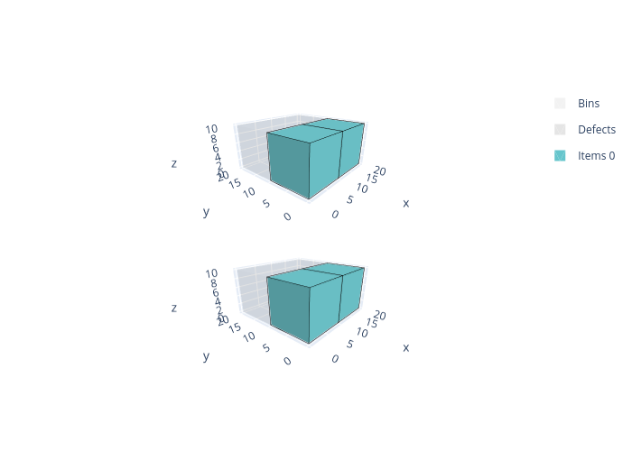

.. _box:

:code:`box` solver
==================

The :code:`box` solver solves three-dimensional bin packing problems where items are rectangular parallelepipeds (boxes) that must be packed into rectangular bins without overlapping. Unlike the :ref:`box-stacks<boxstacks>` solver, items are placed freely in 3D space — they are not restricted to vertical stacks and do not need to share a footprint.

.. image:: ../img/box.png
   :width: 512pt
   :align: center

These problems occur for example in container loading, truck loading, and warehouse picking.

Features:

* Objectives:

  * Knapsack
  * Bin packing
  * Bin packing with leftovers
  * Open dimension X
  * Open dimension Y
  * Open dimension Z
  * Variable-sized bin packing

* Select allowed item rotations (among the 6 possible rotations)

* Maximum weight in bins

Basic usage
-----------

An instance is described in the JSON format below. The `online solver <https://packingsolver.pages.dev/>`_ downloads its instances in this format (**Download**) and loads them (**Load a JSON file**), the command-line solver reads them (``--input``), and the Python package and the C++ library read them with ``InstanceBuilder.read``. Instances can also be built directly with the ``InstanceBuilder`` of the Python package and of the C++ library.

In the following example, the items of three item types are packed in a bin of size 216 × 173 × 110, maximizing the volume of the items packed:

.. example-tabs:: box/basic
   :solve:

The solution:

Instance format
^^^^^^^^^^^^^^^

An instance is a JSON object with the following fields:

.. list-table::
   :header-rows: 1
   :widths: 1 3

   * - Field
     - Description
   * - ``objective``
     - **Mandatory**. One of ``knapsack``, ``bin-packing``, ``bin-packing-with-leftovers``, ``open-dimension-x``, ``open-dimension-y``, ``open-dimension-z``, ``variable-sized-bin-packing``; see :ref:`objectives`
   * - ``leftover_mode``
     - How the leftover of the last bin is measured, for the ``bin-packing-with-leftovers`` objective: the volume of the bin minus the volume used, which is the box from the origin of the bin to the items along the dimensions of the mode, and the whole bin along the other dimensions. One of ``XYZ`` (default; the bounding box of the items), ``XY``, ``XZ``, ``YZ``, ``X`` (the length of the bin used along X, times the Y and Z dimensions of the bin), ``Y``, ``Z``
   * - ``bin_types``
     - **Mandatory**. The bin types (array)
   * - ``item_types``
     - **Mandatory**. The item types (array)

A **bin type** has the following fields:

.. list-table::
   :header-rows: 1
   :widths: 1 3

   * - Field
     - Description
   * - ``x``, ``y``, ``z``
     - **Mandatory**. The dimensions of the bins (integers); ``z`` is the height
   * - ``copies``
     - The number of copies of the bin type. Default: ``1``; ``-1`` for an unlimited number of copies
   * - ``copies_min``
     - The minimum number of copies of the bin type to use, for the variable-sized bin packing objective. Default: ``0``
   * - ``cost``
     - The cost of a bin of this type, for the variable-sized bin packing objective. Default: the volume of the bin
   * - ``maximum_weight``
     - See :ref:`box-maximum-weight`. Default: no limit

An **item type** has the following fields:

.. list-table::
   :header-rows: 1
   :widths: 1 3

   * - Field
     - Description
   * - ``x``, ``y``, ``z``
     - **Mandatory**. The dimensions of the items (integers)
   * - ``copies``
     - The number of copies of the item type. Default: ``1``; ``-1`` for an unlimited number of copies (knapsack objective only)
   * - ``copies_min``
     - The minimum number of copies of the item type to pack, for the knapsack objective. Default: ``0``
   * - ``profit``
     - The profit of an item of this type, for the knapsack objective. Default: the volume of the item
   * - ``rotations``
     - See :ref:`box-item-rotations`. Default: ``["XYZ"]``
   * - ``weight``
     - See :ref:`box-maximum-weight`. Default: ``0``

In Python, the optional fields of the bin types and of the item types are keyword arguments of ``InstanceBuilder.add_bin_type`` and ``InstanceBuilder.add_item_type``, with the same names. In C++, they are set with the ``InstanceBuilder.set_bin_type_<field>`` and ``InstanceBuilder.set_item_type_<field>`` methods; the examples below show the exceptions.

Certificate format
^^^^^^^^^^^^^^^^^^

The solution is written (command-line option ``--certificate``, ``Solution.write``) as a CSV file with the columns ``TYPE``, ``ID``, ``COPIES``, ``BIN``, ``X``, ``Y``, ``Z``, ``LX``, ``LY``, ``LZ``, ``ROTATION``. Each line is:

* a bin (``TYPE`` ``BIN``): ``ID`` is its bin type, ``COPIES`` the number of identical bins it stands for, ``BIN`` its index in the solution, and ``LX``, ``LY``, ``LZ`` its dimensions;
* an item (``TYPE`` ``ITEM``): ``ID`` is its item type, ``BIN`` the index of its bin, ``X``, ``Y``, ``Z`` the position of its corner of smallest coordinates, ``LX``, ``LY``, ``LZ`` its dimensions once placed, and ``ROTATION`` its rotation.

.. literalinclude:: examples/box/basic/solution.csv
   :caption: solution.csv
   :lines: 1-8

To visualize a solution, open it in the `solution viewer <https://packingsolver.pages.dev/viewer.html>`_, or run:

.. code-block:: shell

    python3 scripts/visualize.py solution.csv

.. _box-item-rotations:

Item rotations
--------------

By default, the items keep their original orientation. The allowed rotations of an item type are given among the six possible rotations of a box:

.. list-table::
   :header-rows: 1

   * - Rotation
     - X direction
     - Y direction
     - Z direction (vertical)
   * - ``XYZ``
     - x
     - y
     - z
   * - ``YXZ``
     - y
     - x
     - z
   * - ``ZYX``
     - z
     - y
     - x
   * - ``YZX``
     - y
     - z
     - x
   * - ``XZY``
     - x
     - z
     - y
   * - ``ZXY``
     - z
     - x
     - y

Common combinations:

* ``XYZ``: only the original orientation (default)
* ``XYZ`` and ``YXZ``: the Z face always on top
* ``XYZ``, ``YXZ``, ``ZYX`` and ``YZX``: the Y face never on top
* ``XYZ``, ``YXZ``, ``XZY`` and ``ZXY``: the X face never on top
* all six rotations

.. tab-set::
   :sync-group: interface

   .. tab-item:: Online solver
      :sync: web

      In the **Item types** table, check the allowed rotations of each item type.

   .. tab-item:: JSON
      :sync: json

      In an item type: ``"rotations": ["XYZ", "XZY"]``.

   .. tab-item:: Python
      :sync: python

      ``instance_builder.add_item_type(x, y, z, rotations=[psb.Rotation.XYZ, psb.Rotation.XZY])``

   .. tab-item:: C++
      :sync: cpp

      ``instance_builder.add_item_type_rotation(item_type_id, Rotation::XZY);``, once for each allowed rotation.

In the following example, a 10 × 10 × 6 item and a 10 × 4 × 6 item are packed in bins of size 10 × 10 × 10 (:code:`bin-packing` objective). The first item fills the bottom of a bin, leaving a 10 × 10 × 4 gap on top. When the items keep their orientation, the second item is 6 high and doesn't fit in that gap, so a second bin is needed. When the rotation ``XZY`` is allowed for the second item, it is turned on its side (10 × 6 × 4) and fits in the gap: both items are packed in a single bin.

.. list-table::
   :widths: 1 1
   :header-rows: 1
   :align: center

   * - Oriented items
     - Items which can be rotated
   * - |box_rotation_no|
     - |box_rotation_yes|

.. example-tabs:: box/rotation_no box/rotation_yes

.. _box-maximum-weight:

Maximum total weight in a bin
-----------------------------

Each bin type may have a maximum weight: the total weight of the items packed in a bin must not exceed it.

.. tab-set::
   :sync-group: interface

   .. tab-item:: Online solver
      :sync: web

      Fill the **Weight** column of the **Item types** table, and the **Maximum weight** column of the **Bin types** table.

   .. tab-item:: JSON
      :sync: json

      In an item type: ``"weight": 100``; in a bin type: ``"maximum_weight": 200``.

   .. tab-item:: Python
      :sync: python

      ``instance_builder.add_item_type(x, y, z, weight=100)`` and ``instance_builder.add_bin_type(x, y, z, maximum_weight=200)``

   .. tab-item:: C++
      :sync: cpp

      ``instance_builder.set_item_type_weight(item_type_id, 100);`` and ``instance_builder.set_bin_type_maximum_weight(bin_type_id, 200);``

In the following example, 4 items of size 10 × 10 × 10 and of weight 100 are packed in bins of size 20 × 20 × 10. Without a maximum weight, the 4 items (total weight 400) fit in a single bin, as a 2 × 2 grid. With a maximum weight of 200, at most 2 items can share a bin, so 2 bins are needed.

.. list-table::
   :widths: 1 1
   :header-rows: 1
   :align: center

   * - Without maximum weight
     - With maximum weight
   * - |box_maximum_weight_no|
     - |box_maximum_weight_yes|

.. example-tabs:: box/maximum_weight_no box/maximum_weight_yes
