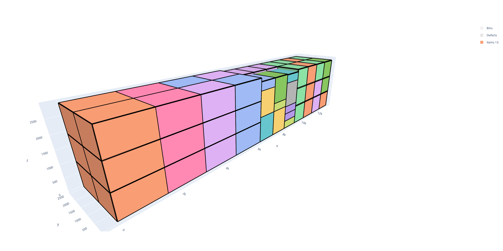
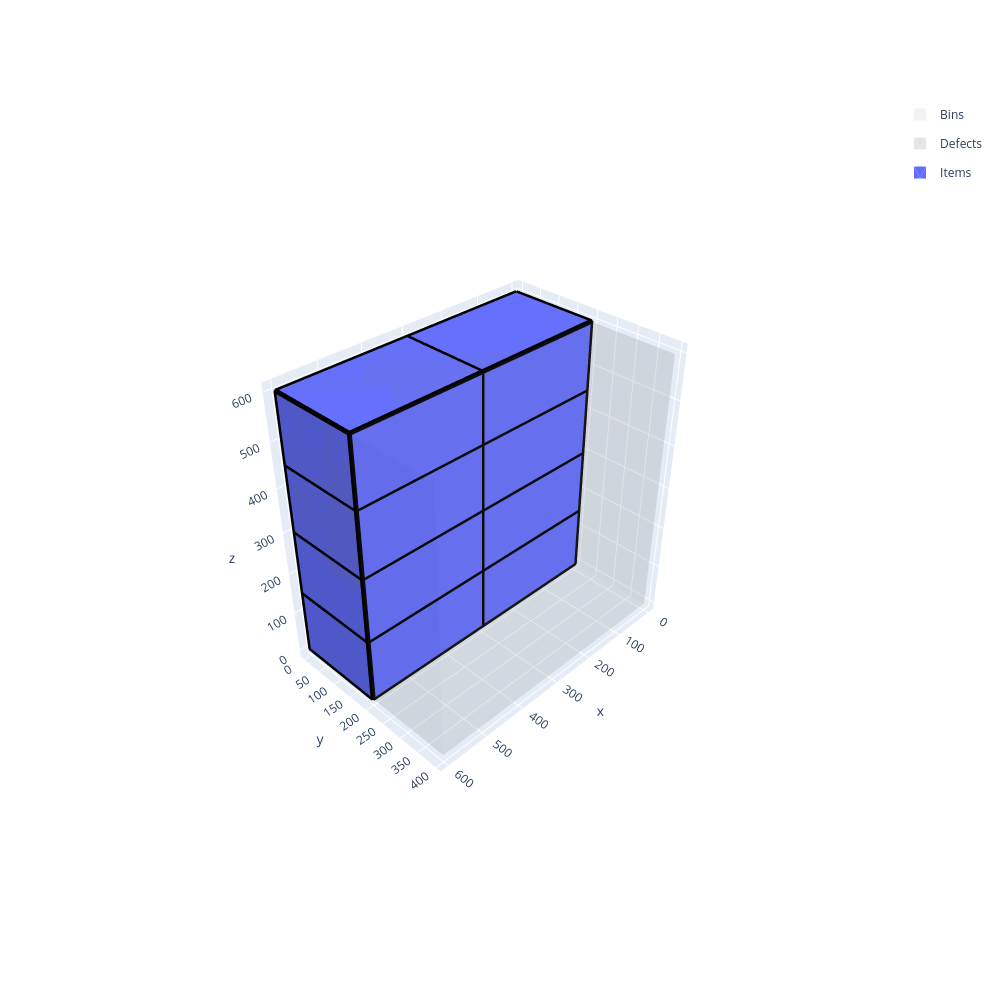

.. _boxstacks:

BoxStacks solver
================

The BoxStacks solver solves three-dimensional bin packing problems where items are rectangular parallelepipeds (boxes) that must be packed into rectangular bins. Items can be stacked vertically: a **stack** is a column of items that all have the same footprint (X and Y dimensions) and the same stackability identifier.

These problems occur for example in pallet building, container loading, and warehouse management.

Features:

* Objectives:

  * Knapsack
  * Bin packing
  * Bin packing with leftovers
  * Open dimension X
  * Open dimension Y
  * Open dimension Z
  * Open dimension XY
  * Variable-sized bin packing

* Item types

  * 3D rotations (up to 6 orientations per item)
  * Groups (for unloading constraints)
  * Weight
  * Stacking constraints

    * Stackability identifier
    * Nesting height
    * Maximum number of items in a stack
    * Maximum weight above an item

* Bin types

  * Maximum weight
  * Maximum stack density (weight per unit floor area)

* Unloading constraints (same as the :ref:`Rectangle<rectangle>` solver)

Usage
-----

The BoxStacks solver takes as input:

* an item CSV file; option: ``--items items.csv``
* a bin CSV file; option: ``--bins bins.csv``
* optionally a parameter CSV file; option: ``--parameters parameters.csv``

It outputs:

* a solution CSV file; option: ``--certificate solution.csv``

The **item file** contains:

* The X dimension of the item type (**mandatory**)

  * column ``X``
  * **Integer value**

* The Y dimension of the item type (**mandatory**)

  * column ``Y``
  * **Integer value**

* The Z dimension of the item type (**mandatory**) — the vertical dimension in the default orientation

  * column ``Z``
  * **Integer value**

* The number of copies of the item type

  * column ``COPIES``
  * default value: ``1``

* The profit of an item of this type (for a knapsack objective)

  * column ``PROFIT``
  * default value: item volume (``X * Y * Z``)

* The weight of the item

  * column ``WEIGHT``
  * default value: ``0``

* The allowed orientations, encoded as a bitmask

  * column ``ROTATIONS``
  * default value: ``1`` (default orientation only)
  * See `Rotations`_ below

* The group of the item (for unloading constraints)

  * column ``GROUP_ID``
  * default value: ``0``

* The stackability identifier; only items with the same X and Y dimensions **and** the same stackability identifier may be stacked on top of each other

  * column ``STACKABILITY_ID``
  * default value: ``0``

* The nesting height; extra Z space saved when this item is placed on top of another item (e.g., for hollow boxes that nest inside each other)

  * column ``NESTING_HEIGHT``
  * default value: ``0``

* The maximum number of items that may be placed in a stack containing an item of this type

  * column ``MAXIMUM_STACKABILITY``
  * default value: no limit

* The maximum weight that may be placed above an item of this type

  * column ``MAXIMUM_WEIGHT_ABOVE``
  * default value: no limit

The **bin file** contains:

* The X dimension of the bin type (**mandatory**)

  * column ``X``
  * **Integer value**

* The Y dimension of the bin type (**mandatory**)

  * column ``Y``
  * **Integer value**

* The Z dimension of the bin type (**mandatory**) — the height of the bin

  * column ``Z``
  * **Integer value**

* The number of copies of the bin type

  * column ``COPIES``
  * default value: ``1``

* The minimum number of copies that must be used

  * column ``COPIES_MIN``
  * default value: ``0``

* The cost of a bin of this type

  * column ``COST``
  * default value: bin volume

* The maximum total weight allowed in a bin of this type

  * column ``MAXIMUM_WEIGHT``
  * default value: no limit

* The maximum weight per unit floor area for any stack in the bin

  * column ``MAXIMUM_STACK_DENSITY``
  * default value: no limit

The **parameter file** has two columns: ``NAME`` and ``VALUE``. The possible entries are:

* The objective; name: ``objective``; possible values:

  * ``knapsack``
  * ``bin-packing``
  * ``bin-packing-with-leftovers``
  * ``open-dimension-x``
  * ``open-dimension-y``
  * ``open-dimension-z``
  * ``open-dimension-xy``
  * ``variable-sized-bin-packing``

Basic example
-------------

Inputs:

.. literalinclude:: examples/boxstacks/items.csv
   :caption: items.csv

.. literalinclude:: examples/boxstacks/bins.csv
   :caption: bins.csv

.. literalinclude:: examples/boxstacks/parameters.csv
   :caption: parameters.csv

Solve:

.. code-block:: shell

    packingsolver_boxstacks \
            --items items.csv \
            --bins bins.csv \
            --parameters parameters.csv \
            --certificate solution.csv

.. literalinclude:: examples/boxstacks/output.txt

Visualize:

.. code-block:: shell

    python3 scripts/visualize_boxstacks.py solution.csv

Rotations
---------

The six possible 3D orientations of a box are:

.. list-table::
   :header-rows: 1

   * - Rotation id
     - X direction
     - Y direction
     - Z direction (vertical)
   * - 0
     - x
     - y
     - z
   * - 1
     - y
     - x
     - z
   * - 2
     - z
     - y
     - x
   * - 3
     - y
     - z
     - x
   * - 4
     - x
     - z
     - y
   * - 5
     - z
     - x
     - y

The ``ROTATIONS`` column is a **bitmask**: bit *k* (value 2^k) is set if rotation *k* is allowed. Common values:

* ``1`` (= 2^0): only the default orientation
* ``3`` (= 2^0 + 2^1): Z face always on top; both XY rotations allowed
* ``15`` (= 2^0 + 2^1 + 2^2 + 2^3): Y face cannot be on top
* ``51`` (= 2^0 + 2^1 + 2^4 + 2^5): X face cannot be on top
* ``63`` (= all 6 bits): all six orientations allowed

Stacking
--------

Items can be stacked on top of each other within a bin. An item can only be placed on top of another item if:

1. Both items have exactly the same X and Y dimensions in their placed orientations.
2. Both items have the same ``STACKABILITY_ID``.

The ``NESTING_HEIGHT`` field models hollow items that can partially nest into each other: when item B is placed on item A, the effective Z space consumed by A is reduced by ``A.NESTING_HEIGHT``.

Stacking constraints per item type:

* ``MAXIMUM_STACKABILITY``: limits the total number of items in a single stack containing an item of this type.
* ``MAXIMUM_WEIGHT_ABOVE``: limits the total weight of items placed above an item of this type.

Groups
------

Items can be assigned to delivery groups via the ``GROUP_ID`` column. Groups work the same way as in the :ref:`Rectangle<rectangle>` solver: group 0 is unloaded first (placed last / nearest the door), group 1 next, etc.
