.. _boxstacks:

:code:`box-stacks` solver
=========================

The :code:`box-stacks` solver solves three-dimensional bin packing problems where items are rectangular parallelepipeds (boxes) that must be packed into rectangular bins. Items can be stacked vertically: a **stack** is a column of items that all have the same footprint (X and Y dimensions) and the same stackability identifier.

.. image:: ../img/boxstacks.png
   :width: 512pt
   :align: center

These problems occur for example in pallet building, container loading, and warehouse management.

Features:

* Objectives:

  * Knapsack
  * Bin packing
  * Bin packing with leftovers
  * Open dimension X
  * Open dimension Y
  * Variable-sized bin packing

* Item types

  * 3D rotations (up to 6 orientations per item)
  * Groups (for unloading constraints)
  * Weight
  * Stacking constraints

    * Stackability identifier
    * Nesting height
    * Maximum number of items in a stack containing an item of a given type
    * Maximum weight above an item

* Bin types

  * Maximum weight
  * Maximum stack density (weight per unit floor area)
  * Maximum weight on the middle and rear axles (semi-trailer trucks)

* Unloading constraints (same as the :ref:`rectangle<rectangle>` solver)

Box vs box-stacks
--------------------

The :code:`box-stacks` solver only produces patterns where items sharing a footprint (X and Y dimensions) and stackability identifier form a single vertical **stack**; an item of a different footprint can never be inserted into the space left above a stack, even if that space would otherwise be enough to hold it. Problems where items may instead be placed freely anywhere in 3D space should be modeled with the :ref:`box<box>` solver.

The following example solves the same instance — a 7500×2400×3000 bin shaped like a truck's cargo area, with three groups of columns of different footprints (4 columns of 1300×1200, 4 of 1200×1200, and 4 of 1250×1200, for 12 columns in total), each group stacking its own large and medium item types, plus three extra small item types (600×500, 500×400 and 700×600) that are all smaller than every column's footprint — with both solvers (:code:`knapsack` objective). The :code:`box-stacks` solver fills the 7500×2400 floor with all 12 columns, each group mixing one large item with several medium items (1500+550+550=2600, 1300+450+450+450=2650, and 1600+1100=2700 out of the 3000 available Z), but none of the three small item types can be placed: none of their footprints matches any column, and the floor is already fully covered, so there is nowhere left to start a new stack — only 88.3% of the bin's volume is loaded, leaving 400, 350 or 300 of unused space at the top of each column, depending on the group. The :code:`box` solver, which places items freely, fills that same leftover space by placing one small item directly on top of each column instead — a different small item type for each of the three groups — loading 90.7% of the bin's volume.

.. literalinclude:: examples/boxstacks/box_vs_boxstacks_boxstacks/bins.csv
   :caption: bins.csv

.. literalinclude:: examples/boxstacks/box_vs_boxstacks_boxstacks/parameters.csv
   :caption: parameters.csv

.. list-table::
   :widths: 1 1
   :header-rows: 1
   :align: center

   * - ``box``
     - ``box-stacks``
   * - .. literalinclude:: examples/boxstacks/box_vs_boxstacks_box/items.csv
          :caption: items.csv
     - .. literalinclude:: examples/boxstacks/box_vs_boxstacks_boxstacks/items.csv
          :caption: items.csv
   * - .. code-block:: shell

            packingsolver_box \
                    --items items.csv \
                    --bins bins.csv \
                    --parameters parameters.csv \
                    --certificate solution.csv
     - .. code-block:: shell

            packingsolver_boxstacks \
                    --items items.csv \
                    --bins bins.csv \
                    --parameters parameters.csv \
                    --certificate solution.csv

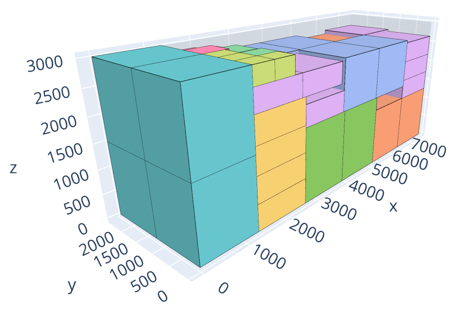

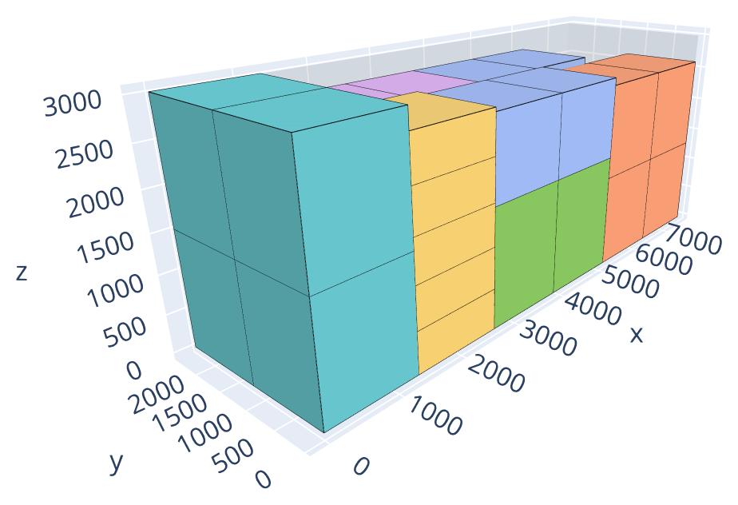

.. raw:: html

   

Basic usage
--------------

The :code:`box-stacks` solver takes as input:

* an item CSV file; option: ``--items items.csv``
* a bin CSV file; option: ``--bins bins.csv``
* optionally a parameter CSV file; option: ``--parameters parameters.csv``

It outputs:

* a solution CSV file; option: ``--certificate solution.csv``

Items can be stacked on top of each other within a bin. An item can only be placed on top of another item if both items have exactly the same X and Y dimensions in their placed orientations, and both items have the same ``STACKABILITY_ID``.

The **item file** contains:

* The X dimension of the item type (**mandatory**)

  * column ``X``
  * **Integer value**

* The Y dimension of the item type (**mandatory**)

  * column ``Y``
  * **Integer value**

* The Z dimension of the item type (**mandatory**) — the vertical dimension in the default orientation

  * column ``Z``
  * **Integer value**

* The number of copies of the item type

  * column ``COPIES``
  * default value: ``1``

* The profit of an item of this type (for a knapsack objective)

  * column ``PROFIT``
  * default value: item volume (``X * Y * Z``)

* The stackability identifier; only items with the same X and Y dimensions **and** the same stackability identifier may be stacked on top of each other

  * column ``STACKABILITY_ID``
  * default value: ``0``

The **bin file** contains:

* The X dimension of the bin type (**mandatory**)

  * column ``X``
  * **Integer value**

* The Y dimension of the bin type (**mandatory**)

  * column ``Y``
  * **Integer value**

* The Z dimension of the bin type (**mandatory**) — the height of the bin

  * column ``Z``
  * **Integer value**

* The number of copies of the bin type

  * column ``COPIES``
  * default value: ``1``

* The minimum number of copies that must be used

  * column ``COPIES_MIN``
  * default value: ``0``

* The cost of a bin of this type

  * column ``COST``
  * default value: bin volume

* The maximum total weight allowed in a bin of this type

  * column ``MAXIMUM_WEIGHT``
  * default value: no limit

The **parameter file** has two columns: ``NAME`` and ``VALUE``. The possible entries are:

* The objective; name: ``objective``; possible values:

  * ``knapsack``
  * ``bin-packing``
  * ``bin-packing-with-leftovers``
  * ``open-dimension-x``
  * ``open-dimension-y``
  * ``variable-sized-bin-packing``

Inputs:

.. literalinclude:: examples/boxstacks/items.csv
   :caption: items.csv

.. literalinclude:: examples/boxstacks/bins.csv
   :caption: bins.csv

.. literalinclude:: examples/boxstacks/parameters.csv
   :caption: parameters.csv

Solve:

.. code-block:: shell

    packingsolver_boxstacks \
            --items items.csv \
            --bins bins.csv \
            --parameters parameters.csv \
            --certificate solution.csv

.. literalinclude:: examples/boxstacks/output.txt

Visualize:

.. code-block:: shell

    python3 scripts/visualize_boxstacks.py solution.csv

.. image:: img/boxstacks_example_solution.png
   :width: 512pt
   :align: center

Rotations
---------

* The allowed orientations

  * columns ``ROTATION_XYZ``, ``ROTATION_YXZ``, ``ROTATION_ZYX``, ``ROTATION_YZX``, ``ROTATION_XZY``, ``ROTATION_ZXY``
  * ``1``: this orientation is allowed; ``0`` or omitted: not allowed
  * default: if none of these columns is set to ``1``, only ``ROTATION_XYZ`` (the default orientation) is used

The six possible 3D orientations of a box are:

.. list-table::
   :header-rows: 1

   * - Column
     - X direction
     - Y direction
     - Z direction (vertical)
   * - ``ROTATION_XYZ``
     - x
     - y
     - z
   * - ``ROTATION_YXZ``
     - y
     - x
     - z
   * - ``ROTATION_ZYX``
     - z
     - y
     - x
   * - ``ROTATION_YZX``
     - y
     - z
     - x
   * - ``ROTATION_XZY``
     - x
     - z
     - y
   * - ``ROTATION_ZXY``
     - z
     - x
     - y

Each rotation is enabled independently via its own boolean column (``1`` to allow it, ``0`` or omitted to disallow it). If none of the ``ROTATION_*`` columns is set, only ``ROTATION_XYZ`` (the default orientation) is used. Common combinations:

* Only ``ROTATION_XYZ``: only the default orientation
* ``ROTATION_XYZ`` and ``ROTATION_YXZ``: Z face always on top; both XY rotations allowed
* ``ROTATION_XYZ``, ``ROTATION_YXZ``, ``ROTATION_ZYX`` and ``ROTATION_YZX``: Y face cannot be on top
* ``ROTATION_XYZ``, ``ROTATION_YXZ``, ``ROTATION_XZY`` and ``ROTATION_ZXY``: X face cannot be on top
* All six columns set to ``1``: all six orientations allowed

The following example packs 18 copies of a 2400×1250×1000 item into 7500×2400×3000 bins, with up to 2 bins available (:code:`bin-packing` objective). Each stack holds 3 items (3×1000=3000 of the 3000 available Z). In its default orientation each item is 2400 wide, so 3 columns fit across the 7500-wide floor, but each column is 1250 deep, so only 1 row fits along the 2400-deep floor, for 1×3=3 stacks (9 items) per bin: packing all 18 items needs both bins. Allowing ``ROTATION_YXZ`` (swapping the X and Y directions) turns each item into a 1250×2400×1000 box, so 6 columns now fit across the floor, still 1 row deep, for 6×1=6 stacks (18 items) on a single bin's floor: all the items fit in just 1 of the 2 available bins.

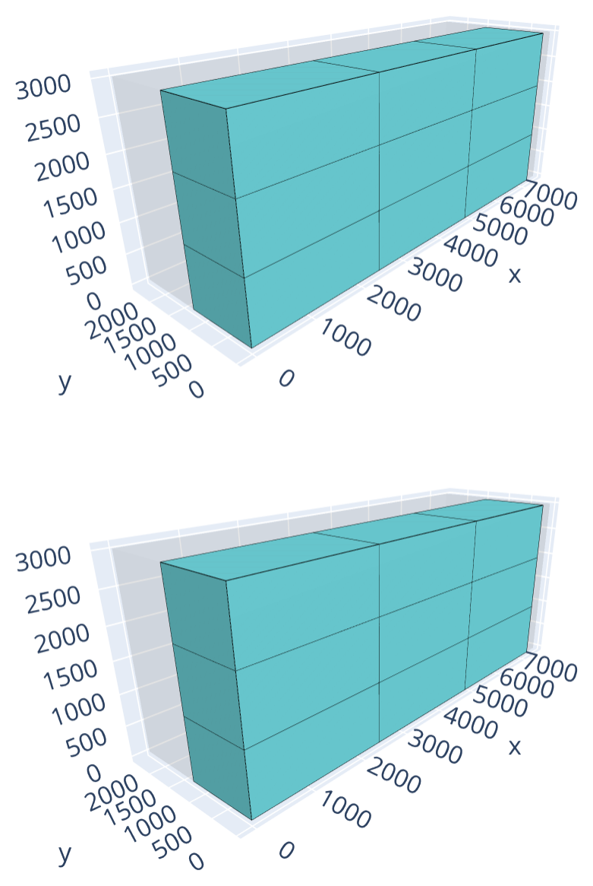

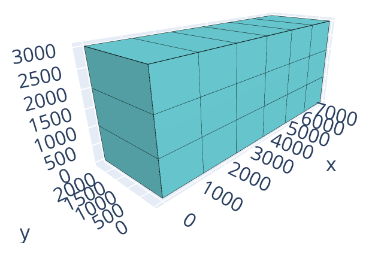

.. list-table::
   :widths: 1 1
   :header-rows: 1
   :align: center

   * - Without rotation
     - With rotation
   * - .. literalinclude:: examples/boxstacks/rotation_no/items.csv
          :caption: items.csv
     - .. literalinclude:: examples/boxstacks/rotation_yes/items.csv
          :caption: items.csv
   * - .. literalinclude:: examples/boxstacks/rotation_no/bins.csv
          :caption: bins.csv
     - .. literalinclude:: examples/boxstacks/rotation_yes/bins.csv
          :caption: bins.csv
   * - .. literalinclude:: examples/boxstacks/rotation_no/parameters.csv
          :caption: parameters.csv
     - .. literalinclude:: examples/boxstacks/rotation_yes/parameters.csv
          :caption: parameters.csv
   * - .. code-block:: shell

            packingsolver_boxstacks \
                    --items items.csv \
                    --bins bins.csv \
                    --parameters parameters.csv \
                    --certificate solution.csv
     - .. code-block:: shell

            packingsolver_boxstacks \
                    --items items.csv \
                    --bins bins.csv \
                    --parameters parameters.csv \
                    --certificate solution.csv
   * - |boxstacks_rotation_no|
     - |boxstacks_rotation_yes|

Nesting height
--------------

* The nesting height; extra Z space saved when this item is placed on top of another item (e.g., for hollow boxes that nest inside each other)

  * column ``NESTING_HEIGHT``
  * default value: ``0``

When item B is placed on top of item A, the effective Z space consumed by A is reduced by ``A.NESTING_HEIGHT``: this models hollow items (e.g. crates, buckets) that partially nest into each other when stacked, instead of resting flat on top.

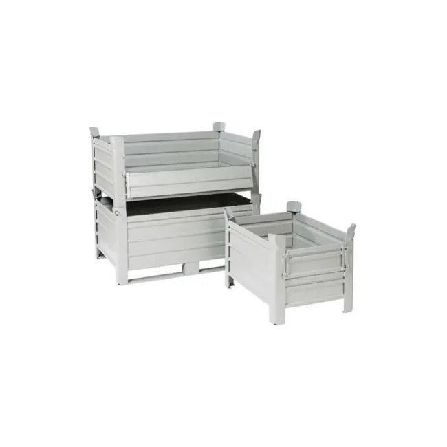

The stackable crate above illustrates the idea: two of them stacked (left) sit lower than twice the height of one alone (right), since the legs of the top crate sink into the one below.

The following example packs 6 copies each of two 2000×1000×1600 items into 7500×2400×3000 bins (:code:`bin-packing` objective), forming 6 side-by-side stacks (3×2) per bin. Without nesting height, items of different types cannot share a stack (1600+1600=3200 exceeds the bin height of 3000), so the 6 copies of one type fill one bin and the 6 copies of the other type need a second bin. With a nesting height of 200, the second item of each stack sinks 200 units into the first, so a stack combining one of each type only needs 1600+1600-200=3000 of Z space, exactly matching the bin height, and all 12 items fit into a single bin as 6 stacks of 2.

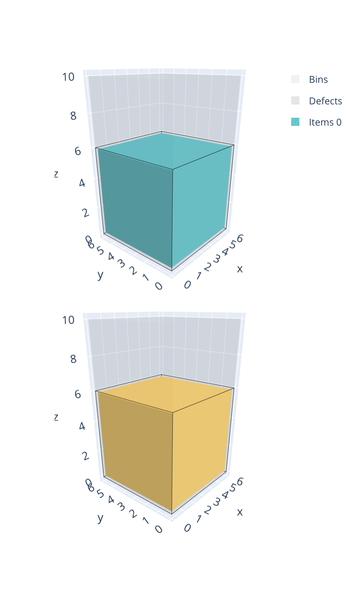

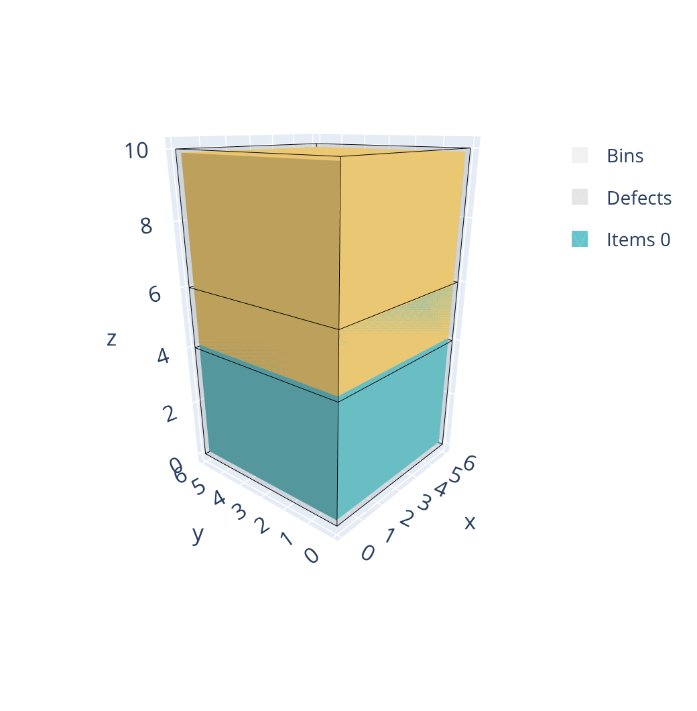

.. list-table::
   :widths: 1 1
   :header-rows: 1
   :align: center

   * - Without nesting height
     - With nesting height
   * - .. literalinclude:: examples/boxstacks/nesting_height_no/items.csv
          :caption: items.csv
     - .. literalinclude:: examples/boxstacks/nesting_height_yes/items.csv
          :caption: items.csv
   * - .. literalinclude:: examples/boxstacks/nesting_height_no/bins.csv
          :caption: bins.csv
     - .. literalinclude:: examples/boxstacks/nesting_height_yes/bins.csv
          :caption: bins.csv
   * - .. literalinclude:: examples/boxstacks/nesting_height_no/parameters.csv
          :caption: parameters.csv
     - .. literalinclude:: examples/boxstacks/nesting_height_yes/parameters.csv
          :caption: parameters.csv
   * - .. code-block:: shell

            packingsolver_boxstacks \
                    --items items.csv \
                    --bins bins.csv \
                    --parameters parameters.csv \
                    --certificate solution.csv
     - .. code-block:: shell

            packingsolver_boxstacks \
                    --items items.csv \
                    --bins bins.csv \
                    --parameters parameters.csv \
                    --certificate solution.csv
   * - |boxstacks_nesting_height_no|
     - |boxstacks_nesting_height_yes|

Maximum number of items in a stack containing an item of a given type
------------------------------------------------------------------------

* The maximum number of items that may be placed in a stack containing an item of this type

  * column ``MAXIMUM_STACKABILITY``
  * default value: no limit

The following example packs 3 copies of a 3000×2400×1200 item and 4 copies of a 3000×2400×600 item into 7500×2400×3000 bins — floor room for 2 stacks per bin (:code:`bin-packing` objective). Each stack behaves like a bin of the :ref:`onedimensional<onedimensional>` example above: without a limit, the optimal solution uses 2 stacks, both fitting in a single bin — one mixing 2 copies of the 1200-height item with 1 of the 600-height item (3000), the other mixing 1 copy of the 1200-height item with 3 of the 600-height item (3000). Setting ``MAXIMUM_STACKABILITY`` to 3 on the 1200-height item only means a stack containing it may hold at most 3 items: the first stack (2+1=3 items) is unaffected, but the second (1+3=4 items) no longer fits, so it drops one of its 600-height items — which no longer fits on the floor of the first bin either, so a second bin is needed.

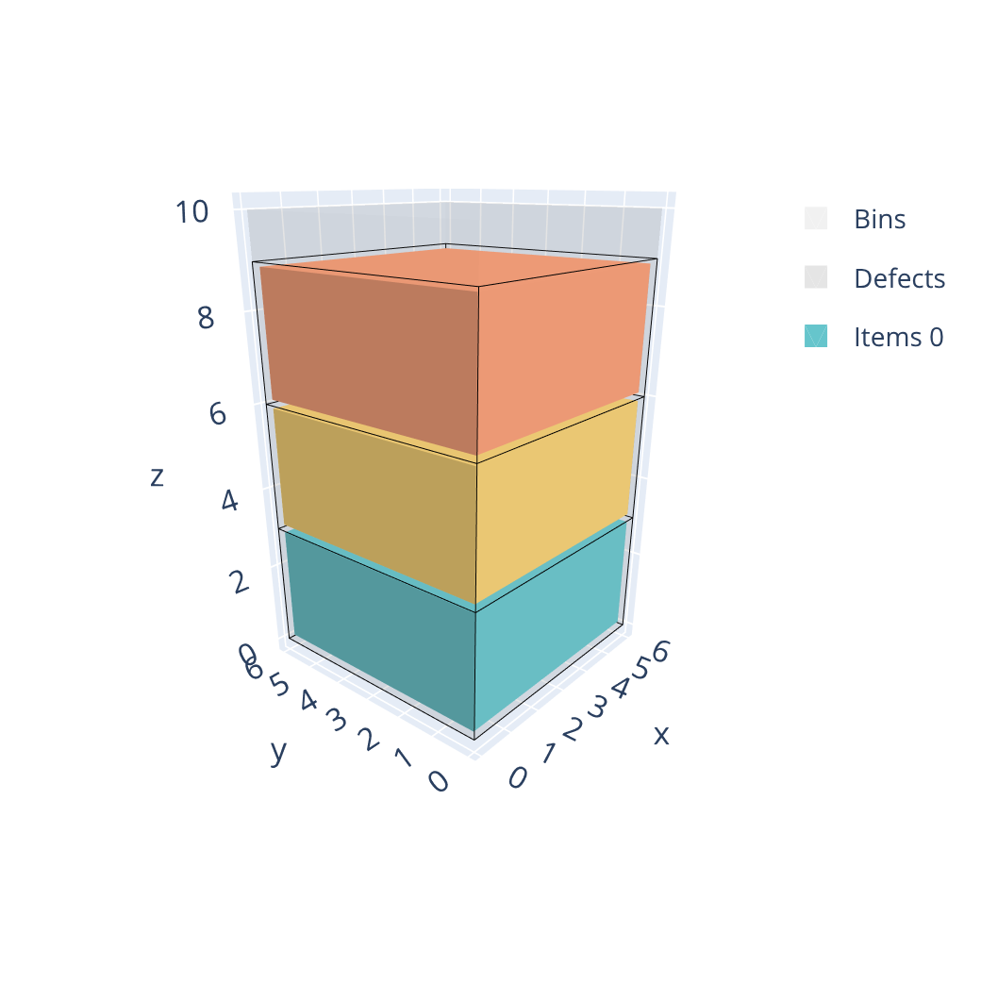

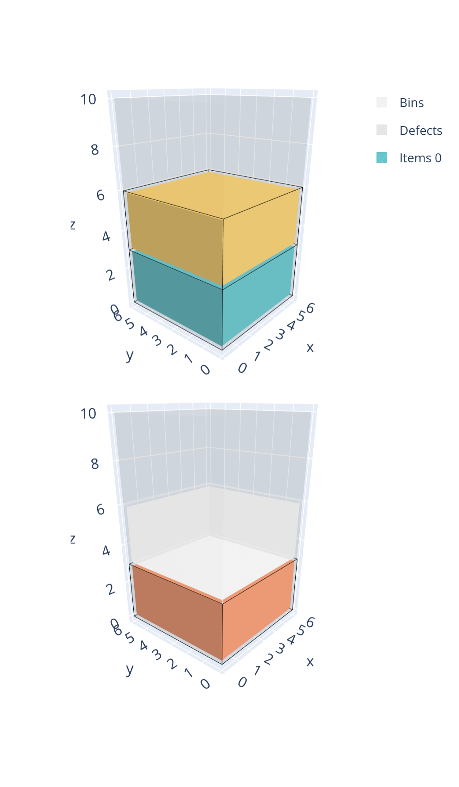

.. list-table::
   :widths: 1 1
   :header-rows: 1
   :align: center

   * - Without limit
     - ``MAXIMUM_STACKABILITY`` = 2
   * - .. literalinclude:: examples/boxstacks/maximum_stackability_no/items.csv
          :caption: items.csv
     - .. literalinclude:: examples/boxstacks/maximum_stackability_yes/items.csv
          :caption: items.csv
   * - .. literalinclude:: examples/boxstacks/maximum_stackability_no/bins.csv
          :caption: bins.csv
     - .. literalinclude:: examples/boxstacks/maximum_stackability_yes/bins.csv
          :caption: bins.csv
   * - .. literalinclude:: examples/boxstacks/maximum_stackability_no/parameters.csv
          :caption: parameters.csv
     - .. literalinclude:: examples/boxstacks/maximum_stackability_yes/parameters.csv
          :caption: parameters.csv
   * - .. code-block:: shell

            packingsolver_boxstacks \
                    --items items.csv \
                    --bins bins.csv \
                    --parameters parameters.csv \
                    --certificate solution.csv
     - .. code-block:: shell

            packingsolver_boxstacks \
                    --items items.csv \
                    --bins bins.csv \
                    --parameters parameters.csv \
                    --certificate solution.csv
   * - |boxstacks_maximum_stackability_no|
     - |boxstacks_maximum_stackability_yes|

Maximum weight above an item
-----------------------------

* The weight of the item (used by this constraint, by the maximum stack density and maximum bin weight constraints, and by the semi-trailer truck axle weight constraints)

  * column ``WEIGHT``
  * default value: ``0``

* The maximum weight that may be placed above an item of this type

  * column ``MAXIMUM_WEIGHT_ABOVE``
  * default value: no limit

The following example packs 2 copies of a 3000×2400×1500 item (weight 40) and 3 copies of a 3000×2400×1000 item (weight 20) into 7500×2400×3000 bins — floor room for 2 stacks per bin (:code:`bin-packing` objective). Each stack behaves like a bin of the :ref:`onedimensional<onedimensional>` example above: without a limit, the optimal solution uses 2 stacks, both fitting in a single bin — one with both copies of the 1500-height item (3000), the other with all 3 copies of the 1000-height item (3000). Setting ``MAXIMUM_WEIGHT_ABOVE`` to 30 on the 1500-height item only means no more than 30 of weight may rest above it: since another copy of that same item weighs 40, two of them can no longer share a stack, while a 1000-height item (weight 20) still can. The optimal solution now uses 2 stacks mixing one of each item, plus a third stack for the last, unpaired 1000-height item — which no longer fits on the floor of the first bin, so a second bin is needed.

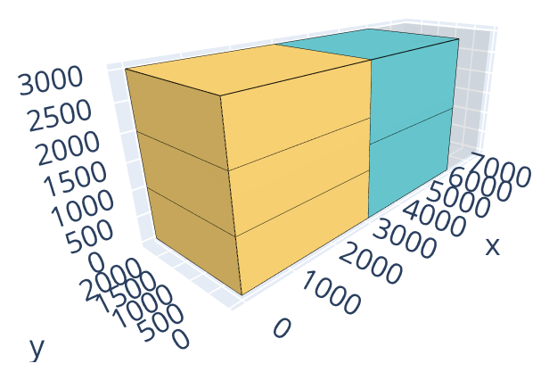

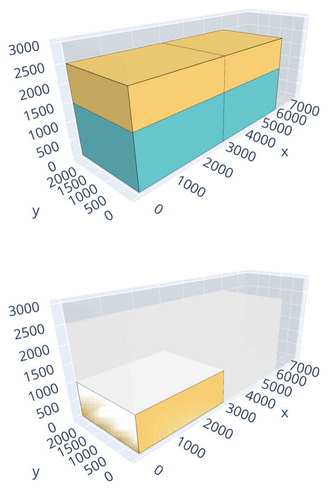

.. list-table::
   :widths: 1 1
   :header-rows: 1
   :align: center

   * - Without limit
     - ``MAXIMUM_WEIGHT_ABOVE`` = 5
   * - .. literalinclude:: examples/boxstacks/maximum_weight_above_no/items.csv
          :caption: items.csv
     - .. literalinclude:: examples/boxstacks/maximum_weight_above_yes/items.csv
          :caption: items.csv
   * - .. literalinclude:: examples/boxstacks/maximum_weight_above_no/bins.csv
          :caption: bins.csv
     - .. literalinclude:: examples/boxstacks/maximum_weight_above_yes/bins.csv
          :caption: bins.csv
   * - .. literalinclude:: examples/boxstacks/maximum_weight_above_no/parameters.csv
          :caption: parameters.csv
     - .. literalinclude:: examples/boxstacks/maximum_weight_above_yes/parameters.csv
          :caption: parameters.csv
   * - .. code-block:: shell

            packingsolver_boxstacks \
                    --items items.csv \
                    --bins bins.csv \
                    --parameters parameters.csv \
                    --certificate solution.csv
     - .. code-block:: shell

            packingsolver_boxstacks \
                    --items items.csv \
                    --bins bins.csv \
                    --parameters parameters.csv \
                    --certificate solution.csv
   * - |boxstacks_maximum_weight_above_no|
     - |boxstacks_maximum_weight_above_yes|

Maximum stack density
----------------------

* The maximum weight per unit floor area for any stack in the bin

  * column ``MAXIMUM_STACK_DENSITY`` in the bin CSV file
  * default value: no limit

The following example packs 9 copies of a 2500×1200×1000 item weighing 700,000 and 9 copies of a 2500×1200×1000 item weighing 900,000 into 7500×2400×3000 bins (:code:`bin-packing` objective). Without a density limit, the items stack into a single bin as 6 side-by-side stacks of 3 — 3 stacks of the lighter item (3×1000=3000 of Z, weighing 3×700,000=2,100,000) and 3 of the heavier one (3×1000=3000 of Z, weighing 3×900,000=2,700,000) — each on a 2500×1200=3,000,000 floor area (density up to 2,700,000/3,000,000=0.9). Setting ``MAXIMUM_STACK_DENSITY`` to 0.6 on the bin means a stack may weigh at most 0.6×3,000,000=1,800,000: no 3-item combination of either item (2,100,000 to 2,700,000) fits under that limit anymore, so every stack is now limited to 2 items (1,400,000 to 1,800,000, all within the limit). With only 6 stacks per bin now holding 12 of the 18 items, a second bin is needed for the remaining 6 — one of its stacks even mixing one of each item.

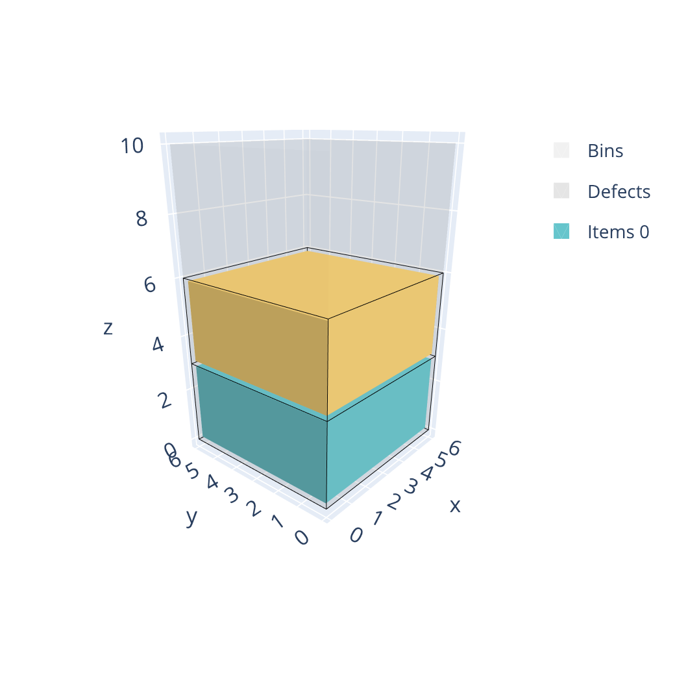

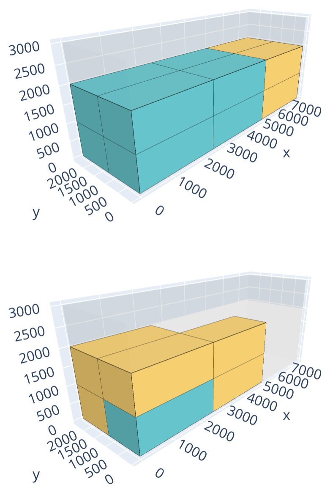

.. list-table::
   :widths: 1 1
   :header-rows: 1
   :align: center

   * - Without limit
     - ``MAXIMUM_STACK_DENSITY`` = 0.6
   * - .. literalinclude:: examples/boxstacks/maximum_stack_density_no/items.csv
          :caption: items.csv
     - .. literalinclude:: examples/boxstacks/maximum_stack_density_yes/items.csv
          :caption: items.csv
   * - .. literalinclude:: examples/boxstacks/maximum_stack_density_no/bins.csv
          :caption: bins.csv
     - .. literalinclude:: examples/boxstacks/maximum_stack_density_yes/bins.csv
          :caption: bins.csv
   * - .. literalinclude:: examples/boxstacks/maximum_stack_density_no/parameters.csv
          :caption: parameters.csv
     - .. literalinclude:: examples/boxstacks/maximum_stack_density_yes/parameters.csv
          :caption: parameters.csv
   * - .. code-block:: shell

            packingsolver_boxstacks \
                    --items items.csv \
                    --bins bins.csv \
                    --parameters parameters.csv \
                    --certificate solution.csv
     - .. code-block:: shell

            packingsolver_boxstacks \
                    --items items.csv \
                    --bins bins.csv \
                    --parameters parameters.csv \
                    --certificate solution.csv
   * - |boxstacks_maximum_stack_density_no|
     - |boxstacks_maximum_stack_density_yes|

Unloading constraints
-------------------------

When loading a truck that visits multiple loading/unloading locations, it might be necessary to be able to load/unload the items at a location without having to move the items which are already in the truck.
This is modeled in the solver with unloading constraints. Items are assigned to groups: items in group 0 are placed last (nearest the door) and unloaded first, items in group 1 are placed next, etc.

* The group of the item (for unloading constraints)

  * column ``GROUP_ID``
  * default value: ``0``

* The unloading constraint; name: ``unloading-constraint``; possible values:

  * ``none`` (default)
  * ``only-x-movements``
  * ``only-y-movements``
  * ``increasing-x``
  * ``increasing-y``

Note that unlike the :ref:`rectangle<rectangle>` solver, the parameter key is hyphenated: ``unloading-constraint`` rather than ``unloading_constraint``.

4 types of unloading constraints are available:

* ``only-x-movements``: items can only be moved out along the X axis; therefore, no item from a later group may be positioned to the right of an item from an earlier group
* ``only-y-movements``: same along the Y axis
* ``increasing-x``: all items from group 0 have a greater X coordinate than all items from group 1, which in turn have a greater X coordinate than all items from group 2, etc.
* ``increasing-y``: same along the Y axis

The following example packs 3 items (3000×1400, 3000×2400 and 2500×1000 footprints, groups 0, 1 and 2) into 7500×2400×3000 bins (:code:`bin-packing-with-leftovers` objective). Without an unloading constraint, the items can be arranged freely and all 3 fit into a single bin. With ``only-x-movements``, the group-2 item cannot be positioned without ending up to the right of the group-1 item while itself needing to come out first, so it no longer fits alongside the others, and a second bin is needed.

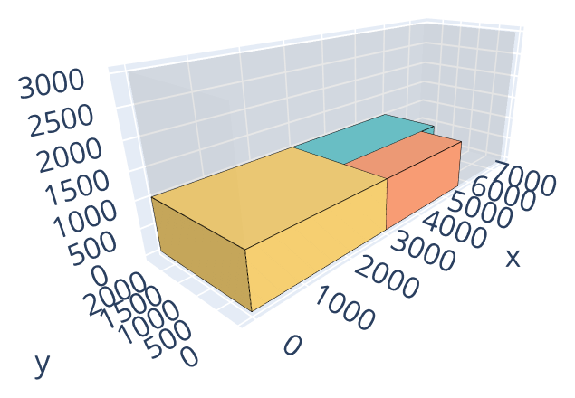

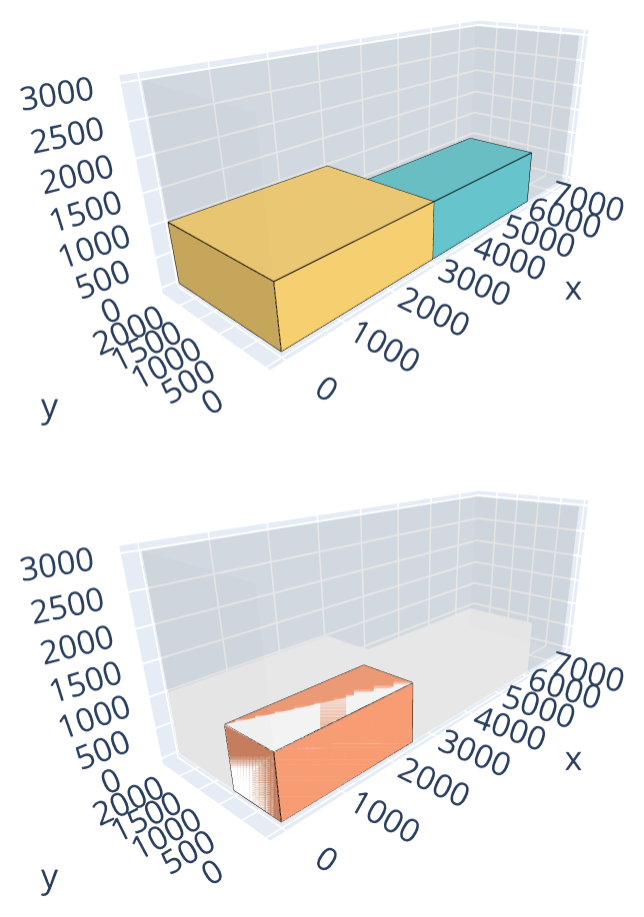

.. list-table::
   :widths: 1 1
   :header-rows: 1
   :align: center

   * - No constraint
     - ``only-x-movements``
   * - .. literalinclude:: examples/boxstacks/unloading_no/items.csv
          :caption: items.csv
     - .. literalinclude:: examples/boxstacks/unloading_yes/items.csv
          :caption: items.csv
   * - .. literalinclude:: examples/boxstacks/unloading_no/bins.csv
          :caption: bins.csv
     - .. literalinclude:: examples/boxstacks/unloading_yes/bins.csv
          :caption: bins.csv
   * - .. literalinclude:: examples/boxstacks/unloading_no/parameters.csv
          :caption: parameters.csv
     - .. literalinclude:: examples/boxstacks/unloading_yes/parameters.csv
          :caption: parameters.csv
   * - .. code-block:: shell

            packingsolver_boxstacks \
                    --items items.csv \
                    --bins bins.csv \
                    --parameters parameters.csv \
                    --certificate solution.csv
     - .. code-block:: shell

            packingsolver_boxstacks \
                    --items items.csv \
                    --bins bins.csv \
                    --parameters parameters.csv \
                    --certificate solution.csv
   * - |boxstacks_unloading_no|
     - |boxstacks_unloading_yes|

Maximum weight on the middle and rear axles
---------------------------------------------

For bins that model the trailer of a semi-trailer truck, the solver can enforce legal weight limits on the tractor's middle (drive) axle and on the trailer's rear axle, computed from the position of the loaded stacks along the trailer and the truck's geometry.

The tractor alone is characterized by its weight (``CM``, i.e. ``TRACTOR_WEIGHT``) and by the distances between its front axle and its middle axle (``CJ``:sup:`fm`, i.e. ``FRONT_AXLE_MIDDLE_AXLE_DISTANCE``) and center of gravity (``CJ``:sup:`fc`, i.e. ``FRONT_AXLE_TRACTOR_GRAVITY_CENTER_DISTANCE``):

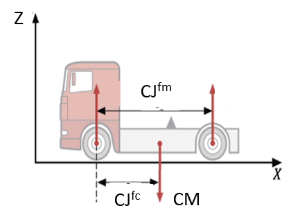

Once the trailer is attached at the harness (fifth wheel), its own geometry and the loaded cargo's weight and position add the remaining quantities used in the axle weight computation below (``EM``, ``EJ``:sup:`eh`, ``EJ``:sup:`hr`, ``EJ``:sup:`cr` are the ``EMPTY_TRAILER_WEIGHT``, ``TRAILER_START_HARNESS_DISTANCE``, ``HARNESS_REAR_AXLE_DISTANCE`` and ``TRAILER_GRAVITY_CENTER_REAR_AXLE_DISTANCE`` columns; ``tm``:sub:`t` is the combined weight of the loaded stacks):

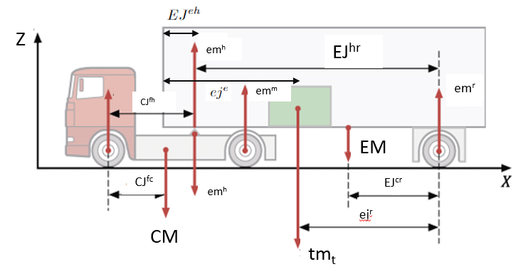

* Whether the bin is a semi-trailer truck

  * column ``IS_SEMI_TRAILER_TRUCK`` in the bin CSV file
  * ``1``: bin is a semi-trailer truck; ``0`` or omitted: not a semi-trailer truck (no axle weight constraints)

* The weight of the tractor

  * column ``TRACTOR_WEIGHT``
  * default value: ``0``

* The distance between the tractor's front axle and its middle (drive) axle

  * column ``FRONT_AXLE_MIDDLE_AXLE_DISTANCE``
  * default value: ``0``

* The distance between the tractor's front axle and the tractor's center of gravity

  * column ``FRONT_AXLE_TRACTOR_GRAVITY_CENTER_DISTANCE``
  * default value: ``0``

* The distance between the tractor's front axle and the harness (fifth-wheel coupling point)

  * column ``FRONT_AXLE_HARNESS_DISTANCE``
  * default value: ``0``

* The weight of the empty trailer

  * column ``EMPTY_TRAILER_WEIGHT``
  * default value: ``0``

* The distance between the harness and the trailer's rear axle

  * column ``HARNESS_REAR_AXLE_DISTANCE``
  * default value: ``0``

* The distance between the empty trailer's center of gravity and its rear axle

  * column ``TRAILER_GRAVITY_CENTER_REAR_AXLE_DISTANCE``
  * default value: ``0``

* The distance between the start of the trailer's cargo area (X = 0 in the item file) and the harness

  * column ``TRAILER_START_HARNESS_DISTANCE``
  * default value: ``0``

* The maximum weight allowed on the trailer's rear axle

  * column ``REAR_AXLE_MAXIMUM_WEIGHT``
  * default value: no limit

* The maximum weight allowed on the tractor's middle (drive) axle

  * column ``MIDDLE_AXLE_MAXIMUM_WEIGHT``
  * default value: no limit

Loading cargo further toward the front of the trailer (closer to the harness) shifts more weight onto the tractor's middle axle and less onto the trailer's rear axle; loading further back does the opposite. The solver uses the combined weight and the X position of each stack's center to compute the resulting middle and rear axle weights, and only accepts solutions that stay within the configured limits.

The following example packs 19 copies of a 1200×1000×1200 item weighing 1200 and 19 copies of a 1200×1000×800 item weighing 800 — heights proportional to weight — into 13500×2440×2900 bins (38,000 of total weight) — dimensions and axle geometry matching a standard semi-trailer truck, as found in the reference instances under ``data/boxstacks`` — with up to 2 bins available (:code:`bin-packing` objective). Without ``IS_SEMI_TRAILER_TRUCK`` set, no axle limits apply, and all 38 items fit in a single bin, packed compactly from the front of the trailer (the shorter item even stacks 3 high there). Had the axle constraint been checked on that loading, it would put 23,499 on the middle axle — almost twice the 12,000 limit used below. Setting ``IS_SEMI_TRAILER_TRUCK`` to 1, with ``MIDDLE_AXLE_MAXIMUM_WEIGHT`` 12,000 and ``REAR_AXLE_MAXIMUM_WEIGHT`` 31,500, makes that loading infeasible: the solver instead places the lighter item toward the front of the trailer and the heavier item toward the back, shifting the load rearward until the middle axle drops to 11,991 and the rear axle rises to 31,256 — both just inside their limits. That rebalanced loading fits 35 of the 38 items (17 lighter, 18 heavier) in the first bin, so the remaining 3 (2 lighter, 1 heavier) need a second bin.

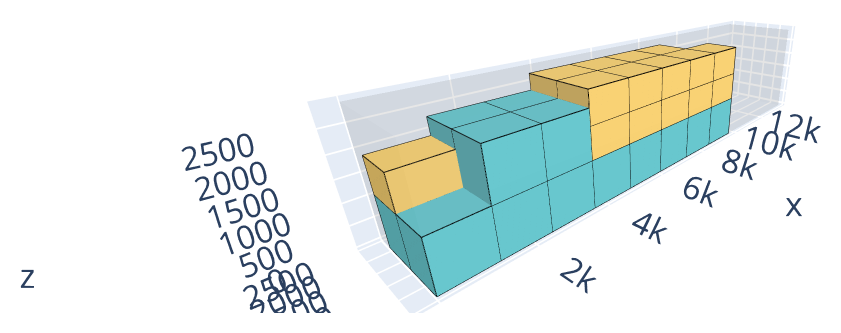

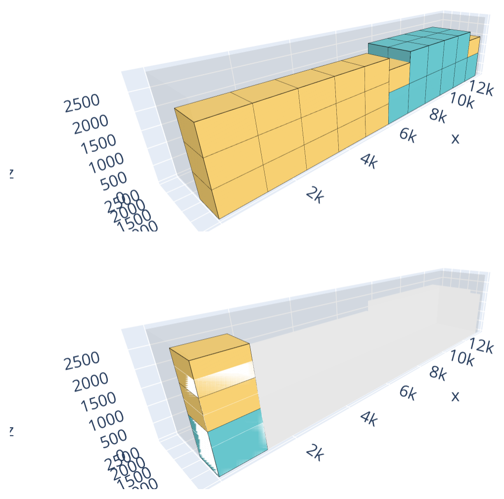

.. list-table::
   :widths: 1 1
   :header-rows: 1
   :align: center
   :class: wide-table

   * - Without axle constraints
     - With axle constraints
   * - .. literalinclude:: examples/boxstacks/axle_weight_no/items.csv
          :caption: items.csv
     - .. literalinclude:: examples/boxstacks/axle_weight_yes/items.csv
          :caption: items.csv
   * - .. literalinclude:: examples/boxstacks/axle_weight_no/bins.csv
          :caption: bins.csv
     - .. literalinclude:: examples/boxstacks/axle_weight_yes/bins.csv
          :caption: bins.csv
   * - .. literalinclude:: examples/boxstacks/axle_weight_no/parameters.csv
          :caption: parameters.csv
     - .. literalinclude:: examples/boxstacks/axle_weight_yes/parameters.csv
          :caption: parameters.csv
   * - .. code-block:: shell

            packingsolver_boxstacks \
                    --items items.csv \
                    --bins bins.csv \
                    --parameters parameters.csv \
                    --certificate solution.csv
     - .. code-block:: shell

            packingsolver_boxstacks \
                    --items items.csv \
                    --bins bins.csv \
                    --parameters parameters.csv \
                    --certificate solution.csv
   * - |boxstacks_axle_weight_no|
     - |boxstacks_axle_weight_yes|
