.. _boxstacks:

:code:`box-stacks` solver
=========================

The :code:`box-stacks` solver solves three-dimensional bin packing problems where items are rectangular parallelepipeds (boxes) that must be packed into rectangular bins. Items can be stacked vertically: a **stack** is a column of items that all have the same footprint (X and Y dimensions) and the same stackability identifier.

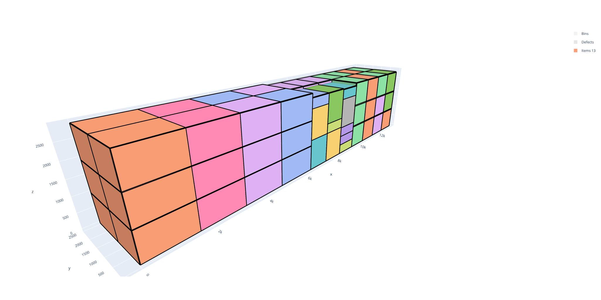

These problems occur for example in pallet building, container loading, and warehouse management.

Features:

* Objectives:

  * Knapsack
  * Bin packing
  * Bin packing with leftovers
  * Open dimension X
  * Open dimension Y
  * Variable-sized bin packing

* Item types

  * Rotations around the vertical axis
  * Groups (for unloading constraints)
  * Weight
  * Stacking constraints

    * Stackability identifier
    * Nesting height
    * Maximum number of items in a stack containing an item of a given type
    * Maximum weight above an item

* Bin types

  * Maximum weight
  * Maximum stack density (weight per unit floor area)
  * Maximum weight on the middle and rear axles (semi-trailer trucks)

* Unloading constraints (same as the :ref:`rectangle<rectangle>` solver)

Box vs box-stacks
-----------------

The :code:`box-stacks` solver only produces patterns where items sharing a footprint (X and Y dimensions) and stackability identifier form a single vertical **stack**; an item of a different footprint can never be inserted into the space left above a stack, even if that space would otherwise be enough to hold it. Problems where items may instead be placed freely anywhere in 3D space should be modeled with the :ref:`box<box>` solver.

The following example solves the same instance — a 7500 × 2400 × 3000 bin shaped like a truck's cargo area, with three groups of columns of different footprints (4 columns of 1300 × 1200, 4 of 1200 × 1200, and 4 of 1250 × 1200, for 12 columns in total), each group stacking its own large and medium item types, plus three extra small item types (600 × 500, 500 × 400 and 700 × 600) that are all smaller than every column's footprint — with both solvers (:code:`knapsack` objective). The :code:`box-stacks` solver fills the 7500 × 2400 floor with all 12 columns, each group mixing one large item with several medium items (1500 + 550 + 550 = 2600, 1300 + 450 + 450 + 450 = 2650, and 1600 + 1100 = 2700 out of the 3000 available Z), but none of the three small item types can be placed: none of their footprints matches any column, and the floor is already fully covered, so there is nowhere left to start a new stack — only 88.3% of the bin's volume is loaded, leaving 400, 350 or 300 of unused space at the top of each column, depending on the group. The :code:`box` solver, which places items freely, fills that same leftover space by placing one small item directly on top of each column instead — a different small item type for each of the three groups — loading 90.7% of the bin's volume.

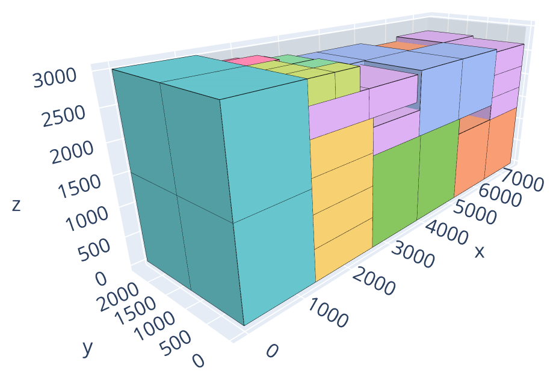

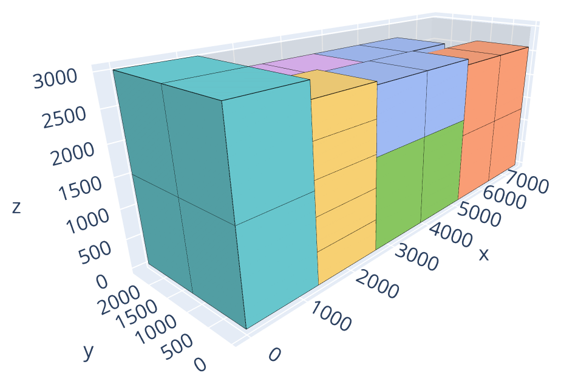

.. list-table::
   :widths: 1 1
   :header-rows: 1
   :align: center

   * - ``box``
     - ``box-stacks``
   * - |boxstacks_box_vs_boxstacks_box|
     - |boxstacks_box_vs_boxstacks_boxstacks|

.. example-tabs:: box/box_vs_boxstacks boxstacks/box_vs_boxstacks

Basic usage
-----------

An instance is described in the JSON format below. The `online solver <https://packingsolver.pages.dev/>`_ downloads its instances in this format (**Download**) and loads them (**Load a JSON file**), the command-line solver reads them (``--input``), and the Python package and the C++ library read them with ``InstanceBuilder.read``. Instances can also be built directly with the ``InstanceBuilder`` of the Python package and of the C++ library.

Items can be stacked on top of each other within a bin. An item can only be placed on top of another item if both items have the same X and Y dimensions in their placed orientations, and the same stackability identifier.

In the following example, the items of three item types, which can't be stacked together, are packed in a bin of size 7500 × 2400 × 3000, maximizing the volume of the items packed:

.. example-tabs:: boxstacks/basic
   :solve:

The solution:

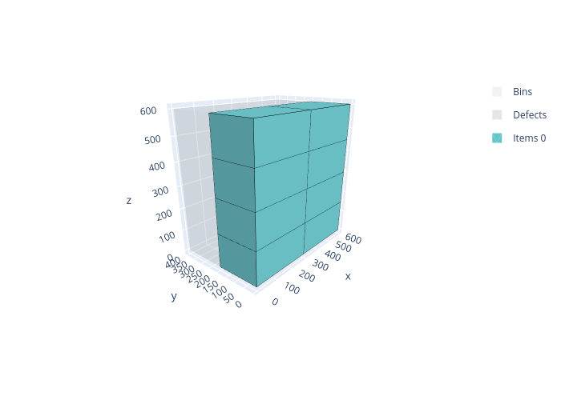

Instance format
^^^^^^^^^^^^^^^

An instance is a JSON object with the following fields:

.. list-table::
   :header-rows: 1
   :widths: 1 3

   * - Field
     - Description
   * - ``objective``
     - **Mandatory**. One of ``knapsack``, ``bin-packing``, ``bin-packing-with-leftovers``, ``open-dimension-x``, ``open-dimension-y``, ``variable-sized-bin-packing``; see :ref:`objectives`
   * - ``unloading_constraint``
     - See :ref:`boxstacks-unloading-constraints`. Default: ``none``
   * - ``no_check_weight_constraints``
     - The groups (array) whose items are not subject to the weight constraints (maximum weight above an item, maximum stack density, axle weights). Default: none
   * - ``bin_types``
     - **Mandatory**. The bin types (array)
   * - ``item_types``
     - **Mandatory**. The item types (array)

A **bin type** has the following fields:

.. list-table::
   :header-rows: 1
   :widths: 1 3

   * - Field
     - Description
   * - ``x``, ``y``, ``z``
     - **Mandatory**. The dimensions of the bins (integers); ``z`` is the height
   * - ``copies``
     - The number of copies of the bin type. Default: ``1``; ``-1`` for an unlimited number of copies
   * - ``copies_min``
     - The minimum number of copies of the bin type to use, for the variable-sized bin packing objective. Default: ``0``
   * - ``cost``
     - The cost of a bin of this type, for the variable-sized bin packing objective. Default: the volume of the bin
   * - ``maximum_weight``
     - The maximum total weight of the items in a bin of this type. Default: no limit
   * - ``maximum_stack_density``
     - See :ref:`boxstacks-maximum-stack-density`. Default: no limit
   * - ``semi_trailer_truck``
     - See :ref:`boxstacks-axle-weights`. Default: none
   * - ``defects``
     - Rectangular regions of the floor of the bin where no stack can be placed (array of objects with fields ``x``, ``y``, ``width``, ``height``). Default: none

An **item type** has the following fields:

.. list-table::
   :header-rows: 1
   :widths: 1 3

   * - Field
     - Description
   * - ``x``, ``y``, ``z``
     - **Mandatory**. The dimensions of the items (integers); ``z`` is the height
   * - ``copies``
     - The number of copies of the item type. Default: ``1``; ``-1`` for an unlimited number of copies (knapsack objective only)
   * - ``copies_min``
     - The minimum number of copies of the item type to pack, for the knapsack objective. Default: ``0``
   * - ``profit``
     - The profit of an item of this type, for the knapsack objective. Default: the volume of the item
   * - ``stackability_id``
     - Only the items with the same stackability identifier can be stacked together. The item types with the same stackability identifier must have the same ``x`` and ``y`` dimensions. Default: ``0``
   * - ``rotations``
     - See :ref:`boxstacks-item-rotations`. Default: ``["XYZ"]``
   * - ``nesting_height``
     - See :ref:`boxstacks-nesting-height`. Default: ``0``
   * - ``maximum_stackability``
     - See :ref:`boxstacks-maximum-stackability`. Default: no limit
   * - ``weight``
     - The weight of an item of this type. Default: ``0``
   * - ``maximum_weight_above``
     - See :ref:`boxstacks-maximum-weight-above`. Default: no limit
   * - ``group_id``
     - See :ref:`boxstacks-unloading-constraints`. Default: ``0``

In Python, the optional fields of the bin types and of the item types are keyword arguments of ``InstanceBuilder.add_bin_type`` and ``InstanceBuilder.add_item_type``, with the same names (``semi_trailer_truck_parameters`` for ``semi_trailer_truck``). In C++, they are set with the ``InstanceBuilder.set_bin_type_<field>`` and ``InstanceBuilder.set_item_type_<field>`` methods; the examples below show the exceptions.

Certificate format
^^^^^^^^^^^^^^^^^^

The solution is written (command-line option ``--certificate``, ``Solution.write``) as a CSV file with the columns ``TYPE``, ``ID``, ``COPIES``, ``BIN``, ``STACK``, ``X``, ``Y``, ``Z``, ``LX``, ``LY``, ``LZ``, ``GROUP_ID``, ``ROTATION``. Each line is:

* a bin (``TYPE`` ``BIN``): ``ID`` is its bin type, ``COPIES`` the number of identical bins it stands for, ``BIN`` its index in the solution, and ``LX``, ``LY``, ``LZ`` its dimensions;
* a defect of a bin (``TYPE`` ``DEFECT``): ``ID`` is its index in its bin type, ``BIN`` the index of its bin, ``X``, ``Y`` the position of its corner, and ``LX``, ``LY`` its dimensions;
* a stack (``TYPE`` ``STACK``): ``ID`` and ``STACK`` are its index in its bin, ``BIN`` the index of its bin, ``X``, ``Y`` the position of its corner, ``LX``, ``LY`` its footprint, and ``LZ`` its height;
* an item (``TYPE`` ``ITEM``): ``ID`` is its item type, ``BIN`` and ``STACK`` the indices of its bin and of its stack, ``X``, ``Y``, ``Z`` the position of its corner, ``LX``, ``LY``, ``LZ`` its dimensions once placed, ``GROUP_ID`` its group, and ``ROTATION`` its rotation.

.. literalinclude:: examples/boxstacks/basic/solution.csv
   :caption: solution.csv
   :lines: 1-8

To visualize a solution, open it in the `solution viewer <https://packingsolver.pages.dev/viewer.html>`_, or run:

.. code-block:: shell

    python3 scripts/visualize.py solution.csv

.. _boxstacks-item-rotations:

Item rotations
--------------

The items stay upright in their stacks: they can only be rotated around the vertical axis. By default, they keep their original orientation (``XYZ``); the rotation ``YXZ`` exchanges their X and Y dimensions.

.. tab-set::
   :sync-group: interface

   .. tab-item:: Online solver
      :sync: web

      In the **Item types** table, check the allowed rotations of each item type.

   .. tab-item:: JSON
      :sync: json

      In an item type: ``"rotations": ["XYZ", "YXZ"]``.

   .. tab-item:: Python
      :sync: python

      ``instance_builder.add_item_type(x, y, z, rotations=[psbs.Rotation.XYZ, psbs.Rotation.YXZ])``

   .. tab-item:: C++
      :sync: cpp

      ``instance_builder.add_item_type_rotation(item_type_id, Rotation::YXZ);``, once for each allowed rotation.

The following example packs 18 copies of a 2400 × 1250 × 1000 item into 7500 × 2400 × 3000 bins, with up to 2 bins available (:code:`bin-packing` objective). Each stack holds 3 items (3 × 1000 = 3000 of the 3000 available Z). In its original orientation, each item is 2400 wide, so 3 columns fit across the 7500-wide floor, but each column is 1250 deep, so only 1 row fits along the 2400-deep floor, for 3 stacks (9 items) per bin: packing all 18 items needs both bins. Allowing the rotation ``YXZ`` turns each item into a 1250 × 2400 × 1000 box, so 6 columns now fit across the floor, for 6 stacks (18 items) on a single bin's floor: all the items fit in a single bin.

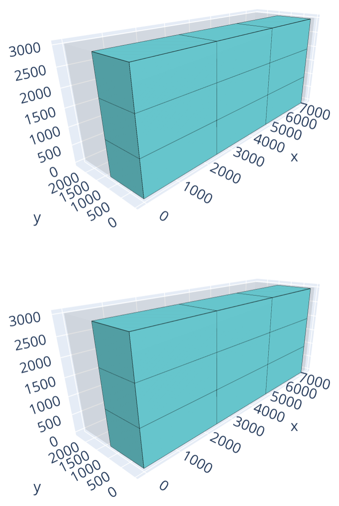

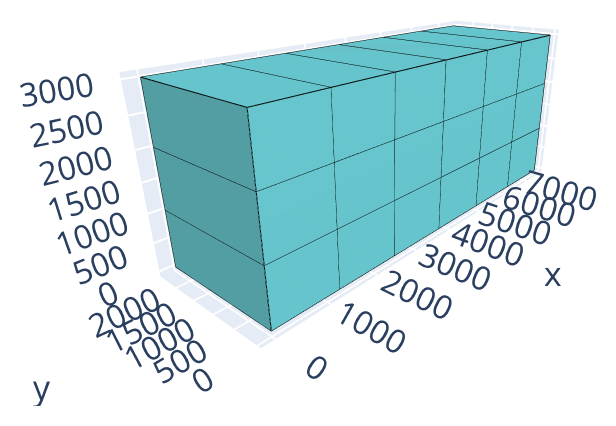

.. list-table::
   :widths: 1 1
   :header-rows: 1
   :align: center

   * - Oriented items
     - Items which can be rotated
   * - |boxstacks_rotation_no|
     - |boxstacks_rotation_yes|

.. example-tabs:: boxstacks/rotation_no boxstacks/rotation_yes

.. _boxstacks-nesting-height:

Nesting height
--------------

When an item is placed on top of another item, the height it occupies may be reduced by its nesting height: this models hollow items (e.g. crates, buckets) that partially nest into each other when stacked, instead of resting flat on top.

.. image:: img/boxstacks_nesting_height.jpeg
   :align: center

The stackable crates above illustrate the idea: two of them stacked (left) sit lower than twice the height of one alone (right), since the legs of the top crate sink into the one below.

.. tab-set::
   :sync-group: interface

   .. tab-item:: Online solver
      :sync: web

      In the **Item types** table, click **More** on a row and fill its **Nesting height**.

   .. tab-item:: JSON
      :sync: json

      In an item type: ``"nesting_height": 200``.

   .. tab-item:: Python
      :sync: python

      ``instance_builder.add_item_type(x, y, z, nesting_height=200)``

   .. tab-item:: C++
      :sync: cpp

      ``instance_builder.set_item_type_nesting_height(item_type_id, 200);``

The following example packs 6 copies each of two 2000 × 1000 × 1600 items into 7500 × 2400 × 3000 bins (:code:`bin-packing` objective), forming 6 side-by-side stacks (3 × 2) per bin. Without nesting height, two items can't share a stack (1600 + 1600 = 3200 exceeds the bin height of 3000), so 2 bins are needed. With a nesting height of 200, the second item of each stack sinks 200 into the first, so a stack of two items only needs 1600 + 1600 - 200 = 3000, exactly matching the bin height, and all 12 items fit into a single bin as 6 stacks of 2.

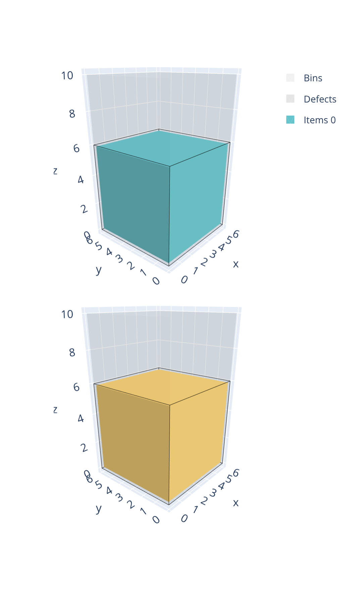

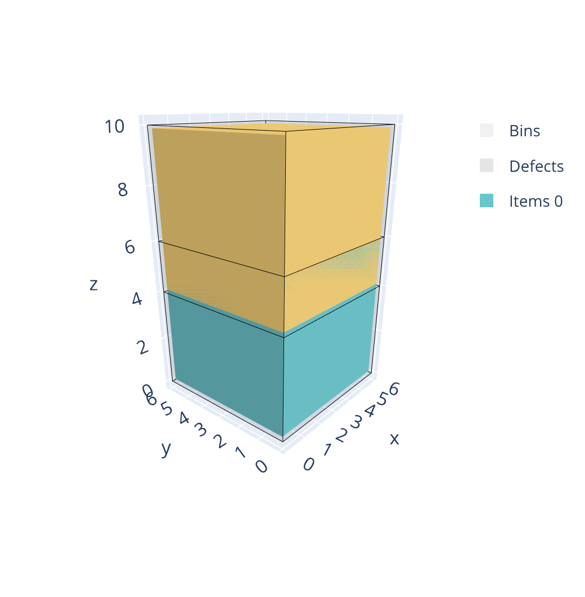

.. list-table::
   :widths: 1 1
   :header-rows: 1
   :align: center

   * - Without nesting height
     - With nesting height
   * - |boxstacks_nesting_height_no|
     - |boxstacks_nesting_height_yes|

.. example-tabs:: boxstacks/nesting_height_no boxstacks/nesting_height_yes

.. _boxstacks-maximum-stackability:

Maximum number of items in a stack containing an item of a given type
---------------------------------------------------------------------

For each item type, it is possible to limit the number of items in a stack that contains an item of this type. This limit is called the maximum stackability of the item type.

.. tab-set::
   :sync-group: interface

   .. tab-item:: Online solver
      :sync: web

      In the **Item types** table, click **More** on a row and fill its **Maximum stackability**.

   .. tab-item:: JSON
      :sync: json

      In an item type: ``"maximum_stackability": 3``.

   .. tab-item:: Python
      :sync: python

      ``instance_builder.add_item_type(x, y, z, maximum_stackability=3)``

   .. tab-item:: C++
      :sync: cpp

      ``instance_builder.set_item_type_maximum_stackability(item_type_id, 3);``

The following example packs 3 copies of a 3000 × 2400 × 1200 item and 4 copies of a 3000 × 2400 × 600 item into 7500 × 2400 × 3000 bins — floor room for 2 stacks per bin (:code:`bin-packing` objective). Each stack behaves like a bin of the corresponding :ref:`one-dimensional<onedimensional-maximum-stackability>` example: without a limit, 2 stacks are enough, both fitting in a single bin — one with 2 copies of the 1200-high item and 1 of the 600-high item (3000), the other with 1 copy of the 1200-high item and 3 of the 600-high item (3000). With a maximum stackability of 3 for the 1200-high item, a stack containing it may hold at most 3 items: the second stack (4 items) isn't valid anymore, and a third stack is needed, which doesn't fit on the floor of the first bin: a second bin is needed.

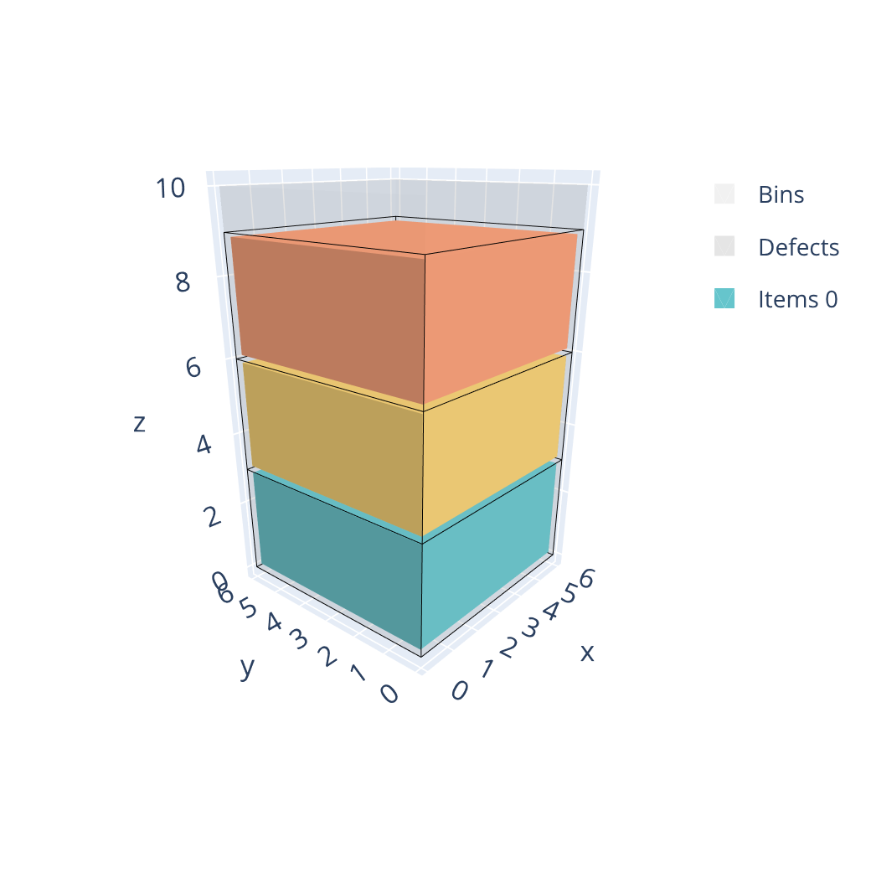

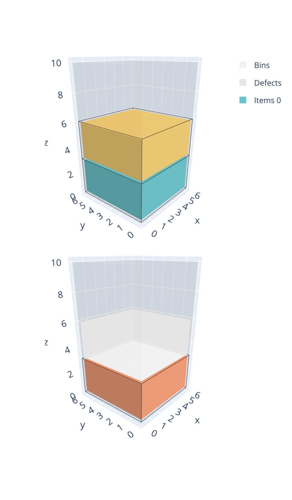

.. list-table::
   :widths: 1 1
   :header-rows: 1
   :align: center

   * - Without limit
     - Maximum stackability 3
   * - |boxstacks_maximum_stackability_no|
     - |boxstacks_maximum_stackability_yes|

.. example-tabs:: boxstacks/maximum_stackability_no boxstacks/maximum_stackability_yes

.. _boxstacks-maximum-weight-above:

Maximum weight above an item
----------------------------

Each item type may have a maximum weight for the items stacked above its items.

.. tab-set::
   :sync-group: interface

   .. tab-item:: Online solver
      :sync: web

      Fill the **Weight** column of the **Item types** table; then click **More** on a row and fill its **Maximum weight above**.

   .. tab-item:: JSON
      :sync: json

      In an item type: ``"weight": 40``, ``"maximum_weight_above": 30``.

   .. tab-item:: Python
      :sync: python

      ``instance_builder.add_item_type(x, y, z, weight=40, maximum_weight_above=30)``

   .. tab-item:: C++
      :sync: cpp

      ``instance_builder.set_item_type_weight(item_type_id, 40);`` and ``instance_builder.set_item_type_maximum_weight_above(item_type_id, 30);``

The following example packs 2 copies of a 3000 × 2400 × 1500 item (weight 40) and 3 copies of a 3000 × 2400 × 1000 item (weight 20) into 7500 × 2400 × 3000 bins — floor room for 2 stacks per bin (:code:`bin-packing` objective). Without a limit, 2 stacks are enough, both fitting in a single bin — one with both copies of the 1500-high item (3000), the other with the 3 copies of the 1000-high item (3000). With a maximum weight above of 30 for the 1500-high item, two of them can no longer share a stack (an item weighs 40), while a 1000-high item (weight 20) can still be stacked on one. The solution now uses 2 stacks mixing one of each item, plus a third stack for the last 1000-high item, which doesn't fit on the floor of the first bin: a second bin is needed.

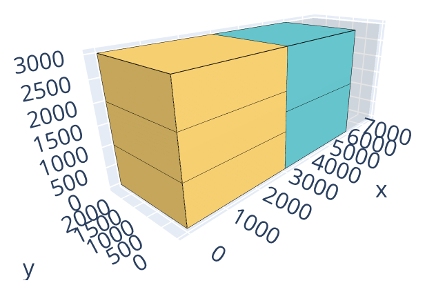

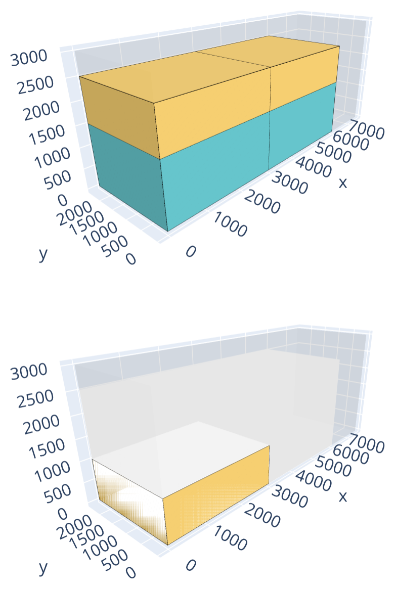

.. list-table::
   :widths: 1 1
   :header-rows: 1
   :align: center

   * - Without limit
     - Maximum weight above 30
   * - |boxstacks_maximum_weight_above_no|
     - |boxstacks_maximum_weight_above_yes|

.. example-tabs:: boxstacks/maximum_weight_above_no boxstacks/maximum_weight_above_yes

.. _boxstacks-maximum-stack-density:

Maximum stack density
---------------------

Each bin type may have a maximum stack density: the maximum weight of a stack per unit of area of its footprint.

.. tab-set::
   :sync-group: interface

   .. tab-item:: Online solver
      :sync: web

      Fill the **Weight** column of the **Item types** table; then, in the **Bin types** table, click **More** on a row and fill its **Maximum stack density**.

   .. tab-item:: JSON
      :sync: json

      In a bin type: ``"maximum_stack_density": 0.6``.

   .. tab-item:: Python
      :sync: python

      ``instance_builder.add_bin_type(x, y, z, maximum_stack_density=0.6)``

   .. tab-item:: C++
      :sync: cpp

      ``instance_builder.set_bin_type_maximum_stack_density(bin_type_id, 0.6);``

The following example packs 9 copies of a 2500 × 1200 × 1000 item weighing 700,000 and 9 copies of a 2500 × 1200 × 1000 item weighing 900,000 into 7500 × 2400 × 3000 bins (:code:`bin-packing` objective). Without a density limit, the items stack into a single bin as 6 side-by-side stacks of 3 — 3 stacks of the lighter item (weighing 3 × 700,000 = 2,100,000) and 3 of the heavier one (weighing 3 × 900,000 = 2,700,000) — each on a 2500 × 1200 = 3,000,000 floor area (density up to 2,700,000 / 3,000,000 = 0.9). With a maximum stack density of 0.6, a stack may weigh at most 0.6 × 3,000,000 = 1,800,000: no stack of 3 items fits under that limit anymore, so every stack is limited to 2 items. With only 6 stacks per bin now holding 12 of the 18 items, a second bin is needed for the remaining 6.

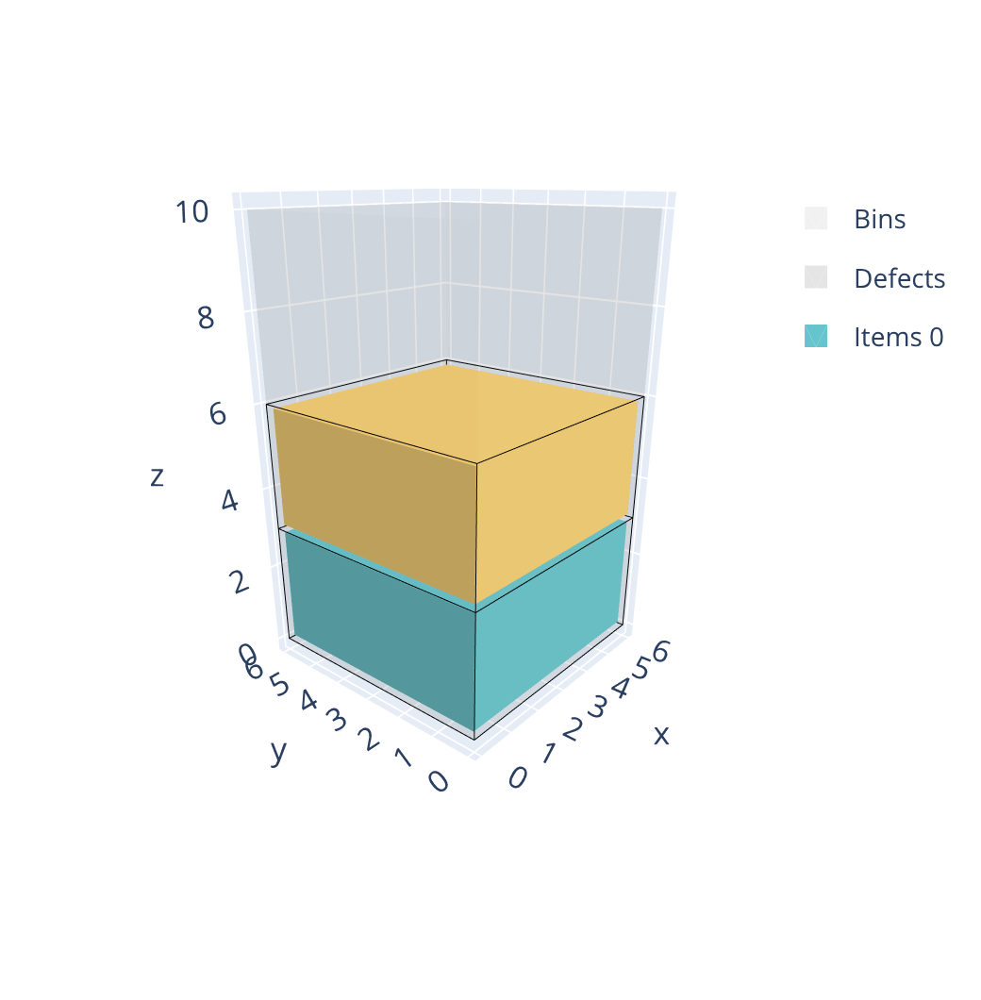

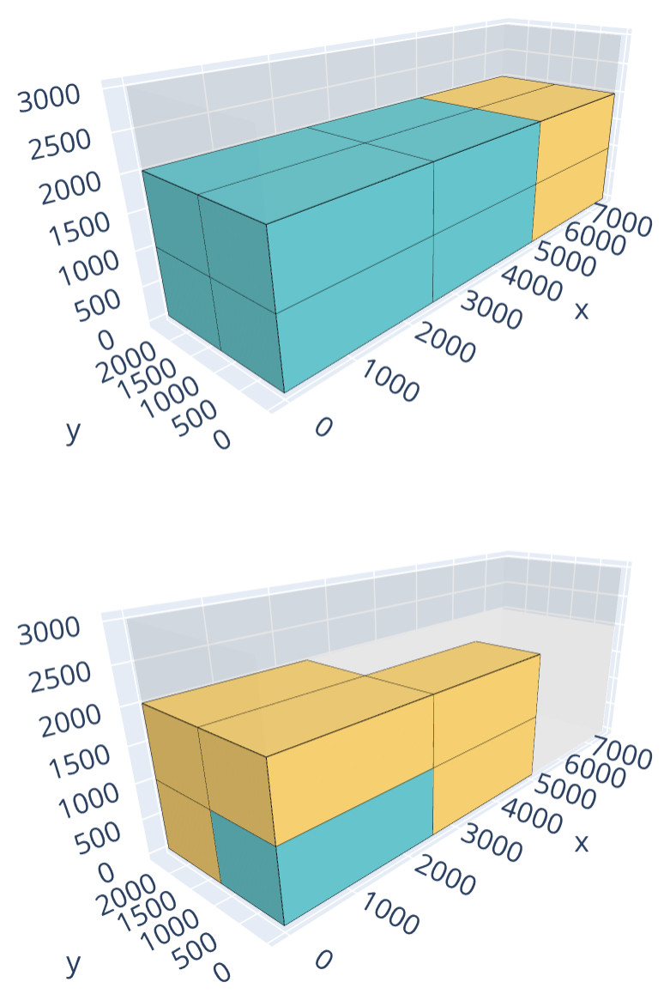

.. list-table::
   :widths: 1 1
   :header-rows: 1
   :align: center

   * - Without limit
     - Maximum stack density 0.6
   * - |boxstacks_maximum_stack_density_no|
     - |boxstacks_maximum_stack_density_yes|

.. example-tabs:: boxstacks/maximum_stack_density_no boxstacks/maximum_stack_density_yes

.. _boxstacks-unloading-constraints:

Unloading constraints
---------------------

When loading a truck that visits multiple locations, it might be necessary to unload the items at a location without moving the items which are still in the truck.
This is modeled with unloading constraints, as for the :ref:`rectangle<rectangle-unloading-constraints>` solver. Items are assigned to groups: the items of group 0 are unloaded first, then the items of group 1, etc.

.. tab-set::
   :sync-group: interface

   .. tab-item:: Online solver
      :sync: web

      Choose the **Unloading constraint** below the objective. Then, in the **Item types** table, click **More** on a row and fill its **Group**.

   .. tab-item:: JSON
      :sync: json

      In the instance: ``"unloading_constraint": "only-x-movements"``; in an item type: ``"group_id": 1``.

   .. tab-item:: Python
      :sync: python

      ``instance_builder.set_unloading_constraint(psbs.UnloadingConstraint.OnlyXMovements)`` and ``instance_builder.add_item_type(x, y, z, group_id=1)``

   .. tab-item:: C++
      :sync: cpp

      ``instance_builder.set_unloading_constraint(rectangle::UnloadingConstraint::OnlyXMovements);`` and ``instance_builder.set_item_type_group(item_type_id, 1);``

4 types of unloading constraints are available:

* ``only-x-movements``: the items are unloaded by moving them along the X axis, towards the right of the bin: no item of a later group may be on the right of an item of an earlier group which it overlaps
* ``only-y-movements``: same along the Y axis
* ``increasing-x``: the items of group 0 have greater X coordinates than the items of group 1, which have greater X coordinates than the items of group 2, etc.
* ``increasing-y``: same along the Y axis

The following example packs 3 items (3000 × 1400, 3000 × 2400 and 2500 × 1000 footprints, groups 0, 1 and 2) into 7500 × 2400 × 3000 bins (:code:`bin-packing-with-leftovers` objective). Without unloading constraints, the 3 items fit into a single bin. With ``only-x-movements``, the item of group 2 can't stay on the right of the item of group 1, so a second bin is needed.

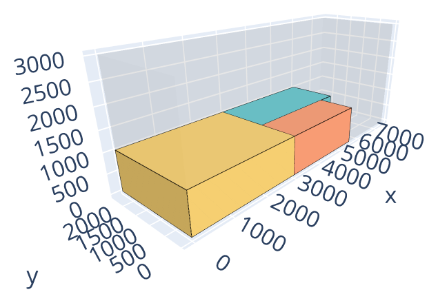

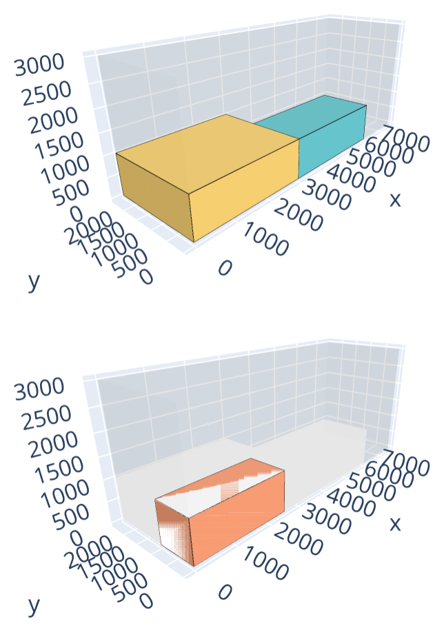

.. list-table::
   :widths: 1 1
   :header-rows: 1
   :align: center

   * - Without unloading constraints
     - ``only-x-movements``
   * - |boxstacks_unloading_no|
     - |boxstacks_unloading_yes|

.. example-tabs:: boxstacks/unloading_no boxstacks/unloading_yes

.. _boxstacks-axle-weights:

Maximum weight on the middle and rear axles
-------------------------------------------

For bins that model the trailer of a semi-trailer truck, the solver can enforce legal weight limits on the tractor's middle (drive) axle and on the trailer's rear axle, computed from the position of the loaded stacks along the trailer and the truck's geometry.

The tractor alone is characterized by its weight (``CM``, ``tractor_weight``) and by the distances between its front axle and its middle axle (``CJ``:sup:`fm`, ``front_axle_middle_axle_distance``) and center of gravity (``CJ``:sup:`fc`, ``front_axle_tractor_gravity_center_distance``):

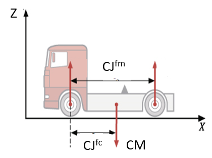

Once the trailer is attached at the harness (fifth wheel), its own geometry and the loaded cargo's weight and position add the remaining quantities used in the axle weight computation below (``EM``, ``EJ``:sup:`eh`, ``EJ``:sup:`hr`, ``EJ``:sup:`cr` are ``empty_trailer_weight``, ``trailer_start_harness_distance``, ``harness_rear_axle_distance`` and ``trailer_gravity_center_rear_axle_distance``; ``tm``:sub:`t` is the combined weight of the loaded stacks):

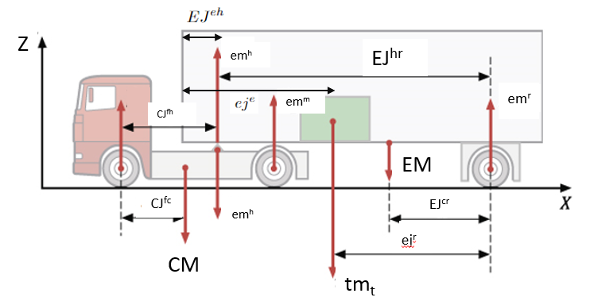

A semi-trailer truck is given by the ``semi_trailer_truck`` object of a bin type, with the following fields (the missing ones are ``0``, except the maximum weights which are unlimited):

* ``tractor_weight``: the weight of the tractor
* ``front_axle_middle_axle_distance``: the distance between the tractor's front axle and its middle (drive) axle
* ``front_axle_tractor_gravity_center_distance``: the distance between the tractor's front axle and its center of gravity
* ``front_axle_harness_distance``: the distance between the tractor's front axle and the harness (fifth-wheel coupling point)
* ``empty_trailer_weight``: the weight of the empty trailer
* ``harness_rear_axle_distance``: the distance between the harness and the trailer's rear axle
* ``trailer_gravity_center_rear_axle_distance``: the distance between the empty trailer's center of gravity and its rear axle
* ``trailer_start_harness_distance``: the distance between the start of the trailer's cargo area (X = 0) and the harness
* ``rear_axle_maximum_weight``: the maximum weight on the trailer's rear axle
* ``middle_axle_maximum_weight``: the maximum weight on the tractor's middle (drive) axle

.. tab-set::
   :sync-group: interface

   .. tab-item:: Online solver
      :sync: web

      In the **Bin types** table, click **More** on a row, check **Semi-trailer truck**, and fill the fields of the truck.

   .. tab-item:: JSON
      :sync: json

      In a bin type: ``"semi_trailer_truck": {"tractor_weight": 7808, ...}``.

   .. tab-item:: Python
      :sync: python

      ``instance_builder.add_bin_type(x, y, z, semi_trailer_truck_parameters={"tractor_weight": 7808, ...})``

   .. tab-item:: C++
      :sync: cpp

      A ``SemiTrailerTruckData`` (with ``is = true``), set with ``instance_builder.set_bin_type_semi_trailer_truck_parameters(bin_type_id, semi_trailer_truck_data);``

Loading cargo further toward the front of the trailer (closer to the harness) shifts more weight onto the tractor's middle axle and less onto the trailer's rear axle; loading further back does the opposite. The solver uses the combined weight and the X position of each stack's center to compute the resulting middle and rear axle weights, and only accepts solutions that stay within the limits.

The following example packs 19 copies of a 1200 × 1000 × 1200 item weighing 1200 and 19 copies of a 1200 × 1000 × 800 item weighing 800 — heights proportional to weight — into 13500 × 2440 × 2900 bins (38,000 of total weight) — dimensions and axle geometry matching a standard semi-trailer truck, as found in the reference instances under ``data/boxstacks`` — with up to 2 bins available (:code:`bin-packing` objective). Without the truck, no axle limits apply, and all 38 items fit in a single bin, packed compactly from the front of the trailer. Had the axle constraint been checked on that loading, it would put 23,499 on the middle axle — almost twice the 12,000 limit used below. With the truck, with a maximum weight of 12,000 on the middle axle and 31,500 on the rear axle, that loading is infeasible: the solver instead places the lighter item toward the front of the trailer and the heavier item toward the back, shifting the load rearward until both axles are just inside their limits. That rebalanced loading doesn't fit all the items in the first bin, so a second bin is needed.

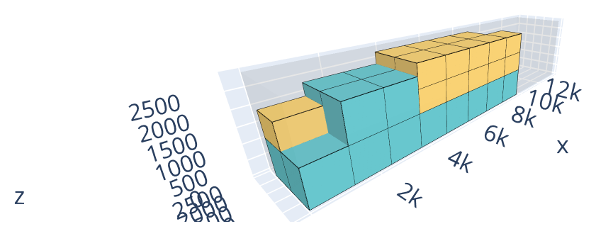

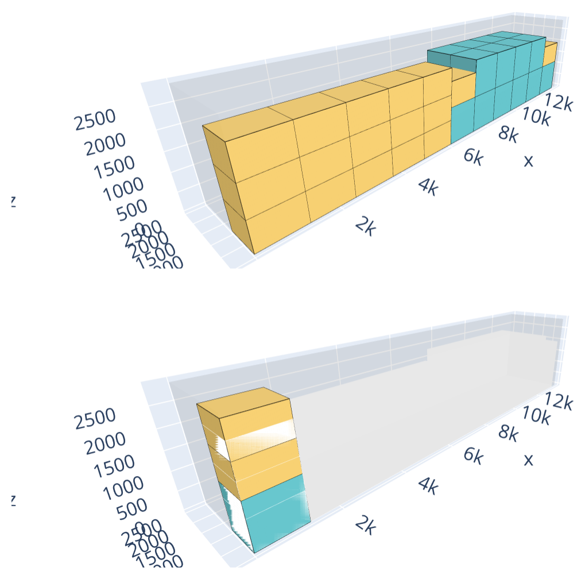

.. list-table::
   :widths: 1 1
   :header-rows: 1
   :align: center
   :class: wide-table

   * - Without axle constraints
     - With axle constraints
   * - |boxstacks_axle_weight_no|
     - |boxstacks_axle_weight_yes|

.. example-tabs:: boxstacks/axle_weight_no boxstacks/axle_weight_yes
