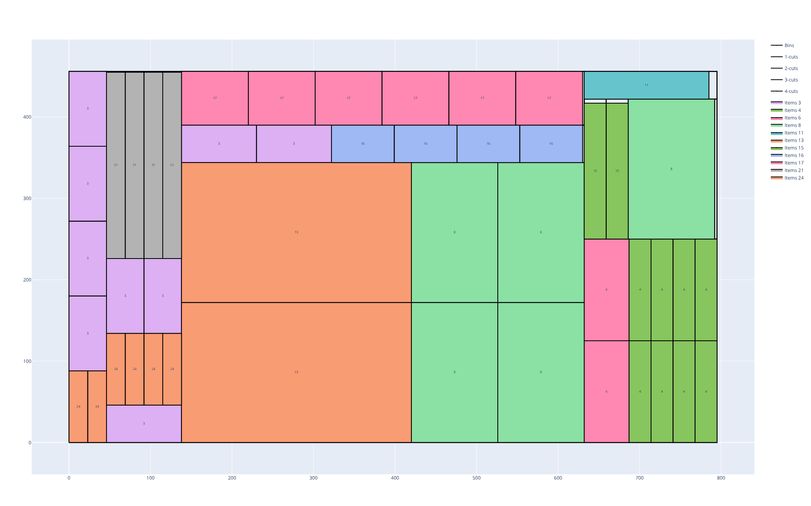
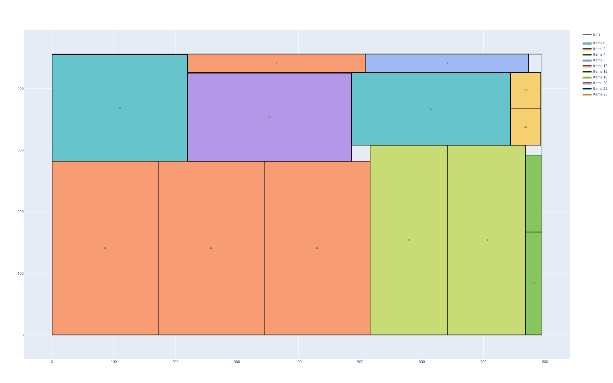
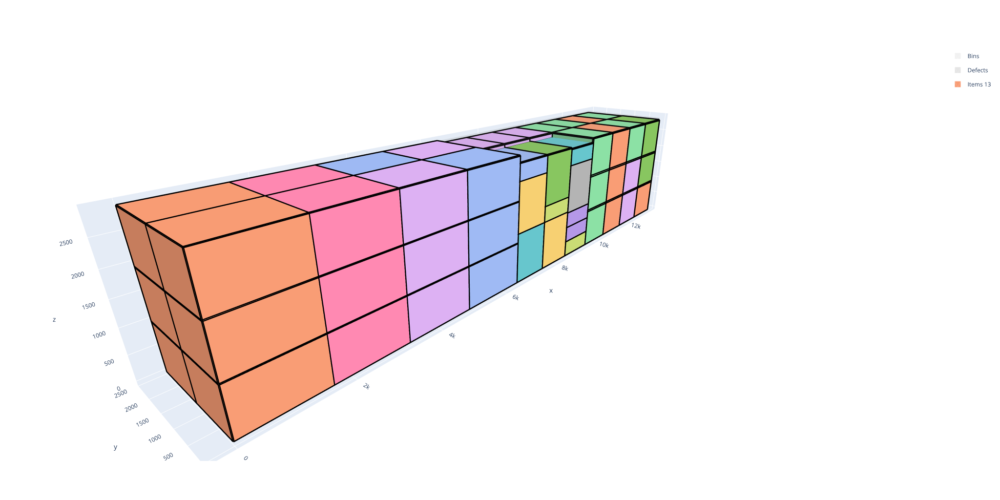
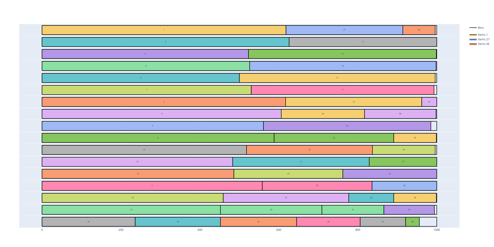
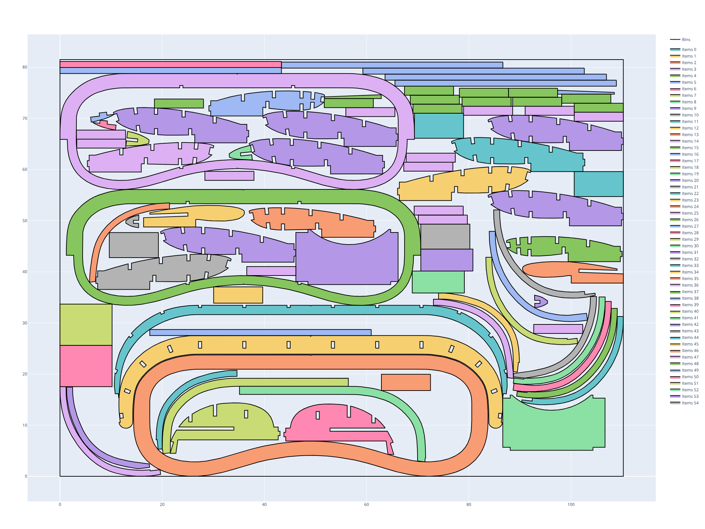
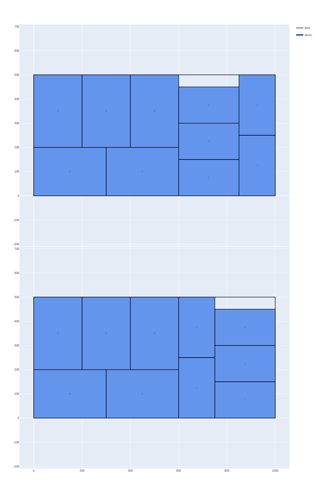

PackingSolver's documentation
=============================

.. toctree::
   :maxdepth: 3
   :hidden:

   self
   objectives
   optimization_modes
   rectangleguillotine
   rectangle
   boxstacks
   onedimensional
   irregular

Introduction
------------

`PackingSolver` is a software package dedicated to the practical resolution of cutting and packing problems.

`PackingSolver` takes as input:

* A set of pieces to cut/pack called **items**.
* A set of containers from which to cut / in which to pack these items, called **bins**.
* A set of parameters for the optimization

Then `PackingSolver` outputs the cutting/loading plans.

PackingSolver solves multiple problem types:

.. list-table::
   :widths: 1, 1
   :align: center

   * - :ref:`RectangleGuillotine<rectangleguillotine>`

       * Items: two-dimensional rectangles
       * Only edge-to-edge cuts are allowed
     - |rectangleguillotine|
   * - :ref:`Rectangle<rectangle>`

       * Items: two-dimensional rectangles
     - |rectangle|
   * - :ref:`BoxStacks<boxstacks>`

       * Items: three-dimensional rectangular parallelepipeds
       * Items can be stacked; a stack contains items with the same width and length
     - |boxstacks|
   * - :ref:`OneDimensional<onedimensional>`

       * Items: one-dimensional items
     - |onedimensional|
   * - :ref:`Irregular<irregular>`

       * Items: two-dimensional polygons
     - |irregular|

Getting started
---------------

Let's see how to solve a simple rectangle packing problem.

In a first CSV file, we provide the width, height and number of copies of the items to pack.
Here we consider two items:

* The first one has a width of 300, a height of 200 and 10 copies.
* The second one has a width of 250, a height of 150 and 10 copies.

.. code-block:: none
   :caption: items.csv

   WIDTH,HEIGHT,COPIES
   300,200,10
   250,150,10

In a second CSV file, we provide the width, height and number of copies of the bins in which the items must be packed.
Here we consider a single container of width 1000 and of height 500 available in 10 copies.

.. code-block:: none
   :caption: bins.csv

   WIDTH,HEIGHT,COPIES
   1000,500,10

Finally, in a third CSV file, we provide the other optimizaton parameters. Here we just set the :code:`objective` parameter to :code:`bin-packing`, which means that we look to pack all the items using as few bins as possible. The :ref:`objectives<objectives>` page gives more details about the possible objectives.

.. code-block:: none
   :caption: parameters.csv

   NAME,VALUE
   objective,bin-packing

Now, we use the following command to launch the optimization:

.. code-block:: shell

    packingsolver_rectangle \
            --items items.csv \
            --bins bins.csv \
            --parameters parameters.csv \
            --certificate solution_rectangle.csv

The terminal output looks like:

.. code-block:: none

    =================================
              PackingSolver          
    =================================

    Problem type
    ------------
    Rectangle

    Instance
    --------
    Objective:             BinPacking
    Number of item types:  2
    Number of items:       20
    Number of bin types:   1
    Number of bins:        10
    Number of groups:      1
    Number of defects:     0
    Unloading constraint:  None
    Total item area:       975000
    Total item width:      5500
    Total item height:     3500
    Smallest item width:   150
    Smallest item height:  150
    Total bin area:        5000000
    Total item weight:     0
    Total bin weight:      0

            Time    Bins  Full waste (%)                         Comment
            ----    ----  --------------                         -------
           0.001       3           35.00                  TS g 0 d X q 1
           0.002       2            2.50                  TS g 0 d X q 9

    Final statistics
    ----------------
    Time (s):  0.0166683

    Solution
    --------
    Number of items:  20 / 20 (100%)
    Item area:        975000 / 975000 (100%)
    Item weight:      0 / 0 (-nan%)
    Item profit:      975000 / 975000 (100%)
    Number of bins:   2 / 10 (20%)
    Bin area:         1000000 / 5000000 (20%)
    Bin weight:       0 / 0 (-nan%)
    Bin cost:         1e+06
    Waste:            25000
    Waste (%):        2.5
    Full waste:       25000
    Full waste (%):   2.5
    Area load:        0.195
    Weight load:      -nan
    X max:            1000
    Y max:            500
    Leftover value:   0

From the terminal output, we see that the solver managed to pack all the items using two bins.
The loading plans are written in the :code:`solution_rectangle.csv` file. A script is available to visualize them:

.. code-block:: shell

    python3 scripts/visualize_rectangle.py solution_rectangle.csv

The script opens a page in a browser where the loading plans are displayed:

