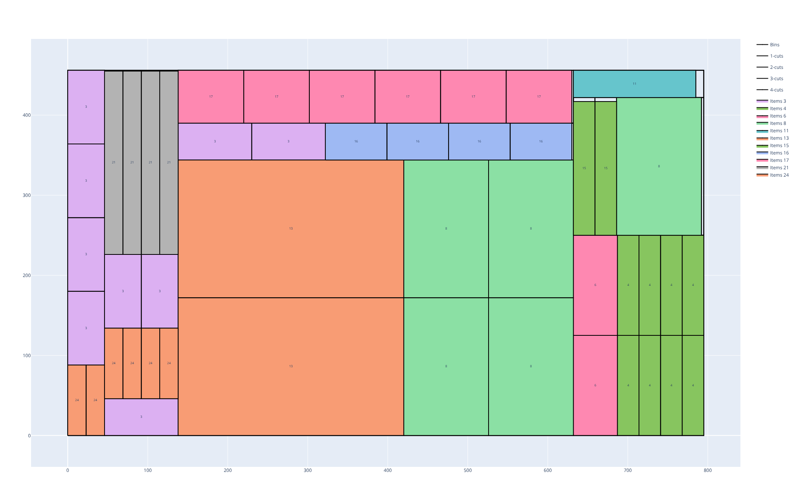
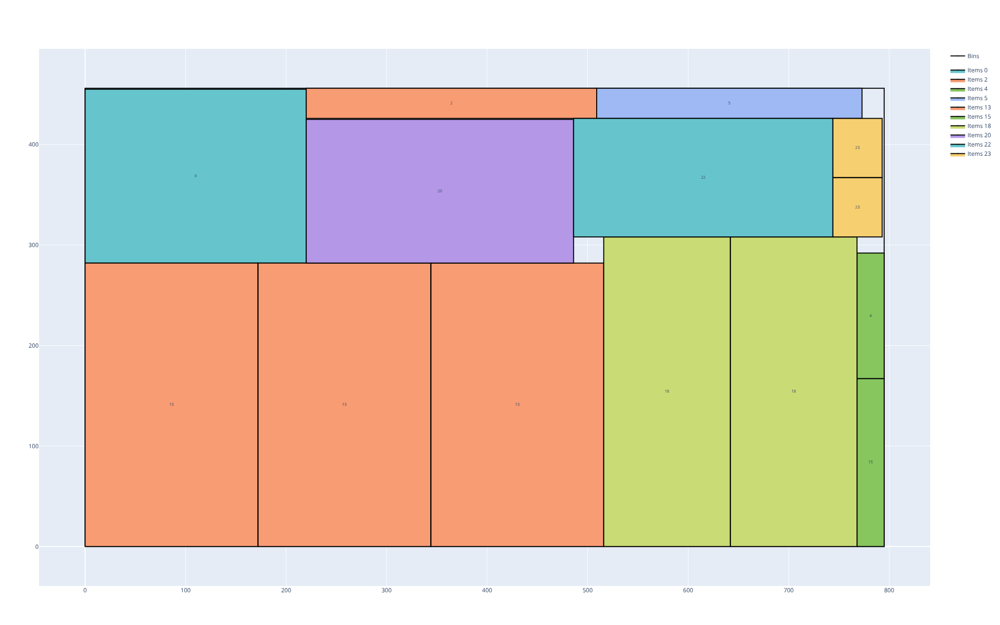
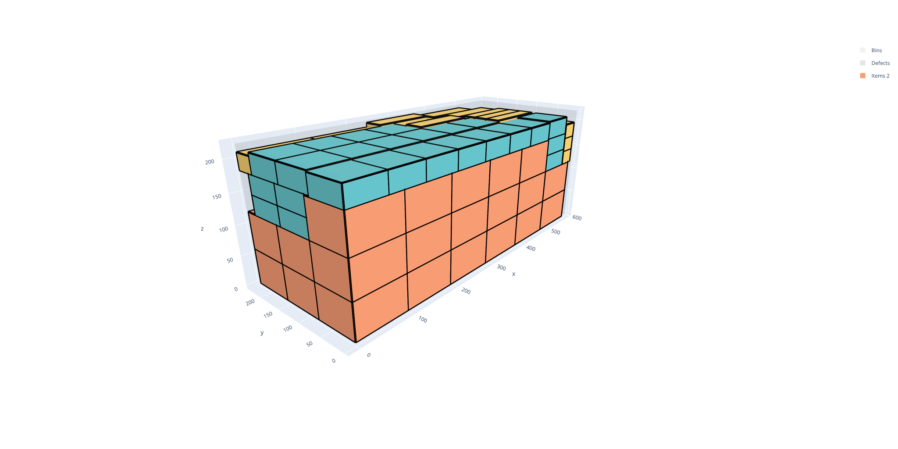
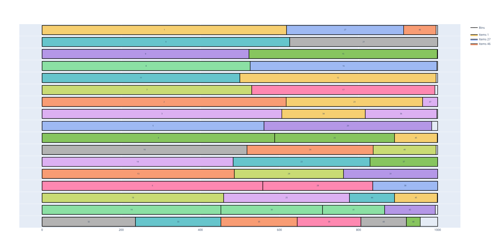
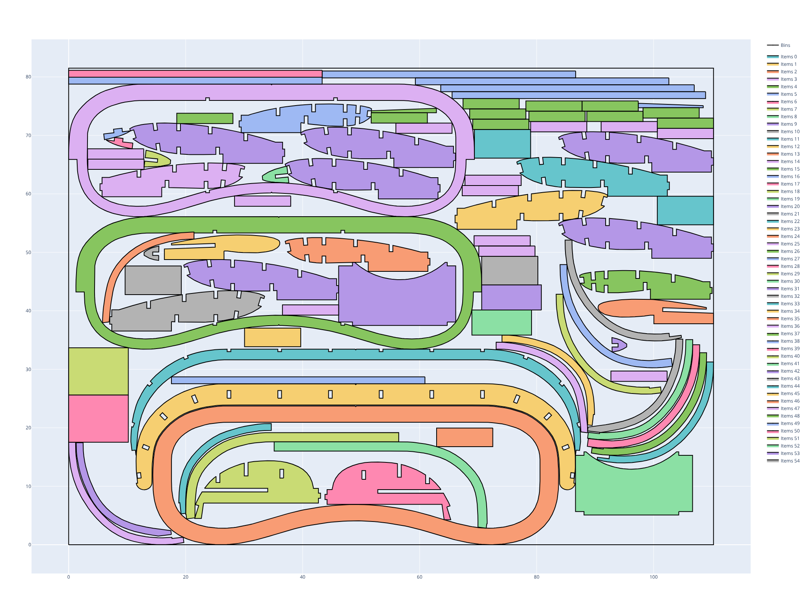
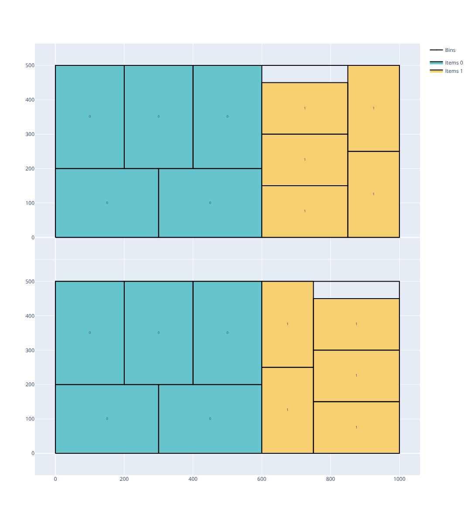

PackingSolver's documentation
=============================

.. toctree::
   :maxdepth: 3
   :hidden:

   self
   objectives
   optimization_modes
   onedimensional
   rectangle
   rectangleguillotine
   box
   boxstacks
   irregular
   internals/overview

Introduction
------------

`PackingSolver` is a software package dedicated to the practical resolution of cutting and packing problems.

`PackingSolver` takes as input:

* A set of pieces to cut/pack called **items**.
* A set of containers from which to cut / in which to pack these items, called **bins**.
* A set of parameters for the optimization

Then `PackingSolver` outputs the cutting/loading plans.

PackingSolver solves multiple problem types:

.. |boxstacks| image:: ../img/boxstacks.png
   :width: 512pt

.. list-table::
   :widths: 1, 1
   :align: center

   * - :ref:`rectangle-guillotine<rectangleguillotine>`

       * Items: two-dimensional rectangles
       * Only edge-to-edge cuts are allowed
     - |rectangleguillotine|
   * - :ref:`rectangle<rectangle>`

       * Items: two-dimensional rectangles
     - |rectangle|
   * - :ref:`box<box>`

       * Items: three-dimensional rectangular parallelepipeds
     - |box|
   * - :ref:`box-stacks<boxstacks>`

       * Items: three-dimensional rectangular parallelepipeds
       * Items are stacked; a stack contains items with the same width and length
     - |boxstacks|
   * - :ref:`one-dimensional<onedimensional>`

       * Items: one-dimensional items
     - |onedimensional|
   * - :ref:`irregular<irregular>`

       * Items: two-dimensional polygons
     - |irregular|

Getting started
---------------

Let's see how to solve a simple rectangle packing problem. There are two item types: the first one has a width of 300, a height of 200 and 10 copies; the second one has a width of 250, a height of 150 and 10 copies. The items are packed in bins of width 1000 and height 500, using as few bins as possible, and then maximizing the leftover of the last bin (see :ref:`objectives`).

PackingSolver can be used:

* in the browser, with the `online solver <https://packingsolver.pages.dev/>`_: no installation is needed, and the computation runs on your machine;
* from the command line, with an instance in the JSON format: the solvers are built with CMake (``cmake -S . -B build -DCMAKE_BUILD_TYPE=Release``, ``cmake --build build --parallel``, ``cmake --install build --prefix install``);
* from Python, with the ``packingsolver`` package (``pip install packingsolver``, Python ≥ 3.12);
* from C++, with the library (CMake targets ``PackingSolver::<problem type>``).

The tabs below show the instance and how to solve it with each of them; the other pages of this documentation use the same tabs:

.. example-tabs:: rectangle/basic
   :solve:

The terminal output of the command-line solver looks like:

.. literalinclude:: examples/rectangle/basic/output.txt

From the terminal output, we see that the solver managed to pack all the items using two bins.
The loading plans are written in the :code:`solution.csv` file. To visualize them, open the file in the `solution viewer <https://packingsolver.pages.dev/viewer.html>`_, or run:

.. code-block:: shell

    python3 scripts/visualize.py solution.csv

