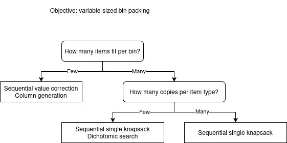

.. _internals_algorithm_selection:

Algorithm selection
=====================

For a given instance, each domain solver usually has several applicable algorithms. All of them can be enabled or disabled individually with a ``--use-<algorithm>`` option (e.g. ``--use-tree-search 1``, ``--use-column-generation 0``); several can be enabled at once, in which case they run concurrently (in anytime mode) and the best solution found by any of them is kept, along with the best bound found by any of them.

If none of the ``--use-<algorithm>`` options is set, the solver picks a default combination automatically, based on three simple structural properties of the instance:

* **The objective** (knapsack, bin packing, variable-sized bin packing, open-dimension, feasibility, ...): each objective supports a different subset of algorithms; see the :ref:`objectives<objectives>` page. With a single bin, the problem reduces to a single knapsack/open-dimension/feasibility instance regardless of the nominal objective, and only single-bin algorithms (tree search and its variants) apply; decomposition algorithms (sequential value correction, dichotomic search, column generation) only become relevant once several bins are available.
* **The average number of items that fit in a bin**: instances where many items fit per bin (e.g. small items in a large bin) behave differently from instances where a bin only holds a handful of items.
* **The average number of copies of each item type**: the more copies an item type has, the more often the pattern(s) that pack it end up repeated in the solution. Instances with few item types and many copies of each (e.g. cutting stock problems) behave differently from instances with many distinct item types and few copies of each.

The following illustrates the algorithm selection for the :code:`variable-sized-bin-packing` objective (when more than one bin type is available):

