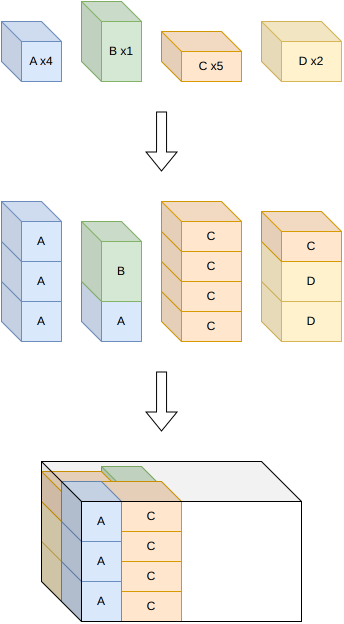
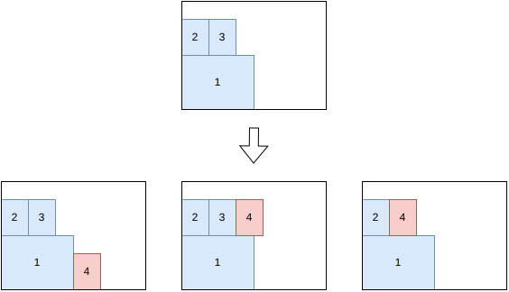

.. _internals_boxstacks:

:code:`box-stacks` algorithms
=============================

See :ref:`boxstacks<boxstacks>` for the input/output format and CLI usage of this solver.

Sequential one-dimensional / rectangle
------------------------------------------

This algorithm solves the :code:`feasibility` and :code:`knapsack` objectives with a single bin.

It decomposes the problem in two phases:

1. Group items into stacks by solving a one-dimensional variable-sized bin packing problem (each stack is a "bin" whose length is limited by the stacking constraints).
2. Pack the resulting stacks into the bin's footprint by solving a rectangle knapsack problem.

The stacks generated in the first step contain exactly all the items.

This decomposition is much cheaper than the full tree search below, and is designed for instances where axle/weight constraints don't force a sparse packing.

Tree search
------------

This algorithm solves the :code:`feasibility` and :code:`knapsack` objectives with a single bin.

It is a tree search algorithm where a single item is packed at each stage. The root node is an empty partial solution (no item packed). Given a node, a child node is generated for each feasible insertion of each unpacked item, either in the same bin or in a new bin.

The possible insertions for an unpacked item are the ones where the new item has its lower y touching either another packed stack or the y = 0 side of the bin; or where the new item is stacked over a packed stack.

This algorithm is more expensive than the sequential one-dimensional / rectangle algorithm. It is useful when axle-weight constraints are active in the best solutions.
