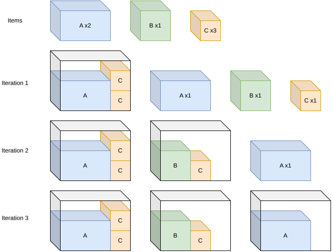
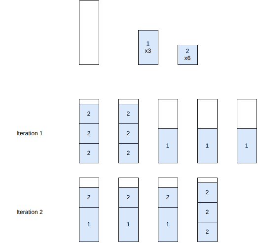
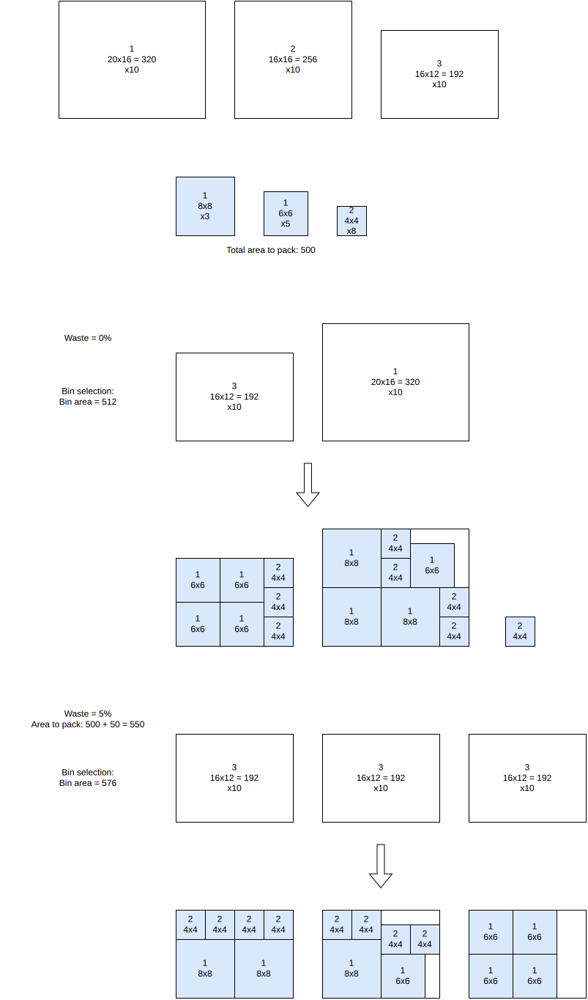
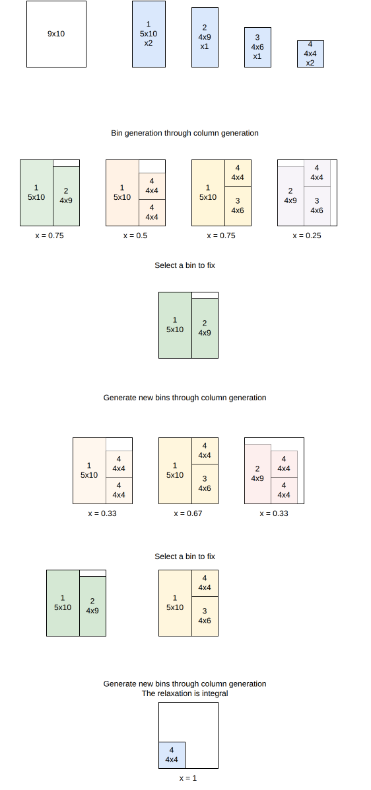

.. _internals_generic_algorithms:

Generic algorithms
===================

The following algorithms are conceptually the same across all domains: each one solves a multi-bin problem by repeatedly solving single-bin (knapsack) sub-problems of the *same* domain.

Sequential single knapsack
----------------------------

This algorithm solves the :code:`knapsack`, :code:`bin-packing`, :code:`bin-packing-with-leftovers` and :code:`variable-sized-bin-packing` objectives.

It iteratively generates new solution bins by solving a knapsack sub-problem with the remaining items for each remaining bin type. Once all items have been packed, it restarts and puts more effort into the sub-problems.

Sequential value correction
----------------------------

This algorithm solves the :code:`knapsack`, :code:`bin-packing`, :code:`bin-packing-with-leftovers` and :code:`variable-sized-bin-packing` objectives.

It is closely related to sequential single knapsack: it also solves single knapsack sub-problems for each bin with the remaining items until all items are packed, but instead of restarting with a larger search effort, it restarts by increasing the profit of items that were packed in high-waste bins, so that they get packed earlier in the next pass and hopefully generate less waste. It repeats this process, refining item profits each time, either for a fixed number of iterations (non-anytime modes) or until the time limit is reached (anytime mode).

In the example below, items :code:`1` (3 copies) and :code:`2` (6 copies) are packed. At iteration 1, item :code:`2` fills two bins perfectly, but item :code:`1` is packed alone in three separate bins, each mostly empty. Since item :code:`1` was packed in high-waste bins, its profit is increased: at iteration 2, it now gets packed earlier and combines with item :code:`2` to fill bins completely, reducing the total number of bins from 5 to 4:

References:

* "Linear one-dimensional cutting-packing problems: numerical experiments with the sequential value correction method (SVC) and a modified branch-and-bound method (MBB)" (Mukhacheva et al., 2000)
* "Parallelized sequential value correction procedure for the one-dimensional cutting stock problem with multiple stock lengths" (Cui et Tang, 2014)

Dichotomic search
------------------

This algorithm solves the :code:`variable-sized-bin-packing` objective.

It searches, by dichotomy, for the smallest achievable waste percentage: for a given waste estimate, it deduces which bins would be needed to reach that quantity of waste, and solves a bin packing sub-problem restricted to those bins. If all items pack successfully, the waste estimate is decreased; otherwise, it is increased. The search continues until the estimate converges.

In the example below, the items to pack have a total area of 500, and three bin types are available (20x16, 16x16 and 16x12). At a waste estimate of 0%, the smallest combination of bins reaching the required area is one 16x12 and one 20x16 bin (total area 512); packing all the items into exactly these two bins turns out to be infeasible, so the waste estimate is increased. At a waste estimate of 5% (required area 550), three 16x12 bins (total area 576) are enough, and this time every item packs successfully:

Column generation
-------------------

This algorithm solves the :code:`knapsack`, :code:`bin-packing`, :code:`bin-packing-with-leftovers` and :code:`variable-sized-bin-packing` objectives.

This is a tree search algorithm. At each stage, a new bin is added to the solution. Bins are generated dynamically at each node through column generation.

**Input**:

* bin types :math:`i = 1, \ldots, m`; for each bin type :math:`i`: a lower bound :math:`l_i` and an upper bound :math:`u_i` on its number of copies, and a cost :math:`c_i`
* item types :math:`j = 1, \ldots, n`; for each item type :math:`j`: a number of copies :math:`q_j`
* for each bin type :math:`i`, a set :math:`K_i` of feasible packing patterns; for each pattern :math:`k \in K_i`, :math:`x_{j,i}^k` is the number of copies of item type :math:`j` it contains

**Variables**:

* :math:`y_i^k \in \{0, \ldots, q^{\max}\}`, :math:`i = 1, \ldots, m`, :math:`k \in K_i`: number of times packing pattern :math:`k` of bin type :math:`i` is used

**Objective**: minimize the total cost of the bins used

.. math::

   \min \sum_{i} c_i \sum_{k} y_i^k

**Constraints**:

* Bin type bounds

.. math::

   \forall i \qquad l_i \le \sum_{k} y_i^k \le u_i

* Item demand: each item type is packed exactly :math:`q_j` times

.. math::

   \forall j \qquad \sum_{i} \sum_{k} x_{j,i}^k \, y_i^k = q_j

The pricing sub-problem -- finding a new, profitable packing pattern to add to the linear relaxation -- consists in finding, for some bin type :math:`i`, a column of negative reduced cost

.. math::

   rc(y_i^k) = c_i - u_i - \sum_{j} x_{j,i}^k \, v_j

where :math:`u_i` and :math:`v_j` are the dual variables of the bin type bound and item demand constraints. This reduces to solving a bounded knapsack problem with item profits :math:`v_j`, which is itself a single-bin knapsack instance, solved with the same tree search used elsewhere in the domain. The linear relaxation is explored with a limited discrepancy search, which also yields a bound on the objective (a knapsack bound, an open-dimension bound, or a bin-packing bound, depending on the objective).

Sequential feasibility
-------------------------

This algorithm solves the :code:`bin-packing`, :code:`bin-packing-with-leftovers`, :code:`open-dimension-x`, :code:`open-dimension-y` and :code:`open-dimension-xy` objectives.

It repeatedly solves a :code:`feasibility` sub-problem asking whether all the items fit into a shrinking amount of space -- a number of bins for :code:`bin-packing`, the width of the last bin for :code:`bin-packing-with-leftovers`, or the open dimension(s) for the :code:`open-dimension-*` objectives. It starts from an upper bound estimated from the total item area, and as long as the sub-problem is feasible, it tightens the bound based on the solution just found (e.g. one fewer bin than it actually used, or slightly less than the dimension it actually achieved) and solves it again. It stops as soon as a sub-problem turns out infeasible, and returns the last feasible solution found.
