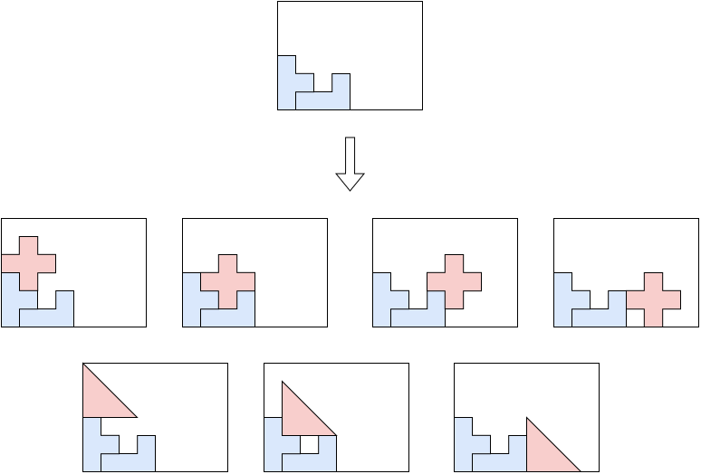
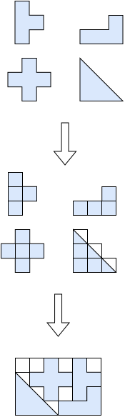
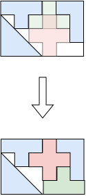

.. _internals_irregular:

:code:`irregular` algorithms
============================

See :ref:`irregular<irregular>` for the input/output format and CLI usage of this solver.

Trivial single item
-----------------------

This algorithm solves the :code:`feasibility` objective.

This is not an algorithm aimed at generating real patterns. It is aimed at providing a fast debug routine to check if an item fits in at least one bin.

It tries to place the item by aligning the center of its bounding box with the center of the bin's bounding box, then validates (and, if needed, adjusts) the placement against the bin's actual shape.

Tree search
------------

This algorithm solves the :code:`feasibility`, :code:`knapsack`, :code:`bin-packing`, :code:`bin-packing-with-leftovers`, :code:`open-dimension-x`, :code:`open-dimension-y` objectives.

It is a tree search algorithm where a single item is packed at each stage. The root node is an empty partial solution (no item packed). Given a node, a child node is generated for each feasible insertion of each unpacked item.

It is a generalization of the tree search algorithm for :code:`rectangle`.

MILP raster
--------------

This algorithm solves the :code:`feasibility` and :code:`knapsack` objectives.

It rasterizes the bin and items onto a grid and solves the resulting placement problem as a mixed-integer linear program.

**Input**:

* a set :math:`G` of grid cells
* a set :math:`P` of candidate placements; for each placement :math:`p`, an item type :math:`j(p)`, a profit :math:`p_{j(p)}` and the set of cells :math:`C_p \subseteq G` it covers
* item types :math:`j = 1, \ldots, n`; for each item type :math:`j`, a number of copies :math:`q_j`

**Variables**:

* :math:`x_p \in \{0, 1\}`, :math:`p \in P`: :math:`x_p = 1` iff placement :math:`p` is selected

**Objective**: maximize the total profit of the placed items

.. math::

   \max \sum_{p} p_{j(p)} \, x_p

**Constraints**:

* Item copies: each item type is placed at most (:code:`knapsack`) or exactly (:code:`feasibility`) its number of copies

.. math::

   \forall j \qquad \sum_{p \,:\, j(p) = j} x_p \le q_j

* Cell conflict: each grid cell is covered by at most one placement

.. math::

   \forall c \in G \qquad \sum_{p \,:\, c \, \in \, C_p} x_p \le 1

The algorithm starts with a coarse grid and iteratively halves the cell size, re-solving the model each time, until the time limit is reached.

Local search
--------------

This algorithm solves the :code:`feasibility` objective.

It works on a solution where all items are packed with overlap. At each iteration, it tries to reduce the overlap until no items overlap anymore and the solution becomes feasible.

One-dimensional bound
------------------------

This algorithm computes a bound for the :code:`bin-packing`, :code:`knapsack` and :code:`variable-sized-bin-packing` objectives.

Relaxes the instance to a one-dimensional problem (each bin and item type keeps only its area) and solves it, which is much cheaper than solving the irregular problem itself. The resulting bin-packing / knapsack / variable-sized-bin-packing bound is a valid bound for the original instance, since no irregular packing can use less total area than this relaxation requires.
