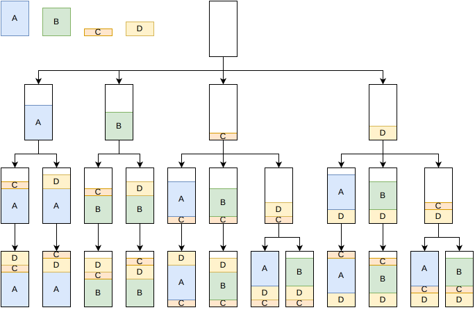

.. _internals_onedimensional:

:code:`one-dimensional` algorithms
==================================

See :ref:`onedimensional<onedimensional>` for the input/output format and CLI usage of this solver.

Dynamic programming for the classical 0-1 knapsack problem
----------------------------------------------------------

This algorithm solves the :code:`knapsack` objective.

It ignores all the constraints except the capacity constraint and solves the problem as a classical 0-1 knapsack problem using the primal-dual dynamic programming algorithm.
Afterwards, it checks if the returned solution satisfies the other constraints previously ignored. If so, the solution is stored and is actually optimal.

Thus, if the instance to solve is a classical 0-1 knapsack problem, it is solved optimally. And even if it is not, as long as in practice only the capacity constraint is active for this instance, it still gets solved very quickly to proven optimality. Otherwise, the running time of this algorithm remains small compared to the time of the other algorithms that will be executed instead. Therefore, the overhead is not significant.

Reference:

* "A Minimal Algorithm for the 0-1 Knapsack Problem" (Pisinger, 1997)

  * https://doi.org/10.1287/opre.45.5.758

Tree search
-----------

This algorithm solves the :code:`feasibility`, :code:`knapsack`, :code:`bin-packing` and :code:`bin-packing-with-leftovers` objectives.

It is a tree search algorithm where a single item is packed at each stage. The root node is an empty partial solution (no item packed). Given a node, a child node is generated for each feasible insertion of an unpacked item after the last one inserted, either in the same bin or in a new bin.

