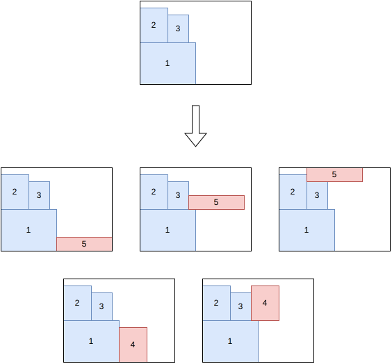
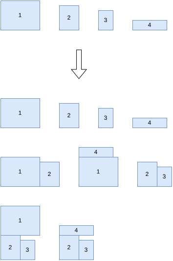
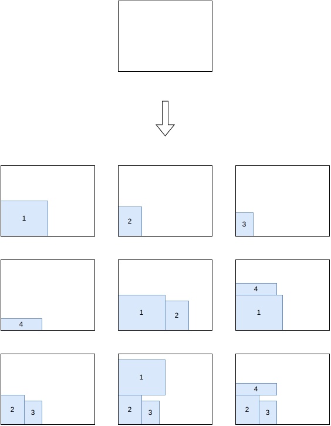
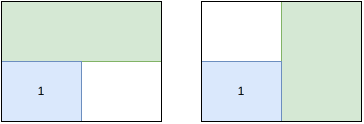
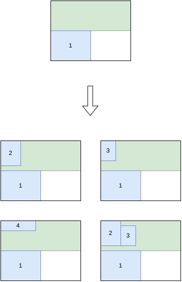
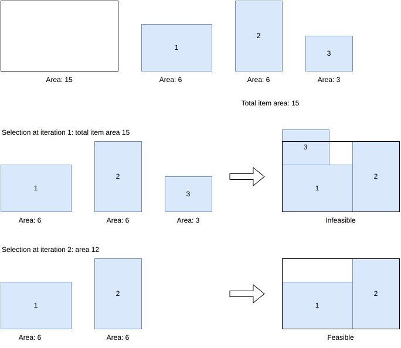
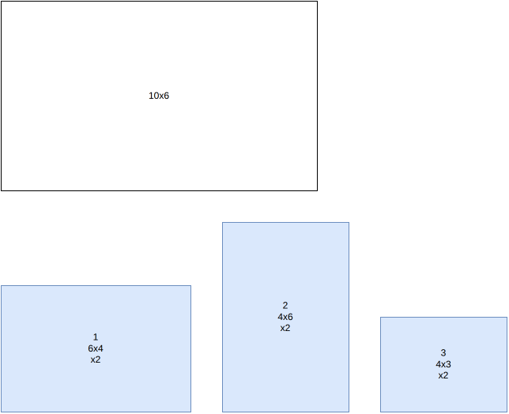
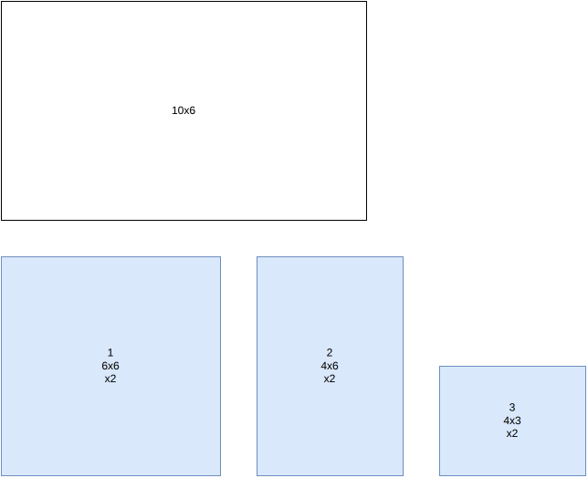

.. _internals_rectangle:

:code:`rectangle` algorithms
============================

See :ref:`rectangle<rectangle>` for the input/output format and CLI usage of this solver.

Tree search
------------

This algorithm solves the :code:`feasibility`, :code:`knapsack`, :code:`open-dimension-x`, :code:`open-dimension-y`, :code:`bin-packing` and :code:`bin-packing-with-leftovers` objectives.

It is a tree search algorithm where a single item is packed at each stage. The root node is an empty partial solution (no item packed). Given a node, a child node is generated for each feasible insertion of each unpacked item, either in the same bin or in a new bin.

The possible insertions for an unpacked item are the ones where the new item is packed above either a packed item or the bottom of the bin, then shifted right until it intersects no packed item.

Tree search with maximal spaces
----------------------------------

This algorithm solves the :code:`feasibility` and :code:`knapsack` objectives with a single bin.
It doesn't support unloading constraints.

It is a tree search algorithm where multiple items are packed at each stage.

In a first step, some blocks of items are generated. Blocks may contain a single item, multiple items of the same type, or multiple items of different types. Here is an example of block generation from 4 items:

In a node of the branching scheme, all maximal empty rectangles are stored. To generate the children of a node, a maximal empty rectangle is first selected, then one child is generated for each remaining block that fits inside the considered space.

At the root node, the only maximal empty rectangle is the bin itself, so one child is generated per candidate block, placed in its bottom-left corner:

Placing a block can leave more than one maximal empty rectangle: after placing the block containing item ``1`` in the bottom-left corner, both the strip above it and the strip to its right are maximal empty rectangles, and both are stored in the node:

When generating the children of this node, one of these maximal empty rectangles is selected, and one child is generated per remaining block that fits inside:

References:

* "A beam search algorithm for the biobjective container loading problem" (Araya, Moyano and Sanchez, 2020)

  * https://doi.org/10.1016/j.ejor.2020.03.040

* "A tree search-based heuristic for the three-dimensional single container loading problem" (Guesser, Alves De Queiroz and Miyazawa, 2026)

  * https://doi.org/10.1016/j.ejor.2026.01.039

Benders decomposition
------------------------

This algorithm solves the :code:`knapsack` objective.

It solves the mixed-integer linear programming model where the geometrical constraints have been removed, only keeping the constraint that the selected items must fit in the bin area.

**Input**:

* item types :math:`j = 1, \ldots, n`; for each item type :math:`j`:

  * a profit :math:`p_j`
  * an area :math:`a_j`
  * a maximum number of copies :math:`q_j` that could possibly fit in the bin

* a bin area :math:`A`
* a set :math:`\mathcal{C}` of previously rejected item selections (the no-good cuts found so far, initially empty)

**Variables**:

* :math:`x_{j,c} \in \{0, 1\}`, :math:`j = 1, \ldots, n`, :math:`c = 1, \ldots, q_j`: :math:`x_{j,c} = 1` iff the :math:`c`-th copy of item type :math:`j` is selected, otherwise :math:`0`.

**Objective**: maximize the total profit of the selected items

.. math::

   \max \sum_{j} \sum_{c} p_j \, x_{j,c}

**Constraints**:

* Bin area: the selected items must fit in the bin area

.. math::

   \sum_{j} \sum_{c} a_j \, x_{j,c} \le A

* Ordered copies: the copies of an item type are selected in order

.. math::

   \forall j \quad \forall c = 1, \ldots, q_j - 1 \qquad x_{j,c+1} \le x_{j,c}

* No-good cuts: one per previously rejected selection :math:`S \in \mathcal{C}`, forbidding that exact same combination of items from being selected again

.. math::

   \forall S \in \mathcal{C} \qquad \sum_{(j,c) \, \in \, S} x_{j,c} \le |S| - 1

At each iteration, the model above is solved, giving a candidate item selection. A :code:`feasibility` subproblem is then solved to check whether there exists a packing with the same items that satisfies the geometrical constraints ignored in the model. If yes, the algorithm stops: the candidate selection is an optimal solution. Otherwise, the candidate selection is added to :math:`\mathcal{C}` as a new no-good cut, and the model is solved again.

In the example below, the bin has an area of 15 and items ``1``, ``2`` and ``3`` have an area of 6, 6 and 3 respectively -- exactly matching the bin area when all three are selected. At iteration 1, with no cuts yet, the model selects all three items (the only selection reaching the maximum possible area, 15). This selection turns out to be infeasible: items ``1`` and ``2`` already leave no room for item ``3``. A no-good cut excluding this exact combination is then added, and at iteration 2 the model selects items ``1`` and ``2`` only (area 12), which is feasible:

References:

* "On the Two-Dimensional Knapsack Problem" (Caprara and Monaci, 2004)

  * https://doi.org/10.1016/S0167-6377(03)00057-9

* "A Cutting-Plane Approach for the Two-Dimensional Orthogonal Non-Guillotine Cutting Problem" (Baldacci and Boschetti, 2007)

  * https://doi.org/10.1016/j.ejor.2005.11.060

* "Combinatorial Benders Decomposition for the Two-Dimensional Bin Packing Problem" (Côté, Haouari and Iori, 2021)

  * https://doi.org/10.1287/ijoc.2020.1014

* "Optimisation de plans de palettisation hétérogène" (Le Jean, 2021, PhD thesis, Université Grenoble Alpes)

  * https://theses.fr/2021GRALM032

.. _internals_rectangle_dual_feasible_functions:

Dual feasible functions
-------------------------

This algorithm computes a bound for the :code:`bin-packing` objective.

It builds dominated instances in the sense that every feasible solution of the original instance is also feasible for the equivalent instances; however, computing the classical bound on these instances may lead to different values, sometimes better, which remain valid bounds for the original instance.

In the example below, the bin is 10x6 and there are two copies each of items ``1`` (6x4), ``2`` (4x6) and ``3`` (4x3). Every pair of these items fits together in the bin, so the naive bound based on the total item area (2x(24+24+12) = 120, divided by the bin area 60, rounded up) is only 2:

We apply the following transformation:

* For every item with height :math:`\geq 4`, change its height to :math:`6`
* Remove every item with height :math:`\leq 2`

Every feasible solution for the original instance is feasible for the modified instance: when the height of an item with height :math:`\geq 4` is increased, every item it might intersect necessarily has height :math:`\leq 2`, and is therefore among the removed items.

Only item ``1`` is affected by the transformation: its height becomes 6. Here is the dominated instance:

Here, the naive area bound computed on the dominated instance (2x(36+24+12) = 144, divided by 60, rounded up) is 3 -- which turns out to be tight: the original instance does require 3 bins.

References:

* "New reduction procedures and lower bounds for the two-dimensional bin packing problem with fixed orientation" (Carlier, Clautiaux and Moukrim, 2007)

  * https://doi.org/10.1016/j.cor.2005.08.012

* "A new lower bound for the non-oriented two-dimensional bin-packing problem" (Clautiaux, Jouglet and El Hayek, 2007)

  * https://doi.org/10.1016/j.orl.2006.07.001

* "Heuristic approaches for the two- and three-dimensional knapsack packing problem" (Egeblad and Pisinger, 2009)

  * https://doi.org/10.1016/j.cor.2007.12.004

* "A theoretical and experimental study of fast lower bounds for the two-dimensional bin packing problem" (Serairi and Haouari, 2018)

  * https://doi.org/10.1051/ro/2017019
