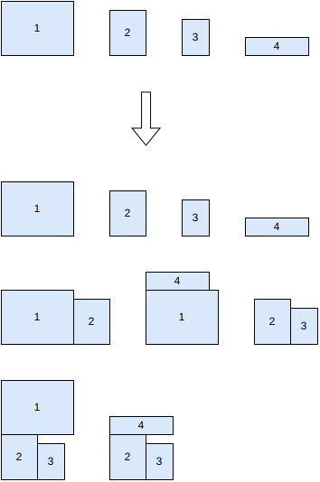
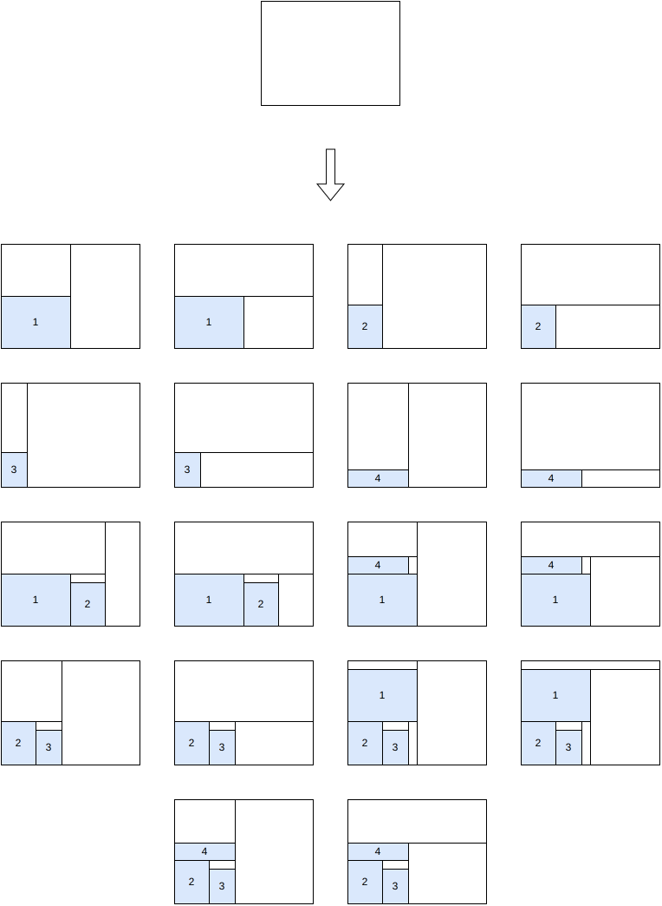
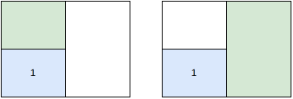
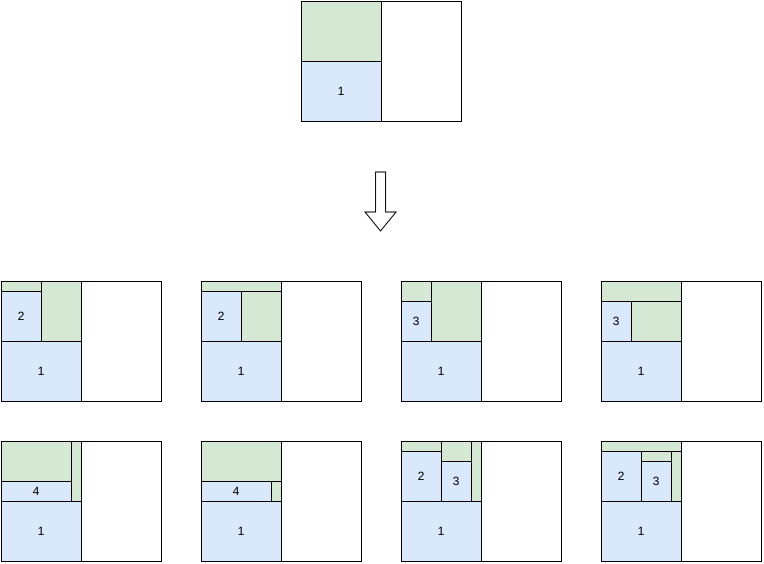
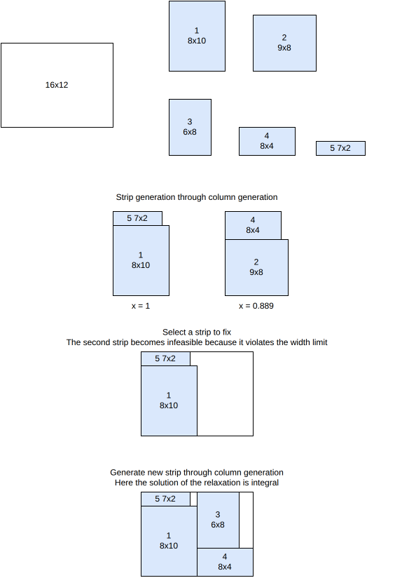
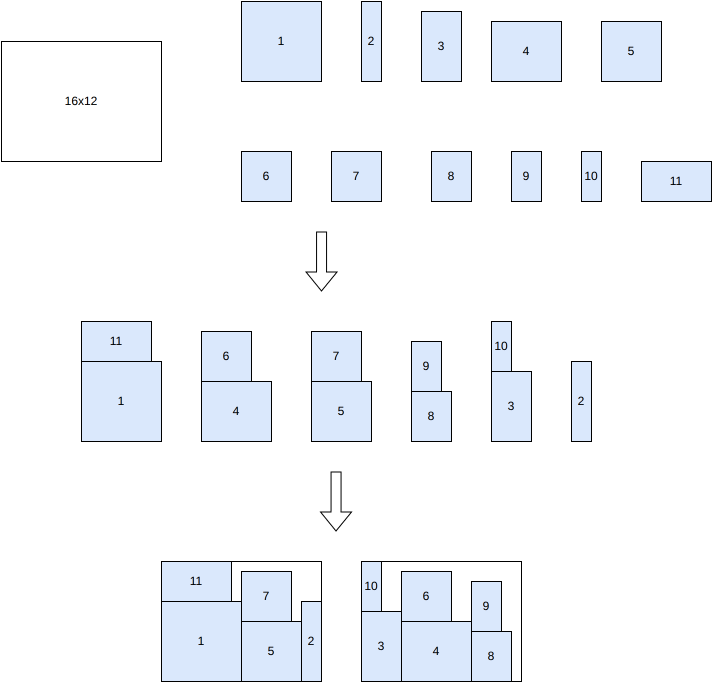
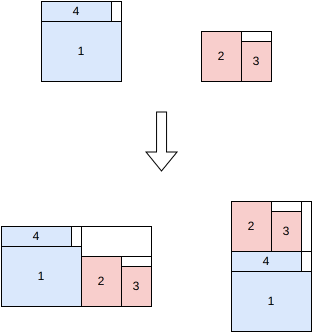
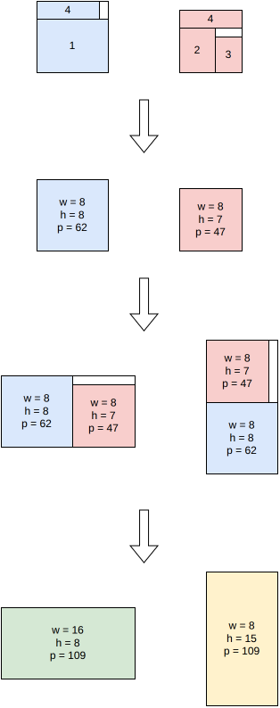

.. _internals_rectangleguillotine:

:code:`rectangle-guillotine` algorithms
=======================================

See :ref:`rectangleguillotine<rectangleguillotine>` for the input/output format and CLI usage of this solver.

Tree search
------------

This algorithm solves the :code:`feasibility`, :code:`knapsack`, :code:`open-dimension-x`, :code:`open-dimension-y`, :code:`bin-packing`, :code:`bin-packing-with-leftovers` and :code:`bin-packing-cutting-cost` objectives.

It is a tree search algorithm where a single item is packed at each stage. The root node is an empty partial solution (no item packed). Given a node, a child node is generated for each feasible insertion of each unpacked item.

The possible insertions for an unpacked item are:

* In the current second-level sub-plate, in a new third-level sub-plate
* In the current first-level sub-plate, in a new second-level sub-plate
* In the same bin, in a new first-level sub-plate
* In a new bin

.. image:: ../img/rectangleguillotine_tree_search.png
   :scale: 100%
   :align: center

The positions of the items are fixed once they are inserted, but the positions of the cuts might change when other items get inserted.

Tree search with maximal spaces
----------------------------------

This algorithm solves the :code:`feasibility` and :code:`knapsack` objectives.

It is a tree search algorithm where multiple items are packed at each stage.

In a first step, some blocks of items are generated. Blocks may contain a single item, multiple items of the same type, or multiple items of different types. Here is an example of block generation from 4 items:

In a node of the branching scheme, all maximal empty rectangles are stored. To generate the children of a node, a maximal empty rectangle is first selected, then one child is generated for each remaining block that fits inside the considered space.

At the root node, the only maximal empty rectangle is the bin itself, so two children are generated per candidate block, one with a vertical cut and one with a horizontal cut:

Placing a block can leave more than one maximal empty rectangle. Here are the two maximal empty rectangles of the first child generated above:

In the :code:`rectangle-guillotine` case, the maximal empty rectangles don't overlap.

When generating the children of this node, one of these maximal empty rectangles is selected, and one child is generated per remaining block that fits inside:

References:

* "A beam search algorithm for the biobjective container loading problem" (Araya, Moyano and Sanchez, 2020)

  * https://doi.org/10.1016/j.ejor.2020.03.040

* "A tree search-based heuristic for the three-dimensional single container loading problem" (Guesser, Alves De Queiroz and Miyazawa, 2026)

  * https://doi.org/10.1016/j.ejor.2026.01.039

* "EATKG: An Open-Source Efficient Exact Algorithm for the Two-Dimensional Knapsack Problem with Guillotine Constraints" (Wang, Baldacci, Liu and Wei, 2025)

  * https://doi.org/10.1016/j.ejor.2025.05.033

Column generation strips
---------------------------

This algorithm solves the :code:`knapsack`, :code:`open-dimension-x` and :code:`open-dimension-y` objectives.

It is a tree search algorithm where a whole strip is packed at each stage. Contrary to the tree search maximal spaces algorithm, the strips are not generated beforehand, but dynamically in the nodes through column generation.

The column generation model is as follows:

**Input**:

* a bin of width :math:`W`
* item types :math:`j = 1, \ldots, n`; for each item type :math:`j`: a profit :math:`p_j`, a width :math:`w_j` and a number of copies :math:`q_j`
* a set :math:`K` of feasible first-level sub-plate patterns ("strips"); for each pattern :math:`k \in K`, :math:`x_j^k` is the number of copies of item type :math:`j` it contains

**Variables**:

* :math:`y^k \in \{0, \ldots, q^{\max}\}`, :math:`k \in K`: number of times sub-plate pattern :math:`k` is used

**Objective**: maximize the total profit of the packed items

.. math::

   \max \sum_{k} \Big( \sum_{j} p_j \, x_j^k \Big) y^k

**Constraints**:

* Bin width: the sub-plates selected must fit side by side in the bin

.. math::

   \sum_{k} \Big( \max_{j} w_j x_j^k \Big) y^k \le W

* Item demand: each item type used at most :math:`q_j` times

.. math::

   \forall j \qquad \sum_{k} x_j^k \, y^k \le q_j

The pricing sub-problem consists in finding a sub-plate pattern of negative reduced cost

.. math::

   rc(y^k) = \Big( \max_{j} w_j x_j^k \Big) u + \sum_{j} x_j^k v_j - \sum_{j} p_j x_j^k

where :math:`u` and :math:`v_j` are the dual variables of the bin width and item demand constraints. This is solved for every possible sub-plate width, by recursively solving :math:`(k-1)`-staged guillotine single-knapsack sub-problems -- one-dimensional knapsack problems for 2-stage exact, 2-stage non-exact or 3-stage homogeneous instances, and the same algorithm applied recursively otherwise. Also yields knapsack / open-dimension bounds.

Here is an illustration of the algorithm:

Sequential strips / one-dimensional
---------------------------------------

This algorithm solves the :code:`bin-packing` and :code:`bin-packing-with-leftovers` objectives.

It is a two-phase heuristic:

1. Generate a set of strips by solving a strip-packing problem (pack all items, minimize total width).
2. Solve a one-dimensional bin packing problem where each strip becomes an "item" (its width becomes the item length, and the bin width becomes the item length capacity), to decide how strips are grouped into bins.

Contrary to the tree search maximal spaces algorithm and the column generation strips algorithm, the generated strips contain exactly all the items.

Labeling algorithm
---------------------

This algorithm solves the :code:`knapsack` objective.

This is a kind of tree search algorithm, but instead of generating children from one parent node, children are generated from two parent nodes. A node corresponds to a partial packing. For two given parent nodes, two child nodes are generated by combining the two parents either vertically or horizontally.

This is similar to the block generation step of the tree search maximal spaces algorithm. In the tree search maximal spaces algorithm, the block generation stops once enough blocks have been generated; while in this algorithm, the block generation stops when it actually generates a block that is the optimal solution.

Dynamic programming with infinite copies
-----------------------------------------

This algorithm solves the :code:`knapsack` objective.

This algorithm works the same way as the labeling algorithm, except that the item type quantities are not taken into account. This means that the domination rule is cheaper to compute and prunes many more nodes. Therefore, it is very fast, but the generated solution might be infeasible regarding the available number of item copies.

Dual feasible functions
-------------------------

This algorithm computes a bound for the :code:`bin-packing` objective.

See :ref:`rectangle <internals_rectangle_dual_feasible_functions>`
