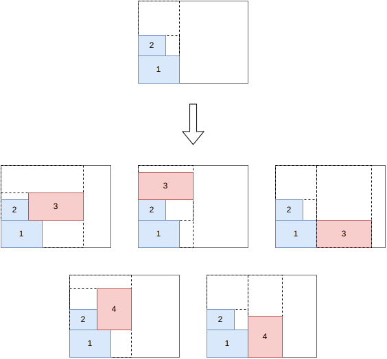

.. _internals_rectangleguillotine:

:code:`rectangle-guillotine` algorithms
=======================================

See :ref:`rectangleguillotine<rectangleguillotine>` for the input/output format and CLI usage of this solver.

Tree search
------------

This algorithm solves the :code:`knapsack`, :code:`open-dimension-x`, :code:`open-dimension-y`, :code:`bin-packing`, :code:`bin-packing-with-leftovers`, :code:`variable-sized-bin-packing` and :code:`bin-packing-cutting-cost` objectives (it is the only algorithm supporting the last one).

Branch-and-bound style search over guillotine cutting patterns (option ``--use-tree-search``), generating 2-stage and 3-stage patterns level by level. Handles all of this domain's constraints (cut orientation, trim, minimum/maximum distance between cuts, defects, etc.). Can run as an anytime improvement process, or with a fixed exploration budget in non-anytime modes.

Branching has to choose not only *which* item to place next, but also *where* in the guillotine cut structure (dashed lines) to place it: a child is generated for each valid way of extending the current sub-plate hierarchy with the candidate item.

Tree search with maximal spaces
----------------------------------

This algorithm solves the :code:`knapsack`, :code:`open-dimension-x` and :code:`open-dimension-y` objectives.

Alternative branching scheme (option ``--use-tree-search-maximal-spaces``) selected automatically for unconstrained (no defects, unlimited stages, no cut-distance restrictions) single-stack instances. Tracks unused rectangular spaces in the guillotine cut tree directly, rather than reasoning stage by stage.

References:

* "A beam search algorithm for the biobjective container loading problem" (Araya, Moyano and Sanchez, 2020)

  * https://doi.org/10.1016/j.ejor.2020.03.040

* "A tree search-based heuristic for the three-dimensional single container loading problem" (Guesser, Alves De Queiroz and Miyazawa, 2026)

  * https://doi.org/10.1016/j.ejor.2026.01.039

* "EATKG: An Open-Source Efficient Exact Algorithm for the Two-Dimensional Knapsack Problem with Guillotine Constraints" (Wang, Baldacci, Liu and Wei, 2025)

  * https://doi.org/10.1016/j.ejor.2025.05.033

Dynamic programming (infinite copies)
-----------------------------------------

This algorithm solves the :code:`knapsack` objective.

Exact algorithm (option ``--use-dynamic-programming-infinite-copies-array``) for the guillotine knapsack problem assuming an unbounded number of copies of each item type. Computes, for every sub-rectangle size reachable by guillotine cuts, the maximum profit achievable, and reconstructs a pattern from these values. Fast, but the "infinite copies" assumption means it may return a pattern that uses more copies of an item type than are actually available.

Labeling algorithm
---------------------

This algorithm solves the :code:`knapsack` objective.

Exact algorithm (option ``--use-labeling``) for the bounded-copies guillotine knapsack problem, based on a decision-hypergraph / labeling formulation (Léonard & Clautiaux, 2025, "An Efficient Solver for Integral Flows in Decision Hypergraphs"). Generates states bottom-up ordered by a best-first priority queue, using dominance between states and dynamic-programming-derived upper bounds to prune the search, then reconstructs a solution by backtracking through the retained labels.

Currently limited to a single bin, without item rotation and without enforcing the number-of-stages constraint.

Column generation strips
---------------------------

This algorithm solves the :code:`knapsack`, :code:`open-dimension-x` and :code:`open-dimension-y` objectives.

Linear-programming-based algorithm (option ``--use-column-generation-strips``) for k-staged guillotine knapsack and open-dimension problems, selected automatically for 2/3-stage, single-stack, defect-free instances. Solves a Dantzig-Wolfe decomposition where each column is a first-level sub-plate (a "strip").

**Input**:

* a bin of width :math:`W`
* item types :math:`j = 1, \ldots, n`; for each item type :math:`j`: a profit :math:`p_j`, a width :math:`w_j` and a number of copies :math:`q_j`
* a set :math:`K` of feasible first-level sub-plate patterns ("strips"); for each pattern :math:`k \in K`, :math:`x_j^k` is the number of copies of item type :math:`j` it contains

**Variables**:

* :math:`y^k \in \{0, \ldots, q^{\max}\}`, :math:`k \in K`: number of times sub-plate pattern :math:`k` is used

**Objective**: maximize the total profit of the packed items

.. math::

   \max \sum_{k} \Big( \sum_{j} p_j \, x_j^k \Big) y^k

**Constraints**:

* Bin width: the sub-plates selected must fit side by side in the bin

.. math::

   \sum_{k} \Big( \max_{j} w_j x_j^k \Big) y^k \le W

* Item demand: each item type used at most :math:`q_j` times

.. math::

   \forall j \qquad \sum_{k} x_j^k \, y^k \le q_j

The pricing sub-problem consists in finding a sub-plate pattern of negative reduced cost

.. math::

   rc(y^k) = \Big( \max_{j} w_j x_j^k \Big) u + \sum_{j} x_j^k v_j - \sum_{j} p_j x_j^k

where :math:`u` and :math:`v_j` are the dual variables of the bin width and item demand constraints. This is solved for every possible sub-plate width, by recursively solving :math:`(k-1)`-staged guillotine single-knapsack sub-problems -- one-dimensional knapsack problems for 2-stage exact, 2-stage non-exact or 3-stage homogeneous instances, and the same algorithm applied recursively otherwise. Also yields knapsack / open-dimension bounds.

Sequential strips / one-dimensional
---------------------------------------

This algorithm solves the :code:`bin-packing` and :code:`bin-packing-with-leftovers` objectives.

Two-phase heuristic (option ``--use-sequential-strips-onedimensional``) for a single bin type:

1. Generate a set of strips by solving a strip-packing problem (pack all items, minimize total width) with the column generation strips algorithm above.
2. Solve a one-dimensional bin packing problem where each strip becomes an "item" (its width becomes the item length, and the bin width becomes the item length capacity), to decide how strips are grouped into bins.

The final solution is reconstructed by placing, in each bin, the strips assigned to it side by side.

Dual feasible functions
-------------------------

This algorithm computes a bound for the :code:`bin-packing` objective.

See :ref:`rectangle <internals_rectangle_dual_feasible_functions>`
