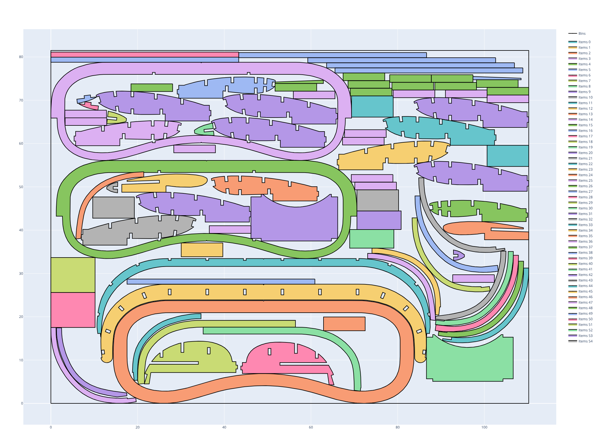
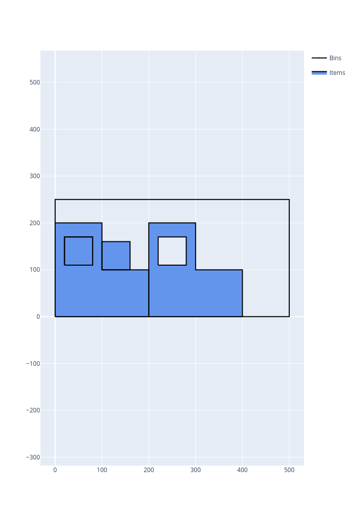

.. _irregular:

Irregular solver
================

The Irregular solver solves problems where items are arbitrary two-dimensional polygons that must be placed inside polygonal bins without overlapping.

These problems occur for example in the textile, leather, sheet metal, and wood industries.

Features:

* Objectives:

  * Knapsack
  * Bin packing
  * Bin packing with leftovers
  * Open dimension X
  * Open dimension Y
  * Open dimension XY
  * Variable-sized bin packing
  * Feasibility

* Item types

  * Polygon shapes (convex or concave)
  * Rectangular and circular shapes
  * Holes inside shapes
  * Discrete and continuous rotations
  * Mirroring (axial symmetry)
  * Multiple item shapes

* Bin types

  * Polygon, rectangle and circle shapes
  * Defects
  * Item-bin minimum spacing

* Spacing constraints

  * Item-item minimum spacing
  * Item-bin minimum spacing
  * Item-defect minimum spacing

Basic usage
-----------

The Irregular solver takes as input a single JSON file and outputs:

* a solution JSON file; option: ``--certificate solution.json``

The **input file** is a JSON file containing:

* The objective (``objective`` field)
* Optional global parameters (``parameters`` field)
* A list of bin types (``bin_types`` field)
* A list of item types (``item_types`` field)

**Example**

This example has two item types:

* An L-shaped piece (non-convex outer boundary) with a rectangular hole in its vertical arm. Two copies are packed, fixed at 0° rotation.
* A small square (60×60) that fits exactly into the hole of the L-shaped piece. Two copies are packed.

The objective is ``bin-packing-with-leftovers`` in a 500×250 bin. The solver packs all four items in one bin and maximizes the leftover value. The optimal solution places each small square inside the hole of one L-shaped piece.

.. literalinclude:: examples/irregular/instance.json
   :caption: instance.json
   :language: json

Solve:

.. code-block:: shell

    packingsolver_irregular \
            --input instance.json \
            --certificate solution.json

.. literalinclude:: examples/irregular/output.txt

The solution is written to ``solution.json``.

A script is available to visualize the solution:

.. code-block:: shell

    python3 scripts/visualize_irregular.py solution.json

Input format
------------

Objectives
~~~~~~~~~~

The ``objective`` field in the JSON input accepts the following values:

* ``knapsack``: maximize the profit of packed items in a single bin
* ``bin-packing``: pack all items using as few bins as possible
* ``bin-packing-with-leftovers``: bin packing, then maximize the leftover value in the last bin
* ``open-dimension-x``: minimize the X dimension of a single bin
* ``open-dimension-y``: minimize the Y dimension of a single bin
* ``open-dimension-xy``: minimize the area of a single bin (aspect ratio can be constrained)
* ``variable-sized-bin-packing``: pack all items minimizing total bin cost; bins may be used in any order
* ``feasibility``: determine whether a packing exists

Parameters
~~~~~~~~~~

The optional ``parameters`` object supports:

* ``item_item_minimum_spacing``: minimum distance between any two items (default: ``0``)

Global spacing constraints apply to all items. Per-bin spacing can be set on individual bin types.

Bin types
~~~~~~~~~

Each entry in ``bin_types`` describes one bin type. Common fields:

* ``copies``: number of available copies of this bin type (default: ``1``)
* ``cost``: cost of one bin of this type, used for variable-sized bin packing (default: bin area)
* ``item_bin_minimum_spacing``: minimum distance between items and the bin boundary (default: ``0``)

Shape specification (one of the following):

* ``type: "rectangle"``: axis-aligned rectangle

  * ``width`` (**mandatory**)
  * ``height`` (**mandatory**)

* ``type: "circle"``: circle

  * ``radius`` (**mandatory**)

* ``type: "polygon"``: arbitrary polygon

  * ``vertices`` (**mandatory**): list of ``{"x": ..., "y": ...}`` objects in counter-clockwise order

Defects can be specified with the ``defects`` field on a bin type. Each defect is a shape (using the same shape fields as above) placed at a position inside the bin.

Item types
~~~~~~~~~~

Each entry in ``item_types`` describes one item type. Common fields:

* ``copies``: number of copies of this item type (default: ``1``)
* ``profit``: profit of one item, used for knapsack (default: item area)

Shape specification — same format as bin types:

* ``type: "rectangle"``, ``type: "circle"``, or ``type: "polygon"`` with ``vertices``

Additional polygon fields:

* ``holes``: list of polygonal holes inside the shape. Each hole is a ``{"type": "polygon", "vertices": [...]}`` object. Vertices must be in counter-clockwise order.

  All shapes (outer contour and holes) must use counter-clockwise vertex ordering.

Rotation constraints
~~~~~~~~~~~~~~~~~~~~

The ``allowed_rotations`` field on an item type controls which orientations are allowed.
It is a list of rotation ranges, each with:

* ``start``: start angle in degrees
* ``end``: end angle in degrees
* ``mirror``: if ``true``, the item is first mirrored about the Y axis, then rotated (default: ``false``)

When ``start == end``, only that exact angle is allowed.
When ``start < end``, any angle in ``[start, end]`` is allowed (continuous rotation range).
When ``end == 360``, a full 360° continuous rotation is allowed.

If ``allowed_rotations`` is omitted, any rotation is allowed by default.

**Examples**

Discrete 90° rotations only:

.. code-block:: json

   "allowed_rotations": [
     {"start": 0,   "end": 0},
     {"start": 90,  "end": 90},
     {"start": 180, "end": 180},
     {"start": 270, "end": 270}
   ]

Fixed orientation (no rotation):

.. code-block:: json

   "allowed_rotations": [
     {"start": 0, "end": 0}
   ]

Full 360° continuous rotation:

.. code-block:: json

   "allowed_rotations": [
     {"start": 0, "end": 360}
   ]

Both orientations and their mirrors:

.. code-block:: json

   "allowed_rotations": [
     {"start": 0,   "end": 0,   "mirror": false},
     {"start": 0,   "end": 0,   "mirror": true}
   ]

Polygon with hole
~~~~~~~~~~~~~~~~~

.. code-block:: json

   {
     "objective": "open-dimension-x",
     "bin_types": [
       {"type": "rectangle", "width": 500, "height": 300}
     ],
     "item_types": [
       {
         "type": "polygon",
         "vertices": [
           {"x": 0,   "y": 0},
           {"x": 400, "y": 0},
           {"x": 400, "y": 300},
           {"x": 0,   "y": 300}
         ],
         "holes": [
           {
             "type": "polygon",
             "vertices": [
               {"x": 100, "y": 100},
               {"x": 300, "y": 100},
               {"x": 300, "y": 200},
               {"x": 100, "y": 200}
             ]
           }
         ]
       }
     ]
   }

Spacing constraints
~~~~~~~~~~~~~~~~~~~

Item-item and item-bin minimum spacings can be set globally in ``parameters`` or per bin type:

.. code-block:: none

   {
     "objective": "knapsack",
     "parameters": {
       "item_item_minimum_spacing": 2.0
     },
     "bin_types": [
       {
         "type": "rectangle",
         "width": 1000,
         "height": 700,
         "item_bin_minimum_spacing": 5.0
       }
     ],
     "item_types": [...]
   }

Output format
-------------

The solution JSON file has a single ``bins`` array. Each entry corresponds to one used bin and contains:

* ``id``: bin type index
* ``copies``: number of copies of this bin represented by this entry
* ``items``: list of placed items, each with:

  * ``id``: item type index
  * ``x``, ``y``: position of the item's origin
  * ``angle``: rotation angle in degrees
  * ``mirror``: whether the item is mirrored

Command-line options
--------------------

.. code-block:: none

    packingsolver_irregular --input instance.json [options]

Mandatory option:

* ``--input, -i``: path to the input JSON file

Instance options (override values in the JSON file):

* ``--objective, -f``: objective (``knapsack``, ``bin-packing``, ``bin-packing-with-leftovers``, ``open-dimension-x``, ``open-dimension-y``, ``open-dimension-xy``, ``variable-sized-bin-packing``, ``feasibility``)
* ``--item-item-minimum-spacing``: global minimum spacing between items
* ``--item-bin-minimum-spacing``: global minimum spacing between items and bin boundary
* ``--leftover-corner``: reference corner for the leftover value in bin-packing-with-leftovers (``bottom-left``, ``top-left``, ``bottom-right``, ``top-right``)
* ``--continuous-rotations``: allow continuous rotations for all item types
* ``--unweighted``: set all item profits to 1
* ``--bin-unweighted``: set all bin costs to 1

Output options:

* ``--certificate, -c``: path for the solution JSON file
* ``--output, -o``: path for a JSON file with detailed statistics
* ``--time-limit, -t``: time limit in seconds
* ``--verbosity-level, -v``: verbosity level (0–3)
