.. _irregular:

:code:`irregular` solver
========================

The :code:`irregular` solver solves problems where items are arbitrary two-dimensional polygons that must be placed inside polygonal bins without overlapping.

.. image:: ../img/irregular.png
   :width: 512pt
   :align: center

These problems occur for example in the textile, leather, sheet metal, and wood industries.

Features:

* Objectives:

  * Knapsack
  * Bin packing
  * Bin packing with leftovers
  * Open dimension X
  * Open dimension Y
  * Open dimension XY
  * Variable-sized bin packing
  * Feasibility

* Item types

  * Polygon shapes (convex or concave)
  * Rectangular and circular shapes
  * Holes inside shapes
  * Discrete and continuous rotations
  * Mirroring (axial symmetry)
  * Multiple item shapes

* Bin types

  * Polygon, rectangle and circle shapes
  * Defects
  * Item-bin minimum spacing

* Spacing constraints

  * Item-item minimum spacing
  * Item-bin minimum spacing
  * Item-defect minimum spacing

Basic usage
--------------

The :code:`irregular` solver takes as input a single JSON file and outputs:

* a solution JSON file; option: ``--certificate solution.json``

The **input file** is a JSON file containing:

* The objective (``objective`` field); possible values:

  * ``knapsack``: maximize the profit of packed items in a single bin
  * ``bin-packing``: pack all items using as few bins as possible
  * ``bin-packing-with-leftovers``: bin packing, then maximize the leftover value in the last bin
  * ``open-dimension-x``: minimize the X dimension of a single bin
  * ``open-dimension-y``: minimize the Y dimension of a single bin
  * ``open-dimension-xy``: minimize the area of a single bin (aspect ratio can be constrained)
  * ``variable-sized-bin-packing``: pack all items minimizing total bin cost; bins may be used in any order
  * ``feasibility``: determine whether a packing exists

* Optional global parameters (``parameters`` field)
* A list of bin types (``bin_types`` field)
* A list of item types (``item_types`` field)

Each entry in ``bin_types`` describes one bin type. Common fields:

* ``copies``: number of available copies of this bin type (default: ``1``)
* ``copies_min``: minimum number of copies of this bin type that must be used (default: ``0``)
* ``cost``: cost of one bin of this type, used for variable-sized bin packing (default: bin area)

Shape specification (one of the following), for both bin types and item types:

* ``type: "rectangle"``: axis-aligned rectangle

  * ``width`` (**mandatory**)
  * ``height`` (**mandatory**)

* ``type: "circle"``: circle

  * ``radius`` (**mandatory**)

* ``type: "polygon"``: arbitrary polygon

  * ``vertices`` (**mandatory**): list of ``{"x": ..., "y": ...}`` objects in counter-clockwise order

Each entry in ``item_types`` describes one item type. Common fields:

* ``copies``: number of copies of this item type (default: ``1``)
* ``profit``: profit of one item, used for knapsack (default: item area)

The **output file** is a JSON file with a single ``bins`` array. Each entry corresponds to one used bin and contains:

* ``id``: bin type index
* ``copies``: number of copies of this bin represented by this entry
* ``items``: list of placed items, each with:

  * ``id``: item type index
  * ``x``, ``y``: position of the item's origin
  * ``angle``: rotation angle in degrees
  * ``mirror``: whether the item is mirrored

This example has 8 item types: the 7 one-sided tetrominoes (I, O, T, S, Z, L and J, each made of 4 unit squares), with 2 copies of each, plus a cross-shaped piece (5 unit squares) with 3 copies (17 items in total).

The objective is ``bin-packing`` in a 180×160 bin. The solver packs all 17 items into a single bin, wasting less than 1.4% of its area — the pieces interlock almost exactly, like a jigsaw puzzle.

.. literalinclude:: examples/irregular/instance.json
   :caption: instance.json
   :language: json

Solve:

.. code-block:: shell

    packingsolver_irregular \
            --input instance.json \
            --certificate solution.json

.. literalinclude:: examples/irregular/output.txt

The solution is written to ``solution.json``.

A script is available to visualize the solution:

.. code-block:: shell

    python3 scripts/visualize_irregular.py solution.json

.. image:: img/irregular_example_solution.png
   :width: 512pt
   :align: center

Rotation
-----------

The ``allowed_rotations`` field on an item type controls which orientations are allowed.
It is a list of rotation ranges, each with:

* ``start``: start angle in degrees
* ``end``: end angle in degrees
* ``mirror``: if ``true``, the item is first mirrored about the Y axis, then rotated (default: ``false``; see `Mirroring`_ below)

When ``start == end``, only that exact angle is allowed.
When ``start < end``, any angle in ``[start, end]`` is allowed (continuous rotation range).
When ``end == 360``, a full 360° continuous rotation is allowed.

If ``allowed_rotations`` is omitted, the item is fixed at 0° (no rotation) by default.

**Examples**

Discrete 90° rotations only:

.. code-block:: json

   "allowed_rotations": [
     {"start": 0,   "end": 0},
     {"start": 90,  "end": 90},
     {"start": 180, "end": 180},
     {"start": 270, "end": 270}
   ]

Fixed orientation (no rotation):

.. code-block:: json

   "allowed_rotations": [
     {"start": 0, "end": 0}
   ]

Full 360° continuous rotation:

.. code-block:: json

   "allowed_rotations": [
     {"start": 0, "end": 360}
   ]

In the example below, 2 copies of an L-shaped item must be packed into 60×60 bins (:code:`bin-packing` objective). Without rotation, the two L-shapes cannot interlock, so 2 bins are needed. Allowing 90° rotations lets them interlock into a single bin.

.. |irregular_rotation_no| image:: img/irregular_rotation_no.png
   :scale: 50%

.. |irregular_rotation_yes| image:: img/irregular_rotation_yes.png
   :scale: 50%

.. list-table::
   :widths: 1 1
   :header-rows: 1
   :align: center

   * - Without rotation
     - With rotation
   * - .. literalinclude:: examples/irregular/rotation_no/instance.json
          :caption: instance.json
          :language: json
     - .. literalinclude:: examples/irregular/rotation_yes/instance.json
          :caption: instance.json
          :language: json
   * - .. code-block:: shell

            packingsolver_irregular \
                    --input instance.json \
                    --certificate solution.json
     - .. code-block:: shell

            packingsolver_irregular \
                    --input instance.json \
                    --certificate solution.json
   * - |irregular_rotation_no|
     - |irregular_rotation_yes|

Mirroring
------------

Each rotation range in ``allowed_rotations`` may set ``mirror: true``, in which case the item is first mirrored about its Y axis, then rotated by the given angle range. Mirroring is off (``false``) by default.

To allow both the original and mirrored orientation of an item at 0°:

.. code-block:: json

   "allowed_rotations": [
     {"start": 0,   "end": 0,   "mirror": false},
     {"start": 0,   "end": 0,   "mirror": true}
   ]

Mirroring matters for shapes that are not symmetric: an L-shaped item is **chiral**, so it cannot be turned into its own mirror image by rotation alone. In the example below, 2 copies of an L-shaped item and a square item must be packed into 80×60 bins (:code:`bin-packing` objective). Without mirroring, the two L-shapes (same orientation) leave two separate notches, too narrow for the square, so 2 bins are needed. Allowing the second L-shape to be mirrored turns it into a matching, opposite-handed piece: together the two L-shapes form a single wide notch that the square fits into exactly, so all three items pack into a single bin.

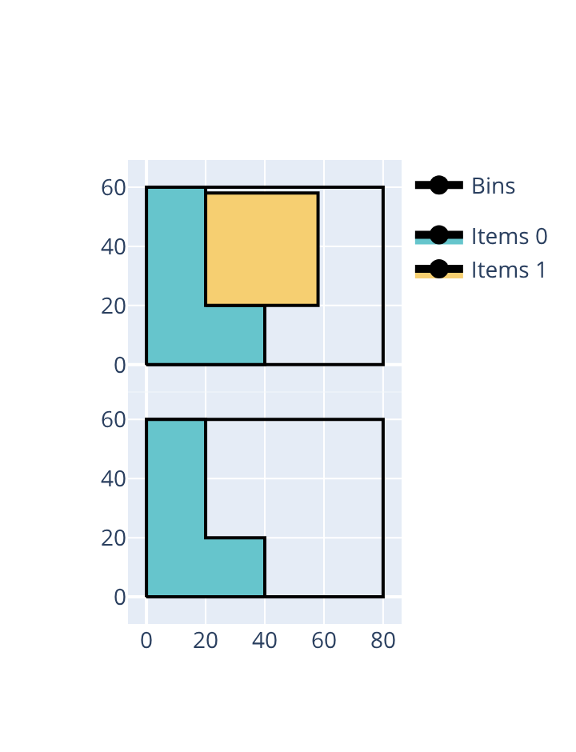

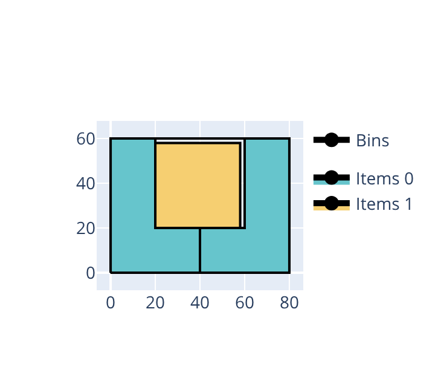

.. list-table::
   :widths: 1 1
   :header-rows: 1
   :align: center

   * - Without mirroring
     - With mirroring
   * - .. literalinclude:: examples/irregular/mirroring_no/instance.json
          :caption: instance.json
          :language: json
     - .. literalinclude:: examples/irregular/mirroring_yes/instance.json
          :caption: instance.json
          :language: json
   * - .. code-block:: shell

            packingsolver_irregular \
                    --input instance.json \
                    --certificate solution.json
     - .. code-block:: shell

            packingsolver_irregular \
                    --input instance.json \
                    --certificate solution.json
   * - |irregular_mirroring_no|
     - |irregular_mirroring_yes|

Holes
--------

An item type's polygon shape may have ``holes``: a list of polygonal holes inside the shape. Each hole is a ``{"type": "polygon", "vertices": [...]}`` object. Vertices must be in counter-clockwise order, for both the outer contour and the holes.

In the example below, there are two item types: a pentagon (a 40×40 square with one corner cut off) and a small triangle, noticeably smaller than the hole so that the hole remains visible around it (:code:`bin-packing` objective, 40×40 bins). Without a hole, the two items cannot share a bin, so 2 bins are needed. Cutting a triangular hole into the pentagon lets the small triangle nest inside it, so both items fit together in a single bin.

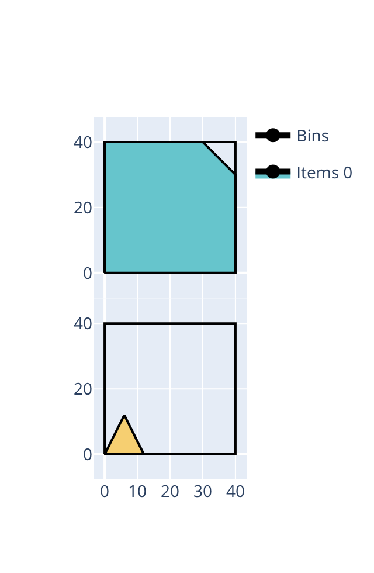

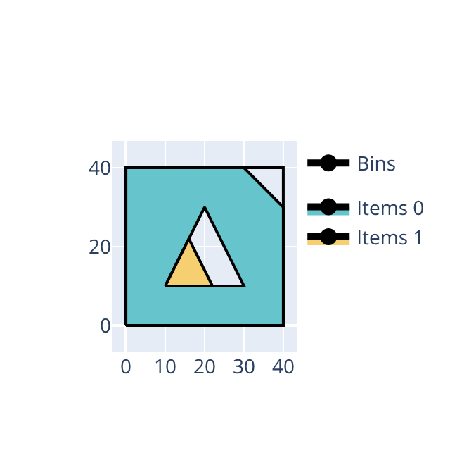

.. list-table::
   :widths: 1 1
   :header-rows: 1
   :align: center

   * - Without a hole
     - With a hole
   * - .. literalinclude:: examples/irregular/holes_no/instance.json
          :caption: instance.json
          :language: json
     - .. literalinclude:: examples/irregular/holes_yes/instance.json
          :caption: instance.json
          :language: json
   * - .. code-block:: shell

            packingsolver_irregular \
                    --input instance.json \
                    --certificate solution.json
     - .. code-block:: shell

            packingsolver_irregular \
                    --input instance.json \
                    --certificate solution.json
   * - |irregular_holes_no|
     - |irregular_holes_yes|

Defects
----------

Defects are regions inside a bin where items cannot be placed. They are specified with the ``defects`` field on a bin type: a list of defects, each with:

* A shape (using the same shape fields as bin/item types: ``type: "rectangle"``, ``type: "circle"``, or ``type: "polygon"``), placed at a position inside the bin
* ``defect_type``: an optional defect type identifier
* ``item_defect_minimum_spacing``: minimum distance between this defect and any item (default: ``0``; see `Item-bin and item-defect spacing`_ below)

In the example below, 2 copies of an L-shaped item must be packed into 60×60 bins (:code:`bin-packing` objective). Without any defect, the two L-shapes interlock into a single bin, as in the rotation example above. Adding a small 10×10 defect in the corner where one of the L-shapes needs to sit breaks the interlocking pattern, and 2 bins become necessary.

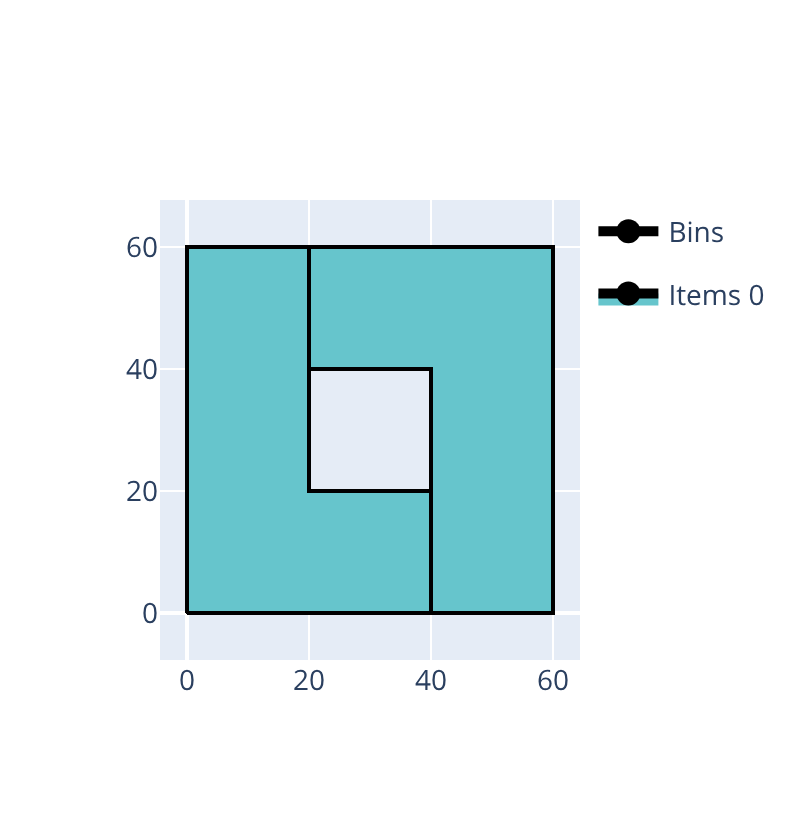

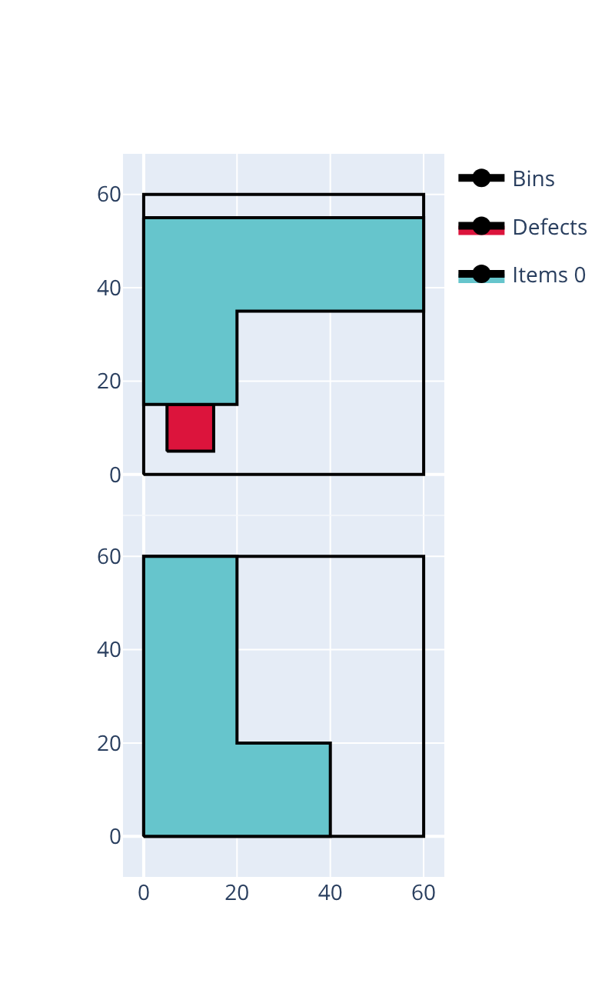

.. list-table::
   :widths: 1 1
   :header-rows: 1
   :align: center

   * - Without a defect
     - With a defect
   * - .. literalinclude:: examples/irregular/defects_no/instance.json
          :caption: instance.json
          :language: json
     - .. literalinclude:: examples/irregular/defects_yes/instance.json
          :caption: instance.json
          :language: json
   * - .. code-block:: shell

            packingsolver_irregular \
                    --input instance.json \
                    --certificate solution.json
     - .. code-block:: shell

            packingsolver_irregular \
                    --input instance.json \
                    --certificate solution.json
   * - |irregular_defects_no|
     - |irregular_defects_yes|

Item-item spacing
---------------------

A minimum distance can be enforced between any two items, globally, via the ``item_item_minimum_spacing`` field of the optional ``parameters`` object (default: ``0``):

.. code-block:: none

   {
     "objective": "knapsack",
     "parameters": {
       "item_item_minimum_spacing": 2.0
     },
     "bin_types": [...],
     "item_types": [...]
   }

In the example below, 10 copies of an L-shaped item (with all 4 rotations allowed) must be packed into 160×100 bins (:code:`bin-packing-with-leftovers` objective). Without any minimum spacing, the 10 L-shapes interlock exactly, filling a single bin with no waste at all. Enforcing an ``item_item_minimum_spacing`` of 3 breaks that tight interlocking pattern entirely: only 6 items fit per bin, each with a clearly visible gap around it, so a second bin is needed for the remaining 4.

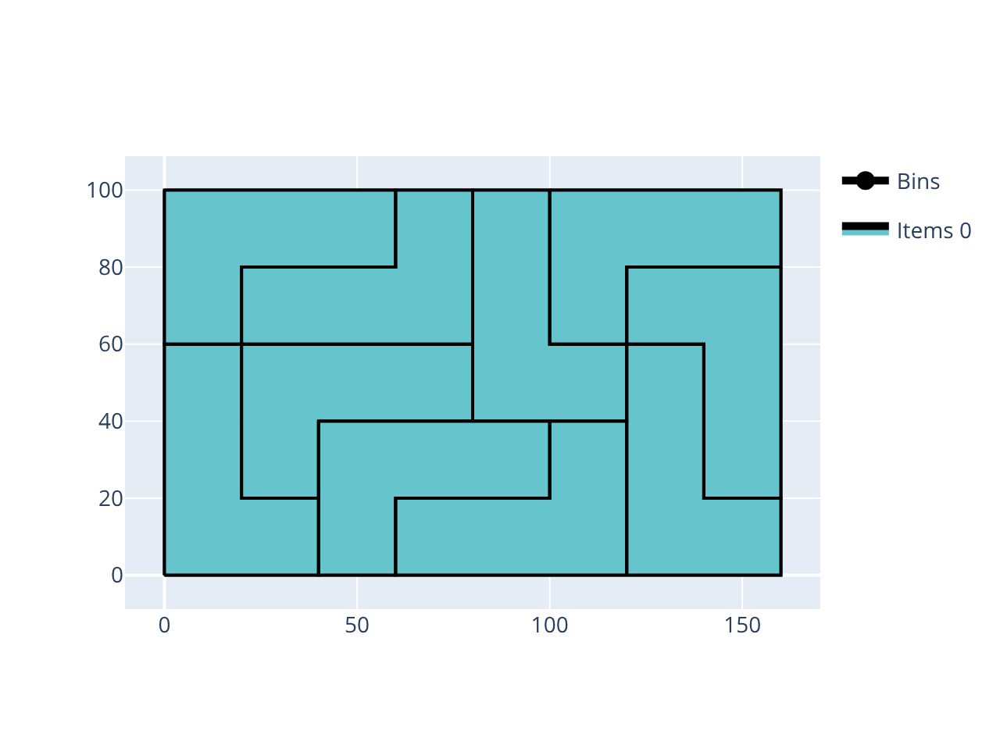

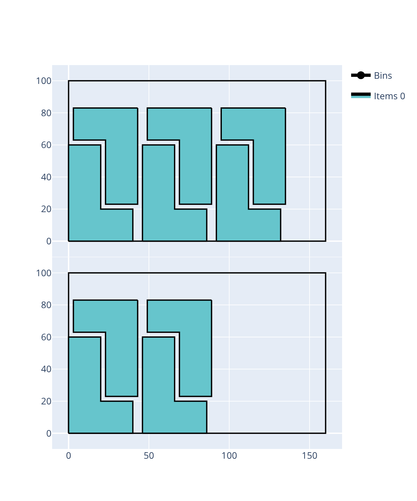

.. list-table::
   :widths: 1 1
   :header-rows: 1
   :align: center

   * - Without spacing
     - With spacing
   * - .. literalinclude:: examples/irregular/item_item_spacing_no/instance.json
          :caption: instance.json
          :language: json
     - .. literalinclude:: examples/irregular/item_item_spacing_yes/instance.json
          :caption: instance.json
          :language: json
   * - .. code-block:: shell

            packingsolver_irregular \
                    --input instance.json \
                    --certificate solution.json
     - .. code-block:: shell

            packingsolver_irregular \
                    --input instance.json \
                    --certificate solution.json
   * - |irregular_item_item_spacing_no|
     - |irregular_item_item_spacing_yes|

Item-bin and item-defect spacing
-------------------------------------

A minimum distance can also be enforced between items and the bin boundary, or between items and defects.

* ``item_bin_minimum_spacing``: minimum distance between items and the bin boundary, set on a bin type (default: ``0``)
* ``item_defect_minimum_spacing``: minimum distance between items and a defect, set on that defect (default: ``0``; see `Defects`_ above)

.. code-block:: none

   {
     "objective": "knapsack",
     "bin_types": [
       {
         "type": "rectangle",
         "width": 1000,
         "height": 700,
         "item_bin_minimum_spacing": 5.0
       }
     ],
     "item_types": [...]
   }

In the example below, the same 10 interlocking L-shapes as above are packed into 160×100 bins (:code:`bin-packing-with-leftovers` objective), this time with no spacing between items. Without any minimum spacing, the 10 L-shapes still interlock exactly, filling a single bin with no waste. Enforcing an ``item_bin_minimum_spacing`` of 3 leaves a clearly visible margin around the whole cluster of items — even though they still touch each other — and that margin alone is enough to break the tiling: only 6 items fit per bin, so a second bin is needed for the remaining 4.

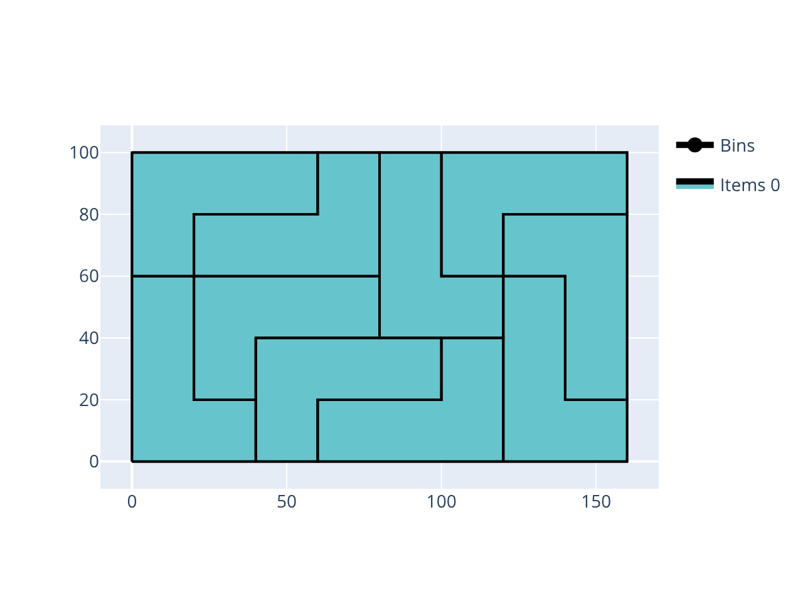

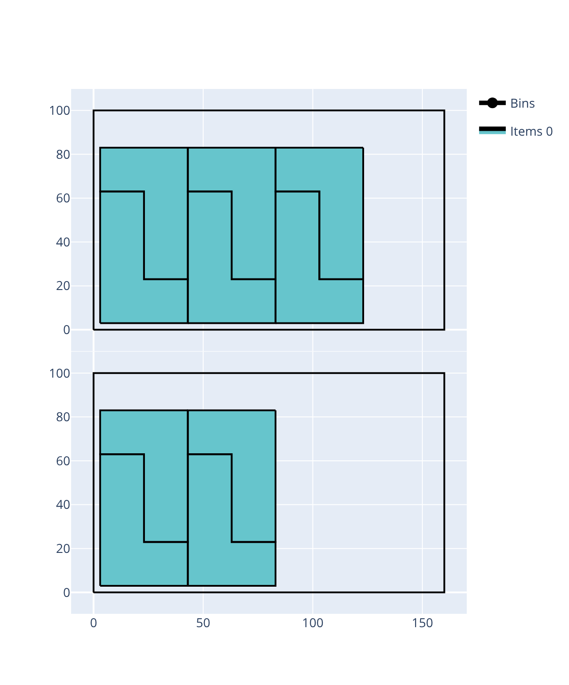

.. list-table::
   :widths: 1 1
   :header-rows: 1
   :align: center

   * - Without item-bin spacing
     - With item-bin spacing
   * - .. literalinclude:: examples/irregular/item_bin_spacing_no/instance.json
          :caption: instance.json
          :language: json
     - .. literalinclude:: examples/irregular/item_bin_spacing_yes/instance.json
          :caption: instance.json
          :language: json
   * - .. code-block:: shell

            packingsolver_irregular \
                    --input instance.json \
                    --certificate solution.json
     - .. code-block:: shell

            packingsolver_irregular \
                    --input instance.json \
                    --certificate solution.json
   * - |irregular_item_bin_spacing_no|
     - |irregular_item_bin_spacing_yes|

The same idea applies to defects. In the example below, 23 copies of a right-triangle item (with legs of 40) are packed into 160×120 bins, one of which has a small triangular defect sitting well inside the bin, away from every border (:code:`bin-packing-with-leftovers` objective). Without any minimum spacing, the items pack right up against the defect and all 23 fit into that single bin. Enforcing an ``item_defect_minimum_spacing`` of 5 on that defect leaves a clearly visible gap around it, which is enough to push 3 items out, so a second (defect-free) bin is needed for them.

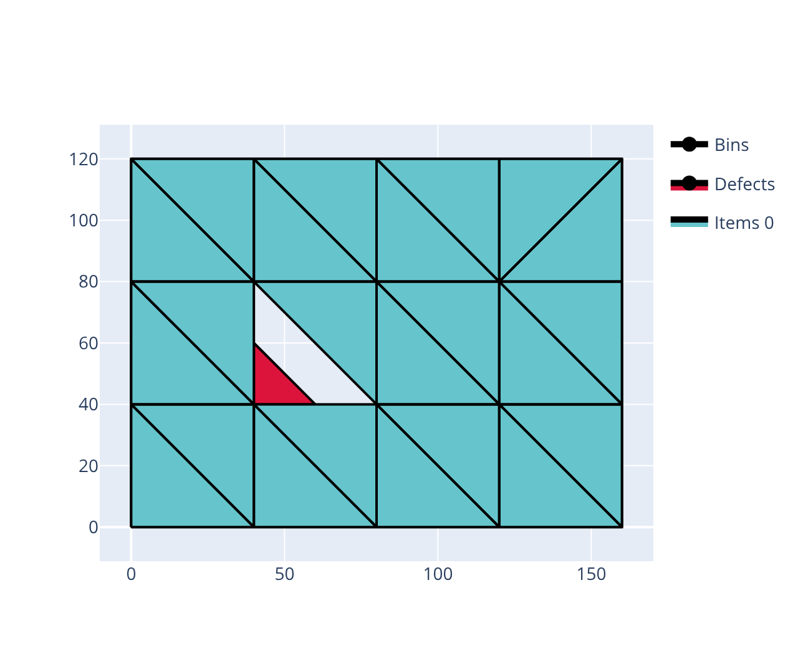

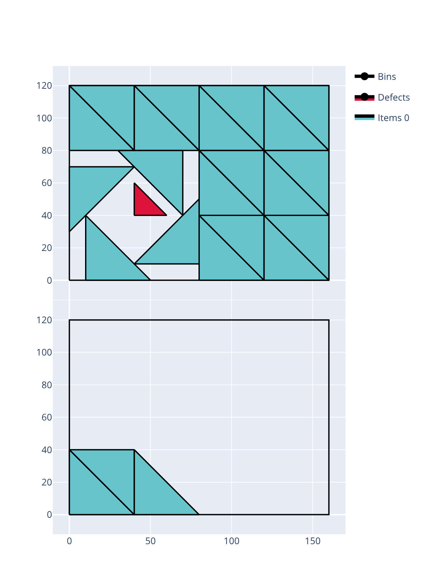

.. list-table::
   :widths: 1 1
   :header-rows: 1
   :align: center

   * - Without item-defect spacing
     - With item-defect spacing
   * - .. literalinclude:: examples/irregular/item_defect_spacing_no/instance.json
          :caption: instance.json
          :language: json
     - .. literalinclude:: examples/irregular/item_defect_spacing_yes/instance.json
          :caption: instance.json
          :language: json
   * - .. code-block:: shell

            packingsolver_irregular \
                    --input instance.json \
                    --certificate solution.json
     - .. code-block:: shell

            packingsolver_irregular \
                    --input instance.json \
                    --certificate solution.json
   * - |irregular_item_defect_spacing_no|
     - |irregular_item_defect_spacing_yes|
