.. _irregular:

:code:`irregular` solver
========================

The :code:`irregular` solver solves problems where items are arbitrary two-dimensional polygons that must be placed inside polygonal bins without overlapping.

.. image:: ../img/irregular.png
   :width: 512pt
   :align: center

These problems occur for example in the textile, leather, sheet metal, and wood industries.

Features:

* Objectives:

  * Knapsack
  * Bin packing
  * Bin packing with leftovers
  * Open dimension X
  * Open dimension Y
  * Open dimension XY
  * Variable-sized bin packing
  * Feasibility

* Item types

  * Polygon shapes (convex or concave)
  * Rectangular and circular shapes
  * Holes inside shapes
  * Discrete and continuous rotations
  * Mirroring (axial symmetry)
  * Multiple item shapes

* Bin types

  * Polygon, rectangle and circle shapes
  * Defects
  * Item-bin minimum spacing

* Spacing constraints

  * Item-item minimum spacing
  * Item-bin minimum spacing
  * Item-defect minimum spacing

Basic usage
-----------

An instance is described in the JSON format below. The `online solver <https://packingsolver.pages.dev/>`_ downloads its instances in this format (**Download**) and loads them (**Load a JSON file**), the command-line solver reads them (``--input``), and the Python package and the C++ library read them with ``InstanceBuilder.read``. Instances can also be built directly with the ``InstanceBuilder`` of the Python package and of the C++ library.

This example has 8 item types: the 7 one-sided tetrominoes (I, O, T, S, Z, L and J, each made of 4 unit squares), with 2 copies of each, plus a cross-shaped piece (5 unit squares) with 3 copies (17 items in total). The objective is ``bin-packing`` in 180 × 160 bins. The solver packs all 17 items into a single bin, wasting less than 1.4% of its area — the pieces interlock almost exactly, like a jigsaw puzzle.

.. example-tabs:: irregular/basic
   :solve:

The solution:

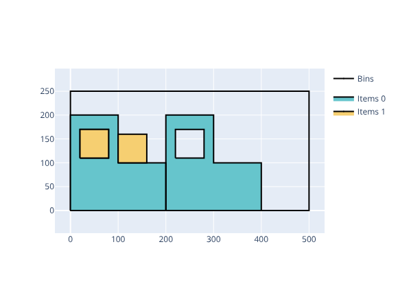

Instance format
^^^^^^^^^^^^^^^

An instance is a JSON object with the following fields:

.. list-table::
   :header-rows: 1
   :widths: 1 3

   * - Field
     - Description
   * - ``objective``
     - **Mandatory**. One of ``knapsack``, ``bin-packing``, ``bin-packing-with-leftovers``, ``open-dimension-x``, ``open-dimension-y``, ``open-dimension-xy``, ``variable-sized-bin-packing``, ``feasibility``; see :ref:`objectives`
   * - ``parameters``
     - An object with the optional fields ``item_item_minimum_spacing`` (see :ref:`irregular-item-item-spacing`), ``open_dimension_xy_aspect_ratio`` (the ratio height / width of the bin for the ``open-dimension-xy`` objective), and ``leftover_mode`` (the corner or side from which the leftover is measured, for the ``bin-packing-with-leftovers`` objective: ``bottom-left`` (default), ``bottom-right``, ``top-left``, ``top-right``, ``left``, ``right``, ``bottom``, ``top``)
   * - ``bin_types``
     - **Mandatory**. The bin types (array)
   * - ``item_types``
     - **Mandatory**. The item types (array)

A **shape** is an object with one of the following ``type``:

* ``"rectangle"``: an axis-aligned rectangle; fields ``width``, ``height``, and the position of its bottom-left corner ``x``, ``y`` (default: ``0``);
* ``"circle"``: a circle; fields ``radius``, and the position of its center ``x``, ``y`` (default: ``0``);
* ``"polygon"``: a polygon; field ``vertices``, a list of ``{"x": ..., "y": ...}`` objects in counter-clockwise order;
* ``"general"``: a shape made of line segments and circular arcs; field ``elements``.

A **bin type** is a shape with the following fields:

.. list-table::
   :header-rows: 1
   :widths: 1 3

   * - Field
     - Description
   * - ``copies``
     - The number of copies of the bin type. Default: ``1``; ``-1`` for an unlimited number of copies
   * - ``copies_min``
     - The minimum number of copies of the bin type to use, for the variable-sized bin packing objective. Default: ``0``
   * - ``cost``
     - The cost of a bin of this type, for the variable-sized bin packing objective. Default: the area of the bin
   * - ``item_bin_minimum_spacing``
     - See :ref:`irregular-item-bin-spacing`. Default: ``0``
   * - ``defects``
     - See :ref:`irregular-defects`. Default: none

An **item type** is a shape (with optional ``holes``, see :ref:`irregular-holes`), or has a field ``shapes``, a list of such shapes for an item type made of several shapes; with the following fields:

.. list-table::
   :header-rows: 1
   :widths: 1 3

   * - Field
     - Description
   * - ``copies``
     - The number of copies of the item type. Default: ``1``; ``-1`` for an unlimited number of copies (knapsack objective only)
   * - ``copies_min``
     - The minimum number of copies of the item type to pack, for the knapsack objective. Default: ``0``
   * - ``profit``
     - The profit of an item of this type, for the knapsack objective. Default: the area of the item
   * - ``allowed_rotations``
     - See :ref:`irregular-rotations`. Default: no rotation

In Python, the shapes are built with ``psi.build_rectangle``, ``psi.build_circle`` and ``psi.build_shape``; the optional fields of the bin types and of the item types are keyword arguments of ``InstanceBuilder.add_bin_type`` and ``InstanceBuilder.add_item_type``. In C++, the shapes are built with ``shape::build_rectangle``, ``shape::build_circle`` and ``shape::build_shape``, and the optional fields are set with the ``InstanceBuilder.set_bin_type_<field>`` and ``InstanceBuilder.set_item_type_<field>`` methods; the examples below show the exceptions.

Certificate format
^^^^^^^^^^^^^^^^^^

The solution is written (command-line option ``--certificate``, ``Solution.write``) as a JSON file with a ``bins`` array. Each entry is a bin of the solution, with:

* ``id``: its bin type, and ``copies``: the number of identical bins it stands for;
* ``shape``: its shape;
* ``items``: its items, each with ``id``, its item type; ``x``, ``y``, the position of its reference point; ``angle``, its rotation angle in degrees; ``mirror``, whether it is mirrored; and ``item_shapes``, its shapes once placed.

To visualize a solution, open it in the `solution viewer <https://packingsolver.pages.dev/viewer.html>`_, or run:

.. code-block:: shell

    python3 scripts/visualize.py solution.json

Irregular bins
--------------

Bin types are not restricted to rectangles or circles: a bin can be any polygon, convex or not.

In the example below, the bin is the irregular 15-vertex polygon container from the smallest instance (``jigsaw_cf3_xcd14250_28``, 28 item types) of the jigsaw puzzle challenge of the `CG:SHOP 2024 <https://cgshop.ibr.cs.tu-bs.de/competition/cg-shop-2024/#problem-description>`_ competition (see ``data/irregular/cgshop2024/``). The objective is :code:`knapsack`: select and place a subset of the items that maximizes the total profit inside the single irregular bin.

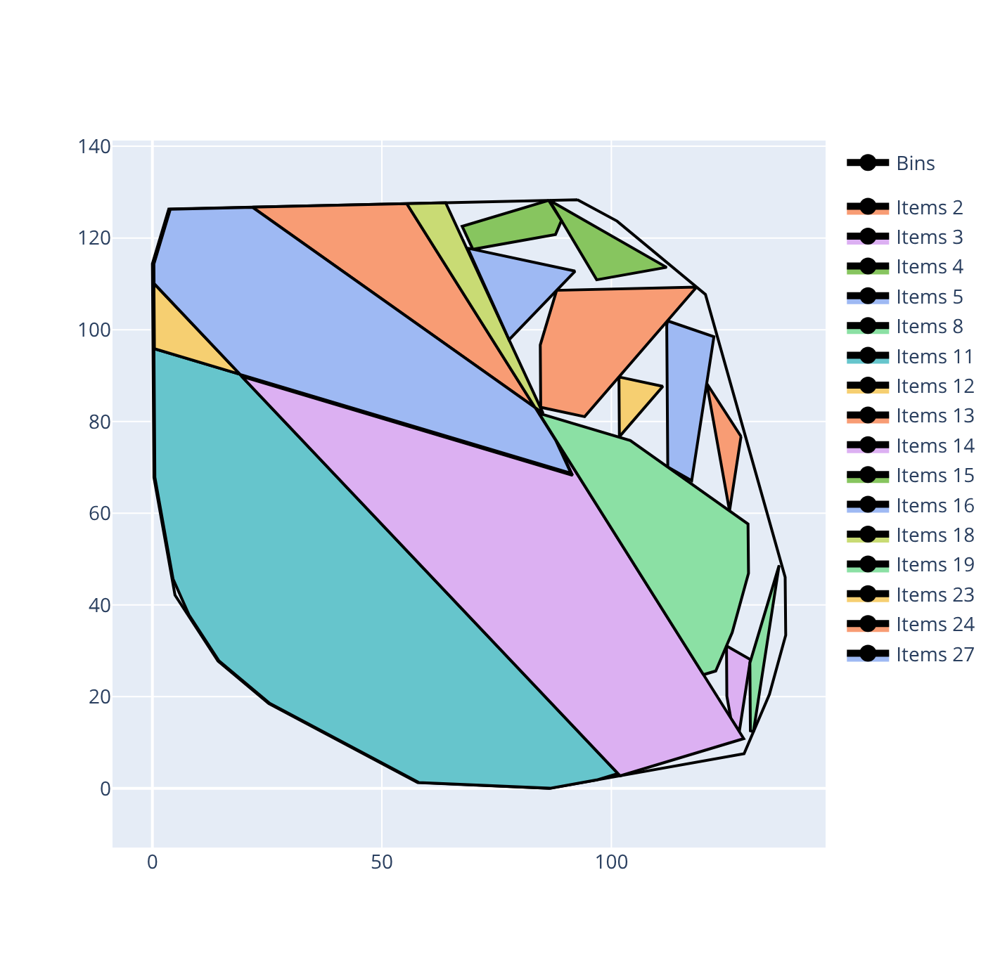

.. example-tabs:: irregular/irregular_bin

.. _irregular-rotations:

Discrete item rotations
-----------------------

The ``allowed_rotations`` field of an item type gives its allowed orientations. It is a list of rotation ranges, each with:

* ``start``: the start angle in degrees
* ``end``: the end angle in degrees
* ``mirror``: if ``true``, the item is first mirrored about the Y axis, then rotated (default: ``false``; see :ref:`irregular-mirroring`)

When ``start == end``, only that exact angle is allowed. When ``start < end``, any angle in ``[start, end]`` is allowed (continuous rotation range). If ``allowed_rotations`` is omitted, the items aren't rotated.

.. tab-set::
   :sync-group: interface

   .. tab-item:: Online solver
      :sync: web

      In the **Item types** table, choose the **Rotations** of an item type: *None*, *Half turns*, *Quarter turns*, *Any angle*, or *Custom* ranges.

   .. tab-item:: JSON
      :sync: json

      In an item type: ``"allowed_rotations": [{"start": 0, "end": 0}, {"start": 90, "end": 90}, {"start": 180, "end": 180}, {"start": 270, "end": 270}]``.

   .. tab-item:: Python
      :sync: python

      ``instance_builder.add_item_type(shape, allowed_rotations=[(0, 0, False), (90, 90, False), (180, 180, False), (270, 270, False)])``: ``(start, end, mirror)`` tuples.

   .. tab-item:: C++
      :sync: cpp

      ``instance_builder.add_item_type_allowed_rotation(item_type_id, 90, 90, false);``, once for each rotation range.

In the example below, 2 copies of an L-shaped item must be packed into 60 × 60 bins (:code:`bin-packing` objective). Without rotation, the two L-shapes cannot interlock, so 2 bins are needed. Allowing 90° rotations lets them interlock into a single bin.

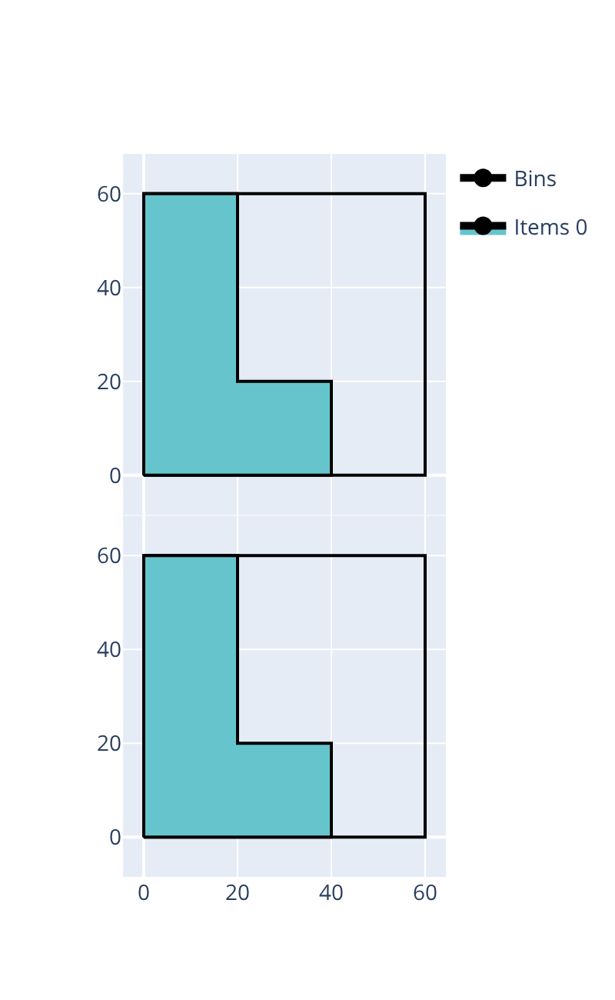

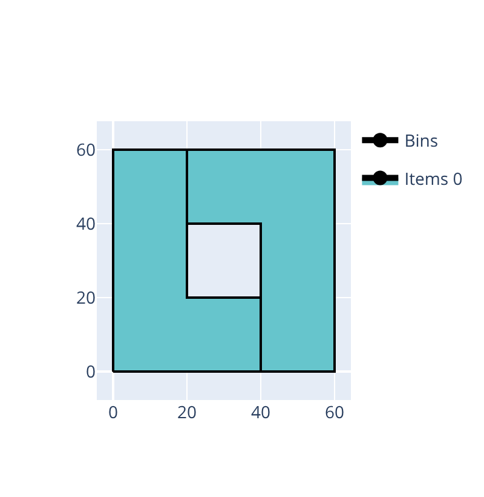

.. list-table::
   :widths: 1 1
   :header-rows: 1
   :align: center

   * - Without rotation
     - With rotation
   * - |irregular_rotation_no|
     - |irregular_rotation_yes|

.. example-tabs:: irregular/rotation_no irregular/rotation_yes

Continuous item rotations
-------------------------

Setting ``start`` strictly lower than ``end`` in a rotation range allows any angle in between, instead of only a fixed set of discrete angles; ``{"start": 0, "end": 360}`` allows any angle. This is especially useful for irregular, non-rectangular shapes, where letting items nest at arbitrary angles (rather than only 0°/90°/180°/270°) can significantly reduce wasted space.

In the example below, 7 copies of a Christmas-tree-shaped item (from the `Kaggle Santa 2025 <https://www.kaggle.com/code/inversion/santa-2025-getting-started>`_ competition) may be rotated by any angle and are packed with the :code:`open-dimension-xy` objective, which finds the smallest bin (here constrained to a square, aspect ratio 1) containing all of them. Free rotation lets the trees nest into each other at odd angles rather than sitting axis-aligned, filling the bin far more tightly.

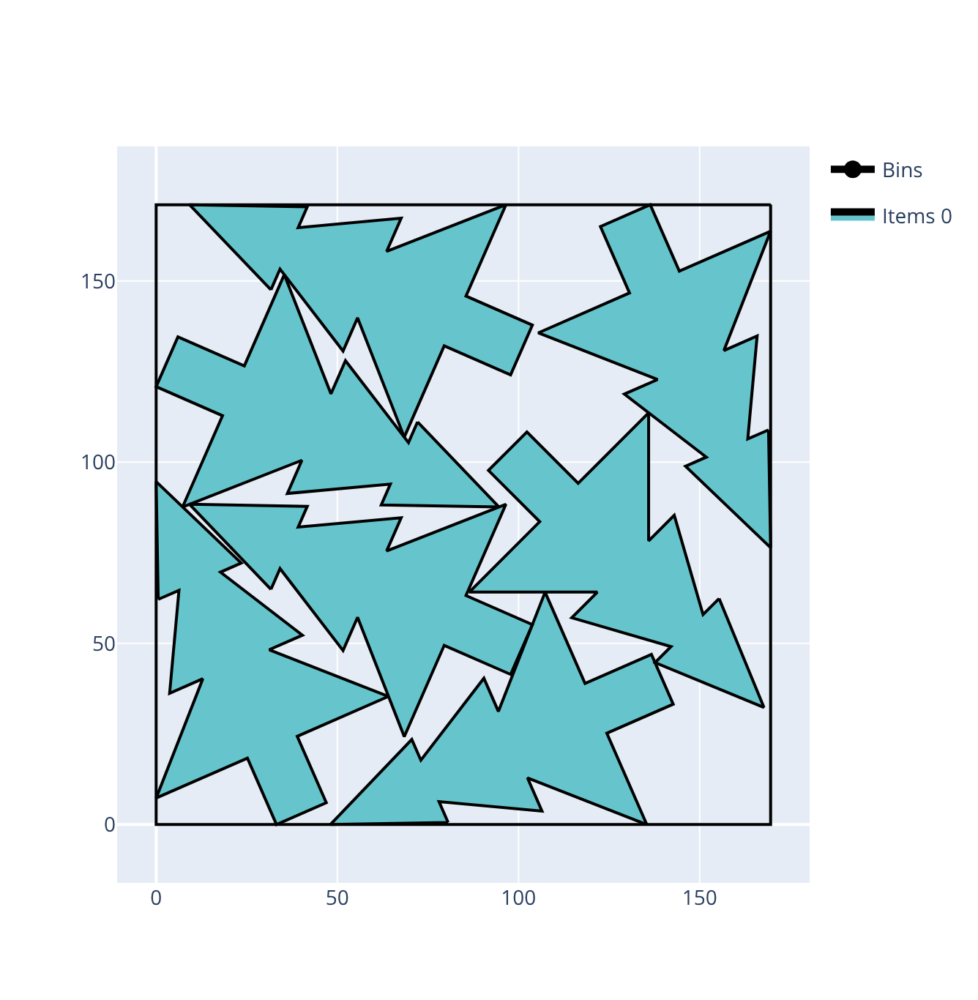

.. example-tabs:: irregular/rotation_continuous

.. _irregular-mirroring:

Item mirroring
--------------

Each rotation range may set ``mirror: true``, in which case the item is first mirrored about its Y axis, then rotated by the given angle range. Mirroring is off by default.

.. tab-set::
   :sync-group: interface

   .. tab-item:: Online solver
      :sync: web

      In the **Item types** table, check **Mirror**.

   .. tab-item:: JSON
      :sync: json

      In an item type: ``"allowed_rotations": [{"start": 0, "end": 0}, {"start": 0, "end": 0, "mirror": true}]``.

   .. tab-item:: Python
      :sync: python

      ``instance_builder.add_item_type(shape, allowed_rotations=[(0, 0, False), (0, 0, True)])``

   .. tab-item:: C++
      :sync: cpp

      ``instance_builder.add_item_type_allowed_rotation(item_type_id, 0, 0, true);``

Mirroring matters for shapes that are not symmetric: an L-shaped item is **chiral**, so it cannot be turned into its own mirror image by rotation alone. In the example below, 2 copies of an L-shaped item and a square item must be packed into 80 × 60 bins (:code:`bin-packing` objective). Without mirroring, the two L-shapes (same orientation) leave two separate notches, too narrow for the square, so 2 bins are needed. Allowing the L-shapes to be mirrored turns one of them into a matching, opposite-handed piece: together the two L-shapes form a single wide notch that the square fits into exactly, so all three items pack into a single bin.

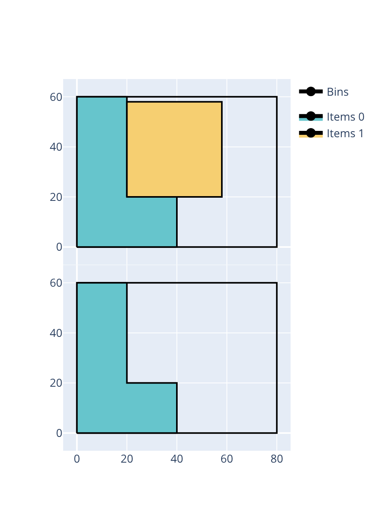

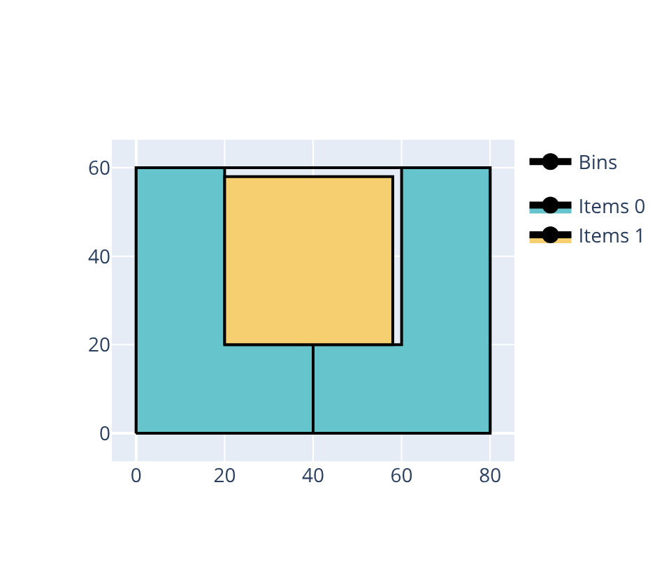

.. list-table::
   :widths: 1 1
   :header-rows: 1
   :align: center

   * - Without mirroring
     - With mirroring
   * - |irregular_mirroring_no|
     - |irregular_mirroring_yes|

.. example-tabs:: irregular/mirroring_no irregular/mirroring_yes

.. _irregular-holes:

Holes
-----

The shape of an item type may have ``holes``: a list of shapes inside it. Vertices must be in counter-clockwise order, for both the outer contour and the holes.

.. tab-set::
   :sync-group: interface

   .. tab-item:: Online solver
      :sync: web

      In the **Item types** table, click **Add a hole** below an item type.

   .. tab-item:: JSON
      :sync: json

      In an item type: ``"holes": [{"type": "polygon", "vertices": [...]}]``.

   .. tab-item:: Python
      :sync: python

      ``instance_builder.add_item_type(psi.ShapeWithHoles(shape, [hole]))``

   .. tab-item:: C++
      :sync: cpp

      ``instance_builder.add_item_type({ItemShape{shape::ShapeWithHoles{shape, {hole}}}});``

In the example below, there are two item types: a pentagon (a 40 × 40 square with one corner cut off) and a small triangle, noticeably smaller than the hole so that the hole remains visible around it (:code:`bin-packing` objective, 40 × 40 bins). Without a hole, the two items cannot share a bin, so 2 bins are needed. Cutting a triangular hole into the pentagon lets the small triangle nest inside it, so both items fit together in a single bin.

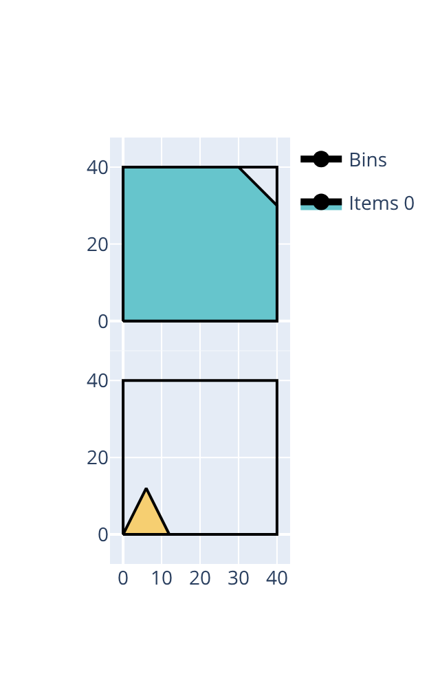

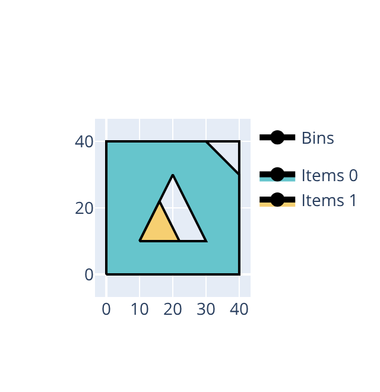

.. list-table::
   :widths: 1 1
   :header-rows: 1
   :align: center

   * - Without a hole
     - With a hole
   * - |irregular_holes_no|
     - |irregular_holes_yes|

.. example-tabs:: irregular/holes_no irregular/holes_yes

.. _irregular-defects:

Defects
-------

Defects are regions of a bin where items cannot be placed. They are given by the ``defects`` field of a bin type: a list of shapes (with optional ``holes``), placed in the bin, each with the optional fields:

* ``defect_type``: a defect type identifier
* ``item_defect_minimum_spacing``: the minimum distance between the defect and the items (default: ``0``; see :ref:`irregular-item-bin-spacing`)

.. tab-set::
   :sync-group: interface

   .. tab-item:: Online solver
      :sync: web

      In the **Bin types** table, click **Add a defect** below a bin type, and give its shape and its position.

   .. tab-item:: JSON
      :sync: json

      In a bin type: ``"defects": [{"type": "rectangle", "x": 5, "y": 5, "width": 10, "height": 10}]``.

   .. tab-item:: Python
      :sync: python

      ``instance_builder.add_defect(bin_type_id, -1, psi.ShapeWithHoles(psi.build_rectangle(5, 15, 5, 15)))``: the bin type, the defect type (``-1`` for none), and the shape.

   .. tab-item:: C++
      :sync: cpp

      ``instance_builder.add_defect(bin_type_id, -1, shape::ShapeWithHoles{shape::build_rectangle(5, 15, 5, 15)});``

In the example below, 2 copies of an L-shaped item must be packed into 60 × 60 bins (:code:`bin-packing` objective). Without any defect, the two L-shapes interlock into a single bin, as in the rotation example above. Adding a small 10 × 10 defect in the corner where one of the L-shapes needs to sit breaks the interlocking pattern, and 2 bins become necessary.

.. |irregular_defects_no| image:: img/irregular_defects_no.png
   :scale: 50%

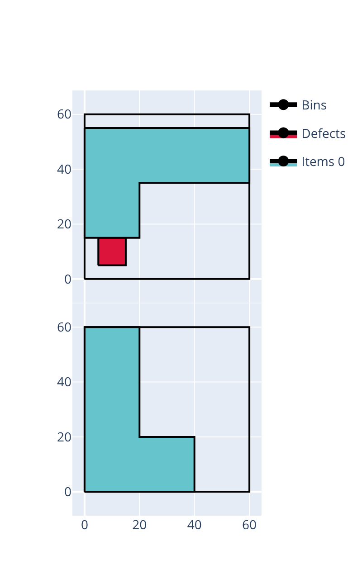

.. list-table::
   :widths: 1 1
   :header-rows: 1
   :align: center

   * - Without a defect
     - With a defect
   * - |irregular_defects_no|
     - |irregular_defects_yes|

.. example-tabs:: irregular/defects_no irregular/defects_yes

.. _irregular-item-item-spacing:

Item-item spacing
-----------------

A minimum distance can be enforced between any two items, with the ``item_item_minimum_spacing`` field of the ``parameters`` object. Default: ``0``.

.. tab-set::
   :sync-group: interface

   .. tab-item:: Online solver
      :sync: web

      Fill the **Minimum spacing between items** below the objective.

   .. tab-item:: JSON
      :sync: json

      In the instance: ``"parameters": {"item_item_minimum_spacing": 3}``.

   .. tab-item:: Python
      :sync: python

      ``instance_builder.set_item_item_minimum_spacing(3)``

   .. tab-item:: C++
      :sync: cpp

      ``instance_builder.set_item_item_minimum_spacing(3);``

In the example below, 10 copies of an L-shaped item (with all 4 rotations allowed) must be packed into 160 × 100 bins (:code:`bin-packing-with-leftovers` objective). Without any minimum spacing, the 10 L-shapes interlock exactly, filling a single bin with no waste at all. A minimum spacing of 3 between items breaks that tight interlocking pattern entirely: only 6 items fit per bin, each with a clearly visible gap around it, so a second bin is needed for the remaining 4.

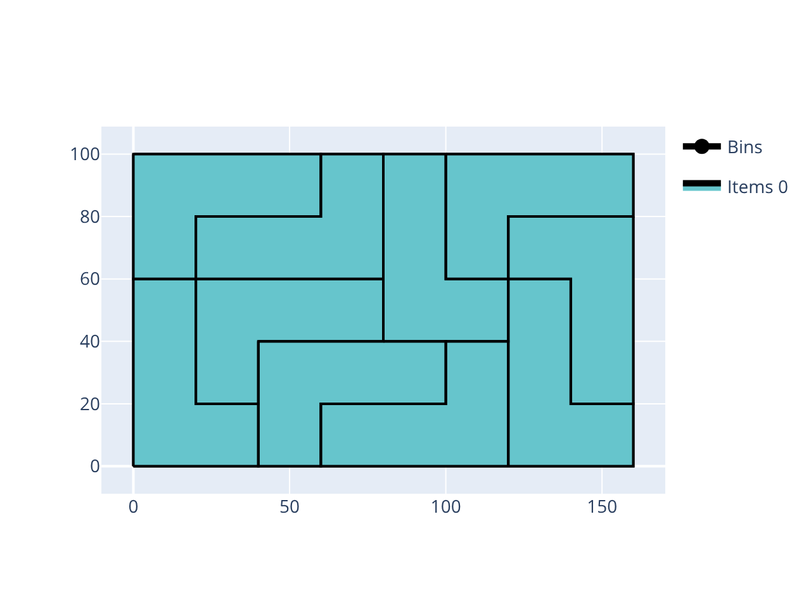

.. |irregular_item_item_spacing_yes| image:: img/irregular_item_item_spacing_yes.png
   :scale: 25%

.. list-table::
   :widths: 1 1
   :header-rows: 1
   :align: center

   * - Without spacing
     - With spacing
   * - |irregular_item_item_spacing_no|
     - |irregular_item_item_spacing_yes|

.. example-tabs:: irregular/item_item_spacing_no irregular/item_item_spacing_yes

.. _irregular-item-bin-spacing:

Item-bin and item-defect spacing
--------------------------------

A minimum distance can also be enforced between the items and the border of a bin, or between the items and a defect:

* ``item_bin_minimum_spacing``: the minimum distance between the items and the border of the bin, set on a bin type (default: ``0``)
* ``item_defect_minimum_spacing``: the minimum distance between the items and a defect, set on that defect (default: ``0``)

.. tab-set::
   :sync-group: interface

   .. tab-item:: Online solver
      :sync: web

      In the **Bin types** table, fill the **Item spacing** of a bin type, or the **Spacing** of a defect.

   .. tab-item:: JSON
      :sync: json

      In a bin type: ``"item_bin_minimum_spacing": 3``; in a defect: ``"item_defect_minimum_spacing": 5``.

   .. tab-item:: Python
      :sync: python

      ``instance_builder.add_bin_type(shape, item_bin_minimum_spacing=3)`` and ``instance_builder.set_item_defect_minimum_spacing(bin_type_id, defect_id, 5)``

   .. tab-item:: C++
      :sync: cpp

      ``instance_builder.set_item_bin_minimum_spacing(bin_type_id, 3);`` and ``instance_builder.set_item_defect_minimum_spacing(bin_type_id, defect_id, 5);``

In the example below, the same 10 interlocking L-shapes as above are packed into 160 × 100 bins (:code:`bin-packing-with-leftovers` objective), this time with no spacing between items. Without any minimum spacing, the 10 L-shapes still interlock exactly, filling a single bin with no waste. A minimum spacing of 3 between the items and the border of the bin leaves a clearly visible margin around the whole cluster of items — even though they still touch each other — and that margin alone is enough to break the tiling: only 6 items fit per bin, so a second bin is needed for the remaining 4.

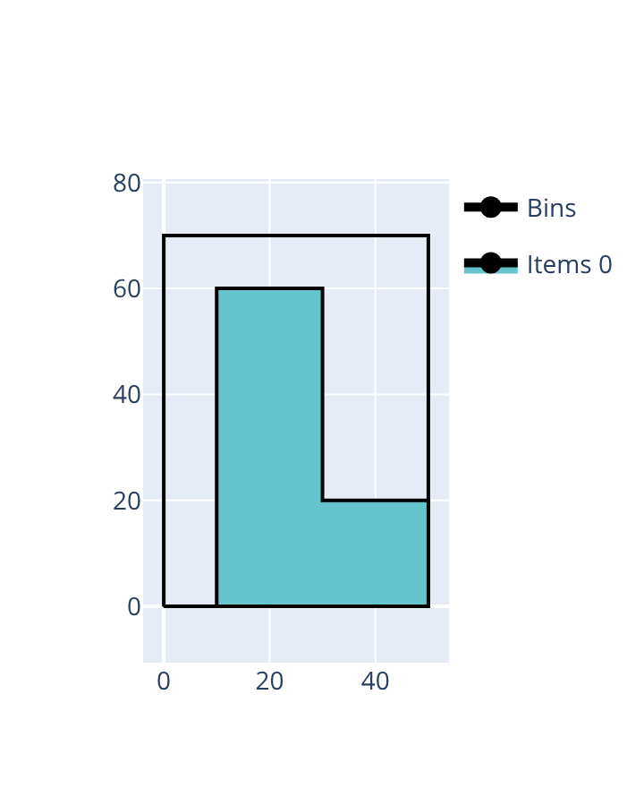

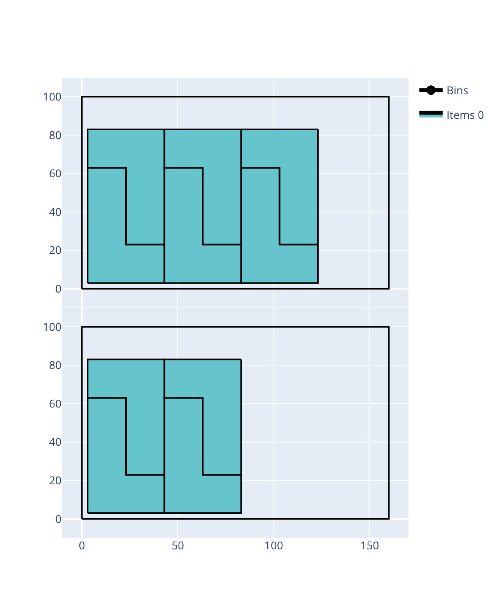

.. list-table::
   :widths: 1 1
   :header-rows: 1
   :align: center

   * - Without item-bin spacing
     - With item-bin spacing
   * - |irregular_item_bin_spacing_no|
     - |irregular_item_bin_spacing_yes|

.. example-tabs:: irregular/item_bin_spacing_no irregular/item_bin_spacing_yes

The same idea applies to defects. In the example below, 23 copies of a right-triangle item (with legs of 40) are packed into 160 × 120 bins, one of which has a small triangular defect sitting well inside the bin, away from every border (:code:`bin-packing-with-leftovers` objective). Without any minimum spacing, the items pack right up against the defect and all 23 fit into that single bin. A minimum spacing of 5 around the defect leaves a clearly visible gap around it, which is enough to push 3 items out, so a second (defect-free) bin is needed for them.

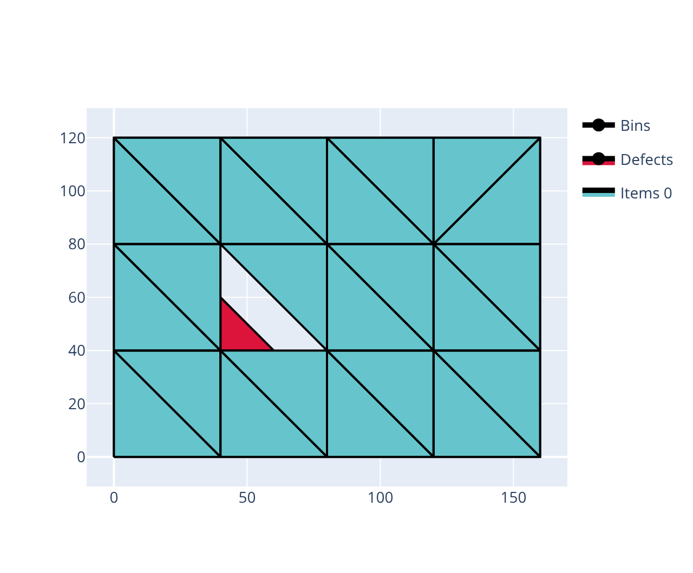

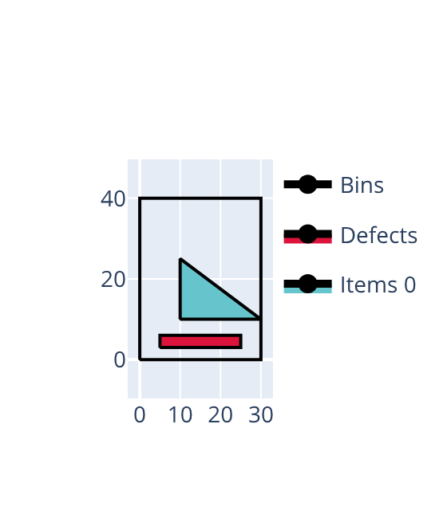

.. list-table::
   :widths: 1 1
   :header-rows: 1
   :align: center

   * - Without item-defect spacing
     - With item-defect spacing
   * - |irregular_item_defect_spacing_no|
     - |irregular_item_defect_spacing_yes|

.. example-tabs:: irregular/item_defect_spacing_no irregular/item_defect_spacing_yes
