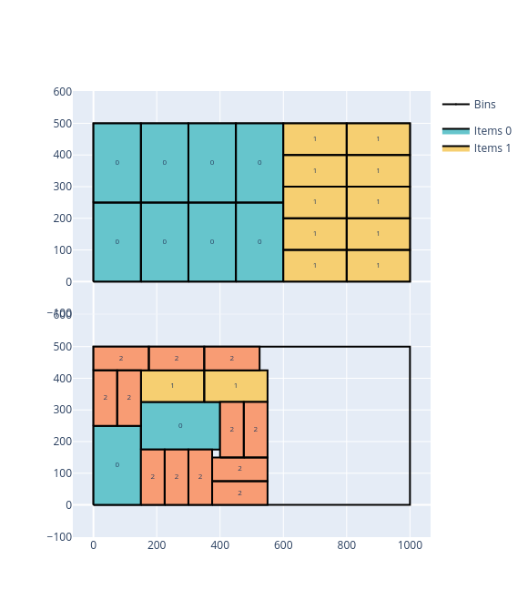
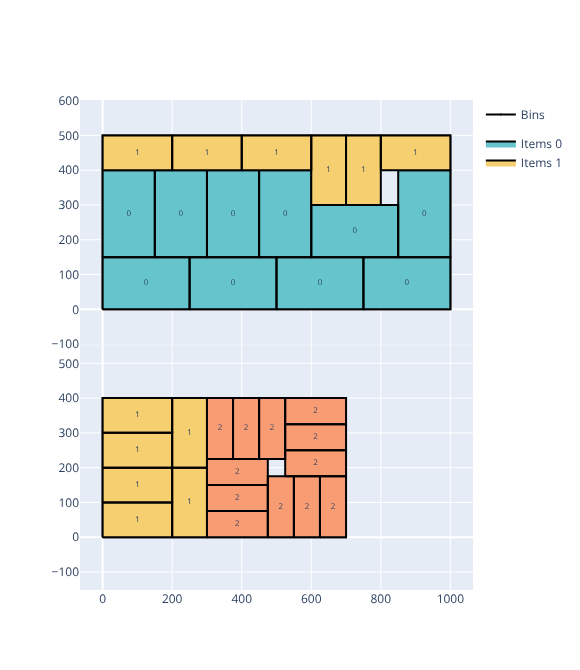
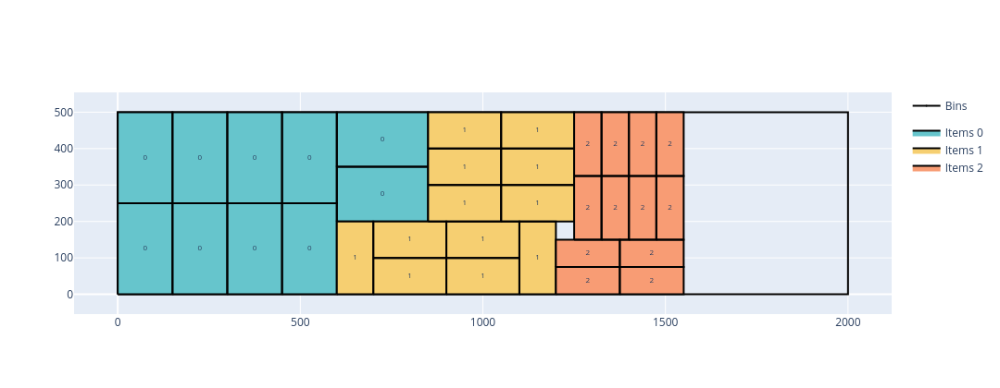
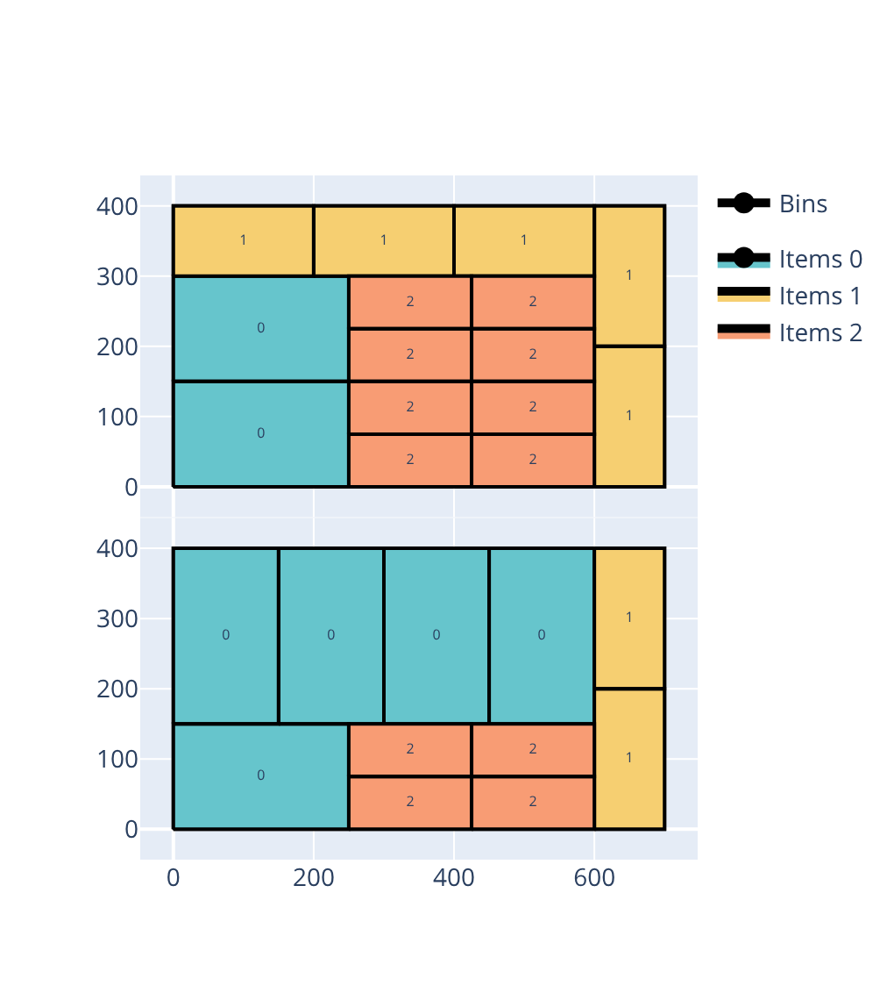

.. _objectives:

Objectives
==========

First, the objectives can be classified in two categories:

* **input minimization**: pack/cut all items using as few space as possible
* **output maximization**: pack/cut as many items as possible inside all the provided containers

There is a single output maximization objective called **knapsack**.

There is also a **feasibility** objective that simply checks whether a valid packing exists.

For input minimization, there are 3 objective types:

* **Open-dimension**: there is a single bin and the objective is to minimize the space used in this bin
* **Bin packing**: there are multiple bins, the objective is to use as few bins as possible; bins must be used in the order they are provided
* **Variable-sized bin packing**: there are multiple bins, the objective is to use as few bins as possible; there is no constraint in the order bins are used

The objective of an instance is set as follows (here, bin packing; the examples below use the :ref:`rectangle<rectangle>` problem type):

.. tab-set::
   :sync-group: interface

   .. tab-item:: Online solver
      :sync: web

      Choose the **Objective** of the project.

   .. tab-item:: JSON
      :sync: json

      In the instance: ``"objective": "bin-packing"``.

   .. tab-item:: Python
      :sync: python

      ``instance_builder.set_objective(psr.Objective.BinPacking)``

   .. tab-item:: C++
      :sync: cpp

      ``instance_builder.set_objective(Objective::BinPacking);``

Bin packing
-----------

In bin packing problems, the objective is to **pack/cut all items** in **as few bins as possible**.
Bins must be used **in the order they are provided**.

PackingSolver supports two variants of this type of objective:

* :code:`bin-packing`: minimize the number of bins
* :code:`bin-packing-with-leftovers`: minimize the number of bins; and then maximize the value of the leftover of the last bin of the solution

**Example**

In this example, there are two bin types. The first bin type has 10 copies. To use bins of the second bin type, the solution should already contain the first 10 copies of the first bin type. The solver only needs to use 2 copies of the first bin type to pack all items. Therefore, only the first bin type is used. Since the objective is bin packing with leftovers, the solver optimizes the leftover of the last bin of the solution.

.. example-tabs:: rectangle/objective_bin_packing_with_leftovers

Variable-sized bin packing
--------------------------

In variable-sized bin packing problems, the objective is to **pack/cut all items** in **the cheapest bins as possible**.
There is **no constraint in the order** bins are used.

Each bin has an associated cost. If no cost is provided, then the cost of a bin is its space (length, area, volume).

**Example**

The input is the same as the previous one. With the variable-sized bin packing objective, the solver can use the second bin type to minimize the overall waste.

.. example-tabs:: rectangle/objective_variable_sized_bin_packing

Open-dimension
--------------

In open-dimension problems, the objective is to **pack/cut all items** in a single bin using **as few space as possible** on the bin. As few space as possible may for example mean:

* minimize the width used
* minimize the height used
* minimize the rectangular area used
* minimize the circular area used

PackingSolver currently supports the objectives:

* :code:`open-dimension-x`: minimize the width used
* :code:`open-dimension-y`: minimize the height used
* :code:`open-dimension-z`: minimize the height used, for the :ref:`box<box>` problem type
* :code:`open-dimension-xy`: minimize the area used, with a given aspect ratio, for the :ref:`irregular<irregular>` problem type

The open-dimension objectives are available for all the problem types except :ref:`one-dimensional<onedimensional>`.

**Example**

.. example-tabs:: rectangle/objective_open_dimension_x

Knapsack
--------

In knapsack problems, the objective is to **maximize the value of the items packed/cut** inside **all the provided containers**.

Each item has an associated profit. If no profit is provided, then the profit of an item is its space (length, area, volume).

**Example**

The items are the same as in the previous examples. Only 2 copies of the small bin type are available. This is not enough to pack all the items.

.. example-tabs:: rectangle/objective_knapsack

Feasibility
-----------

In feasibility problems, the objective is simply to **determine whether a valid packing exists** — no optimization is performed.

The solver returns a solution as soon as it finds one valid placement of all items, or reports that no feasible packing was found.
