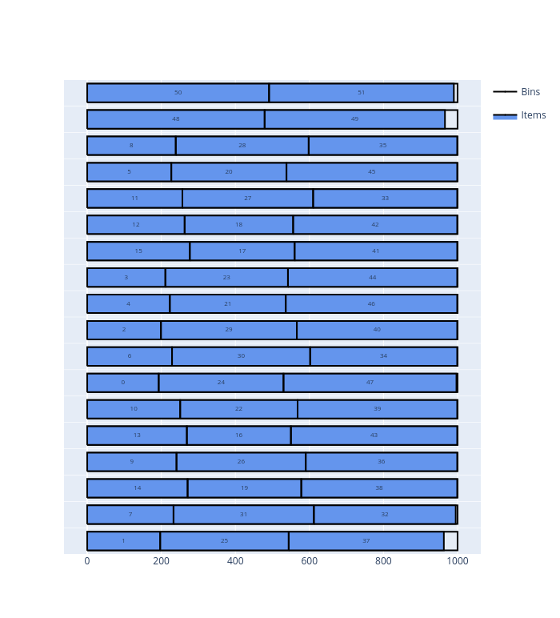

.. _onedimensional:

OneDimensional solver
=====================

The OneDimensional solver solves problems with one-dimensional items and bins.

These problems occur for example when cutting paper rolls, pipes, cables, steel bars; or when stacking parcels.

This dimension is called length here.

Features:

* Objectives:

  * Knapsack
  * Bin packing
  * Bin packing with leftovers
  * Variable-sized bin packing

* Item types

  * Nesting length
  * Maximum number of items in a bin containing an item of a given type
  * Maximum weight allowed after an item of a given type

* Bin types

  * Maximum weight

* Item type / bin type eligibility

Basic usage
-----------

The OneDimensional solver takes as input:

* an item CSV file; option: ``--items items.csv`` 
* a bin CSV file; option: ``--bins bins.csv``
* a parameter CSV file; option: ``--parameters parameters.csv``

It outputs:

* a solution CSV file; option: ``--certificate solution.csv``

The **item file** contains:

* The dimension of the item type (**mandatory**)

  * column ``X`` 
  * **Integer value**

* The number of copies of the item type

  * column ``COPIES`` 
  * default value: ``1``

* The profit of an item of this type (for a knapsack objective)

  * column ``PROFIT`` 
  * default value: item length

The **bin file** contains:

* The dimension of the bin type (**mandatory**)

  * column ``X`` 
  * **Integer value**

* The number of copies of the bin type

  * column ``COPIES`` 
  * default value: ``1``

* The cost of a bin of this type (for a variable-sized bin packing objective)

  * column ``COST`` 
  * default value: bin length

The **parameter file** has two columns: ``NAME`` and ``VALUE``. The possible entries are:

* The objective; name: ``objective``; possible values:

  * ``knapsasck``
  * ``bin-packing``
  * ``bin-packing-with-leftovers``
  * ``variable-sized-bin-packing``

The output **certificate file** is a CSV file as well. Each line corresponds to either a bin - if the value in the ``TYPE`` column is ``BIN`` - or to an item of the solution - if the value in the ``TYPE`` column is ``ITEM``.

A line corresponding to a bin contains:

* The id of the bin type

  * Column ``ID``

* The number of copies of this bin in the solution

  * Column ``COPIES``

* The length of the bin (input)

  * Column ``X``

A line corresponding to an item contains:

* The id of the item type

  * Column ``ID``

* The starting length of the item

  * Column ``X``

* The length of the item (input)

  * Column ``LX``

**Example**

Inputs

.. code-block:: none
   :caption: items.csv

   X
   193
   197
   199
   211
   223
   227
   229
   233
   239
   241
   251
   257
   263
   269
   271
   277
   281
   283
   293
   307
   311
   313
   317
   331
   337
   347
   349
   353
   359
   367
   373
   379
   383
   389
   397
   401
   409
   419
   421
   431
   433
   439
   443
   449
   457
   461
   463
   467
   479
   487
   491
   499

.. code-block:: none
   :caption: bins.csv

   X,COPIES
   1000,100

.. code-block:: none
   :caption: parameters.csv

   NAME,VALUE
   objective,bin-packing

Solve:

.. code-block:: shell

    packingsolver_onedimensional \
            --items items.csv \
            --bins bins.csv \
            --parameters parameters.csv \
            --certificate solution.csv

.. code-block:: none

    =================================
              PackingSolver          
    =================================

    Problem type
    ------------
    OneDimensional

    Instance
    --------
    Objective:             BinPacking
    Number of item types:  52
    Number of items:       52
    Number of bin types:   1
    Number of bins:        100
    Maximum item copies:   1
    Maximum bin cost:      1000

            Time    Bins  Full waste (%)                         Comment
            ----    ----  --------------                         -------
           0.001      20           10.51                      TS g 0 q 1
           0.003      19            5.80                      TS g 2 q 2
           0.130      18            0.57                         CG n 18

    Final statistics
    ----------------
    Time (s):  0.131665

    Solution
    --------
    Number of items:  52 / 52 (100%)
    Item length:      17898 / 17898 (100%)
    Item profit:      17898 / 17898 (100%)
    Number of bins:   18 / 100 (18%)
    Bin length:       18000 / 100000 (18%)
    Bin cost:         18000
    Waste:            75
    Waste (%):        0.417293
    Full waste:       102
    Full waste (%):   0.566667

.. code-block:: none
   :caption: solution.csv

    TYPE,ID,COPIES,BIN,X,LX
    BIN,0,1,0,0,1000
    ITEM,50,1,0,0,491
    ITEM,51,1,0,491,499
    BIN,0,1,1,0,1000
    ITEM,48,1,1,0,479
    ITEM,49,1,1,479,487
    BIN,0,1,2,0,1000
    ITEM,5,1,2,0,227
    ITEM,32,1,2,227,383
    ITEM,33,1,2,610,389
    BIN,0,1,3,0,1000
    ITEM,9,1,3,0,241
    ITEM,26,1,3,241,349
    ITEM,36,1,3,590,409
    BIN,0,1,4,0,1000
    ITEM,15,1,4,0,277
    ITEM,17,1,4,277,283
    ITEM,41,1,4,560,439
    BIN,0,1,5,0,1000
    ITEM,3,1,5,0,211
    ITEM,29,1,5,211,367
    ITEM,38,1,5,578,421
    BIN,0,1,6,0,1000
    ITEM,0,1,6,0,193
    ITEM,30,1,6,193,373
    ITEM,40,1,6,566,433
    BIN,0,1,7,0,1000
    ITEM,1,1,7,0,197
    ITEM,27,1,7,197,353
    ITEM,43,1,7,550,449
    BIN,0,1,8,0,1000
    ITEM,8,1,8,0,239
    ITEM,28,1,8,239,359
    ITEM,35,1,8,598,401
    BIN,0,1,9,0,1000
    ITEM,11,1,9,0,257
    ITEM,16,1,9,257,281
    ITEM,45,1,9,538,461
    BIN,0,1,10,0,1000
    ITEM,10,1,10,0,251
    ITEM,22,1,10,251,317
    ITEM,39,1,10,568,431
    BIN,0,1,11,0,1000
    ITEM,13,1,11,0,269
    ITEM,20,1,11,269,311
    ITEM,37,1,11,580,419
    BIN,0,1,12,0,1000
    ITEM,14,1,12,0,271
    ITEM,25,1,12,271,347
    ITEM,31,1,12,618,379
    BIN,0,1,13,0,1000
    ITEM,12,1,13,0,263
    ITEM,24,1,13,263,337
    ITEM,34,1,13,600,397
    BIN,0,1,14,0,1000
    ITEM,6,1,14,0,229
    ITEM,21,1,14,229,313
    ITEM,44,1,14,542,457
    BIN,0,1,15,0,1000
    ITEM,7,1,15,0,233
    ITEM,18,1,15,233,293
    ITEM,46,1,15,526,463
    BIN,0,1,16,0,1000
    ITEM,4,1,16,0,223
    ITEM,19,1,16,223,307
    ITEM,47,1,16,530,467
    BIN,0,1,17,0,1000
    ITEM,2,1,17,0,199
    ITEM,23,1,17,199,331
    ITEM,42,1,17,530,443

Visualize:

.. code-block:: shell

    python3 scripts/visualize_onedimensional.py solution.csv

Nesting length
--------------

Maximum number of items in a bin containing an item of a given type
-------------------------------------------------------------------

Maximum weight allowed after an item of a given type
----------------------------------------------------

Maximum weight in a bin
-----------------------

Item type / bin type eligibility
--------------------------------
