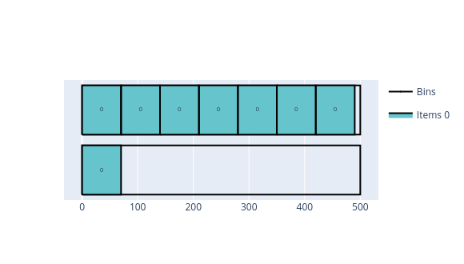
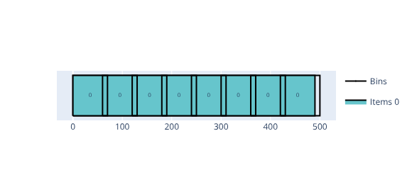
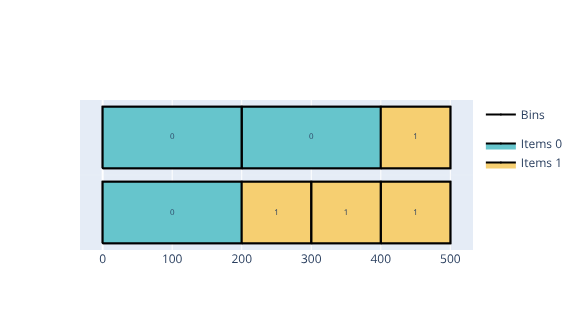
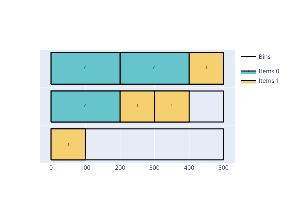
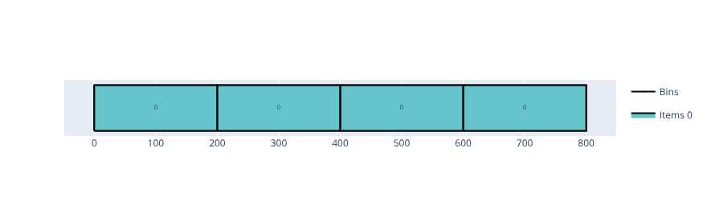
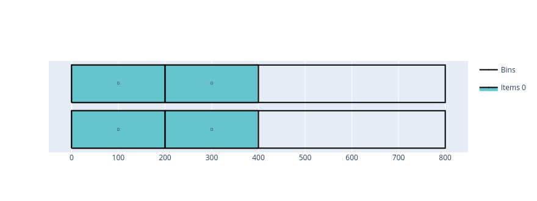
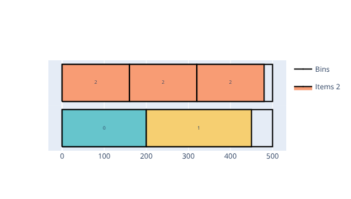
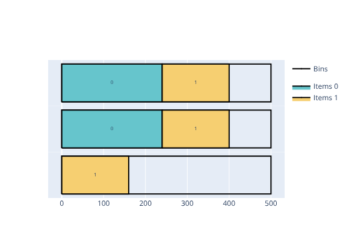

.. _onedimensional:

OneDimensional solver
=====================

The OneDimensional solver solves problems with one-dimensional items and bins.

.. image:: ../img/onedimensional.png
   :width: 512pt
   :align: center

These problems occur for example when cutting paper rolls, pipes, cables, steel bars; or when stacking parcels.

This dimension is called length here.

Features:

* Objectives:

  * Knapsack
  * Bin packing
  * Bin packing with leftovers
  * Variable-sized bin packing

* Nesting length between consecutive items

* Maximum number of items in a bin containing an item of a given type

* Maximum weight allowed after an item of a given type

* Maximum weight in bins

* Item type / bin type eligibility

Usage
-----

The OneDimensional solver takes as input:

* an item CSV file; option: ``--items items.csv`` 
* a bin CSV file; option: ``--bins bins.csv``
* a parameter CSV file; option: ``--parameters parameters.csv``

It outputs:

* a solution CSV file; option: ``--certificate solution.csv``

The **item file** contains:

* The dimension of the item type (**mandatory**)

  * column ``X`` 
  * **Integer value**

* The number of copies of the item type

  * column ``COPIES`` 
  * default value: ``1``

* The profit of an item of this type (for a knapsack objective)

  * column ``PROFIT`` 
  * default value: item length

The **bin file** contains:

* The dimension of the bin type (**mandatory**)

  * column ``X`` 
  * **Integer value**

* The number of copies of the bin type

  * column ``COPIES`` 
  * default value: ``1``

* The cost of a bin of this type (for a variable-sized bin packing objective)

  * column ``COST`` 
  * default value: bin length

The **parameter file** has two columns: ``NAME`` and ``VALUE``. The possible entries are:

* The objective; name: ``objective``; possible values:

  * ``knapsasck``
  * ``bin-packing``
  * ``bin-packing-with-leftovers``
  * ``variable-sized-bin-packing``

The output **certificate file** is a CSV file as well. Each line corresponds to either a bin - if the value in the ``TYPE`` column is ``BIN`` - or to an item of the solution - if the value in the ``TYPE`` column is ``ITEM``.

A line corresponding to a bin contains:

* The id of the bin type

  * Column ``ID``

* The number of copies of this bin in the solution

  * Column ``COPIES``

* The length of the bin (input)

  * Column ``X``

A line corresponding to an item contains:

* The id of the item type

  * Column ``ID``

* The starting length of the item

  * Column ``X``

* The length of the item (input)

  * Column ``LX``

Basic example
-------------

Inputs:

.. literalinclude:: examples/onedimensional/items.csv
   :caption: items.csv

.. literalinclude:: examples/onedimensional/bins.csv
   :caption: bins.csv

.. literalinclude:: examples/onedimensional/parameters.csv
   :caption: parameters.csv

Solve:

.. code-block:: shell

    packingsolver_onedimensional \
            --items items.csv \
            --bins bins.csv \
            --parameters parameters.csv \
            --certificate solution.csv

.. literalinclude:: examples/onedimensional/output.txt

.. literalinclude:: examples/onedimensional/solution.csv
   :caption: solution.csv

Visualize:

.. code-block:: shell

    python3 scripts/visualize_onedimensional.py solution.csv

.. image:: img/onedimensional_solution.png
   :width: 512pt
   :align: center

Nesting length
--------------

In some cases, when two items are placed consecutively in a bin, the second item might nests with the first one, reducing the effective space it occupies. This length difference is called the nesting length.

The nesting length is specified via the ``NESTING_LENGTH`` column in the item CSV file.

In the following example, thanks to nesting, all items might fit in a single bin.

.. list-table::
   :widths: 1 1
   :header-rows: 1
   :align: center

   * - Without nesting length
     - With nesting length
   * - .. literalinclude:: examples/onedimensional/nesting_length_no/items.csv
          :caption: items.csv
     - .. literalinclude:: examples/onedimensional/nesting_length_yes/items.csv
          :caption: items.csv
   * - .. literalinclude:: examples/onedimensional/nesting_length_no/bins.csv
          :caption: bins.csv
     - .. literalinclude:: examples/onedimensional/nesting_length_yes/bins.csv
          :caption: bins.csv
   * - .. literalinclude:: examples/onedimensional/nesting_length_no/parameters.csv
          :caption: parameters.csv
     - .. literalinclude:: examples/onedimensional/nesting_length_yes/parameters.csv
          :caption: parameters.csv
   * - |oned_nesting_length_no|
     - |oned_nesting_length_yes|

Maximum number of items in a bin containing an item of a given type
-------------------------------------------------------------------

For each item type, it is possible to define a limit on the number of items in a bin that contains an item of this type. This value is called the maximum stackability of the item type.

The maximum stackability of an item type is specified via the ``MAXIMUM_STACKABILITY`` column in the item CSV file.

In the following example, without the maximum stackability constraint, all items fit in 2 bins. In the second case, the second item type has a maximum stackability of 3. Therefore, the first bin of the first case is not valid in the second case; and there is no way to fit all items in 2 bins only.

.. list-table::
   :widths: 1 1
   :header-rows: 1
   :align: center

   * - Without maximum stackability
     - With maximum stackability
   * - .. literalinclude:: examples/onedimensional/maximum_stackability_no/items.csv
          :caption: items.csv
     - .. literalinclude:: examples/onedimensional/maximum_stackability_yes/items.csv
          :caption: items.csv
   * - .. literalinclude:: examples/onedimensional/maximum_stackability_no/bins.csv
          :caption: bins.csv
     - .. literalinclude:: examples/onedimensional/maximum_stackability_yes/bins.csv
          :caption: bins.csv
   * - .. literalinclude:: examples/onedimensional/maximum_stackability_no/parameters.csv
          :caption: parameters.csv
     - .. literalinclude:: examples/onedimensional/maximum_stackability_yes/parameters.csv
          :caption: parameters.csv
   * - |oned_maximum_stackability_no|
     - |oned_maximum_stackability_yes|

Maximum weight
--------------

Each bin type may have a maximum weight limits: the total weight of items placed in any bin must not exceed its maximum weight.

The weight of an item type is specified via the ``WEIGHT`` column in the item CSV file.
The maximum weight of a bin type is specified via the ``MAXIMUM_WEIGHT`` column in the bin CSV file. Items are assigned a weight via the ``WEIGHT`` column in the item CSV file.

In the following example, all items fit in a single bin without the maximum weight limit. In the second case, placing all items in a single bin violates the maximum weight limit. Therefore, 2 bins are necessary to pack all items.

.. list-table::
   :widths: 1 1
   :header-rows: 1
   :align: center

   * - Without maximum weight
     - With maximum weight
   * - .. literalinclude:: examples/onedimensional/maximum_weight_no/items.csv
          :caption: items.csv
     - .. literalinclude:: examples/onedimensional/maximum_weight_yes/items.csv
          :caption: items.csv
   * - .. literalinclude:: examples/onedimensional/maximum_weight_no/bins.csv
          :caption: bins.csv
     - .. literalinclude:: examples/onedimensional/maximum_weight_yes/bins.csv
          :caption: bins.csv
   * - .. literalinclude:: examples/onedimensional/maximum_weight_no/parameters.csv
          :caption: parameters.csv
     - .. literalinclude:: examples/onedimensional/maximum_weight_yes/parameters.csv
          :caption: parameters.csv
   * - .. code-block:: shell

            packingsolver_onedimensional \
                    --items items.csv \
                    --bins bins.csv \
                    --parameters parameters.csv \
                    --certificate solution.csv
     - .. code-block:: shell

            packingsolver_onedimensional \
                    --items items.csv \
                    --bins bins.csv \
                    --parameters parameters.csv \
                    --certificate solution.csv
   * - |oned_maximum_weight_no|
     - |oned_maximum_weight_yes|

Maximum weight allowed after an item of a given type
----------------------------------------------------

Each item type may a have maximum weight allowed for the items packed after it in its bin. This corresponds to the maximum weight that an item can support when they are stacked on each other.

The maximum weight after of an item type is specified via the ``MAXIMUM_WEIGHT_AFTER`` column in the item CSV file.

In the following examples, in the first, the first item type has a tight maximum weight after value; while in the second case, it's the second item type that has a tight maximum weight after value. Therefore in the first case, the first item type is placed first; while in the second case, it's the second item type that is placed first.

.. list-table::
   :widths: 1 1
   :header-rows: 1
   :align: center

   * - Without maximum weight after
     - With maximum weight after
   * - .. literalinclude:: examples/onedimensional/maximum_weight_after_no/items.csv
          :caption: items.csv
     - .. literalinclude:: examples/onedimensional/maximum_weight_after_yes/items.csv
          :caption: items.csv
   * - .. literalinclude:: examples/onedimensional/maximum_weight_after_no/bins.csv
          :caption: bins.csv
     - .. literalinclude:: examples/onedimensional/maximum_weight_after_yes/bins.csv
          :caption: bins.csv
   * - .. literalinclude:: examples/onedimensional/maximum_weight_after_no/parameters.csv
          :caption: parameters.csv
     - .. literalinclude:: examples/onedimensional/maximum_weight_after_yes/parameters.csv
          :caption: parameters.csv
   * - |oned_maximum_weight_after_no|
     - |oned_maximum_weight_after_yes|

Item type / bin type eligibility
--------------------------------
