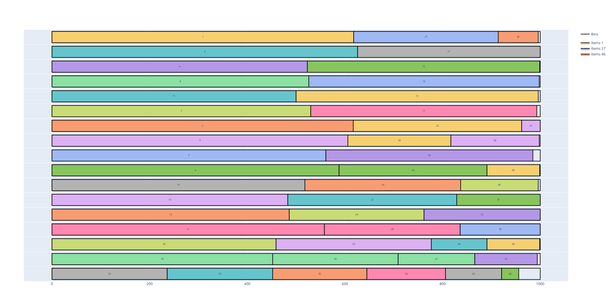
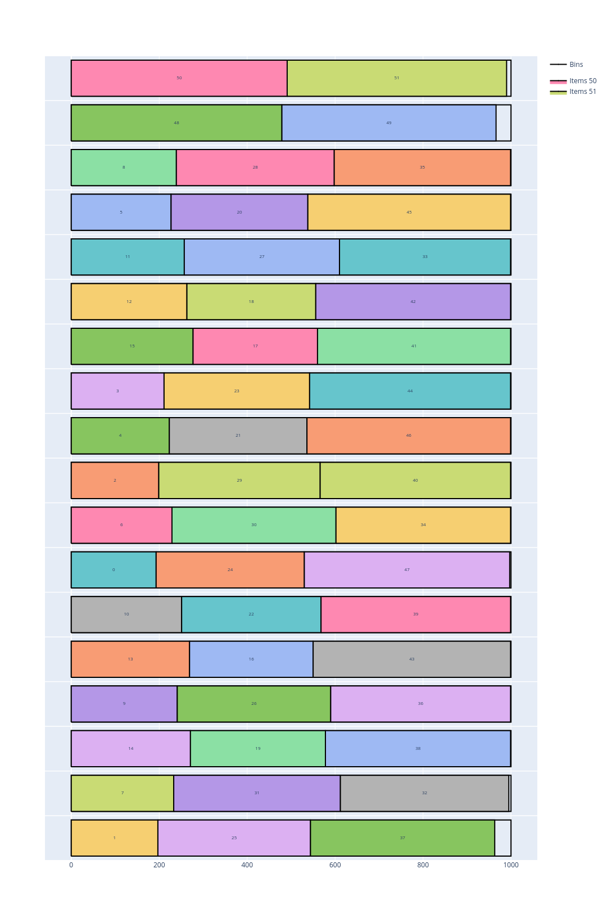

.. _onedimensional:

OneDimensional solver
=====================

The OneDimensional solver solves problems with one-dimensional items and bins.

These problems occur for example when cutting paper rolls, pipes, cables, steel bars; or when stacking parcels.

This dimension is called length here.

Features:

* Objectives:
  * Knapsack
  * Bin packing
  * Bin packing with leftovers
  * Variable-sized bin packing

* Nesting length between consecutive items

* Maximum number of items in a bin containing an item of a given type

* Maximum weight allowed after an item of a given type

* Maximum weight in bins

* Item type / bin type eligibility

Usage
-----

The OneDimensional solver takes as input:

* an item CSV file; option: ``--items items.csv`` 
* a bin CSV file; option: ``--bins bins.csv``
* a parameter CSV file; option: ``--parameters parameters.csv``

It outputs:

* a solution CSV file; option: ``--certificate solution.csv``

The **item file** contains:

* The dimension of the item type (**mandatory**)

  * column ``X`` 
  * **Integer value**

* The number of copies of the item type

  * column ``COPIES`` 
  * default value: ``1``

* The profit of an item of this type (for a knapsack objective)

  * column ``PROFIT`` 
  * default value: item length

The **bin file** contains:

* The dimension of the bin type (**mandatory**)

  * column ``X`` 
  * **Integer value**

* The number of copies of the bin type

  * column ``COPIES`` 
  * default value: ``1``

* The cost of a bin of this type (for a variable-sized bin packing objective)

  * column ``COST`` 
  * default value: bin length

The **parameter file** has two columns: ``NAME`` and ``VALUE``. The possible entries are:

* The objective; name: ``objective``; possible values:

  * ``knapsasck``
  * ``bin-packing``
  * ``bin-packing-with-leftovers``
  * ``variable-sized-bin-packing``

The output **certificate file** is a CSV file as well. Each line corresponds to either a bin - if the value in the ``TYPE`` column is ``BIN`` - or to an item of the solution - if the value in the ``TYPE`` column is ``ITEM``.

A line corresponding to a bin contains:

* The id of the bin type

  * Column ``ID``

* The number of copies of this bin in the solution

  * Column ``COPIES``

* The length of the bin (input)

  * Column ``X``

A line corresponding to an item contains:

* The id of the item type

  * Column ``ID``

* The starting length of the item

  * Column ``X``

* The length of the item (input)

  * Column ``LX``

Basic example
-------------

Inputs:

.. literalinclude:: examples/onedimensional/items.csv
   :caption: items.csv

.. literalinclude:: examples/onedimensional/bins.csv
   :caption: bins.csv

.. literalinclude:: examples/onedimensional/parameters.csv
   :caption: parameters.csv

Solve:

.. code-block:: shell

    packingsolver_onedimensional \
            --items items.csv \
            --bins bins.csv \
            --parameters parameters.csv \
            --certificate solution.csv

.. literalinclude:: examples/onedimensional/output.txt

.. literalinclude:: examples/onedimensional/solution.csv
   :caption: solution.csv

Visualize:

.. code-block:: shell

    python3 scripts/visualize_onedimensional.py solution.csv

Nesting length
--------------

Maximum number of items in a bin containing an item of a given type
-------------------------------------------------------------------

Maximum weight allowed after an item of a given type
----------------------------------------------------

Maximum weight in a bin
-----------------------

Item type / bin type eligibility
--------------------------------
