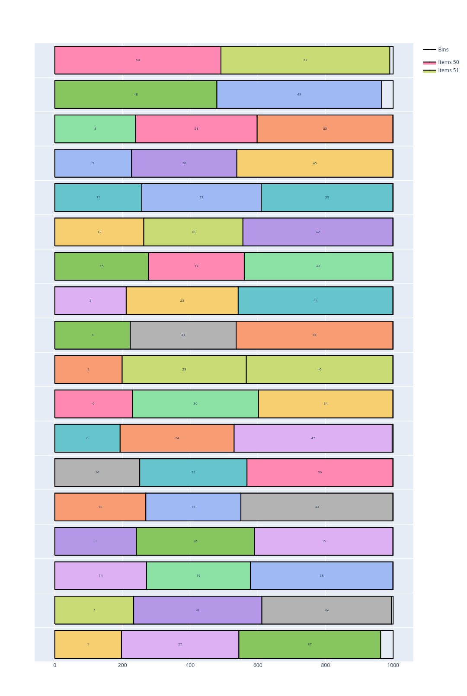
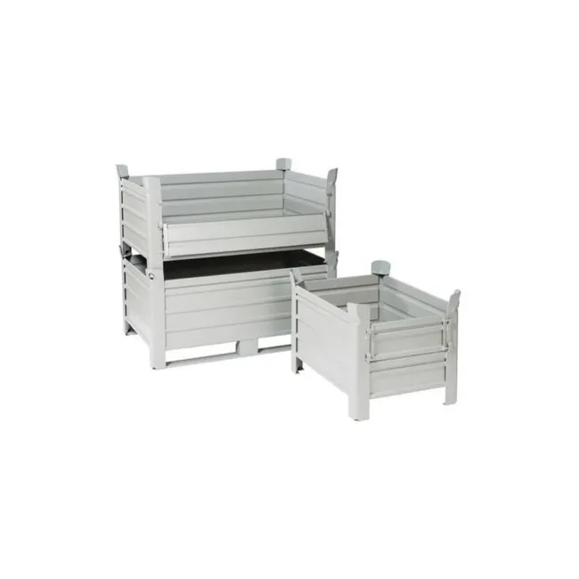
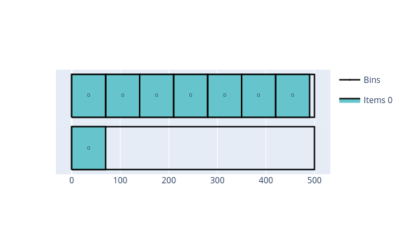
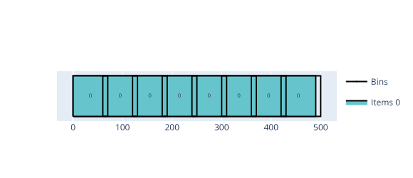
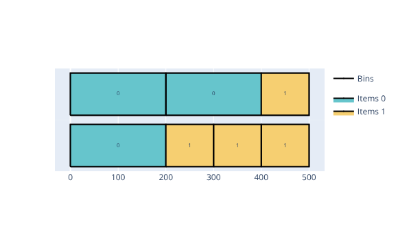
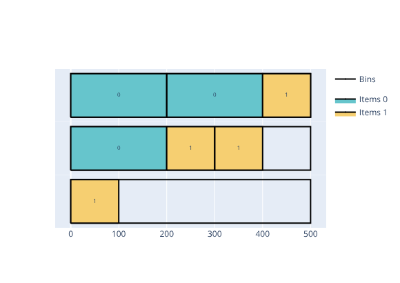
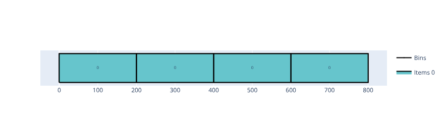
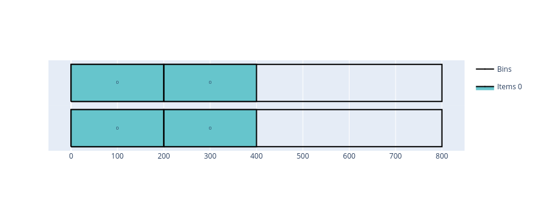
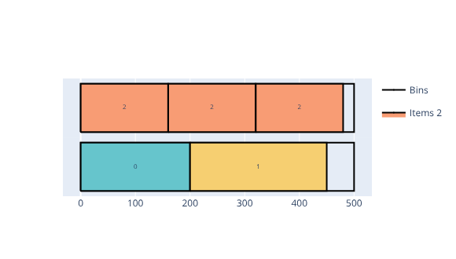
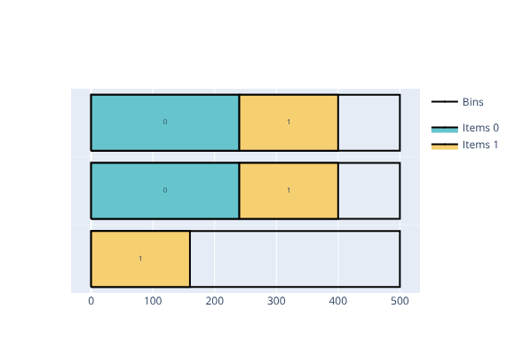

.. _onedimensional:

:code:`one-dimensional` solver
==============================

The :code:`one-dimensional` solver solves problems with one-dimensional items and bins.

.. image:: ../img/onedimensional.png
   :width: 512pt
   :align: center

These problems occur for example when cutting paper rolls, pipes, cables, steel bars; or when stacking parcels.

This dimension is called length here.

Features:

* Objectives:

  * Knapsack
  * Bin packing
  * Bin packing with leftovers
  * Variable-sized bin packing

* Nesting length between consecutive items

* Maximum number of items in a bin containing an item of a given type

* Maximum weight allowed after an item of a given type

* Maximum weight in bins

Basic usage
-----------

An instance is described in the JSON format below. The `online solver <https://packingsolver.pages.dev/>`_ downloads its instances in this format (**Download**) and loads them (**Load a JSON file**), the command-line solver reads them (``--input``), and the Python package and the C++ library read them with ``InstanceBuilder.read``. Instances can also be built directly with the ``InstanceBuilder`` of the Python package and of the C++ library.

In the following example, 52 items of different lengths are packed in bins of length 1000, using as few bins as possible:

.. example-tabs:: onedimensional/basic
   :solve:

The solution:

Instance format
^^^^^^^^^^^^^^^

An instance is a JSON object with the following fields:

.. list-table::
   :header-rows: 1
   :widths: 1 3

   * - Field
     - Description
   * - ``objective``
     - **Mandatory**. One of ``knapsack``, ``bin-packing``, ``bin-packing-with-leftovers``, ``variable-sized-bin-packing``; see :ref:`objectives`
   * - ``bin_types``
     - **Mandatory**. The bin types (array)
   * - ``item_types``
     - **Mandatory**. The item types (array)

A **bin type** has the following fields:

.. list-table::
   :header-rows: 1
   :widths: 1 3

   * - Field
     - Description
   * - ``length``
     - **Mandatory**. The length of the bins (integer)
   * - ``copies``
     - The number of copies of the bin type. Default: ``1``; ``-1`` for an unlimited number of copies
   * - ``copies_min``
     - The minimum number of copies of the bin type to use, for the variable-sized bin packing objective. Default: ``0``
   * - ``cost``
     - The cost of a bin of this type, for the variable-sized bin packing objective. Default: the length of the bin
   * - ``maximum_weight``
     - See :ref:`onedimensional-maximum-weight`. Default: no limit
   * - ``eligibility_ids``
     - The eligibility ids of the bin type (array): an item type with an eligibility id can only be packed in the bin types which have it. Default: none

An **item type** has the following fields:

.. list-table::
   :header-rows: 1
   :widths: 1 3

   * - Field
     - Description
   * - ``length``
     - **Mandatory**. The length of the items (integer)
   * - ``copies``
     - The number of copies of the item type. Default: ``1``; ``-1`` for an unlimited number of copies (knapsack objective only)
   * - ``copies_min``
     - The minimum number of copies of the item type to pack, for the knapsack objective. Default: ``0``
   * - ``profit``
     - The profit of an item of this type, for the knapsack objective. Default: the length of the item
   * - ``nesting_length``
     - See :ref:`onedimensional-nesting-length`. Default: ``0``
   * - ``maximum_stackability``
     - See :ref:`onedimensional-maximum-stackability`. Default: no limit
   * - ``weight``
     - See :ref:`onedimensional-maximum-weight`. Default: ``0``
   * - ``maximum_weight_after``
     - See :ref:`onedimensional-maximum-weight-after`. Default: no limit
   * - ``eligibility_id``
     - The eligibility id of the item type. Default: none (the items can be packed in any bin type)

In Python, the optional fields of the bin types and of the item types are keyword arguments of ``InstanceBuilder.add_bin_type`` and ``InstanceBuilder.add_item_type``, with the same names. In C++, they are set with the ``InstanceBuilder.set_bin_type_<field>`` and ``InstanceBuilder.set_item_type_<field>`` methods; the eligibility ids of a bin type are added with ``InstanceBuilder.add_bin_type_eligibility``, and the eligibility id of an item type is set with ``InstanceBuilder.set_item_type_eligibility``.

Certificate format
^^^^^^^^^^^^^^^^^^

The solution is written (command-line option ``--certificate``, ``Solution.write``) as a CSV file with the columns ``TYPE``, ``ID``, ``COPIES``, ``BIN``, ``X``, ``LX``. Each line is:

* a bin (``TYPE`` ``BIN``): ``ID`` is its bin type, ``COPIES`` the number of identical bins it stands for, ``BIN`` its index in the solution, and ``LX`` its length;
* an item (``TYPE`` ``ITEM``): ``ID`` is its item type, ``BIN`` the index of its bin, ``X`` the position of its start in the bin, and ``LX`` its length.

.. literalinclude:: examples/onedimensional/basic/solution.csv
   :caption: solution.csv
   :lines: 1-8

To visualize a solution, open it in the `solution viewer <https://packingsolver.pages.dev/viewer.html>`_, or run:

.. code-block:: shell

    python3 scripts/visualize.py solution.csv

.. _onedimensional-nesting-length:

Nesting length
--------------

In some cases, when two items are placed consecutively in a bin, the second item nests in the first one, which reduces the length it occupies. This length difference is called the nesting length of the second item.

The stackable crates above illustrate the idea: two of them nested (left) take up less length than twice the length of one alone (right), since the legs of the second crate sink into the one before it.

.. tab-set::
   :sync-group: interface

   .. tab-item:: Online solver
      :sync: web

      In the **Item types** table, click **More** on a row and fill its **Nesting length**.

   .. tab-item:: JSON
      :sync: json

      In an item type: ``"nesting_length": 10``.

   .. tab-item:: Python
      :sync: python

      ``instance_builder.add_item_type(length, nesting_length=10)``

   .. tab-item:: C++
      :sync: cpp

      ``instance_builder.set_item_type_nesting_length(item_type_id, 10);``

In the following example, 8 items of length 70 are packed in bins of length 500. Without nesting, they need a length of 560, so 2 bins are needed. With a nesting length of 10, every item but the first one occupies a length of 60: the 8 items need a length of 490, and fit in a single bin.

.. list-table::
   :widths: 1 1
   :header-rows: 1
   :align: center

   * - Without nesting length
     - With nesting length
   * - |oned_nesting_length_no|
     - |oned_nesting_length_yes|

.. example-tabs:: onedimensional/nesting_length_no onedimensional/nesting_length_yes

.. _onedimensional-maximum-stackability:

Maximum number of items in a bin containing an item of a given type
-------------------------------------------------------------------

For each item type, it is possible to limit the number of items in a bin that contains an item of this type. This limit is called the maximum stackability of the item type.

.. tab-set::
   :sync-group: interface

   .. tab-item:: Online solver
      :sync: web

      In the **Item types** table, click **More** on a row and fill its **Maximum stackability**.

   .. tab-item:: JSON
      :sync: json

      In an item type: ``"maximum_stackability": 3``.

   .. tab-item:: Python
      :sync: python

      ``instance_builder.add_item_type(length, maximum_stackability=3)``

   .. tab-item:: C++
      :sync: cpp

      ``instance_builder.set_item_type_maximum_stackability(item_type_id, 3);``

In the following example, 3 items of length 200 and 4 items of length 100 are packed in bins of length 500. Without a maximum stackability, they fit in 2 bins: 200 + 200 + 100 and 200 + 100 + 100 + 100. With a maximum stackability of 3 for the items of length 200, the second bin isn't valid anymore, and 3 bins are needed.

.. list-table::
   :widths: 1 1
   :header-rows: 1
   :align: center

   * - Without maximum stackability
     - With maximum stackability
   * - |oned_maximum_stackability_no|
     - |oned_maximum_stackability_yes|

.. example-tabs:: onedimensional/maximum_stackability_no onedimensional/maximum_stackability_yes

.. _onedimensional-maximum-weight:

Maximum total weight in a bin
-----------------------------

Each bin type may have a maximum weight: the total weight of the items packed in a bin must not exceed it.

.. tab-set::
   :sync-group: interface

   .. tab-item:: Online solver
      :sync: web

      Fill the **Weight** column of the **Item types** table, and the **Maximum weight** column of the **Bin types** table.

   .. tab-item:: JSON
      :sync: json

      In an item type: ``"weight": 100``; in a bin type: ``"maximum_weight": 200``.

   .. tab-item:: Python
      :sync: python

      ``instance_builder.add_item_type(length, weight=100)`` and ``instance_builder.add_bin_type(length, maximum_weight=200)``

   .. tab-item:: C++
      :sync: cpp

      ``instance_builder.set_item_type_weight(item_type_id, 100);`` and ``instance_builder.set_bin_type_maximum_weight(bin_type_id, 200);``

In the following example, 4 items of length 200 and of weight 100 are packed in bins of length 800. Without a maximum weight, they fit in a single bin. With a maximum weight of 200, at most 2 items can share a bin, so 2 bins are needed.

.. list-table::
   :widths: 1 1
   :header-rows: 1
   :align: center

   * - Without maximum weight
     - With maximum weight
   * - |oned_maximum_weight_no|
     - |oned_maximum_weight_yes|

.. example-tabs:: onedimensional/maximum_weight_no onedimensional/maximum_weight_yes

.. _onedimensional-maximum-weight-after:

Maximum weight allowed after an item of a given type
----------------------------------------------------

Each item type may have a maximum weight for the items packed after it in its bin. This corresponds to the maximum weight that an item can support when the items are stacked on each other.

.. tab-set::
   :sync-group: interface

   .. tab-item:: Online solver
      :sync: web

      In the **Item types** table, click **More** on a row and fill its **Maximum weight after**.

   .. tab-item:: JSON
      :sync: json

      In an item type: ``"maximum_weight_after": 150``.

   .. tab-item:: Python
      :sync: python

      ``instance_builder.add_item_type(length, maximum_weight_after=150)``

   .. tab-item:: C++
      :sync: cpp

      ``instance_builder.set_item_type_maximum_weight_after(item_type_id, 150);``

In the following example, 2 items of length 240 (weight 200) and 3 items of length 160 (weight 100) are packed in bins of length 500 (:code:`bin-packing-with-leftovers` objective). Without a limit, 2 bins are enough: one with the 2 items of length 240, the other with the 3 items of length 160. With a maximum weight after of 150 for the items of length 240, two of them can't share a bin anymore (an item of length 240 weighs 200), while an item of length 160 (weight 100) can still follow one. Each item of length 240 is then packed in its own bin with an item of length 160, and a third bin is needed for the last item of length 160.

.. list-table::
   :widths: 1 1
   :header-rows: 1
   :align: center

   * - Without maximum weight after
     - With maximum weight after
   * - |oned_maximum_weight_after_no|
     - |oned_maximum_weight_after_yes|

.. example-tabs:: onedimensional/maximum_weight_after_no onedimensional/maximum_weight_after_yes
