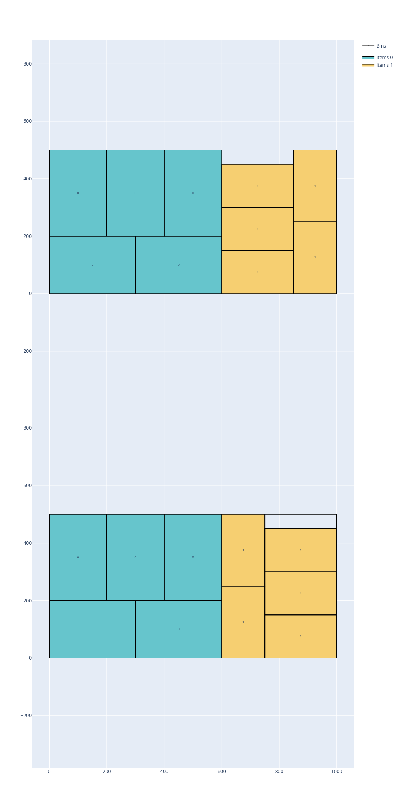
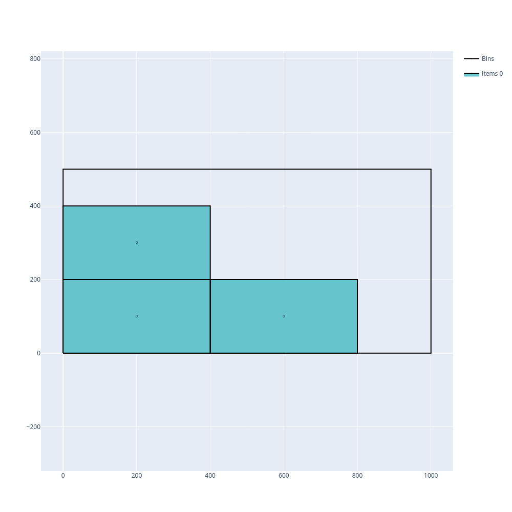
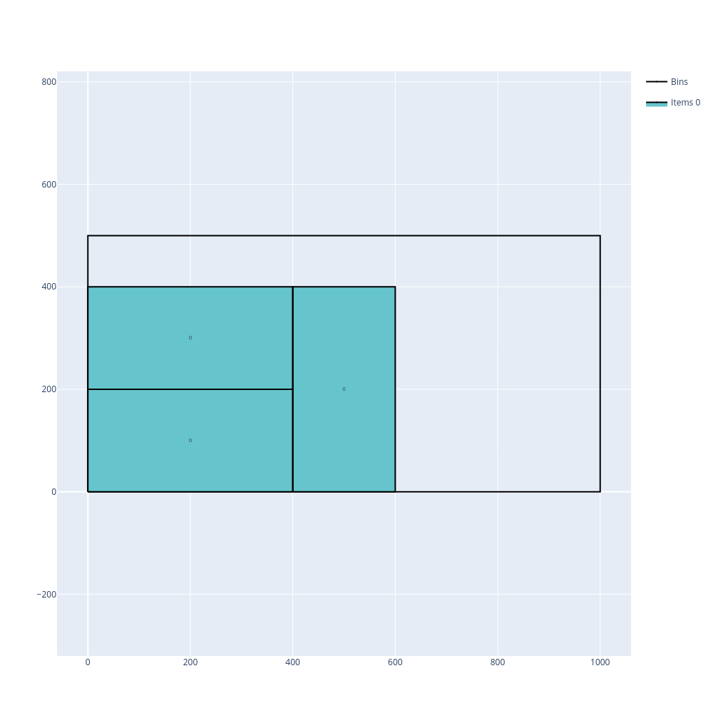
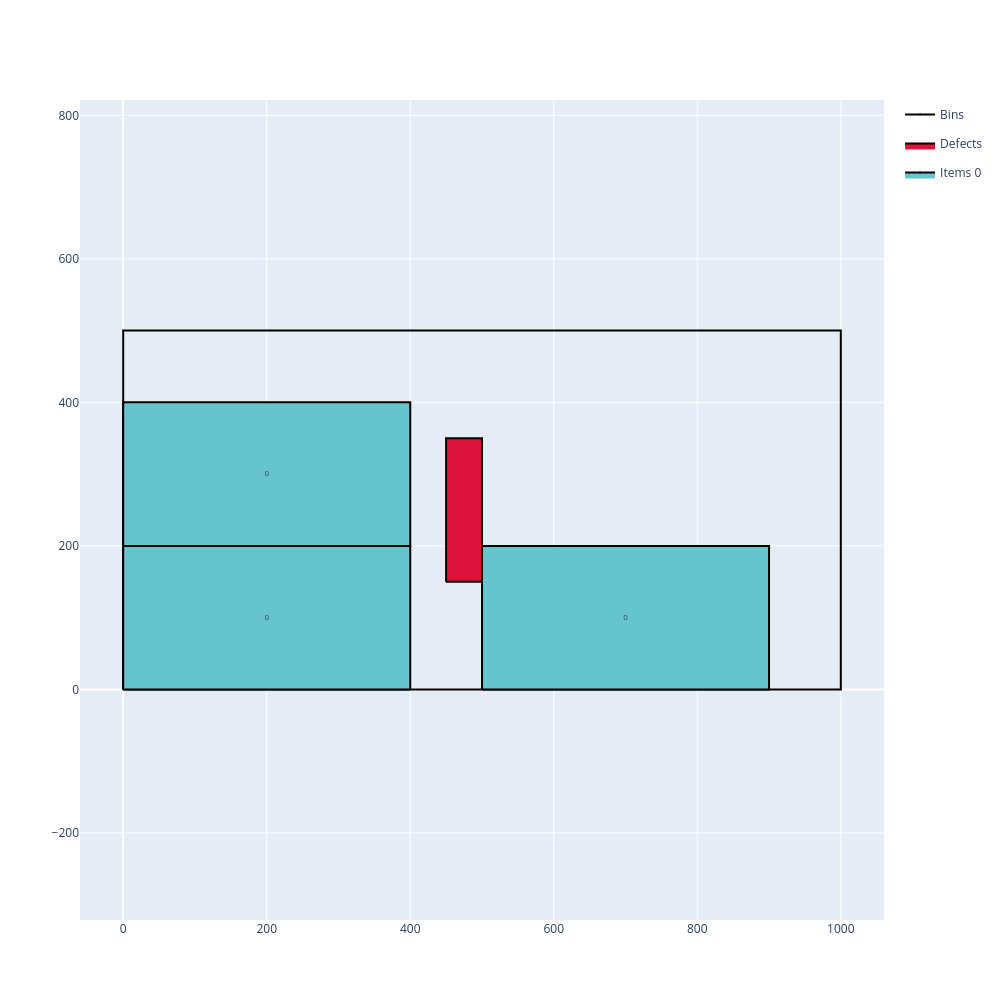
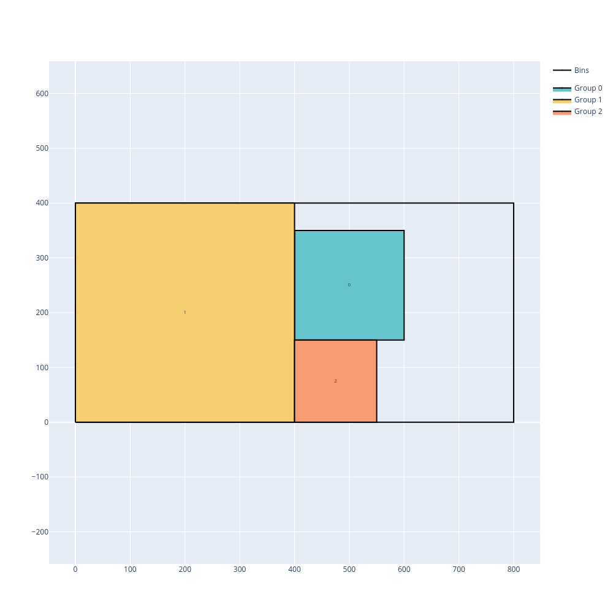
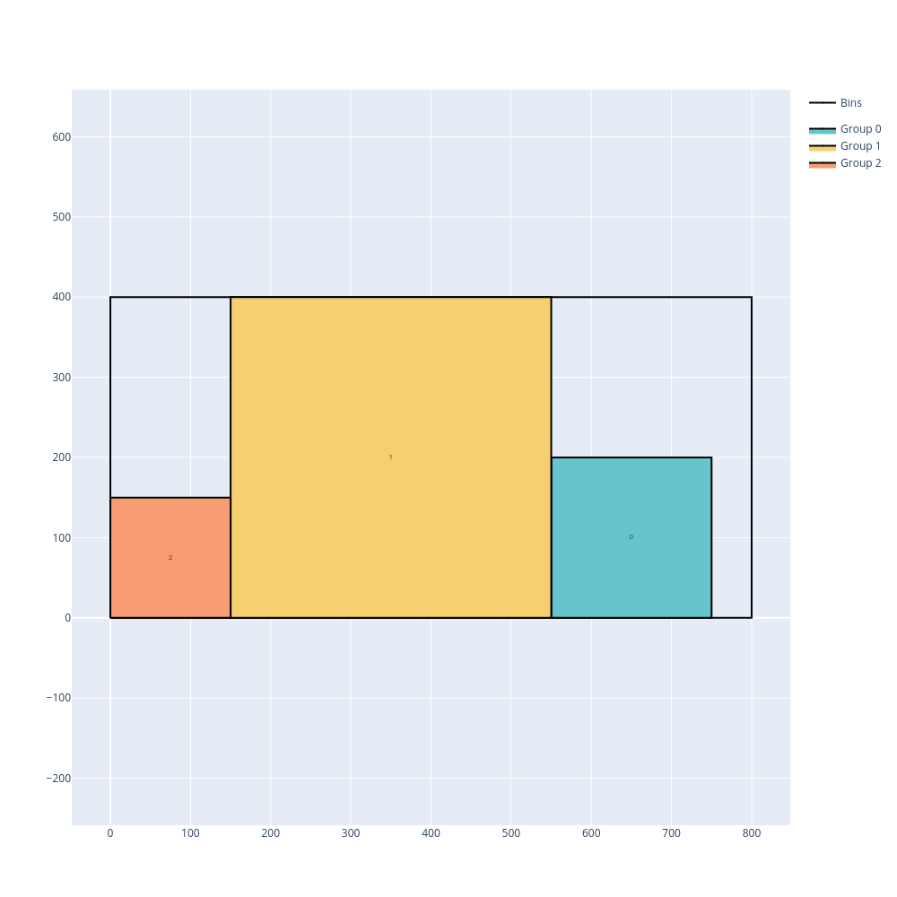
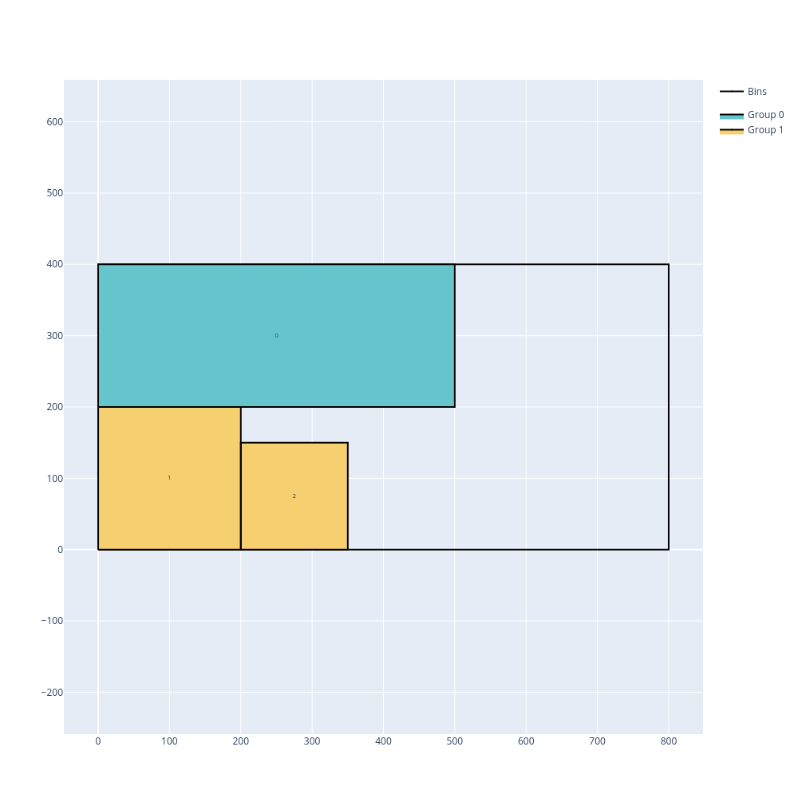
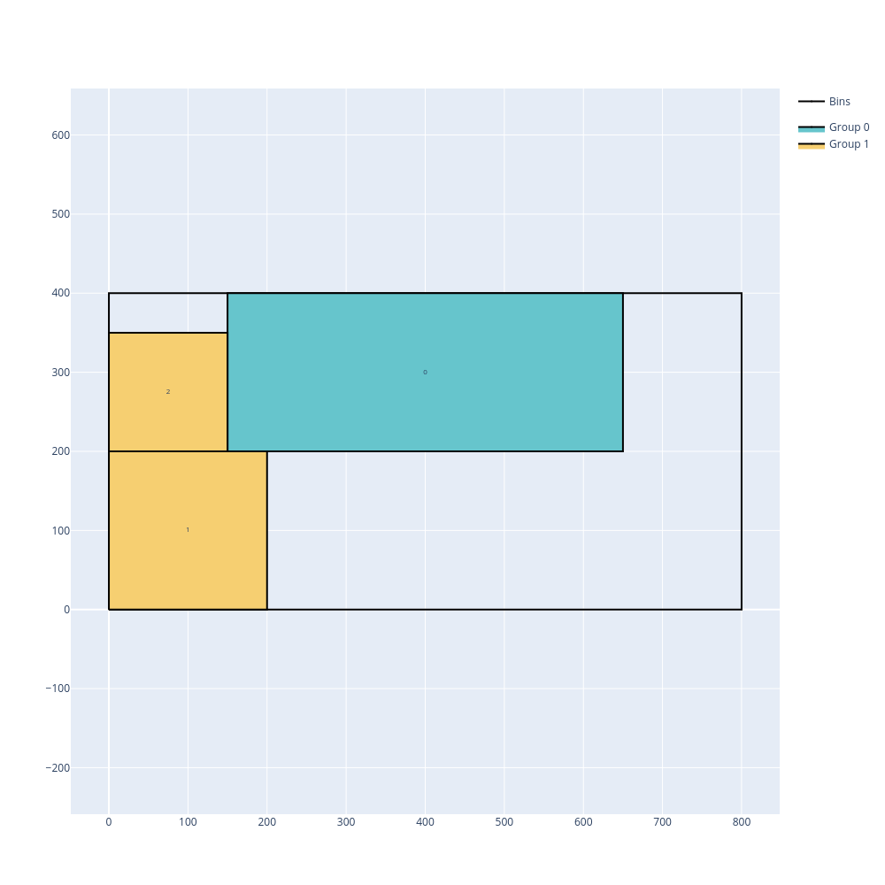

.. _rectangle:

Rectangle solver
================

The Rectangle solver solves problems where items are two-dimensional rectangles that must be packed into rectangular bins without overlapping. Unlike the :ref:`RectangleGuillotine<rectangleguillotine>` solver, items can be placed in any position (guillotine cuts are not required).

.. image:: ../img/rectangle.png
   :width: 512pt
   :align: center

These problems occur for example in logistics (palletizing), sheet-metal cutting, and warehousing.

Features:

* Objectives:

  * Knapsack
  * Bin packing
  * Bin packing with leftovers
  * Open dimension X
  * Open dimension Y
  * Variable-sized bin packing

* With or without item rotations

* Bins may contain defects

* Maximum weight in bins

* Unloading constraints: only horizontal/vertical movements, increasing x/y

Usage
-----

The Rectangle solver takes as input:

* an item CSV file; option: ``--items items.csv``
* a bin CSV file; option: ``--bins bins.csv``
* optionally a defect CSV file; option: ``--defects defects.csv``
* optionally a parameter CSV file; option: ``--parameters parameters.csv``

It outputs:

* a solution CSV file; option: ``--certificate solution.csv``

The **item file** contains:

* The width of the item type (**mandatory**)

  * column ``WIDTH``
  * **Integer value**

* The height of the item type (**mandatory**)

  * column ``HEIGHT``
  * **Integer value**

* The number of copies of the item type

  * column ``COPIES``
  * default value: ``1``

* Whether the item is fixed in its original orientation (cannot be rotated 90°)

  * column ``ORIENTED``
  * ``0``: rotation allowed (default)
  * ``1``: item is oriented; rotation not allowed

* The profit of an item of this type (for a knapsack objective)

  * column ``PROFIT``
  * default value: item area (``WIDTH * HEIGHT``)

* The group of the item (for unloading constraints)

  * column ``GROUP_ID``
  * default value: ``0``

* The weight of the item

  * column ``WEIGHT``
  * default value: ``0``

The **bin file** contains:

* The width of the bin type (**mandatory**)

  * column ``WIDTH``
  * **Integer value**

* The height of the bin type (**mandatory**)

  * column ``HEIGHT``
  * **Integer value**

* The number of copies of the bin type

  * column ``COPIES``
  * default value: ``1``

* The minimum number of copies of the bin type that must be used

  * column ``COPIES_MIN``
  * default value: ``0``

* The cost of a bin of this type (for a variable-sized bin packing objective)

  * column ``COST``
  * default value: bin area (``WIDTH * HEIGHT``)

* The maximum total weight that can be placed in a bin of this type

  * column ``MAXIMUM_WEIGHT``
  * default value: no limit

The **defect file** contains:

* The bin type that contains the defect (**mandatory**)

  * column ``BIN``
  * It refers to the bin type by its position (0-indexed) in the bins file

* The X coordinate of the bottom-left corner of the defect (**mandatory**)

  * column ``X``
  * **Integer value**

* The Y coordinate of the bottom-left corner of the defect (**mandatory**)

  * column ``Y``
  * **Integer value**

* The width of the defect (**mandatory**)

  * column ``WIDTH``
  * **Integer value**

* The height of the defect (**mandatory**)

  * column ``HEIGHT``
  * **Integer value**

The **parameter file** has two columns: ``NAME`` and ``VALUE``. The possible entries are:

* The objective; name: ``objective``; possible values:

  * ``knapsack``
  * ``bin-packing``
  * ``bin-packing-with-leftovers``
  * ``open-dimension-x``
  * ``open-dimension-y``
  * ``open-dimension-xy``
  * ``variable-sized-bin-packing``

* The unloading constraint; name: ``unloading_constraint``; possible values:

  * ``none`` (default)
  * ``only-x-movements``
  * ``only-y-movements``
  * ``increasing-x``
  * ``increasing-y``

Basic example
-------------

Inputs:

.. literalinclude:: examples/rectangle/items.csv
   :caption: items.csv

.. literalinclude:: examples/rectangle/bins.csv
   :caption: bins.csv

.. literalinclude:: examples/rectangle/parameters.csv
   :caption: parameters.csv

Solve:

.. code-block:: shell

    packingsolver_rectangle \
            --items items.csv \
            --bins bins.csv \
            --parameters parameters.csv \
            --certificate solution.csv

.. literalinclude:: examples/rectangle/output.txt

Visualize:

.. code-block:: shell

    python3 scripts/visualize_rectangle.py solution.csv

Rotation
--------

Item 90° rotation may be enabled or disabled for each item by setting the ``ORIENTED`` column to ``0`` (no rotation alllowed) or to ``1`` (rotation allowed) in the item CSV file.

By default, item rotation is allowed.

The following example packs 3 items of size 400×200 into a 1000×500 bin. Without rotation, the items occupy an 800×400 region and leave a narrow leftover. With rotation, one item is placed at 200×400, allowing all three to pack into a compact 600×400 region and leaving a larger leftover.

.. list-table::
   :widths: 1 1
   :header-rows: 1
   :align: center

   * - Without rotation
     - With rotation
   * - .. literalinclude:: examples/rectangle/rotation_no/items.csv
          :caption: items.csv
     - .. literalinclude:: examples/rectangle/rotation_yes/items.csv
          :caption: items.csv
   * - .. literalinclude:: examples/rectangle/rotation_no/bins.csv
          :caption: bins.csv
     - .. literalinclude:: examples/rectangle/rotation_yes/bins.csv
          :caption: bins.csv
   * - .. literalinclude:: examples/rectangle/rotation_no/parameters.csv
          :caption: parameters.csv
     - .. literalinclude:: examples/rectangle/rotation_yes/parameters.csv
          :caption: parameters.csv
   * - .. code-block:: shell

            packingsolver_rectangle \
                    --items items.csv \
                    --bins bins.csv \
                    --parameters parameters.csv \
                    --certificate solution.csv
     - .. code-block:: shell

            packingsolver_rectangle \
                    --items items.csv \
                    --bins bins.csv \
                    --parameters parameters.csv \
                    --certificate solution.csv
   * - |rect_rotation_no|
     - |rect_rotation_yes|

Defects
-------

Defects are rectangular regions inside a bin where items cannot be placed. They are specified in the defects CSV file (see above).

The following example packs 3 items of size 400×200 into a 1000×500 bin. Without defects, the items fill a compact L-shaped region. With a 200×300 defect at position (450, 150), the item that would naturally sit there is pushed further right, reducing the leftover.

.. |rect_defects_no| image:: img/rectangle_defects_no.png
   :width: 100%

.. list-table::
   :widths: 1 1
   :header-rows: 1
   :align: center

   * - Without defects
     - With defects
   * - .. literalinclude:: examples/rectangle/defects_no/items.csv
          :caption: items.csv
     - .. literalinclude:: examples/rectangle/defects_yes/items.csv
          :caption: items.csv
   * - .. literalinclude:: examples/rectangle/defects_no/bins.csv
          :caption: bins.csv
     - .. literalinclude:: examples/rectangle/defects_yes/bins.csv
          :caption: bins.csv
   * - .. literalinclude:: examples/rectangle/defects_no/parameters.csv
          :caption: parameters.csv
     - .. literalinclude:: examples/rectangle/defects_yes/parameters.csv
          :caption: parameters.csv
   * -
     - .. literalinclude:: examples/rectangle/defects_yes/defects.csv
          :caption: defects.csv
   * - .. code-block:: shell

            packingsolver_rectangle \
                    --items items.csv \
                    --bins bins.csv \
                    --parameters parameters.csv \
                    --certificate solution.csv
     - .. code-block:: shell

            packingsolver_rectangle \
                    --items items.csv \
                    --bins bins.csv \
                    --defects defects.csv \
                    --parameters parameters.csv \
                    --certificate solution.csv
   * - |rect_defects_no|
     - |rect_defects_yes|

Unloading constraints
---------------------

When loading a truck that visits multiple loading/unloading locations, it might be necessary to be able to load/unload the items at a location without having to move the items which are already in the truck.

This is modeled in the solver with unloading constraints. Items are assigned to groups via the ``GROUP_ID`` column: items in group 0 are placed last (nearest the door) and unloaded first, items in group 1 are placed next, etc.

In the following examples, without unloading constraints, all items fit using a width of 600. But with unloading constraints, a width of 750 is necessary.

.. list-table::
   :widths: 1 1
   :header-rows: 1
   :align: center

   * - No constraint
     - ``With unloading constraints``
   * - .. literalinclude:: examples/rectangle/unloading_no/items.csv
          :caption: items.csv
     - .. literalinclude:: examples/rectangle/unloading_yes/items.csv
          :caption: items.csv
   * - .. literalinclude:: examples/rectangle/unloading_no/bins.csv
          :caption: bins.csv
     - .. literalinclude:: examples/rectangle/unloading_yes/bins.csv
          :caption: bins.csv
   * - .. literalinclude:: examples/rectangle/unloading_no/parameters.csv
          :caption: parameters.csv
     - .. literalinclude:: examples/rectangle/unloading_yes/parameters.csv
          :caption: parameters.csv
   * - .. code-block:: shell

            packingsolver_rectangle \
                    --items items.csv \
                    --bins bins.csv \
                    --parameters parameters.csv \
                    --certificate solution.csv
     - .. code-block:: shell

            packingsolver_rectangle \
                    --items items.csv \
                    --bins bins.csv \
                    --parameters parameters.csv \
                    --certificate solution.csv
   * - |rect_unloading_no|
     - |rect_unloading_yes|

Two types of unloading constraints are available:

* ``only-x-movements``: items can only be moved out along the X axis; therefore, within each horizontal row, no item from a later group may be positioned to the right of an item from an earlier group
* ``only-y-movements``: same along the Y axis
* ``increasing-x``: all items from group 0 have a greater X coordinate than all items from group 1, which in turn have a greater X coordinate than all items from group 2, etc.
* ``increasing-y``: same along the Y axis

In the following examples, two different solutions are obtained depending of the type of unloading constraint.

.. list-table::
   :widths: 1 1
   :header-rows: 1
   :align: center

   * - ``only-x-movements``
     - ``increasing-x``
   * - .. literalinclude:: examples/rectangle/unloading_x_movements/items.csv
          :caption: items.csv
     - .. literalinclude:: examples/rectangle/unloading_increasing_x/items.csv
          :caption: items.csv
   * - .. literalinclude:: examples/rectangle/unloading_x_movements/bins.csv
          :caption: bins.csv
     - .. literalinclude:: examples/rectangle/unloading_increasing_x/bins.csv
          :caption: bins.csv
   * - .. literalinclude:: examples/rectangle/unloading_x_movements/parameters.csv
          :caption: parameters.csv
     - .. literalinclude:: examples/rectangle/unloading_increasing_x/parameters.csv
          :caption: parameters.csv
   * - .. code-block:: shell

            packingsolver_rectangle \
                    --items items.csv \
                    --bins bins.csv \
                    --parameters parameters.csv \
                    --certificate solution.csv
     - .. code-block:: shell

            packingsolver_rectangle \
                    --items items.csv \
                    --bins bins.csv \
                    --parameters parameters.csv \
                    --certificate solution.csv
   * - |rect_unloading_x_movements|
     - |rect_unloading_increasing_x|
