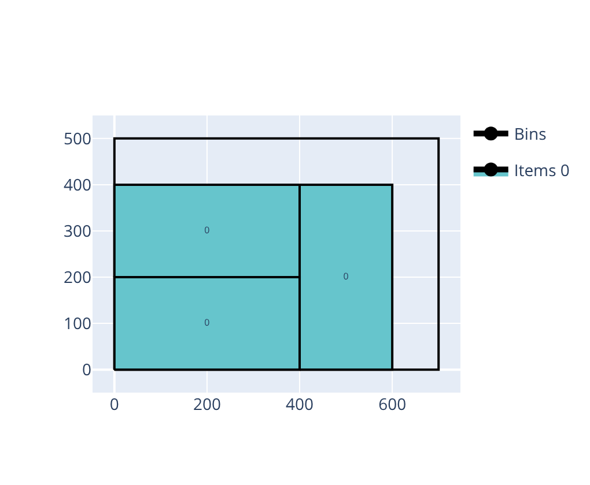
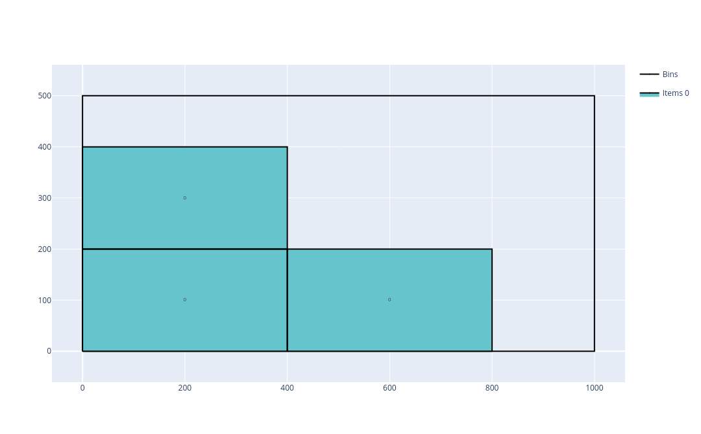
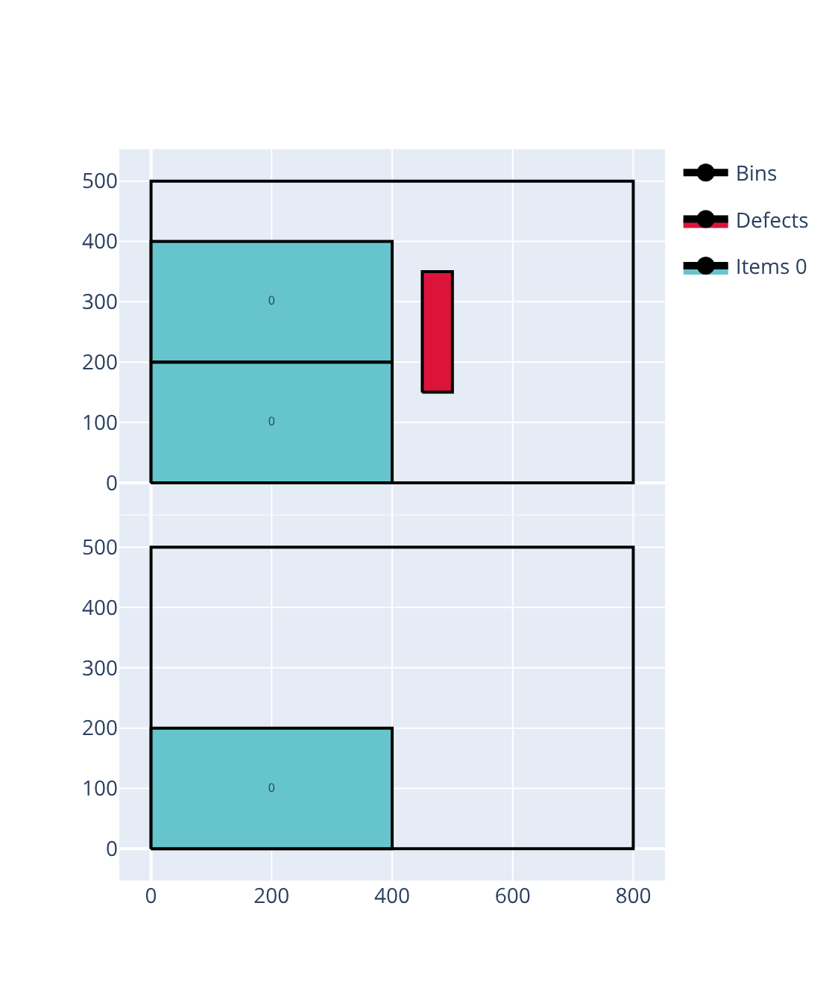
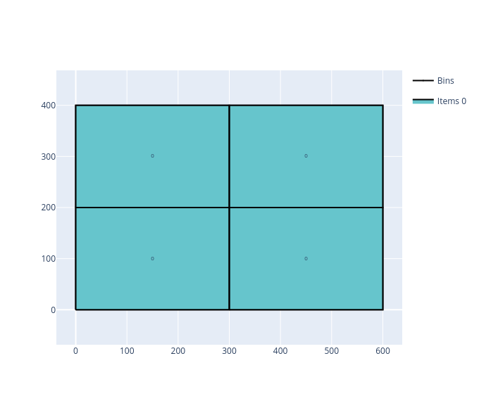
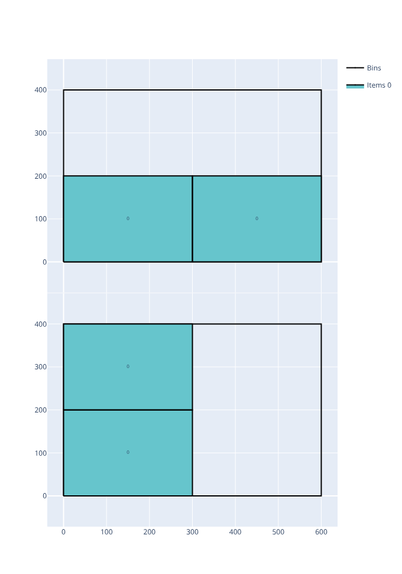
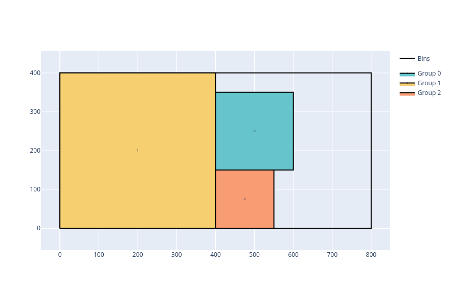
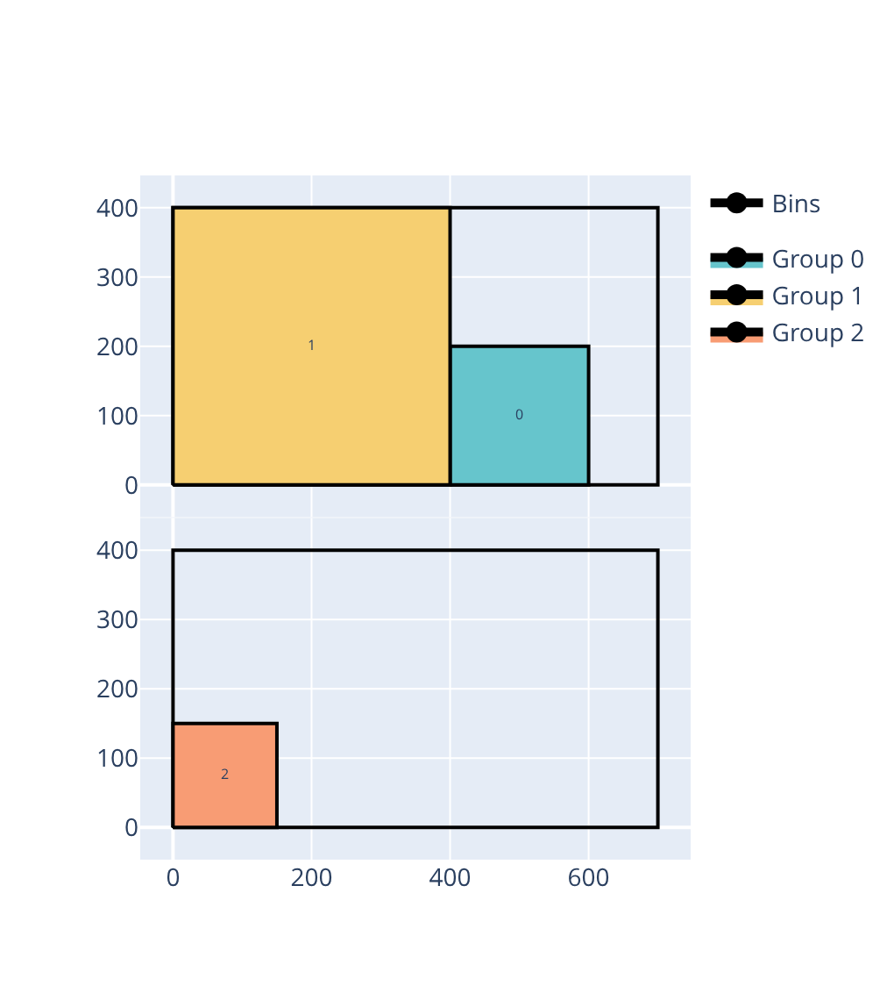
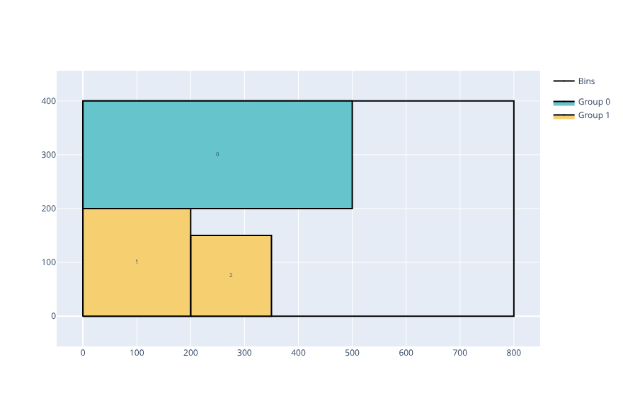
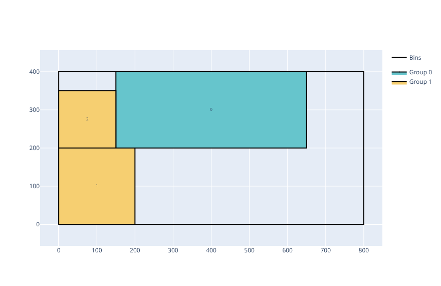

.. _rectangle:

:code:`rectangle` solver
========================

The :code:`rectangle` solver solves problems where items are two-dimensional rectangles that must be packed into rectangular bins without overlapping. Unlike the :ref:`rectangle-guillotine<rectangleguillotine>` solver, items can be placed in any position (guillotine cuts are not required).

.. image:: ../img/rectangle.png
   :width: 512pt
   :align: center

These problems occur for example in logistics (palletizing), sheet-metal cutting, and warehousing.

Features:

* Objectives:

  * Knapsack
  * Bin packing
  * Bin packing with leftovers
  * Open dimension X
  * Open dimension Y
  * Variable-sized bin packing

* With or without item rotations

* Bins may contain defects

* Maximum weight in bins

* Unloading constraints: only horizontal/vertical movements, increasing x/y

Basic usage
-----------

An instance is described in the JSON format below. The `online solver <https://packingsolver.pages.dev/>`_ downloads its instances in this format (**Download**) and loads them (**Load a JSON file**), the command-line solver reads them (``--input``), and the Python package and the C++ library read them with ``InstanceBuilder.read``. Instances can also be built directly with the ``InstanceBuilder`` of the Python package and of the C++ library.

In the following example, the items of two item types are packed in bins of size 1000 × 500, using as few bins as possible, and then maximizing the leftover of the last bin:

.. example-tabs:: rectangle/basic
   :solve:

The solution:

.. image:: img/rectangle_example_solution.png
   :width: 512pt
   :align: center

Instance format
^^^^^^^^^^^^^^^

An instance is a JSON object with the following fields:

.. list-table::
   :header-rows: 1
   :widths: 1 3

   * - Field
     - Description
   * - ``objective``
     - **Mandatory**. One of ``knapsack``, ``bin-packing``, ``bin-packing-with-leftovers``, ``open-dimension-x``, ``open-dimension-y``, ``variable-sized-bin-packing``; see :ref:`objectives`
   * - ``leftover_mode``
     - How the leftover of the last bin is measured, for the ``bin-packing-with-leftovers`` objective: ``area`` (default; the area of the bin minus the area of the rectangle containing its items), ``x`` (the width of the bin on the right of the items, times the height of the bin), or ``y`` (the height of the bin above the items, times the width of the bin)
   * - ``unloading_constraint``
     - See :ref:`rectangle-unloading-constraints`. Default: ``none``
   * - ``bin_types``
     - **Mandatory**. The bin types (array)
   * - ``item_types``
     - **Mandatory**. The item types (array)

A **bin type** has the following fields:

.. list-table::
   :header-rows: 1
   :widths: 1 3

   * - Field
     - Description
   * - ``x``, ``y``
     - **Mandatory**. The width and the height of the bins (integers)
   * - ``copies``
     - The number of copies of the bin type. Default: ``1``; ``-1`` for an unlimited number of copies
   * - ``copies_min``
     - The minimum number of copies of the bin type to use, for the variable-sized bin packing objective. Default: ``0``
   * - ``cost``
     - The cost of a bin of this type, for the variable-sized bin packing objective. Default: the area of the bin
   * - ``maximum_weight``
     - See :ref:`rectangle-maximum-weight`. Default: no limit
   * - ``eligibility_ids``
     - The eligibility ids of the bin type (array): an item type with an eligibility id can only be packed in the bin types which have it. Default: none
   * - ``defects``
     - See :ref:`rectangle-defects`. Default: none

An **item type** has the following fields:

.. list-table::
   :header-rows: 1
   :widths: 1 3

   * - Field
     - Description
   * - ``x``, ``y``
     - **Mandatory**. The width and the height of the items (integers)
   * - ``copies``
     - The number of copies of the item type. Default: ``1``; ``-1`` for an unlimited number of copies (knapsack objective only)
   * - ``copies_min``
     - The minimum number of copies of the item type to pack, for the knapsack objective. Default: ``0``
   * - ``profit``
     - The profit of an item of this type, for the knapsack objective. Default: the area of the item
   * - ``oriented``
     - See :ref:`rectangle-item-rotations`. Default: ``false``
   * - ``weight``
     - See :ref:`rectangle-maximum-weight`. Default: ``0``
   * - ``group_id``
     - See :ref:`rectangle-unloading-constraints`. Default: ``0``
   * - ``eligibility_id``
     - The eligibility id of the item type. Default: none (the items can be packed in any bin type)

In Python, the optional fields of the bin types and of the item types are keyword arguments of ``InstanceBuilder.add_bin_type`` and ``InstanceBuilder.add_item_type``, with the same names. In C++, they are set with the ``InstanceBuilder.set_bin_type_<field>`` and ``InstanceBuilder.set_item_type_<field>`` methods; the examples below show the exceptions.

Certificate format
^^^^^^^^^^^^^^^^^^

The solution is written (command-line option ``--certificate``, ``Solution.write``) as a CSV file with the columns ``TYPE``, ``ID``, ``COPIES``, ``BIN``, ``X``, ``Y``, ``LX``, ``LY``, ``GROUP_ID``. Each line is:

* a bin (``TYPE`` ``BIN``): ``ID`` is its bin type, ``COPIES`` the number of identical bins it stands for, ``BIN`` its index in the solution, and ``LX``, ``LY`` its width and its height;
* a defect of a bin (``TYPE`` ``DEFECT``): ``ID`` is its index in its bin type, ``BIN`` the index of its bin, ``X``, ``Y`` the position of its bottom-left corner, and ``LX``, ``LY`` its width and its height;
* an item (``TYPE`` ``ITEM``): ``ID`` is its item type, ``BIN`` the index of its bin, ``X``, ``Y`` the position of its bottom-left corner, ``LX``, ``LY`` its width and its height once placed (exchanged if it is rotated), and ``GROUP_ID`` the group of its item type.

.. literalinclude:: examples/rectangle/basic/solution.csv
   :caption: solution.csv
   :lines: 1-8

To visualize a solution, open it in the `solution viewer <https://packingsolver.pages.dev/viewer.html>`_, or run:

.. code-block:: shell

    python3 scripts/visualize.py solution.csv

.. _rectangle-item-rotations:

Item rotations
--------------

By default, the items may be rotated by 90°. An item type can be fixed in its original orientation:

.. tab-set::
   :sync-group: interface

   .. tab-item:: Online solver
      :sync: web

      In the **Item types** table, check **Oriented**.

   .. tab-item:: JSON
      :sync: json

      In an item type: ``"oriented": true``.

   .. tab-item:: Python
      :sync: python

      ``instance_builder.add_item_type(x, y, oriented=True)``

   .. tab-item:: C++
      :sync: cpp

      ``instance_builder.add_item_type(x, y, true);``

In the following example, 3 items of size 400 × 200 are packed in bins of size 700 × 500. When the items are oriented, at most 2 items fit in a bin, so 2 bins are needed. When they can be rotated, the third item is rotated and placed next to the other two, in the first bin.

.. |rect_rotation_no| image:: img/rectangle_rotation_no.png
   :scale: 50%

.. list-table::
   :widths: 1 1
   :header-rows: 1
   :align: center

   * - Oriented items
     - Items which can be rotated
   * - |rect_rotation_no|
     - |rect_rotation_yes|

.. example-tabs:: rectangle/rotation_no rectangle/rotation_yes

.. _rectangle-defects:

Defects
-------

Defects are rectangular regions of a bin where items cannot be placed. A defect is given by the position of its bottom-left corner (``x``, ``y``) and by its size (``width``, ``height``):

.. tab-set::
   :sync-group: interface

   .. tab-item:: Online solver
      :sync: web

      In the **Bin types** table, click **Add a defect** below a bin type, and fill its position (**X**, **Y**) and its size (**W**, **H**).

   .. tab-item:: JSON
      :sync: json

      In a bin type: ``"defects": [{"x": 450, "y": 150, "width": 50, "height": 200}]``.

   .. tab-item:: Python
      :sync: python

      ``instance_builder.add_defect(bin_type_id, x, y, width, height)``, where ``bin_type_id`` is returned by ``add_bin_type``.

   .. tab-item:: C++
      :sync: cpp

      ``instance_builder.add_defect(bin_type_id, x, y, width, height);``, where ``bin_type_id`` is returned by ``add_bin_type``.

In the following example, 3 oriented items of size 400 × 200 are packed in two bins of size 800 × 500. Without defects, the 3 items fit in the first bin. With a 50 × 200 defect at position (450, 150) in the first bin, only 2 items fit in it, and the third one is packed in the second bin.

.. list-table::
   :widths: 1 1
   :header-rows: 1
   :align: center

   * - Without defects
     - With a defect
   * - |rect_defects_no|
     - |rect_defects_yes|

.. example-tabs:: rectangle/defects_no rectangle/defects_yes

.. _rectangle-maximum-weight:

Maximum total weight in a bin
-----------------------------

Each bin type may have a maximum weight: the total weight of the items packed in a bin must not exceed it.

.. tab-set::
   :sync-group: interface

   .. tab-item:: Online solver
      :sync: web

      Fill the **Weight** column of the **Item types** table, and the **Maximum weight** column of the **Bin types** table.

   .. tab-item:: JSON
      :sync: json

      In an item type: ``"weight": 100``; in a bin type: ``"maximum_weight": 200``.

   .. tab-item:: Python
      :sync: python

      ``instance_builder.add_item_type(x, y, weight=100)`` and ``instance_builder.add_bin_type(x, y, maximum_weight=200)``

   .. tab-item:: C++
      :sync: cpp

      ``instance_builder.set_item_type_weight(item_type_id, 100);`` and ``instance_builder.set_bin_type_maximum_weight(bin_type_id, 200);``

In the following example, 4 items of size 300 × 200 and of weight 100 are packed in bins of size 600 × 400. Without a maximum weight, the 4 items (total weight 400) fit in a single bin. With a maximum weight of 200, at most 2 items can share a bin, so 2 bins are needed.

.. list-table::
   :widths: 1 1
   :header-rows: 1
   :align: center

   * - Without maximum weight
     - With maximum weight
   * - |rect_maximum_weight_no|
     - |rect_maximum_weight_yes|

.. example-tabs:: rectangle/maximum_weight_no rectangle/maximum_weight_yes

.. _rectangle-unloading-constraints:

Unloading constraints
---------------------

When loading a truck that visits multiple locations, it might be necessary to unload the items at a location without moving the items which are still in the truck.
This is modeled with unloading constraints. Items are assigned to groups: the items of group 0 are unloaded first, then the items of group 1, etc.

.. tab-set::
   :sync-group: interface

   .. tab-item:: Online solver
      :sync: web

      Choose the **Unloading constraint** below the objective. Then, in the **Item types** table, click **More** on a row and fill its **Group**.

   .. tab-item:: JSON
      :sync: json

      In the instance: ``"unloading_constraint": "only-x-movements"``; in an item type: ``"group_id": 1``.

   .. tab-item:: Python
      :sync: python

      ``instance_builder.set_unloading_constraint(psr.UnloadingConstraint.OnlyXMovements)`` and ``instance_builder.add_item_type(x, y, group_id=1)``

   .. tab-item:: C++
      :sync: cpp

      ``instance_builder.set_unloading_constraint(UnloadingConstraint::OnlyXMovements);`` and ``instance_builder.set_item_type_group(item_type_id, 1);``

4 types of unloading constraints are available:

* ``only-x-movements``: the items are unloaded by moving them along the X axis, towards the right of the bin: no item of a later group may be on the right of an item of an earlier group which it overlaps vertically
* ``only-y-movements``: same along the Y axis, towards the top of the bin
* ``increasing-x``: the bottom-left corners of the items of group 0 have greater X coordinates than those of the items of group 1, which have greater X coordinates than those of the items of group 2, etc.
* ``increasing-y``: same along the Y axis

In the following example, 3 items of groups 0, 1 and 2 are packed in bins of size 700 × 400. Without unloading constraints, the 3 items fit in a single bin. With the ``only-x-movements`` unloading constraint, the item of group 2 can't stay on the right of the item of group 1, so 2 bins are needed.

.. list-table::
   :widths: 1 1
   :header-rows: 1
   :align: center

   * - Without unloading constraints
     - ``only-x-movements``
   * - |rect_unloading_no|
     - |rect_unloading_yes|

.. example-tabs:: rectangle/unloading_no rectangle/unloading_yes

In the following example, the open dimension X objective gives different solutions for the ``only-x-movements`` and ``increasing-x`` unloading constraints. With ``only-x-movements``, the items of group 1 can be below the item of group 0, and a width of 500 is enough. With ``increasing-x``, the bottom-left corner of the item of group 0 must be on the right of those of the items of group 1, and a width of 650 is needed.

.. list-table::
   :widths: 1 1
   :header-rows: 1
   :align: center

   * - ``only-x-movements``
     - ``increasing-x``
   * - |rect_unloading_x_movements|
     - |rect_unloading_increasing_x|

.. example-tabs:: rectangle/unloading_x_movements rectangle/unloading_increasing_x
