.. _rectangleguillotine:

:code:`rectangle-guillotine` solver
===================================

The :code:`rectangle-guillotine` solver solves problems where items are two-dimensional rectangles that must be cut from rectangular bins using **guillotine cuts** — cuts that go all the way from one side of the current plate to the other.

.. image:: ../img/rectangleguillotine.png
   :width: 512pt
   :align: center

These problems occur for example in glass cutting, wooden panel cutting, and paper cutting industries.

Features:

* Objectives:

  * Knapsack
  * Bin packing
  * Bin packing with leftovers
  * Open dimension X
  * Open dimension Y
  * Variable-sized bin packing

* Item types

  * Item rotation (90°)
  * Stacks (items that must stay grouped)

* Bin types

  * Trims (border offsets on each side)
  * Rectangular defects

* Cutting constraints

  * Number of cutting stages
  * Cut type (Roadef2018, NonExact, Exact, Homogenous)
  * First stage orientation (horizontal or vertical)
  * Minimum and maximum distances between cuts
  * Maximum number of consecutive 1-cuts
  * Maximum number of consecutive 2-cuts
  * Cut thickness

Guillotine vs non-guillotine patterns
-----------------------------------------

A cutting pattern is a **guillotine pattern** if it can be produced by a sequence of straight cuts, each going all the way from one edge of the current plate to the opposite edge. The number of cutting stages of a pattern is the number of sets of parallel cuts necessary to extract all the items from the pattern. Here is an example of a 4-staged pattern:

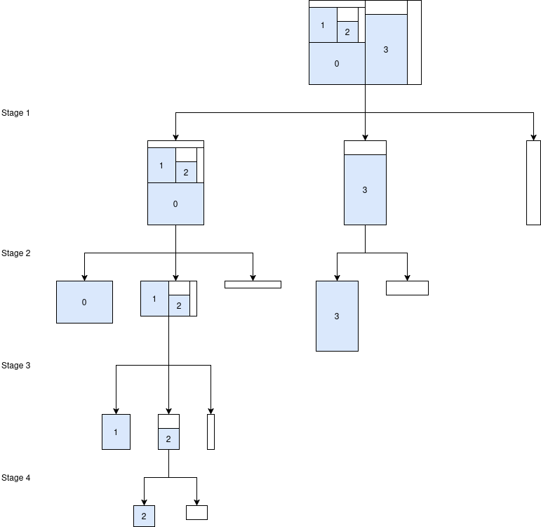

A pattern that cannot be produced this way, however the items are arranged, is a **non-guillotine pattern**.

The :code:`rectangle-guillotine` solver only produces guillotine patterns. Problems where non-guillotine patterns are required (or simply allowed) should instead be modeled with the :ref:`rectangle<rectangle>` solver, which places items freely.

The following example solves the same instance — four items of clearly different shapes (8×3, 4×5, 5×4 and 7×6) arranged in a "pinwheel" around a tiny unused central rectangle — with both solvers (:code:`bin-packing` objective). The :code:`rectangle` solver, which is free to produce non-guillotine patterns, packs all 4 items into a single 12×9 bin using the pinwheel arrangement, leaving almost no waste. The :code:`rectangle-guillotine` solver cannot reproduce this pattern with straight cuts, however the items are arranged, so it needs a second bin.

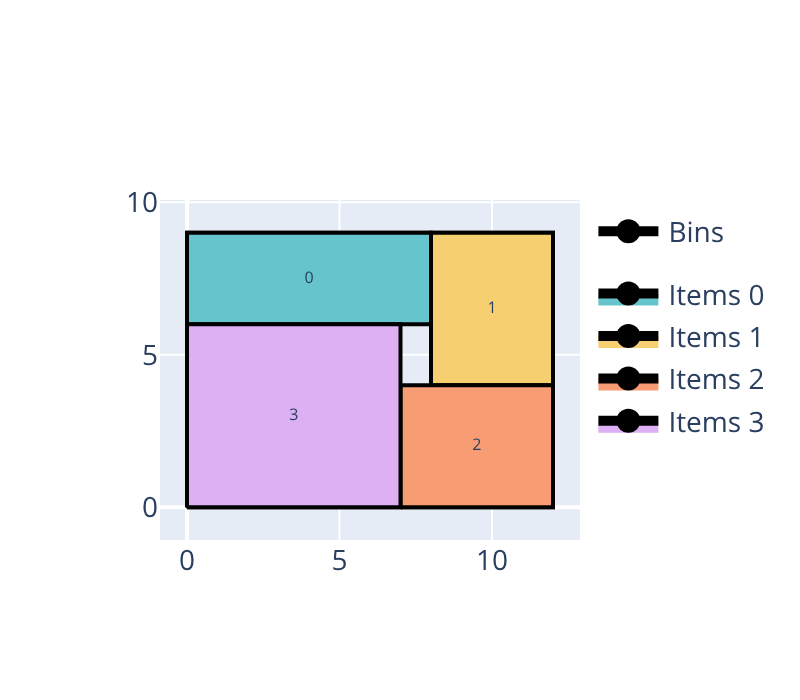

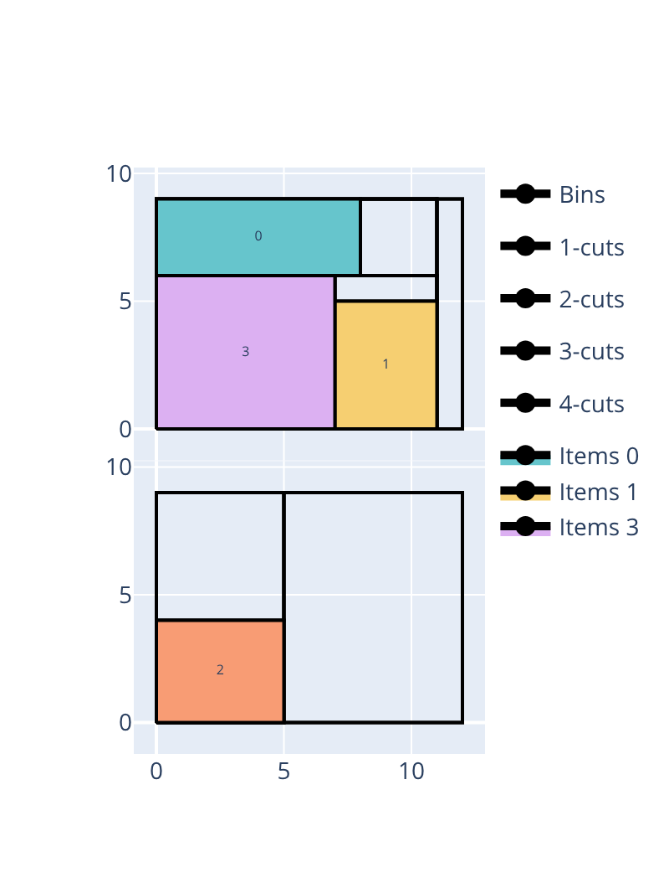

.. literalinclude:: examples/rectangleguillotine/guillotine_vs_non_guillotine_rectangle/items.csv
   :caption: items.csv

.. literalinclude:: examples/rectangleguillotine/guillotine_vs_non_guillotine_rectangle/bins.csv
   :caption: bins.csv

.. literalinclude:: examples/rectangleguillotine/guillotine_vs_non_guillotine_rectangle/parameters.csv
   :caption: parameters.csv

.. list-table::
   :widths: 1 1
   :header-rows: 1
   :align: center

   * - ``rectangle``
     - ``rectangle-guillotine``
   * - .. code-block:: shell

            packingsolver_rectangle \
                    --items items.csv \
                    --bins bins.csv \
                    --parameters parameters.csv \
                    --certificate solution.csv
     - .. code-block:: shell

            packingsolver_rectangleguillotine \
                    --items items.csv \
                    --bins bins.csv \
                    --parameters parameters.csv \
                    --certificate solution.csv
   * - |rectangleguillotine_gvng_rectangle|
     - |rectangleguillotine_gvng_rectangleguillotine|

Basic usage
--------------

The :code:`rectangle-guillotine` solver takes as input:

* an item CSV file; option: ``--items items.csv``
* a bin CSV file; option: ``--bins bins.csv``
* optionally a defect CSV file; option: ``--defects defects.csv``
* optionally a parameter CSV file; option: ``--parameters parameters.csv``

It outputs:

* a solution CSV file; option: ``--certificate solution.csv``

The **item file** contains:

* The width of the item type (**mandatory**)

  * column ``WIDTH``
  * **Integer value**

* The height of the item type (**mandatory**)

  * column ``HEIGHT``
  * **Integer value**

* The number of copies of the item type

  * column ``COPIES``
  * default value: ``1``

* The profit of an item of this type (for a knapsack objective)

  * column ``PROFIT``
  * default value: item area (``WIDTH * HEIGHT``)

The **bin file** contains:

* The width of the bin type (**mandatory**)

  * column ``WIDTH``
  * **Integer value**

* The height of the bin type (**mandatory**)

  * column ``HEIGHT``
  * **Integer value**

* The number of copies of the bin type

  * column ``COPIES``
  * default value: ``1``

* The minimum number of copies that must be used

  * column ``COPIES_MIN``
  * default value: ``0``

* The cost of a bin of this type (for a variable-sized bin packing objective)

  * column ``COST``
  * default value: bin area

The **parameter file** has two columns: ``NAME`` and ``VALUE``. The possible entries are:

* The objective; name: ``objective``; possible values:

  * ``knapsack``
  * ``bin-packing``
  * ``bin-packing-with-leftovers``
  * ``open-dimension-x``
  * ``open-dimension-y``
  * ``variable-sized-bin-packing``

Inputs:

.. literalinclude:: examples/rectangleguillotine/items.csv
   :caption: items.csv

.. literalinclude:: examples/rectangleguillotine/bins.csv
   :caption: bins.csv

.. literalinclude:: examples/rectangleguillotine/parameters.csv
   :caption: parameters.csv

Solve:

.. code-block:: shell

    packingsolver_rectangleguillotine \
            --items items.csv \
            --bins bins.csv \
            --parameters parameters.csv \
            --certificate solution.csv

.. literalinclude:: examples/rectangleguillotine/output.txt

Visualize:

.. code-block:: shell

    python3 scripts/visualize_rectangleguillotine.py solution.csv

.. image:: img/rectangleguillotine_example_solution.png
   :width: 512pt
   :align: center

Maximum number of cutting stages
--------------------------------

The maximum number of stages may be constrained.

* The number of cutting stages; name: ``number_of_stages``; default value: ``3``

The following example packs 24 items (12 item types) into 80×40 bins with ``cut_type`` set to ``exact``, ``first_stage_orientation`` set to ``vertical`` and the :code:`bin-packing-with-leftovers` objective. Since items must fill their sub-plate exactly at the last stage, the number of stages directly limits how tightly they can be nested. With only 2 stages, that requirement leaves so much waste that a third bin is needed (3 bins, 40.15% waste). Adding a third stage is already enough to fit everything into 2 bins, with far less waste (10.44%):

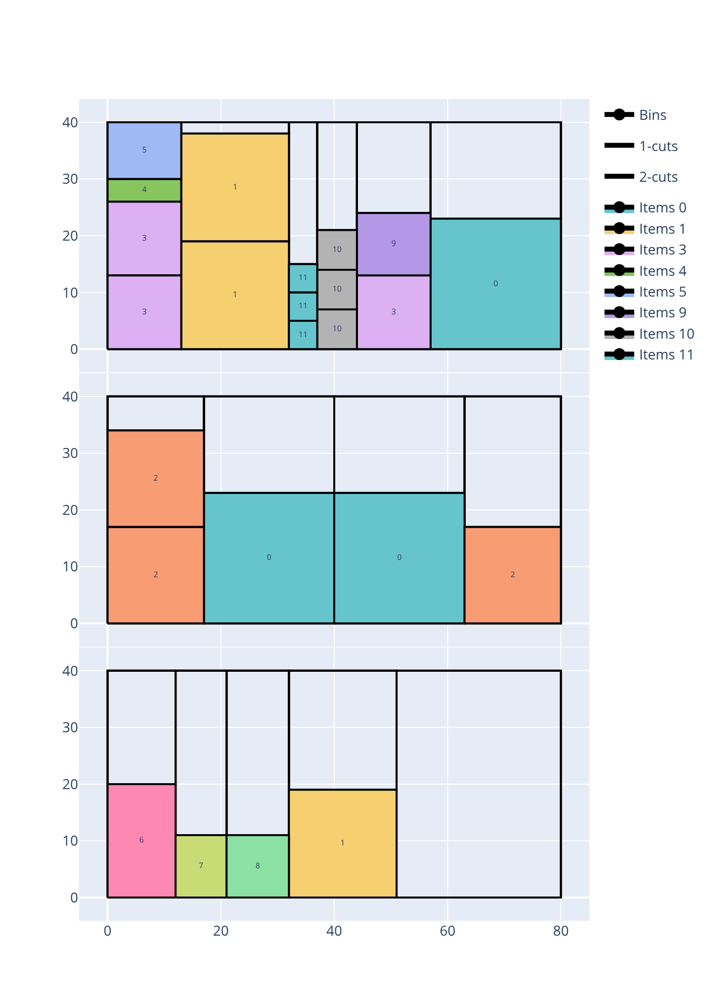

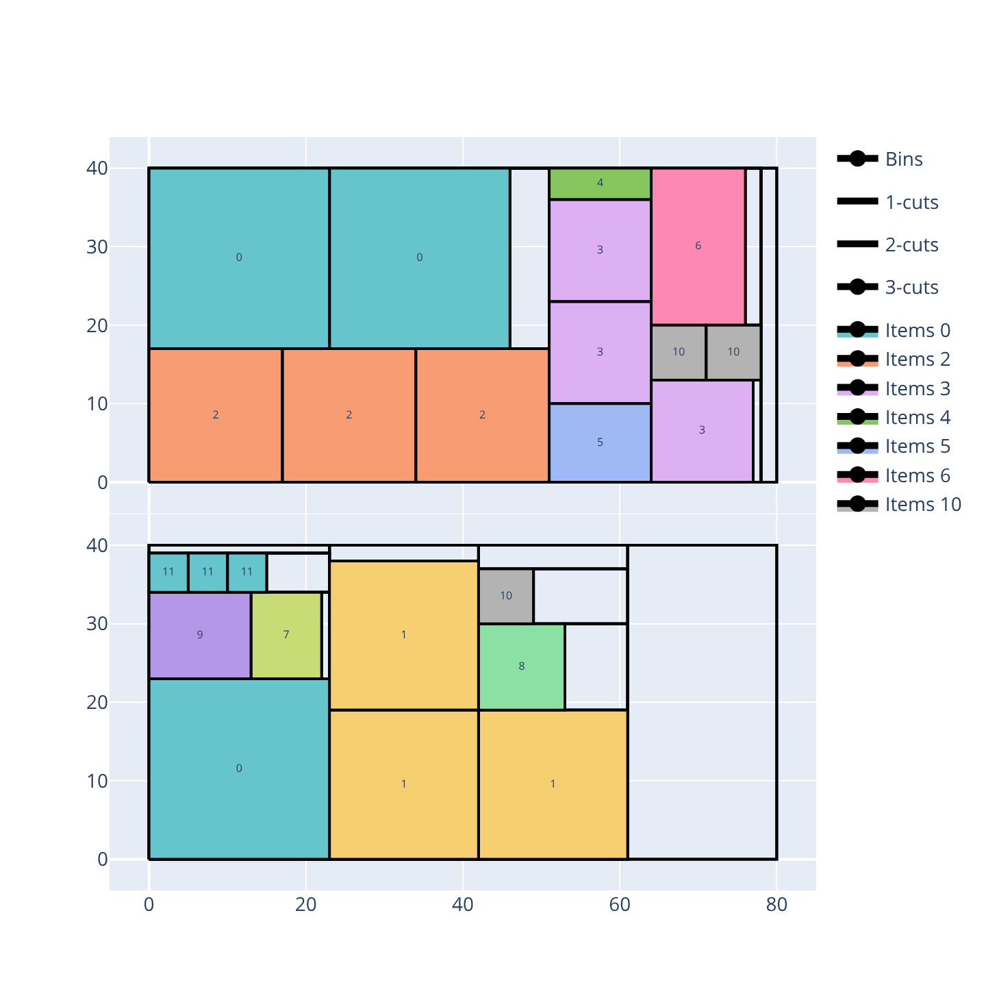

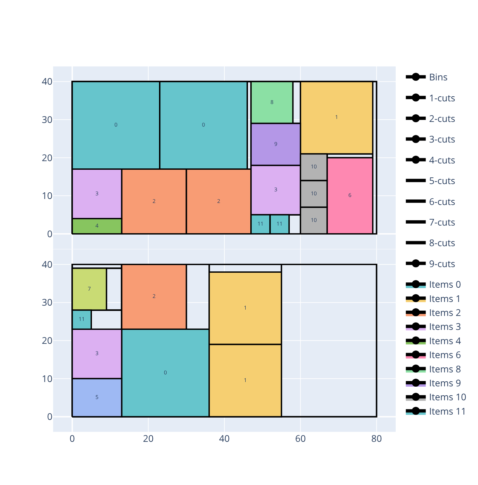

.. literalinclude:: examples/rectangleguillotine/stages_2/items.csv
   :caption: items.csv

.. literalinclude:: examples/rectangleguillotine/stages_2/bins.csv
   :caption: bins.csv

.. list-table::
   :widths: 1 1
   :header-rows: 1
   :align: center

   * - 2 stages
     - 3 stages
   * - .. literalinclude:: examples/rectangleguillotine/stages_2/parameters.csv
          :caption: parameters.csv
     - .. literalinclude:: examples/rectangleguillotine/stages_3/parameters.csv
          :caption: parameters.csv
   * - .. code-block:: shell

            packingsolver_rectangleguillotine \
                    --items items.csv \
                    --bins bins.csv \
                    --parameters parameters.csv \
                    --certificate solution.csv
     - .. code-block:: shell

            packingsolver_rectangleguillotine \
                    --items items.csv \
                    --bins bins.csv \
                    --parameters parameters.csv \
                    --certificate solution.csv
   * - |rectangleguillotine_stages_2|
     - |rectangleguillotine_stages_3|

Allowing an unlimited number of stages keeps the same 2 bins but reduces waste further still (6.46%), by nesting items through a deeper hierarchy of cuts (up to a 6th-stage cut, visible in the image below):

.. literalinclude:: examples/rectangleguillotine/stages_unlimited/parameters.csv
   :caption: parameters.csv

.. code-block:: shell

    packingsolver_rectangleguillotine \
            --items items.csv \
            --bins bins.csv \
            --parameters parameters.csv \
            --certificate solution.csv

|rectangleguillotine_stages_unlimited|

Cut types
---------

* ``roadef2018``: pattern from the 2018 ROADEF challenge; stage-2 cuts produce only items of identical height; trimming cuts are allowed
* ``non-exact``: more flexible; stage-3 cuts are not required; some waste is allowed in sub-plates
* ``exact``: items must fill their sub-plate exactly with no waste at stage 3
* ``homogenous``: all items in a strip have the same height

The cut type is set via the ``cut_type`` key in the parameters CSV file, using one of the values above.

The following example packs 24 items (12 item types) into 80×40 bins with 3 cutting stages, ``first_stage_orientation`` set to ``vertical`` and the :code:`bin-packing-with-leftovers` objective, which minimizes the number of bins first and, among solutions using that many bins, maximizes the leftover value of the last bin. Every bin in every solution below uses several genuine stage-1 cuts, splitting it into multiple vertical strips. All 4 cut types pack every item into the same 2 bins, but the leftover value they reach decreases as the cut type gets more restrictive:

* ``roadef2018``: leftover value 72 — the most permissive cut type, it takes full advantage of its free trimming cuts past the 3-stage budget
* ``non-exact``: leftover value 65 — still allows sub-plates to be filled with some waste, but without ``roadef2018``'s free trimming cuts, so it packs slightly less tightly
* ``exact``: leftover value 57 — items must fill their sub-plate exactly, which rules out some of the arrangements the 2 cut types above use
* ``homogenous``: leftover value 48 — the most restrictive cut type here, since items sharing a sub-plate must also be of the same type

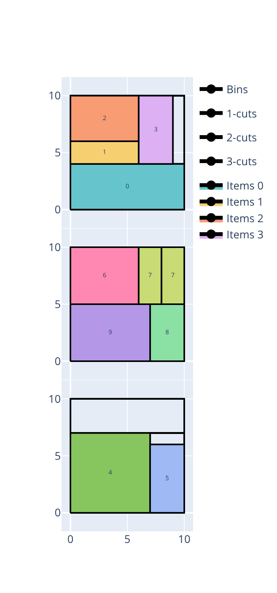

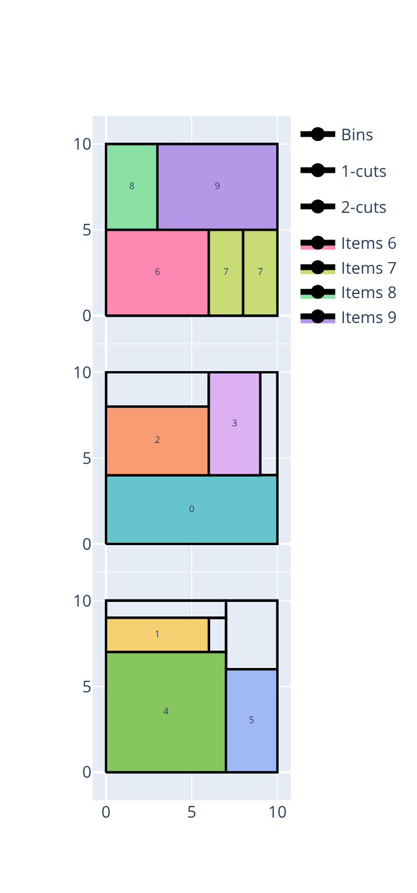

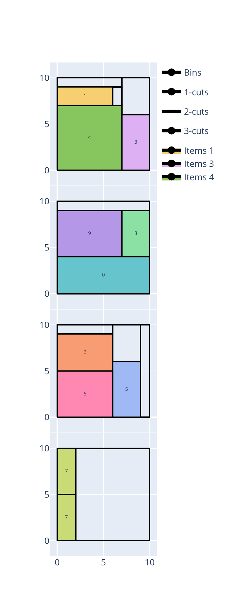

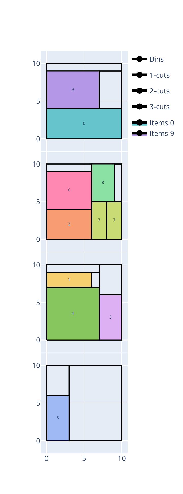

.. literalinclude:: examples/rectangleguillotine/cuttype_roadef2018/items.csv
   :caption: items.csv

.. literalinclude:: examples/rectangleguillotine/cuttype_roadef2018/bins.csv
   :caption: bins.csv

.. list-table::
   :widths: 1 1
   :header-rows: 1
   :align: center

   * - ``roadef2018``
     - ``non-exact``
   * - .. literalinclude:: examples/rectangleguillotine/cuttype_roadef2018/parameters.csv
          :caption: parameters.csv
     - .. literalinclude:: examples/rectangleguillotine/cuttype_nonexact/parameters.csv
          :caption: parameters.csv
   * - .. code-block:: shell

            packingsolver_rectangleguillotine \
                    --items items.csv \
                    --bins bins.csv \
                    --parameters parameters.csv \
                    --certificate solution.csv
     - .. code-block:: shell

            packingsolver_rectangleguillotine \
                    --items items.csv \
                    --bins bins.csv \
                    --parameters parameters.csv \
                    --certificate solution.csv
   * - |rectangleguillotine_cuttype_roadef2018|
     - |rectangleguillotine_cuttype_nonexact|

.. list-table::
   :widths: 1 1
   :header-rows: 1
   :align: center

   * - ``exact``
     - ``homogenous``
   * - .. literalinclude:: examples/rectangleguillotine/cuttype_exact/parameters.csv
          :caption: parameters.csv
     - .. literalinclude:: examples/rectangleguillotine/cuttype_homogenous/parameters.csv
          :caption: parameters.csv
   * - .. code-block:: shell

            packingsolver_rectangleguillotine \
                    --items items.csv \
                    --bins bins.csv \
                    --parameters parameters.csv \
                    --certificate solution.csv
     - .. code-block:: shell

            packingsolver_rectangleguillotine \
                    --items items.csv \
                    --bins bins.csv \
                    --parameters parameters.csv \
                    --certificate solution.csv
   * - |rectangleguillotine_cuttype_exact|
     - |rectangleguillotine_cuttype_homogenous|

First stage orientation
---------------------------

The first stage orientation controls whether stage-1 cuts (see `Guillotine vs non-guillotine patterns`_ above) are vertical or horizontal.

* The first stage orientation; name: ``first_stage_orientation``; possible values: ``vertical`` or ``horizontal``

The following example packs 4 items (4×3, 4×7, 6×5 and 6×4) into 10×10 bins with only 2 cutting stages (:code:`bin-packing` objective). The two 4-wide items share a column, stacking to exactly fill a 4×10 vertical strip; the two 6-wide items share a second 6×10 vertical strip, stacking to a height of 9 with some waste. With ``first_stage_orientation`` set to ``vertical``, stage-1 cuts run along these two columns and all 4 items fit into a single bin. With ``horizontal``, stage-1 cuts run the other way instead: since no two items share the same height, each stage-1 row can only hold one item at that depth, and a second bin is needed.

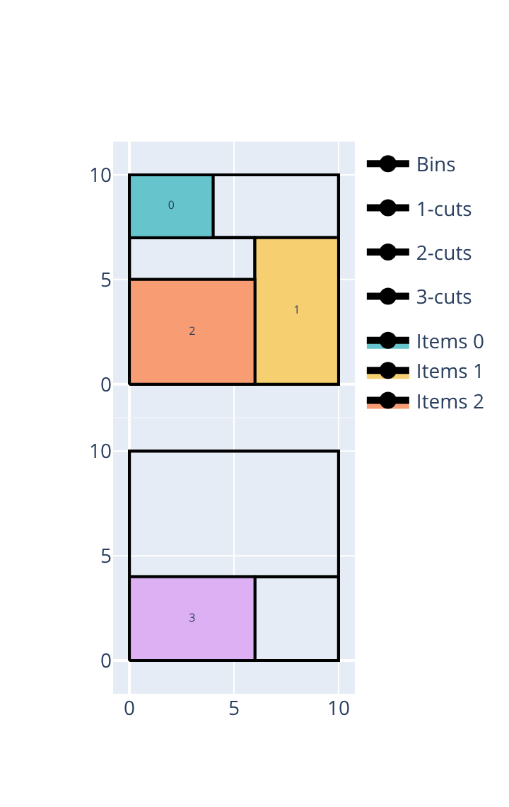

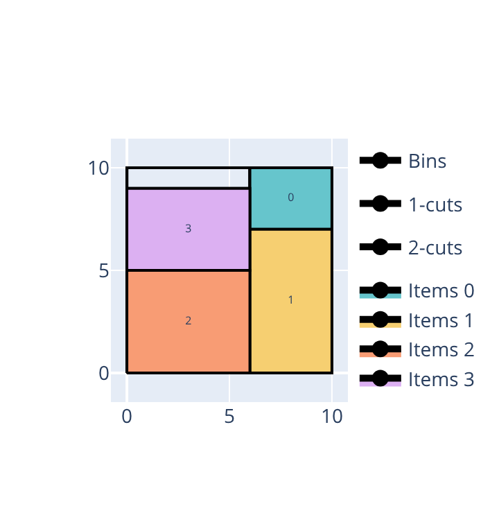

.. list-table::
   :widths: 1 1
   :header-rows: 1
   :align: center

   * - ``horizontal``
     - ``vertical``
   * - .. literalinclude:: examples/rectangleguillotine/orientation_no/items.csv
          :caption: items.csv
     - .. literalinclude:: examples/rectangleguillotine/orientation_yes/items.csv
          :caption: items.csv
   * - .. literalinclude:: examples/rectangleguillotine/orientation_no/bins.csv
          :caption: bins.csv
     - .. literalinclude:: examples/rectangleguillotine/orientation_yes/bins.csv
          :caption: bins.csv
   * - .. literalinclude:: examples/rectangleguillotine/orientation_no/parameters.csv
          :caption: parameters.csv
     - .. literalinclude:: examples/rectangleguillotine/orientation_yes/parameters.csv
          :caption: parameters.csv
   * - .. code-block:: shell

            packingsolver_rectangleguillotine \
                    --items items.csv \
                    --bins bins.csv \
                    --parameters parameters.csv \
                    --certificate solution.csv
     - .. code-block:: shell

            packingsolver_rectangleguillotine \
                    --items items.csv \
                    --bins bins.csv \
                    --parameters parameters.csv \
                    --certificate solution.csv
   * - |rectangleguillotine_orientation_no|
     - |rectangleguillotine_orientation_yes|

Item rotations
--------------

Each item may individually be allowed to be rotated by 90° or have a fixed orientation.

By default, item rotation is allowed.

* Whether the item is fixed in its original orientation (cannot be rotated 90°)

  * column ``ORIENTED``
  * ``0``: rotation allowed (default)
  * ``1``: item is oriented; rotation not allowed

The following example packs 2 copies of a 6×10 item into 10×12 bins (:code:`bin-packing` objective). Without rotation, two items side by side need 12 of width (more than the bin's 10) and stacked need 20 of height (more than the bin's 12), so they cannot share a bin: 2 bins are needed. With rotation allowed, both items are turned on their side (10×6) and stacked exactly into a single 10×12 bin.

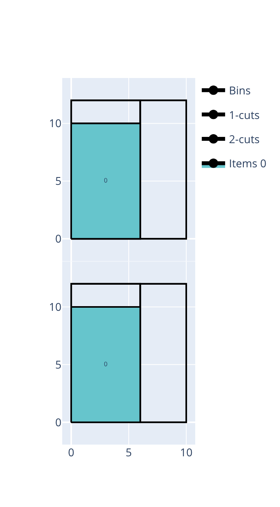

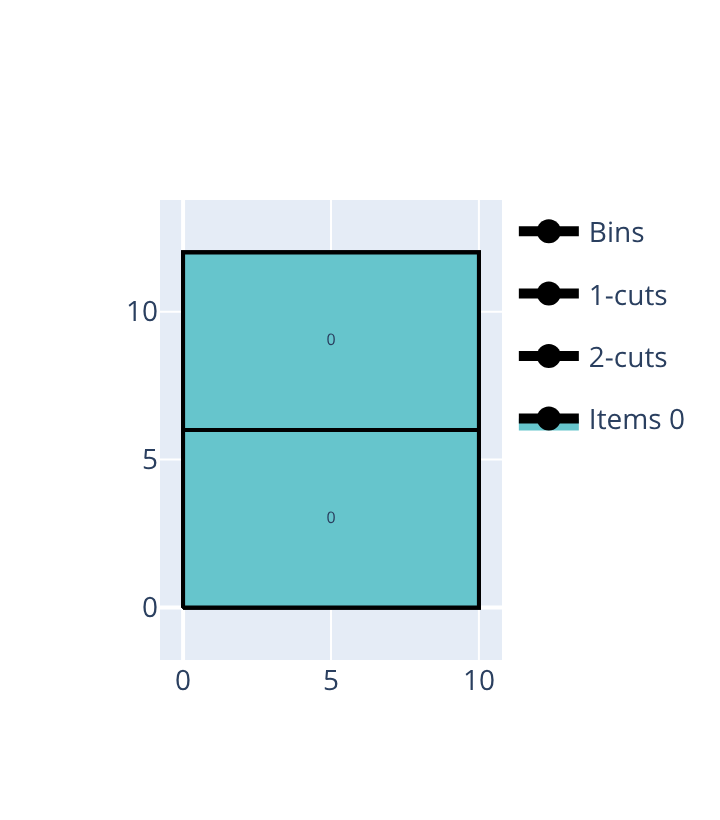

.. list-table::
   :widths: 1 1
   :header-rows: 1
   :align: center

   * - Without rotation
     - With rotation
   * - .. literalinclude:: examples/rectangleguillotine/rotation_no/items.csv
          :caption: items.csv
     - .. literalinclude:: examples/rectangleguillotine/rotation_yes/items.csv
          :caption: items.csv
   * - .. literalinclude:: examples/rectangleguillotine/rotation_no/bins.csv
          :caption: bins.csv
     - .. literalinclude:: examples/rectangleguillotine/rotation_yes/bins.csv
          :caption: bins.csv
   * - .. literalinclude:: examples/rectangleguillotine/rotation_no/parameters.csv
          :caption: parameters.csv
     - .. literalinclude:: examples/rectangleguillotine/rotation_yes/parameters.csv
          :caption: parameters.csv
   * - .. code-block:: shell

            packingsolver_rectangleguillotine \
                    --items items.csv \
                    --bins bins.csv \
                    --parameters parameters.csv \
                    --certificate solution.csv
     - .. code-block:: shell

            packingsolver_rectangleguillotine \
                    --items items.csv \
                    --bins bins.csv \
                    --parameters parameters.csv \
                    --certificate solution.csv
   * - |rectangleguillotine_rotation_no|
     - |rectangleguillotine_rotation_yes|

Cut thickness
-----------------

* The width of the saw blade; name: ``cut_thickness``; default value: ``0``

The following example packs 3 items (10×4, 10×3 and 10×3) into 10×10 bins (:code:`bin-packing` objective), stacked to exactly fill the bin height. With no cut thickness, all 3 items fit in a single bin. Each cut also consumes material equal to the saw blade width: with a cut thickness of 1, the two cuts separating the 3 items eat into the available height, so the third item no longer fits and a second bin is needed.

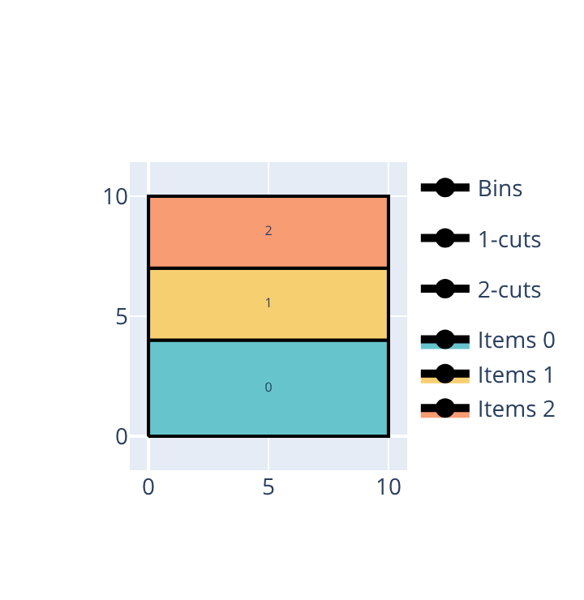

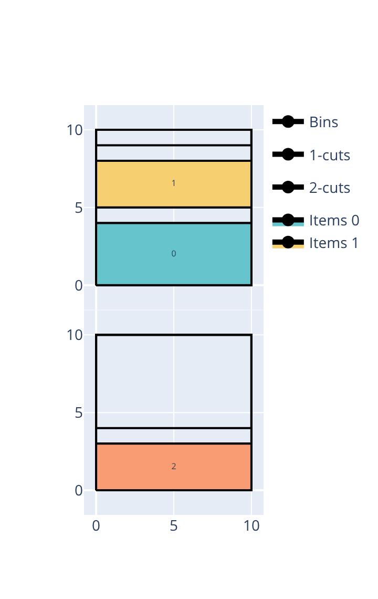

.. list-table::
   :widths: 1 1
   :header-rows: 1
   :align: center

   * - ``cut_thickness`` = 0
     - ``cut_thickness`` = 1
   * - .. literalinclude:: examples/rectangleguillotine/cutthickness_no/items.csv
          :caption: items.csv
     - .. literalinclude:: examples/rectangleguillotine/cutthickness_yes/items.csv
          :caption: items.csv
   * - .. literalinclude:: examples/rectangleguillotine/cutthickness_no/bins.csv
          :caption: bins.csv
     - .. literalinclude:: examples/rectangleguillotine/cutthickness_yes/bins.csv
          :caption: bins.csv
   * - .. literalinclude:: examples/rectangleguillotine/cutthickness_no/parameters.csv
          :caption: parameters.csv
     - .. literalinclude:: examples/rectangleguillotine/cutthickness_yes/parameters.csv
          :caption: parameters.csv
   * - .. code-block:: shell

            packingsolver_rectangleguillotine \
                    --items items.csv \
                    --bins bins.csv \
                    --parameters parameters.csv \
                    --certificate solution.csv
     - .. code-block:: shell

            packingsolver_rectangleguillotine \
                    --items items.csv \
                    --bins bins.csv \
                    --parameters parameters.csv \
                    --certificate solution.csv
   * - |rectangleguillotine_cutthickness_no|
     - |rectangleguillotine_cutthickness_yes|

Trims
-----

Trims model a reserved border around the bin (e.g., for clamping or edge defects). They prevent items from being placed within the specified distance of each edge.

* A **hard** trim is physically cut away: the trim strip is counted as waste.
* A **soft** trim is reserved but not cut: waste is only counted from the first actual cut inward.

* Border trims: distances from each edge before any item can be placed

  * columns ``BOTTOM_TRIM``, ``TOP_TRIM``, ``LEFT_TRIM``, ``RIGHT_TRIM`` in the bin CSV file
  * **Integer values**, default: ``0``

* Trim types: whether trimming strips are cut (hard) or just reserved (soft)

  * columns ``BOTTOM_TRIM_TYPE``, ``TOP_TRIM_TYPE``, ``LEFT_TRIM_TYPE``, ``RIGHT_TRIM_TYPE`` in the bin CSV file
  * ``Hard``: the trim is physically cut; the strip is waste
  * ``Soft``: the trim is reserved but not cut; default for top and right trims

The following example packs 3 items (4×8, 3×8 and 3×8) into 10×10 bins (:code:`bin-packing` objective), side by side to exactly fill the bin width. Without any trim, all 3 items fit in a single bin. Reserving a 1-unit trim on all four edges (left, right, bottom and top) leaves only 8 of usable width, which is no longer enough for the three items to sit side by side, so a second bin is needed.

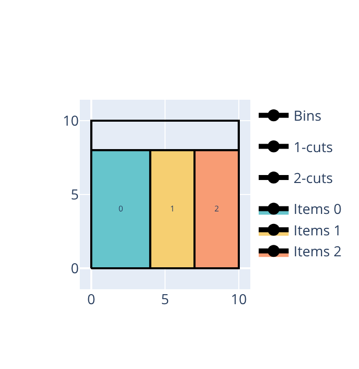

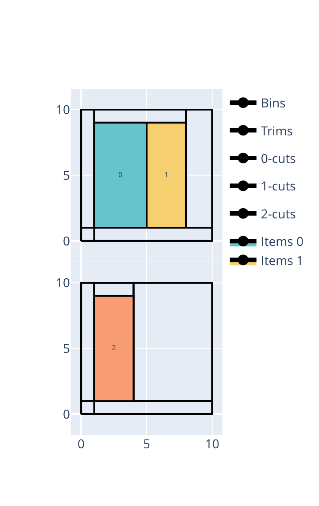

.. list-table::
   :widths: 1 1
   :header-rows: 1
   :align: center

   * - Without trim
     - ``LEFT_TRIM`` = 2
   * - .. literalinclude:: examples/rectangleguillotine/trims_no/items.csv
          :caption: items.csv
     - .. literalinclude:: examples/rectangleguillotine/trims_yes/items.csv
          :caption: items.csv
   * - .. literalinclude:: examples/rectangleguillotine/trims_no/bins.csv
          :caption: bins.csv
     - .. literalinclude:: examples/rectangleguillotine/trims_yes/bins.csv
          :caption: bins.csv
   * - .. literalinclude:: examples/rectangleguillotine/trims_no/parameters.csv
          :caption: parameters.csv
     - .. literalinclude:: examples/rectangleguillotine/trims_yes/parameters.csv
          :caption: parameters.csv
   * - .. code-block:: shell

            packingsolver_rectangleguillotine \
                    --items items.csv \
                    --bins bins.csv \
                    --parameters parameters.csv \
                    --certificate solution.csv
     - .. code-block:: shell

            packingsolver_rectangleguillotine \
                    --items items.csv \
                    --bins bins.csv \
                    --parameters parameters.csv \
                    --certificate solution.csv
   * - |rectangleguillotine_trims_no|
     - |rectangleguillotine_trims_yes|

Defects
-------

Defects are rectangular regions inside a bin where items cannot be placed.

Defects are specified in the defects CSV file; option: ``--defects defects.csv``. The **defect file** contains the same columns as for the :ref:`rectangle<rectangle>` solver:

* The bin type that contains the defect (**mandatory**)

  * column ``BIN``
  * It refers to the bin type by its position (0-indexed) in the bins file

* The X coordinate of the bottom-left corner of the defect (**mandatory**)

  * column ``X``
  * **Integer value**

* The Y coordinate of the bottom-left corner of the defect (**mandatory**)

  * column ``Y``
  * **Integer value**

* The width of the defect (**mandatory**)

  * column ``WIDTH``
  * **Integer value**

* The height of the defect (**mandatory**)

  * column ``HEIGHT``
  * **Integer value**

The following example packs 2 copies of a 10×6 item into 10×12 bins (:code:`bin-packing` objective), stacked to fill each bin exactly with no waste. Without any defect, one bin is enough. Adding a small 2×2 defect in the middle of the join between the two items leaves no room to shift either item out of the way, since there is no slack left in the bin: one of the two items no longer fits, so a second bin is needed.

.. |rectangleguillotine_defects_no| image:: img/rectangleguillotine_defects_no.png
   :scale: 50%

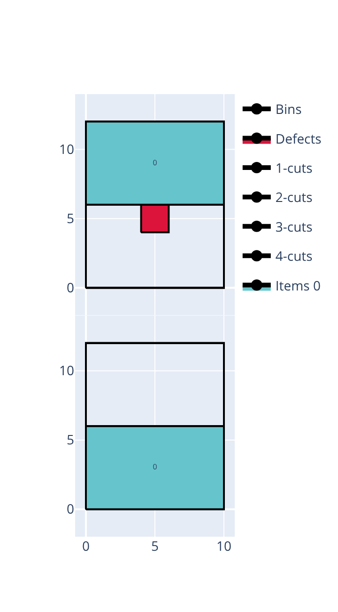

.. list-table::
   :widths: 1 1
   :header-rows: 1
   :align: center

   * - Without defects
     - With defects
   * - .. literalinclude:: examples/rectangleguillotine/defects_no/items.csv
          :caption: items.csv
     - .. literalinclude:: examples/rectangleguillotine/defects_yes/items.csv
          :caption: items.csv
   * - .. literalinclude:: examples/rectangleguillotine/defects_no/bins.csv
          :caption: bins.csv
     - .. literalinclude:: examples/rectangleguillotine/defects_yes/bins.csv
          :caption: bins.csv
   * -
     - .. literalinclude:: examples/rectangleguillotine/defects_yes/defects.csv
          :caption: defects.csv
   * - .. literalinclude:: examples/rectangleguillotine/defects_no/parameters.csv
          :caption: parameters.csv
     - .. literalinclude:: examples/rectangleguillotine/defects_yes/parameters.csv
          :caption: parameters.csv
   * - .. code-block:: shell

            packingsolver_rectangleguillotine \
                    --items items.csv \
                    --bins bins.csv \
                    --parameters parameters.csv \
                    --certificate solution.csv
     - .. code-block:: shell

            packingsolver_rectangleguillotine \
                    --items items.csv \
                    --bins bins.csv \
                    --defects defects.csv \
                    --parameters parameters.csv \
                    --certificate solution.csv
   * - |rectangleguillotine_defects_no|
     - |rectangleguillotine_defects_yes|

Cut through defects
---------------------

By default, a guillotine cut may not pass through a defect; it must be routed around it instead.

* Whether cuts are allowed to pass through defects

  * name: ``cut_through_defects``
  * ``0``: cuts must avoid defects (default)
  * ``1``: cuts may pass through defects

The following example packs a 5×5 and a 5×6 item into 10×10 bins with only 2 cutting stages (:code:`bin-packing` objective), so the two items — whose widths sum exactly to the bin width — must be separated by a single first-stage cut. A small 2×2 defect floats in the unused strip above the shorter item, without touching either item or the edges of the bin, but still straddling that cut. Allowing cuts through defects lets the solver cut straight through it, and both items fit into a single bin. Without allowing cuts through defects, that cut can no longer be made, so the two items can no longer share a bin, and a second bin is needed.

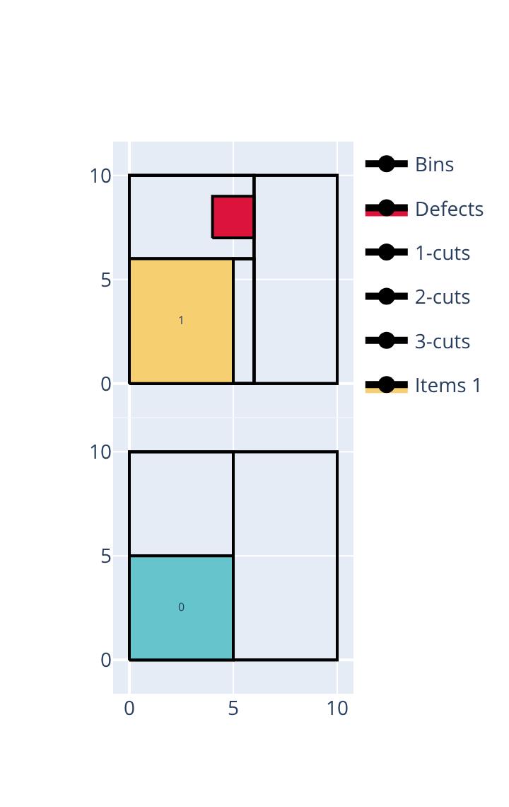

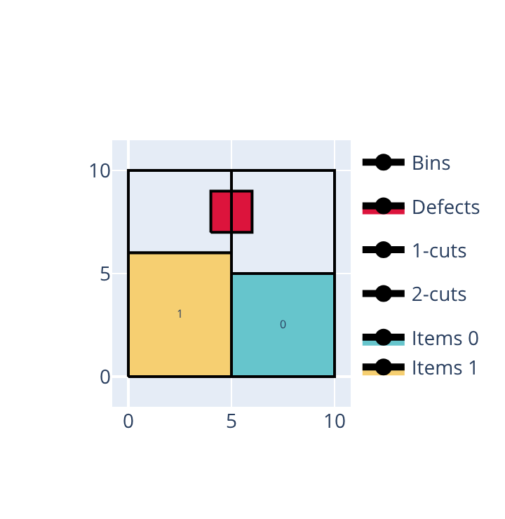

.. literalinclude:: examples/rectangleguillotine/cutdefects_no/items.csv
   :caption: items.csv

.. literalinclude:: examples/rectangleguillotine/cutdefects_no/bins.csv
   :caption: bins.csv

.. literalinclude:: examples/rectangleguillotine/cutdefects_no/defects.csv
   :caption: defects.csv

.. list-table::
   :widths: 1 1
   :header-rows: 1
   :align: center

   * - With cuts through defects
     - Without cuts through defects
   * - .. literalinclude:: examples/rectangleguillotine/cutdefects_yes/parameters.csv
          :caption: parameters.csv
     - .. literalinclude:: examples/rectangleguillotine/cutdefects_no/parameters.csv
          :caption: parameters.csv
   * - .. code-block:: shell

            packingsolver_rectangleguillotine \
                    --items items.csv \
                    --bins bins.csv \
                    --defects defects.csv \
                    --parameters parameters.csv \
                    --certificate solution.csv
     - .. code-block:: shell

            packingsolver_rectangleguillotine \
                    --items items.csv \
                    --bins bins.csv \
                    --defects defects.csv \
                    --parameters parameters.csv \
                    --certificate solution.csv
   * - |rectangleguillotine_cutdefects_yes|
     - |rectangleguillotine_cutdefects_no|

Cutting sequences (stacks)
--------------------------

Items with the same stack id must be produced contiguously, in the order they appear in the item file: all copies of an item type must be cut before moving on to the next item type of the same stack. This models a physical stack of items (e.g. glued or stapled together) that must be separated in a fixed sequence. By default, each item type forms its own single-item stack, so no ordering constraint applies.

* The stack identifier; items with the same stack id must remain contiguous in the solution

  * column ``STACK_ID``
  * default value: no stack grouping

The following example packs 4 items of width 5 into 10×10 bins (:code:`bin-packing` objective): two items of height 6 and 4 that together fill one 5×10 column, and two items of height 3 and 7 that together fill another 5×10 column. Without stacking constraints, the solver is free to group the items by column and packs everything into a single bin. Splitting the items into two stacks of two — stack 0 with the height-6 and height-7 items, stack 1 with the height-3 and height-4 items — pairs one item from each column in every stack, forcing each stack's two items to be produced back-to-back; since neither column can be completed without interrupting the other stack, a second bin is needed.

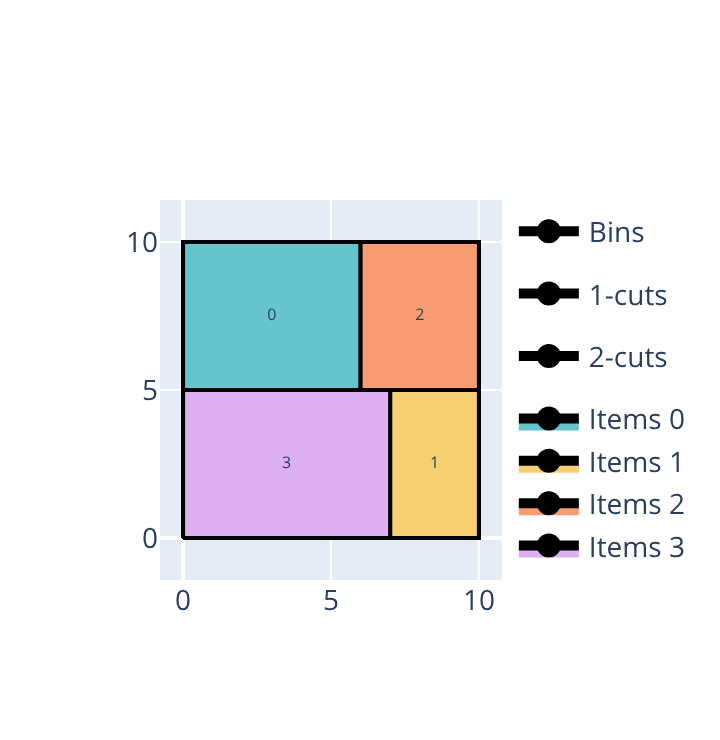

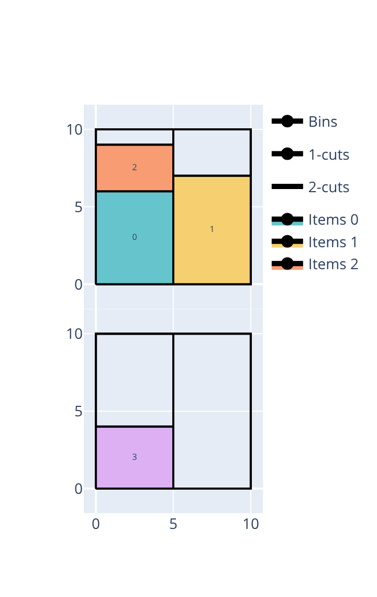

.. list-table::
   :widths: 1 1
   :header-rows: 1
   :align: center

   * - Without stacks
     - With stacks
   * - .. literalinclude:: examples/rectangleguillotine/stacks_no/items.csv
          :caption: items.csv
     - .. literalinclude:: examples/rectangleguillotine/stacks_yes/items.csv
          :caption: items.csv
   * - .. literalinclude:: examples/rectangleguillotine/stacks_no/bins.csv
          :caption: bins.csv
     - .. literalinclude:: examples/rectangleguillotine/stacks_yes/bins.csv
          :caption: bins.csv
   * - .. literalinclude:: examples/rectangleguillotine/stacks_no/parameters.csv
          :caption: parameters.csv
     - .. literalinclude:: examples/rectangleguillotine/stacks_yes/parameters.csv
          :caption: parameters.csv
   * - .. code-block:: shell

            packingsolver_rectangleguillotine \
                    --items items.csv \
                    --bins bins.csv \
                    --parameters parameters.csv \
                    --certificate solution.csv
     - .. code-block:: shell

            packingsolver_rectangleguillotine \
                    --items items.csv \
                    --bins bins.csv \
                    --parameters parameters.csv \
                    --certificate solution.csv
   * - |rectangleguillotine_stacks_no|
     - |rectangleguillotine_stacks_yes|

Minimum and maximum distances between cuts
-----------------------------------------------

* The minimum distance between first-level (stage-1) cuts; name: ``minimum_distance_1_cuts``; default value: ``0``
* The maximum distance between first-level cuts; name: ``maximum_distance_1_cuts``; ``-1`` for no limit
* The minimum distance between second-level cuts; name: ``minimum_distance_2_cuts``; default value: ``0``
* The maximum distance between second-level cuts; name: ``maximum_distance_2_cuts``; ``-1`` for no limit (default); not allowed when ``number_of_stages == 2``
* The minimum length for any waste piece; name: ``minimum_waste_length``; default value: ``0``

Maximum number of consecutive 1-cuts
----------------------------------------

* The maximum number of 1-cuts in a bin; name: ``maximum_number_1_cuts``; ``-1`` for no limit (default); must not be ``0``

The following example packs 3 copies of a 3×10 item into 10×10 bins with only 2 cutting stages (:code:`bin-packing` objective). Without a limit, the 3 items are placed side by side using 2 stage-1 cuts, all in a single bin. Setting ``maximum_number_1_cuts`` to 1 allows only 2 strips, so only 2 of the 3 items fit, and a second bin is needed for the third.

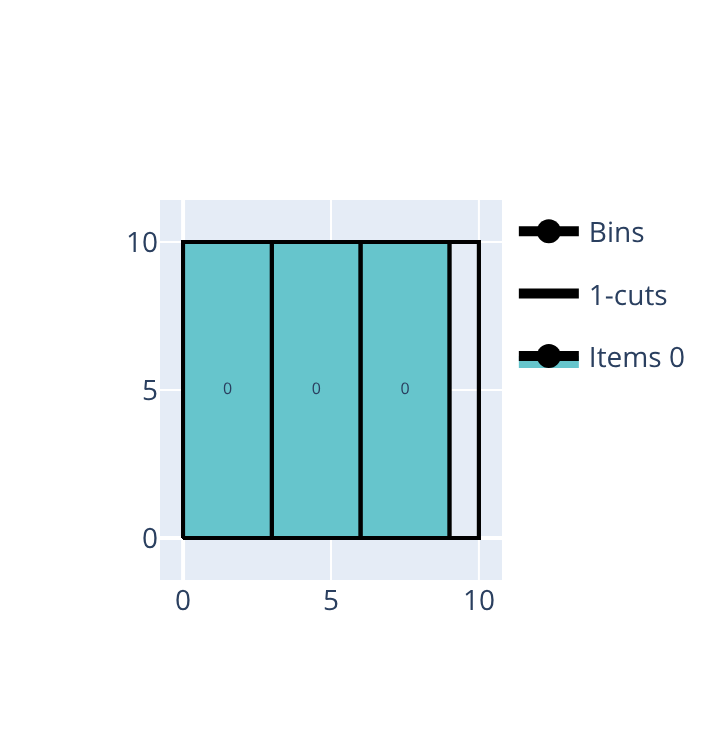

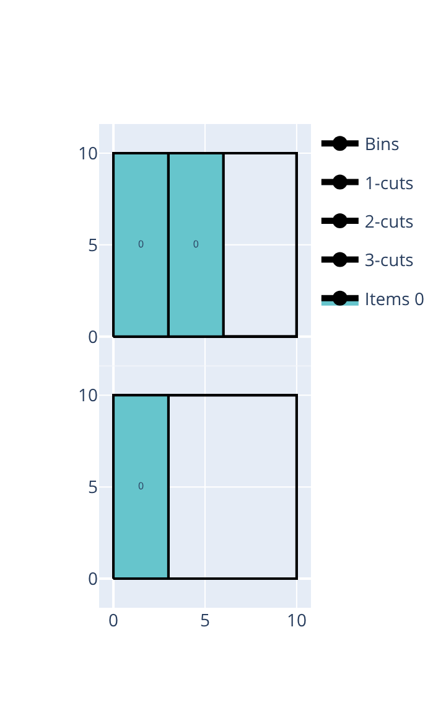

.. list-table::
   :widths: 1 1
   :header-rows: 1
   :align: center

   * - Without limit
     - ``maximum_number_1_cuts`` = 1
   * - .. literalinclude:: examples/rectangleguillotine/maxcuts_no/items.csv
          :caption: items.csv
     - .. literalinclude:: examples/rectangleguillotine/maxcuts_yes/items.csv
          :caption: items.csv
   * - .. literalinclude:: examples/rectangleguillotine/maxcuts_no/bins.csv
          :caption: bins.csv
     - .. literalinclude:: examples/rectangleguillotine/maxcuts_yes/bins.csv
          :caption: bins.csv
   * - .. literalinclude:: examples/rectangleguillotine/maxcuts_no/parameters.csv
          :caption: parameters.csv
     - .. literalinclude:: examples/rectangleguillotine/maxcuts_yes/parameters.csv
          :caption: parameters.csv
   * - .. code-block:: shell

            packingsolver_rectangleguillotine \
                    --items items.csv \
                    --bins bins.csv \
                    --parameters parameters.csv \
                    --certificate solution.csv
     - .. code-block:: shell

            packingsolver_rectangleguillotine \
                    --items items.csv \
                    --bins bins.csv \
                    --parameters parameters.csv \
                    --certificate solution.csv
   * - |rectangleguillotine_maxcuts_no|
     - |rectangleguillotine_maxcuts_yes|

Maximum number of consecutive 2-cuts
----------------------------------------

* The maximum number of 2-cuts in a first-level sub-plate; name: ``maximum_number_2_cuts``; ``-1`` for no limit

The following example packs 4 items (10×3, 10×3, 10×4 and 10×10) into 20×10 bins with only 2 cutting stages (:code:`bin-packing` objective). A first stage-1 cut splits the bin into two 10-wide strips: one holds the 10×10 item alone, the other stacks the three shorter items using 2 stage-2 cuts. Without a limit, all 4 items fit into a single bin. Setting ``maximum_number_2_cuts`` to 1 allows only 2 stage-2 cuts' worth of shelves per strip, so only 2 of the 3 stacked items fit, and a second bin is needed for the third.

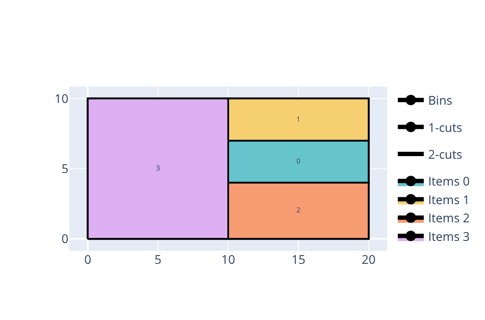

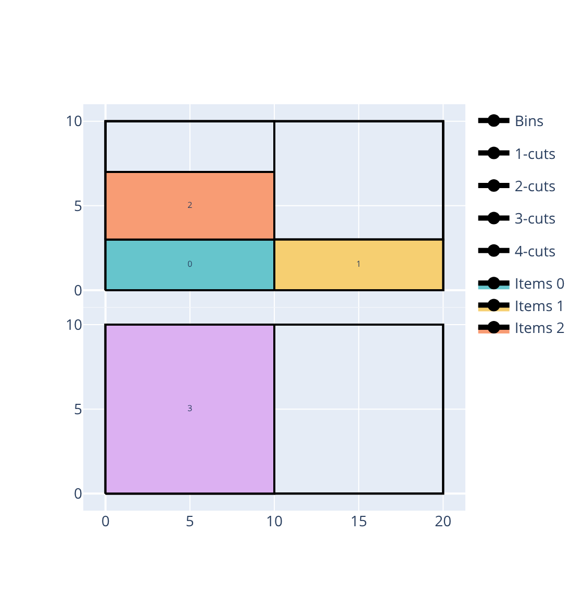

.. list-table::
   :widths: 1 1
   :header-rows: 1
   :align: center

   * - Without limit
     - ``maximum_number_2_cuts`` = 1
   * - .. literalinclude:: examples/rectangleguillotine/maxcuts2_no/items.csv
          :caption: items.csv
     - .. literalinclude:: examples/rectangleguillotine/maxcuts2_yes/items.csv
          :caption: items.csv
   * - .. literalinclude:: examples/rectangleguillotine/maxcuts2_no/bins.csv
          :caption: bins.csv
     - .. literalinclude:: examples/rectangleguillotine/maxcuts2_yes/bins.csv
          :caption: bins.csv
   * - .. literalinclude:: examples/rectangleguillotine/maxcuts2_no/parameters.csv
          :caption: parameters.csv
     - .. literalinclude:: examples/rectangleguillotine/maxcuts2_yes/parameters.csv
          :caption: parameters.csv
   * - .. code-block:: shell

            packingsolver_rectangleguillotine \
                    --items items.csv \
                    --bins bins.csv \
                    --parameters parameters.csv \
                    --certificate solution.csv
     - .. code-block:: shell

            packingsolver_rectangleguillotine \
                    --items items.csv \
                    --bins bins.csv \
                    --parameters parameters.csv \
                    --certificate solution.csv
   * - |rectangleguillotine_maxcuts2_no|
     - |rectangleguillotine_maxcuts2_yes|
