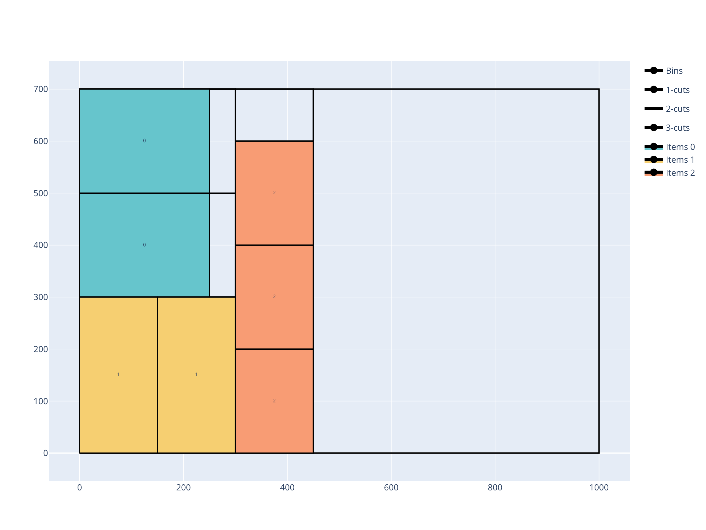

.. _rectangleguillotine:

RectangleGuillotine solver
==========================

The RectangleGuillotine solver solves problems where items are two-dimensional rectangles that must be cut from rectangular bins using **guillotine cuts** — cuts that go all the way from one side of the current plate to the other.

.. image:: ../img/rectangleguillotine.png
   :width: 512pt
   :align: center

These problems occur for example in glass cutting, wooden panel cutting, and paper cutting industries.

Features:

* Objectives:

  * Knapsack
  * Bin packing
  * Bin packing with leftovers
  * Open dimension X
  * Open dimension Y
  * Open dimension XY
  * Variable-sized bin packing

* Item types

  * Item rotation (90°)
  * Stacks (items that must stay grouped)

* Bin types

  * Trims (border offsets on each side)
  * Rectangular defects

* Cutting constraints

  * Number of cutting stages
  * Cut type (Roadef2018, NonExact, Exact, Homogenous)
  * First stage orientation (horizontal or vertical)
  * Minimum and maximum distances between cuts
  * Maximum number of 2-cuts per strip
  * Cut thickness

Usage
-----

The RectangleGuillotine solver takes as input:

* an item CSV file; option: ``--items items.csv``
* a bin CSV file; option: ``--bins bins.csv``
* optionally a defect CSV file; option: ``--defects defects.csv``
* optionally a parameter CSV file; option: ``--parameters parameters.csv``

It outputs:

* a solution CSV file; option: ``--certificate solution.csv``

The **item file** contains:

* The width of the item type (**mandatory**)

  * column ``WIDTH``
  * **Integer value**

* The height of the item type (**mandatory**)

  * column ``HEIGHT``
  * **Integer value**

* The number of copies of the item type

  * column ``COPIES``
  * default value: ``1``

* Whether the item is fixed in its original orientation (cannot be rotated 90°)

  * column ``ORIENTED``
  * ``0``: rotation allowed (default)
  * ``1``: item is oriented; rotation not allowed

* The profit of an item of this type (for a knapsack objective)

  * column ``PROFIT``
  * default value: item area (``WIDTH * HEIGHT``)

* The stack identifier; items with the same stack id must remain contiguous in the solution

  * column ``STACK_ID``
  * default value: no stack grouping

The **bin file** contains:

* The width of the bin type (**mandatory**)

  * column ``WIDTH``
  * **Integer value**

* The height of the bin type (**mandatory**)

  * column ``HEIGHT``
  * **Integer value**

* The number of copies of the bin type

  * column ``COPIES``
  * default value: ``1``

* The minimum number of copies that must be used

  * column ``COPIES_MIN``
  * default value: ``0``

* The cost of a bin of this type (for a variable-sized bin packing objective)

  * column ``COST``
  * default value: bin area

* Border trims: distances from each edge before any item can be placed

  * columns ``BOTTOM_TRIM``, ``TOP_TRIM``, ``LEFT_TRIM``, ``RIGHT_TRIM``
  * **Integer values**, default: ``0``

* Trim types: whether trimming strips are cut (hard) or just reserved (soft)

  * columns ``BOTTOM_TRIM_TYPE``, ``TOP_TRIM_TYPE``, ``LEFT_TRIM_TYPE``, ``RIGHT_TRIM_TYPE``
  * ``Hard``: the trim is physically cut; the strip is waste
  * ``Soft``: the trim is reserved but not cut; default for top and right trims

The **defect file** contains the same columns as for the :ref:`Rectangle<rectangle>` solver: ``BIN``, ``X``, ``Y``, ``WIDTH``, ``HEIGHT``.

The **parameter file** has two columns: ``NAME`` and ``VALUE``. The possible entries are:

* The objective; name: ``objective``; possible values:

  * ``knapsack``
  * ``bin-packing``
  * ``bin-packing-with-leftovers``
  * ``open-dimension-x``
  * ``open-dimension-y``
  * ``variable-sized-bin-packing``

* Cutting constraints (all have integer values unless noted):

  * ``number_of_stages``: number of cutting stages (default: ``3``)
  * ``cut_type``: cut pattern type; ``roadef2018``, ``non-exact``, ``exact``, or ``homogenous``
  * ``first_stage_orientation``: ``vertical`` or ``horizontal``
  * ``minimum_distance_1_cuts``: minimum distance between first-level (stage-1) cuts (default: ``0``)
  * ``maximum_distance_1_cuts``: maximum distance between first-level cuts; ``-1`` for no limit
  * ``minimum_distance_2_cuts``: minimum distance between second-level cuts (default: ``0``)
  * ``minimum_waste_length``: minimum length for any waste piece (default: ``0``)
  * ``maximum_number_2_cuts``: maximum number of stage-2 cuts per strip; ``-1`` for no limit
  * ``cut_through_defects``: ``0`` or ``1``; whether cuts may pass through defects (default: ``0``)
  * ``cut_thickness``: width of the saw blade (default: ``0``)

Basic example
-------------

Inputs:

.. literalinclude:: examples/rectangleguillotine/items.csv
   :caption: items.csv

.. literalinclude:: examples/rectangleguillotine/bins.csv
   :caption: bins.csv

.. literalinclude:: examples/rectangleguillotine/parameters.csv
   :caption: parameters.csv

Solve:

.. code-block:: shell

    packingsolver_rectangleguillotine \
            --items items.csv \
            --bins bins.csv \
            --parameters parameters.csv \
            --certificate solution.csv

.. literalinclude:: examples/rectangleguillotine/output.txt

Visualize:

.. code-block:: shell

    python3 scripts/visualize_rectangleguillotine.py solution.csv

Cutting stages
--------------

A **guillotine cut** divides a plate into two sub-plates. Repeated cuts create a hierarchy of plates:

* **Stage 1**: cuts that divide the original bin into vertical (or horizontal) **strips**
* **Stage 2**: cuts inside each strip, perpendicular to stage-1 cuts
* **Stage 3**: cuts inside the resulting sub-strips (exact cutting only)

The number of stages controls how many levels of cuts are applied. Three-stage cutting is the most common in practice.

Cut types
---------

* ``roadef2018``: pattern from the 2018 ROADEF challenge; stage-2 cuts produce only items of identical height; trimming cuts are allowed
* ``non-exact``: more flexible; stage-3 cuts are not required; some waste is allowed in sub-plates
* ``exact``: items must fill their sub-plate exactly with no waste at stage 3
* ``homogenous``: all items in a strip have the same height

Trims
-----

Trims model a reserved border around the bin (e.g., for clamping or edge defects). They prevent items from being placed within the specified distance of each edge.

* A **hard** trim is physically cut away: the trim strip is counted as waste.
* A **soft** trim is reserved but not cut: waste is only counted from the first actual cut inward.
