.. _rectangleguillotine:

:code:`rectangle-guillotine` solver
===================================

The :code:`rectangle-guillotine` solver solves problems where items are two-dimensional rectangles that must be cut from rectangular bins using **guillotine cuts** — cuts that go all the way from one side of the current plate to the other.

.. image:: ../img/rectangleguillotine.png
   :width: 512pt
   :align: center

These problems occur for example in glass cutting, wooden panel cutting, and paper cutting industries.

Features:

* Objectives:

  * Knapsack
  * Bin packing
  * Bin packing with leftovers
  * Open dimension X
  * Open dimension Y
  * Variable-sized bin packing

* Item types

  * Item rotation (90°)
  * Stacks (items that must stay grouped)

* Bin types

  * Trims (border offsets on each side)
  * Rectangular defects

* Cutting constraints

  * Number of cutting stages
  * Cut type (Roadef2018, NonExact, Exact, Homogenous)
  * First stage orientation (horizontal or vertical)
  * Minimum and maximum distances between cuts
  * Maximum number of consecutive 1-cuts
  * Maximum number of consecutive 2-cuts
  * Cut thickness

Guillotine vs non-guillotine patterns
-------------------------------------

A cutting pattern is a **guillotine pattern** if it can be produced by a sequence of straight cuts, each going all the way from one edge of the current plate to the opposite edge. The number of cutting stages of a pattern is the number of sets of parallel cuts necessary to extract all the items from the pattern. Here is an example of a 4-staged pattern:

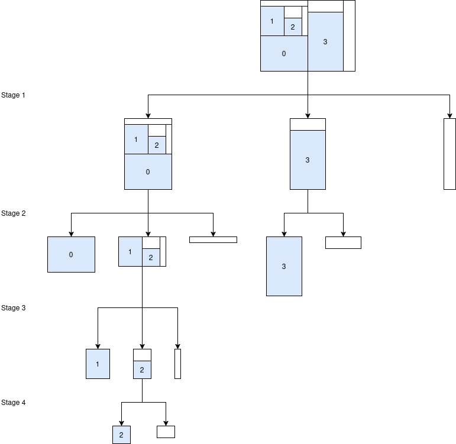

A pattern that cannot be produced this way, however the items are arranged, is a **non-guillotine pattern**.

The :code:`rectangle-guillotine` solver only produces guillotine patterns. Problems where non-guillotine patterns are required (or simply allowed) should instead be modeled with the :ref:`rectangle<rectangle>` solver, which places items freely.

The following example solves the same instance — four items of clearly different shapes (8 × 3, 4 × 5, 5 × 4 and 7 × 6) arranged in a "pinwheel" around a tiny unused central rectangle — with both solvers (:code:`bin-packing` objective). The :code:`rectangle` solver, which is free to produce non-guillotine patterns, packs all 4 items into a single 12 × 9 bin using the pinwheel arrangement, leaving almost no waste. The :code:`rectangle-guillotine` solver cannot reproduce this pattern with straight cuts, however the items are arranged, so it needs a second bin.

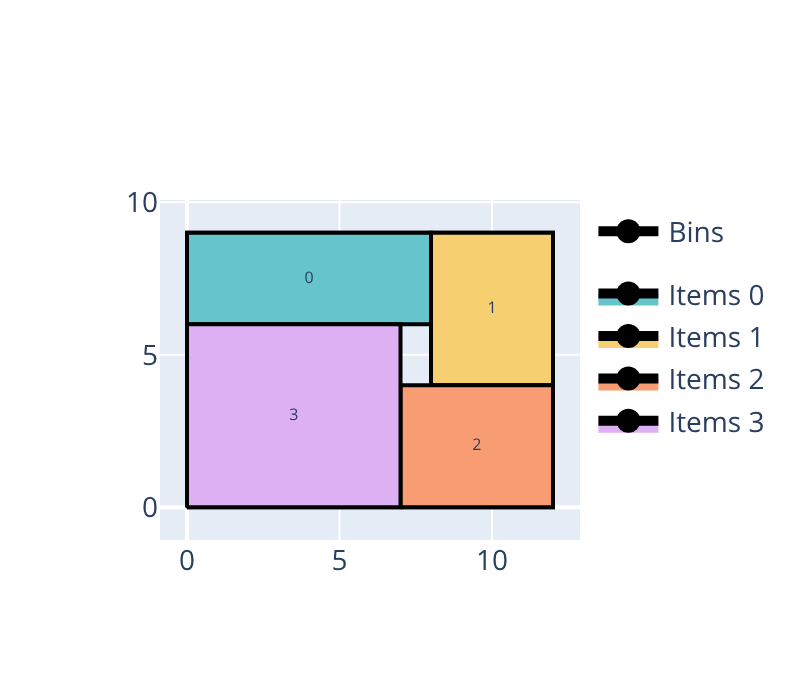

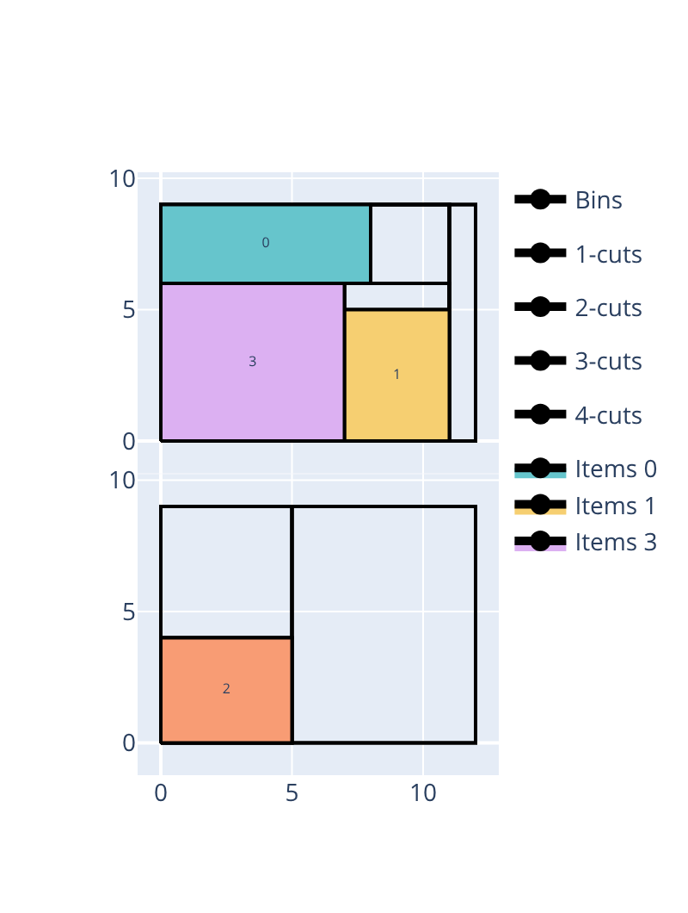

.. list-table::
   :widths: 1 1
   :header-rows: 1
   :align: center

   * - ``rectangle``
     - ``rectangle-guillotine``
   * - |rectangleguillotine_gvng_rectangle|
     - |rectangleguillotine_gvng_rectangleguillotine|

.. example-tabs:: rectangle/guillotine_vs_non_guillotine rectangleguillotine/guillotine_vs_non_guillotine

Basic usage
-----------

An instance is described in the JSON format below. The `online solver <https://packingsolver.pages.dev/>`_ downloads its instances in this format (**Download**) and loads them (**Load a JSON file**), the command-line solver reads them (``--input``), and the Python package and the C++ library read them with ``InstanceBuilder.read``. Instances can also be built directly with the ``InstanceBuilder`` of the Python package and of the C++ library.

In the following example, the items of three item types are cut from plates of size 1000 × 700, using as few plates as possible, and then maximizing the leftover of the last plate:

.. example-tabs:: rectangleguillotine/basic
   :solve:

The solution:

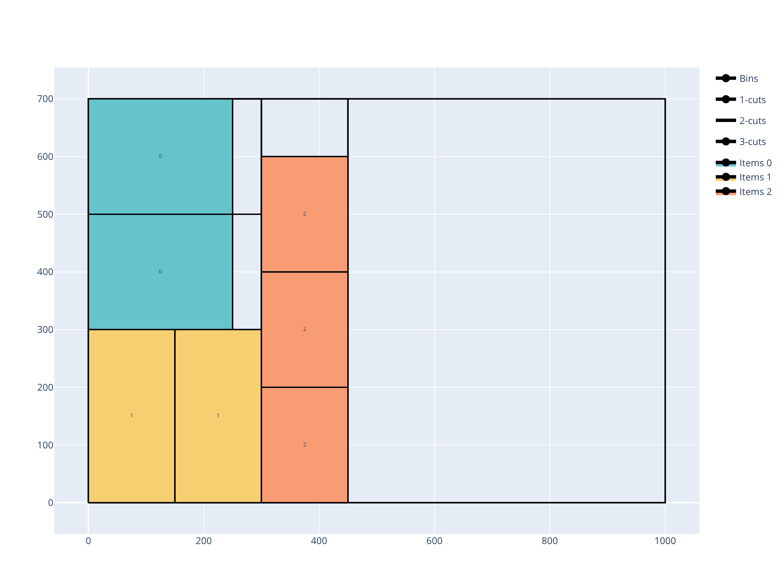

Instance format
^^^^^^^^^^^^^^^

An instance is a JSON object with the following fields:

.. list-table::
   :header-rows: 1
   :widths: 1 3

   * - Field
     - Description
   * - ``objective``
     - **Mandatory**. One of ``knapsack``, ``bin-packing``, ``bin-packing-with-leftovers``, ``open-dimension-x``, ``open-dimension-y``, ``variable-sized-bin-packing``; see :ref:`objectives`
   * - ``number_of_stages``
     - See :ref:`rectangleguillotine-stages`. Default: ``3``
   * - ``cut_type``
     - See :ref:`rectangleguillotine-cut-types`. Default: ``non-exact``
   * - ``first_stage_orientation``
     - See :ref:`rectangleguillotine-first-stage-orientation`. Default: ``vertical``
   * - ``cut_thickness``
     - See :ref:`rectangleguillotine-cut-thickness`. Default: ``0``
   * - ``cut_through_defects``
     - See :ref:`rectangleguillotine-cut-through-defects`. Default: ``false``
   * - ``minimum_distance_1_cuts``, ``maximum_distance_1_cuts``, ``minimum_distance_2_cuts``, ``maximum_distance_2_cuts``, ``minimum_waste_length``
     - See :ref:`rectangleguillotine-distances`
   * - ``maximum_number_1_cuts``, ``maximum_number_2_cuts``
     - See :ref:`rectangleguillotine-maximum-number-1-cuts` and :ref:`rectangleguillotine-maximum-number-2-cuts`. Default: no limit
   * - ``bin_types``
     - **Mandatory**. The bin types (array)
   * - ``item_types``
     - **Mandatory**. The item types (array)

A **bin type** has the following fields:

.. list-table::
   :header-rows: 1
   :widths: 1 3

   * - Field
     - Description
   * - ``width``, ``height``
     - **Mandatory**. The width and the height of the bins (integers)
   * - ``copies``
     - The number of copies of the bin type. Default: ``1``; ``-1`` for an unlimited number of copies
   * - ``copies_min``
     - The minimum number of copies of the bin type to use, for the variable-sized bin packing objective. Default: ``0``
   * - ``cost``
     - The cost of a bin of this type, for the variable-sized bin packing objective. Default: the area of the bin
   * - ``left_trim``, ``right_trim``, ``bottom_trim``, ``top_trim``, and their types ``left_trim_type``...
     - See :ref:`rectangleguillotine-trims`. Default: no trims
   * - ``defects``
     - See :ref:`rectangleguillotine-defects`. Default: none

An **item type** has the following fields:

.. list-table::
   :header-rows: 1
   :widths: 1 3

   * - Field
     - Description
   * - ``width``, ``height``
     - **Mandatory**. The width and the height of the items (integers)
   * - ``copies``
     - The number of copies of the item type. Default: ``1``; ``-1`` for an unlimited number of copies (knapsack objective only)
   * - ``copies_min``
     - The minimum number of copies of the item type to pack, for the knapsack objective. Default: ``0``
   * - ``profit``
     - The profit of an item of this type, for the knapsack objective. Default: the area of the item
   * - ``oriented``
     - See :ref:`rectangleguillotine-item-rotations`. Default: ``false``
   * - ``stack_id``
     - See :ref:`rectangleguillotine-stacks`. Default: none

In Python, the optional fields of the bin types and of the item types are keyword arguments of ``InstanceBuilder.add_bin_type`` and ``InstanceBuilder.add_item_type``, with the same names (the trims are given in a dictionary, ``trims``). In C++, they are set with the ``InstanceBuilder.set_bin_type_<field>`` and ``InstanceBuilder.set_item_type_<field>`` methods; the examples below show the exceptions. The other fields of the instance are set with the ``InstanceBuilder.set_<field>`` methods.

Certificate format
^^^^^^^^^^^^^^^^^^

The solution is written (command-line option ``--certificate``, ``Solution.write``) as a CSV file with the columns ``PLATE_ID``, ``COPIES``, ``NODE_ID``, ``X``, ``Y``, ``WIDTH``, ``HEIGHT``, ``TYPE``, ``CUT``, ``PARENT``. Each line is a node of the cutting tree of a plate (a bin of the solution), or a defect:

* ``PLATE_ID``: the index of the plate in the solution, and ``COPIES`` the number of identical plates it stands for;
* ``NODE_ID``: the id of the node, and ``PARENT`` the id of its parent node (empty for the plates and the defects);
* ``X``, ``Y``, ``WIDTH``, ``HEIGHT``: the position of the bottom-left corner of the node, and its size;
* ``TYPE``: the item type of the node if it is an item; ``-1`` for a waste, ``-2`` for an intermediate node (cut further), ``-3`` for the residual (the leftover of the last plate), ``-4`` for a defect;
* ``CUT``: the depth of the node in the cutting tree: ``0`` for a plate, ``1`` for a node obtained by a 1-cut, etc.; ``-1`` for a trim.

.. literalinclude:: examples/rectangleguillotine/basic/solution.csv
   :caption: solution.csv
   :lines: 1-8

To visualize a solution, open it in the `solution viewer <https://packingsolver.pages.dev/viewer.html>`_, or run:

.. code-block:: shell

    python3 scripts/visualize.py solution.csv

.. _rectangleguillotine-stages:

Maximum number of cutting stages
--------------------------------

The maximum number of stages may be constrained: ``2``, ``3`` (default), or unlimited.

.. tab-set::
   :sync-group: interface

   .. tab-item:: Online solver
      :sync: web

      Choose the **Number of stages** below the objective.

   .. tab-item:: JSON
      :sync: json

      In the instance: ``"number_of_stages": 2``, or ``"number_of_stages": "unlimited"``.

   .. tab-item:: Python
      :sync: python

      ``instance_builder.set_number_of_stages(2)``, or ``instance_builder.set_number_of_stages_unlimited()``

   .. tab-item:: C++
      :sync: cpp

      ``instance_builder.set_number_of_stages(2);``, or ``instance_builder.set_number_of_stages_unlimited();``

The following example packs 24 items (12 item types) into 80 × 40 bins with the ``exact`` cut type, a ``vertical`` first stage orientation and the :code:`bin-packing-with-leftovers` objective. Since items must fill their sub-plate exactly at the last stage, the number of stages directly limits how tightly they can be nested. With only 2 stages, that requirement leaves so much waste that a third bin is needed (3 bins, 40.15% waste). A third stage is already enough to fit everything into 2 bins, with far less waste (10.44%):

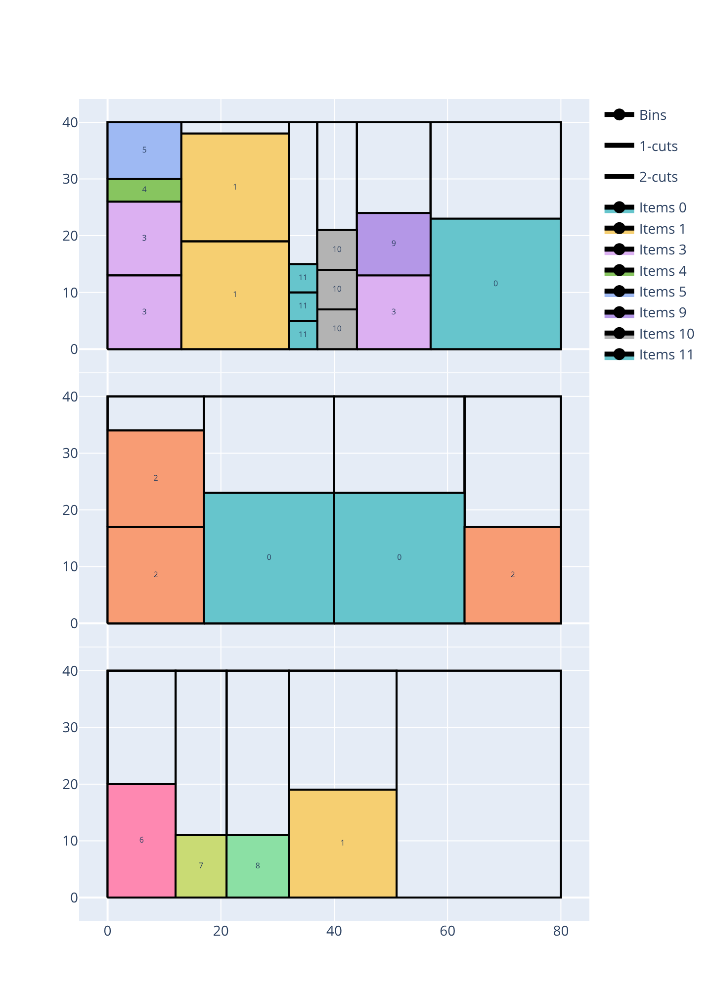

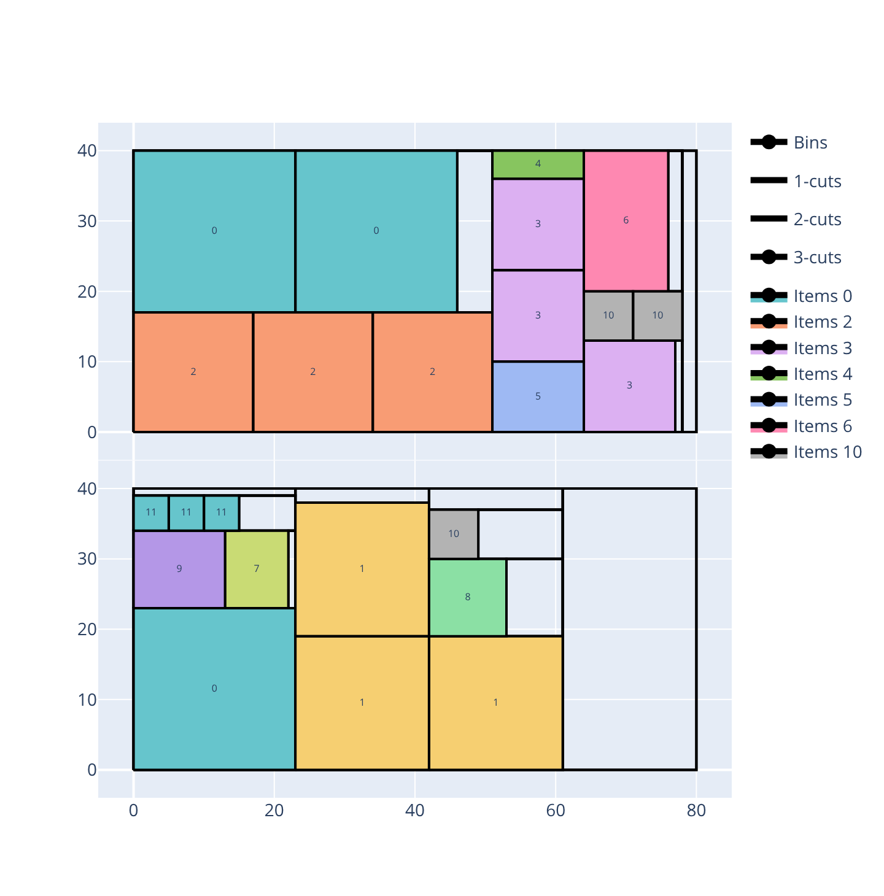

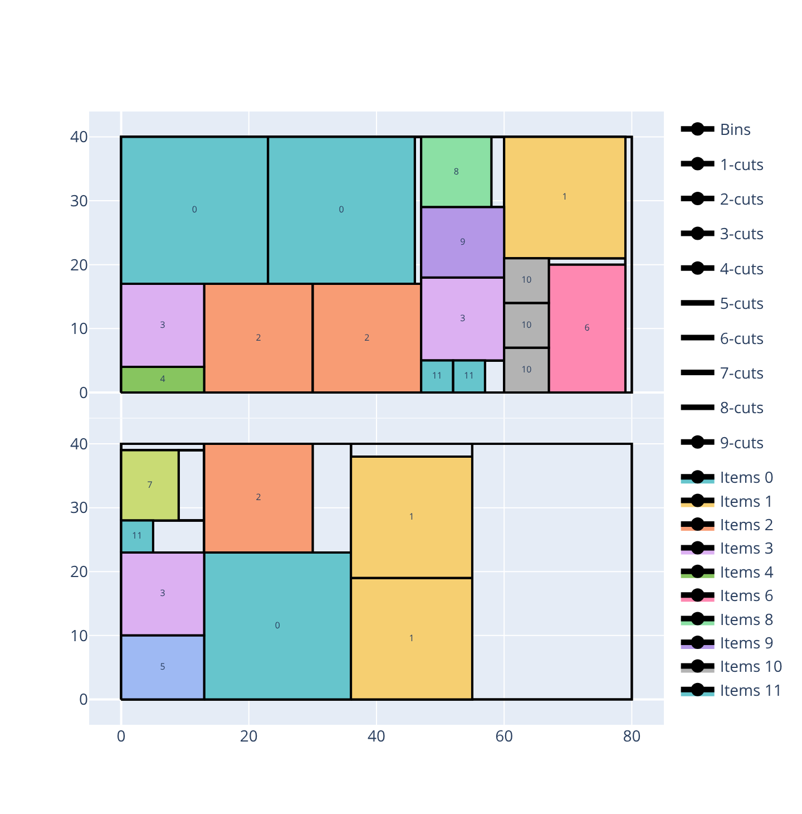

.. list-table::
   :widths: 1 1
   :header-rows: 1
   :align: center

   * - 2 stages
     - 3 stages
   * - |rectangleguillotine_stages_2|
     - |rectangleguillotine_stages_3|

An unlimited number of stages keeps the same 2 bins but reduces the waste further (6.46%), by nesting items through a deeper hierarchy of cuts (up to a 6th-stage cut, visible in the image below):

|rectangleguillotine_stages_unlimited|

.. example-tabs:: rectangleguillotine/stages_2 rectangleguillotine/stages_3 rectangleguillotine/stages_unlimited

.. _rectangleguillotine-cut-types:

Cut types
---------

* ``roadef2018``: pattern from the 2018 ROADEF challenge; stage-2 cuts produce only items of identical height; trimming cuts are allowed
* ``non-exact`` (default): more flexible; stage-3 cuts are not required; some waste is allowed in sub-plates
* ``exact``: items must fill their sub-plate exactly with no waste at stage 3
* ``homogenous``: all items in a strip have the same height

.. tab-set::
   :sync-group: interface

   .. tab-item:: Online solver
      :sync: web

      Choose the **Cut type** below the objective.

   .. tab-item:: JSON
      :sync: json

      In the instance: ``"cut_type": "exact"``.

   .. tab-item:: Python
      :sync: python

      ``instance_builder.set_cut_type(psg.CutType.Exact)``

   .. tab-item:: C++
      :sync: cpp

      ``instance_builder.set_cut_type(CutType::Exact);``

The following example packs 24 items (12 item types) into 80 × 40 bins with 3 cutting stages, a ``vertical`` first stage orientation and the :code:`bin-packing-with-leftovers` objective, which minimizes the number of bins first and, among solutions using that many bins, maximizes the leftover value of the last bin. Every bin in every solution below uses several genuine stage-1 cuts, splitting it into multiple vertical strips. All 4 cut types pack every item into the same 2 bins, but the leftover value they reach decreases as the cut type gets more restrictive:

* ``roadef2018``: leftover value 72 — the most permissive cut type, it takes full advantage of its free trimming cuts past the 3-stage budget
* ``non-exact``: leftover value 65 — still allows sub-plates to be filled with some waste, but without ``roadef2018``'s free trimming cuts, so it packs slightly less tightly
* ``exact``: leftover value 57 — items must fill their sub-plate exactly, which rules out some of the arrangements the 2 cut types above use
* ``homogenous``: leftover value 48 — the most restrictive cut type here, since items sharing a sub-plate must also be of the same type

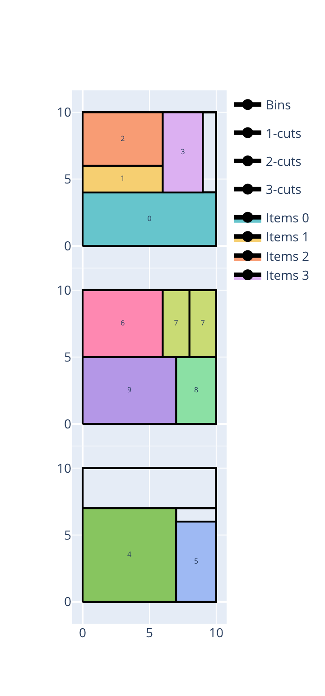

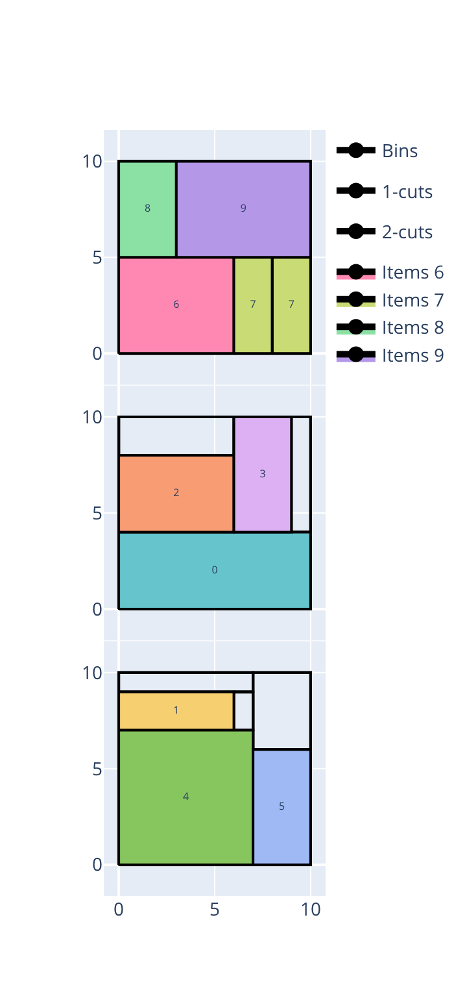

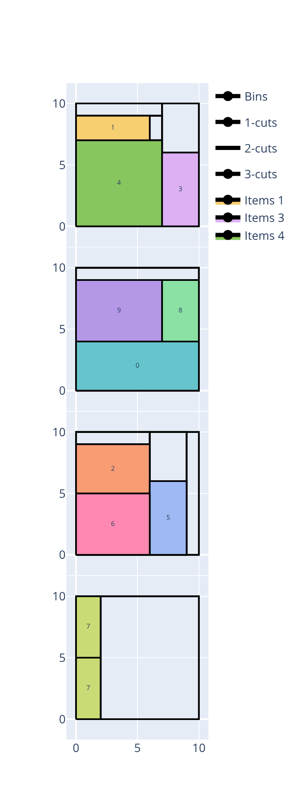

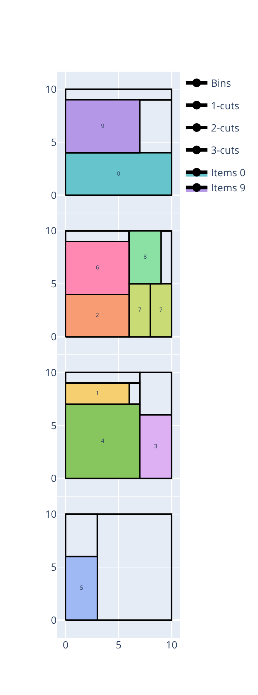

.. list-table::
   :widths: 1 1
   :header-rows: 1
   :align: center

   * - ``roadef2018``
     - ``non-exact``
   * - |rectangleguillotine_cuttype_roadef2018|
     - |rectangleguillotine_cuttype_nonexact|

.. list-table::
   :widths: 1 1
   :header-rows: 1
   :align: center

   * - ``exact``
     - ``homogenous``
   * - |rectangleguillotine_cuttype_exact|
     - |rectangleguillotine_cuttype_homogenous|

.. example-tabs:: rectangleguillotine/cuttype_roadef2018 rectangleguillotine/cuttype_nonexact rectangleguillotine/cuttype_exact rectangleguillotine/cuttype_homogenous

.. _rectangleguillotine-first-stage-orientation:

First stage orientation
-----------------------

The first stage orientation controls whether stage-1 cuts (see `Guillotine vs non-guillotine patterns`_ above) are ``vertical`` (default) or ``horizontal``; with ``any``, the orientation of the stage-1 cuts may differ from one plate to the other.

.. tab-set::
   :sync-group: interface

   .. tab-item:: Online solver
      :sync: web

      Choose the **First stage orientation** below the objective.

   .. tab-item:: JSON
      :sync: json

      In the instance: ``"first_stage_orientation": "horizontal"``.

   .. tab-item:: Python
      :sync: python

      ``instance_builder.set_first_stage_orientation(psg.CutOrientation.Horizontal)``

   .. tab-item:: C++
      :sync: cpp

      ``instance_builder.set_first_stage_orientation(CutOrientation::Horizontal);``

The following example packs 4 items (4 × 3, 4 × 7, 6 × 5 and 6 × 4) into 10 × 10 bins with only 2 cutting stages (:code:`bin-packing` objective). The two 4-wide items share a column, stacking to exactly fill a 4 × 10 vertical strip; the two 6-wide items share a second 6 × 10 vertical strip, stacking to a height of 9 with some waste. With vertical stage-1 cuts, the cuts run along these two columns and all 4 items fit into a single bin. With horizontal stage-1 cuts, since no two items share the same height, each stage-1 row can only hold one item at that depth, and a second bin is needed.

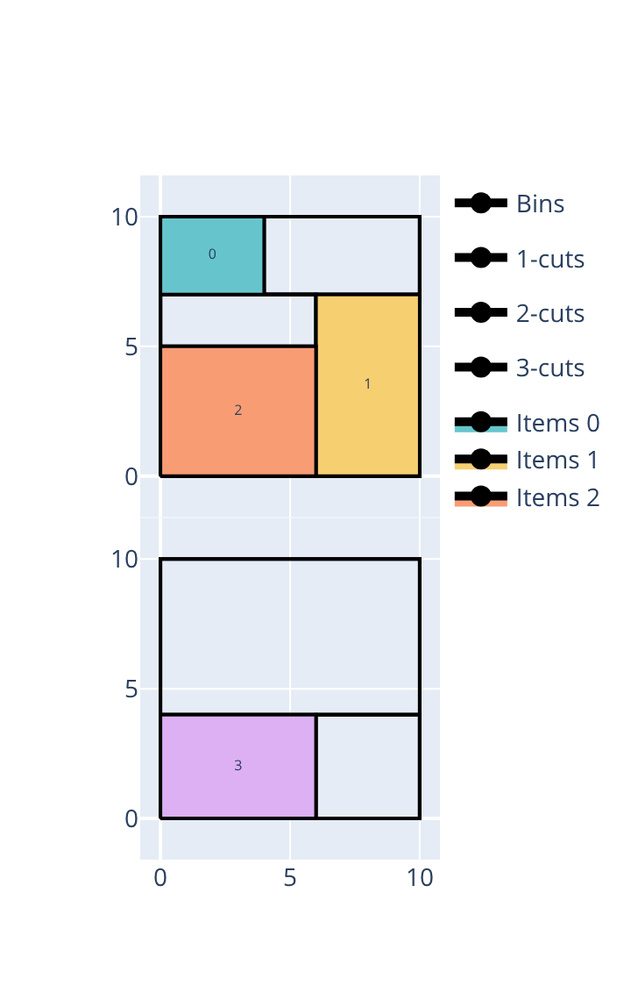

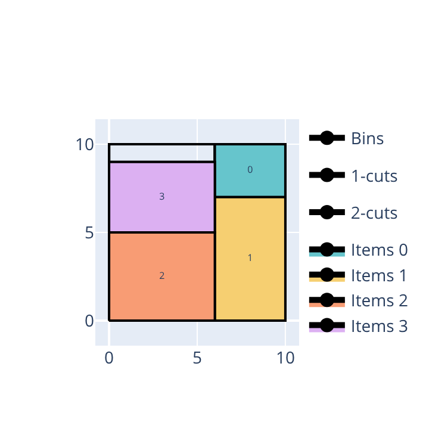

.. list-table::
   :widths: 1 1
   :header-rows: 1
   :align: center

   * - ``horizontal``
     - ``vertical``
   * - |rectangleguillotine_orientation_no|
     - |rectangleguillotine_orientation_yes|

.. example-tabs:: rectangleguillotine/orientation_no rectangleguillotine/orientation_yes

.. _rectangleguillotine-item-rotations:

Item rotations
--------------

By default, the items may be rotated by 90°. An item type can be fixed in its original orientation:

.. tab-set::
   :sync-group: interface

   .. tab-item:: Online solver
      :sync: web

      In the **Item types** table, check **Oriented**.

   .. tab-item:: JSON
      :sync: json

      In an item type: ``"oriented": true``.

   .. tab-item:: Python
      :sync: python

      ``instance_builder.add_item_type(width, height, oriented=True)``

   .. tab-item:: C++
      :sync: cpp

      ``instance_builder.add_item_type(width, height, true);``

The following example packs 2 copies of a 6 × 10 item into 10 × 12 bins (:code:`bin-packing` objective). When the items are oriented, two items side by side need a width of 12 (more than the 10 of the bin), and stacked they need a height of 20 (more than the 12 of the bin), so they can't share a bin: 2 bins are needed. When they can be rotated, both items are turned on their side (10 × 6) and stacked exactly into a single 10 × 12 bin.

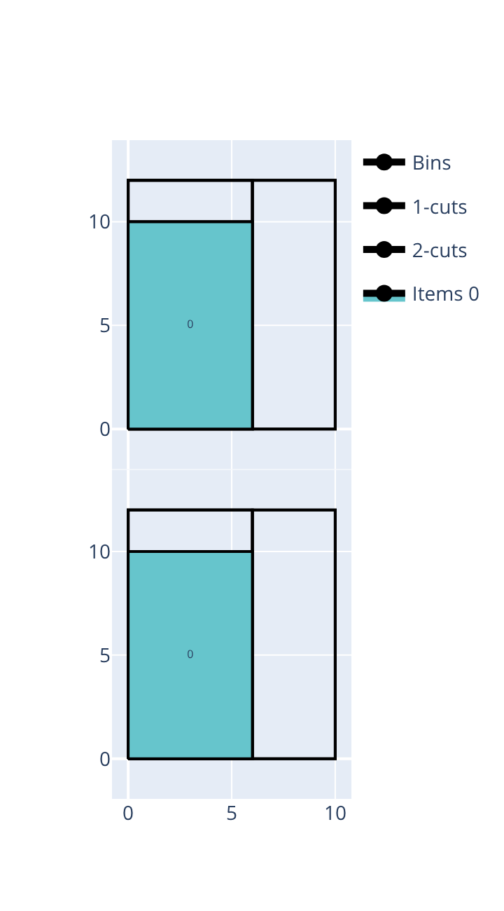

.. |rectangleguillotine_rotation_yes| image:: img/rectangleguillotine_rotation_yes.png
   :scale: 50%

.. list-table::
   :widths: 1 1
   :header-rows: 1
   :align: center

   * - Oriented items
     - Items which can be rotated
   * - |rectangleguillotine_rotation_no|
     - |rectangleguillotine_rotation_yes|

.. example-tabs:: rectangleguillotine/rotation_no rectangleguillotine/rotation_yes

.. _rectangleguillotine-cut-thickness:

Cut thickness
-------------

The cut thickness is the width of the saw blade: each cut consumes this width of material. Default: ``0``.

.. tab-set::
   :sync-group: interface

   .. tab-item:: Online solver
      :sync: web

      Fill the **Cut thickness** below the objective.

   .. tab-item:: JSON
      :sync: json

      In the instance: ``"cut_thickness": 1``.

   .. tab-item:: Python
      :sync: python

      ``instance_builder.set_cut_thickness(1)``

   .. tab-item:: C++
      :sync: cpp

      ``instance_builder.set_cut_thickness(1);``

The following example packs 3 items (10 × 4, 10 × 3 and 10 × 3) into 10 × 10 bins (:code:`bin-packing` objective), stacked to exactly fill the height of the bin. Without cut thickness, the 3 items fit in a single bin. With a cut thickness of 1, the two cuts separating the 3 items eat into the available height, so the third item no longer fits and a second bin is needed.

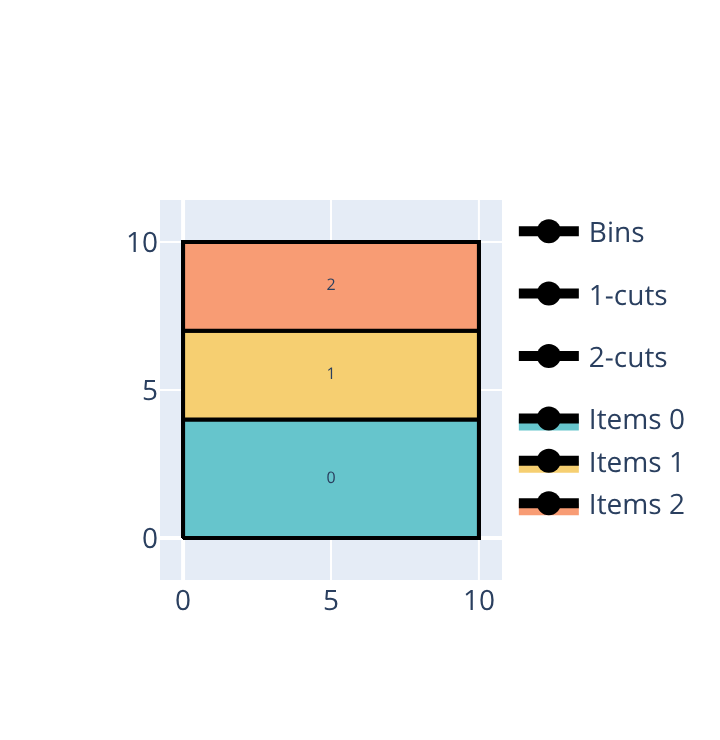

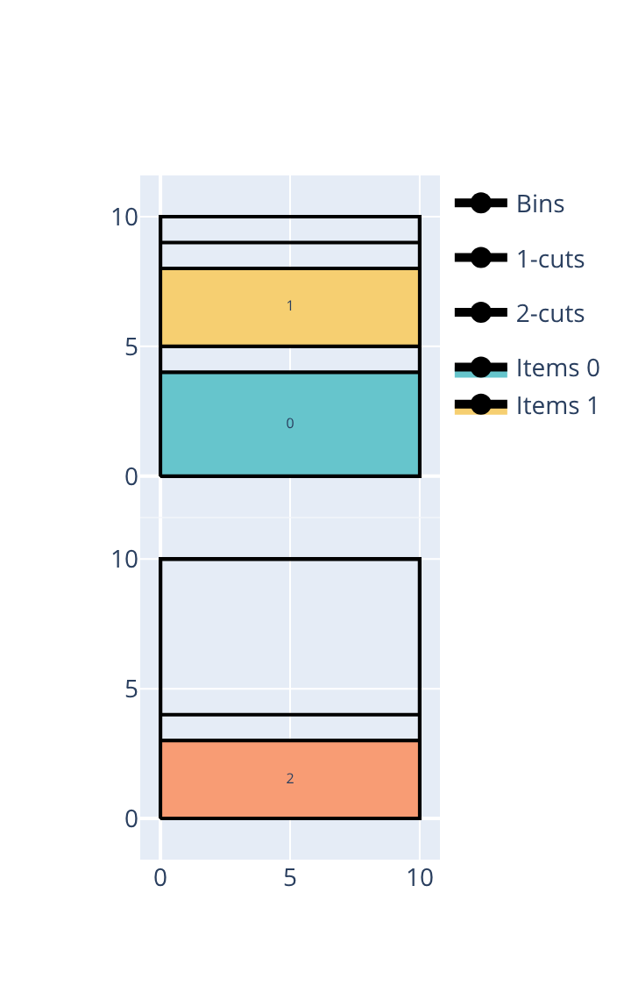

.. list-table::
   :widths: 1 1
   :header-rows: 1
   :align: center

   * - Cut thickness 0
     - Cut thickness 1
   * - |rectangleguillotine_cutthickness_no|
     - |rectangleguillotine_cutthickness_yes|

.. example-tabs:: rectangleguillotine/cutthickness_no rectangleguillotine/cutthickness_yes

.. _rectangleguillotine-trims:

Trims
-----

Trims model a reserved border around the bin (e.g., for clamping or edge defects). They prevent items from being placed within the specified distance of each edge.

* A **hard** trim is physically cut away: the trim strip is counted as waste. The left and bottom trims are hard by default.
* A **soft** trim is reserved but not cut: waste is only counted from the first actual cut inward. The right and top trims are soft by default.

.. tab-set::
   :sync-group: interface

   .. tab-item:: Online solver
      :sync: web

      In the **Bin types** table, fill the **Trims** of a bin type; click **More** on its row to change their types.

   .. tab-item:: JSON
      :sync: json

      In a bin type: ``"left_trim": 1``, ``"left_trim_type": "soft"``, and the same for ``right``, ``bottom`` and ``top``.

   .. tab-item:: Python
      :sync: python

      ``instance_builder.add_bin_type(width, height, trims={"left_trim": 1, "left_trim_type": psg.TrimType.Soft})``, and the same for ``right``, ``bottom`` and ``top``.

   .. tab-item:: C++
      :sync: cpp

      ``instance_builder.add_trims(bin_type_id, left_trim, left_trim_type, right_trim, right_trim_type, bottom_trim, bottom_trim_type, top_trim, top_trim_type);``

The following example packs 3 items (4 × 8, 3 × 8 and 3 × 8) into 10 × 10 bins (:code:`bin-packing` objective), side by side to exactly fill the width of the bin. Without trims, the 3 items fit in a single bin. With a trim of 1 on the four edges, only a width of 8 is left, which is no longer enough for the three items to sit side by side, so a second bin is needed.

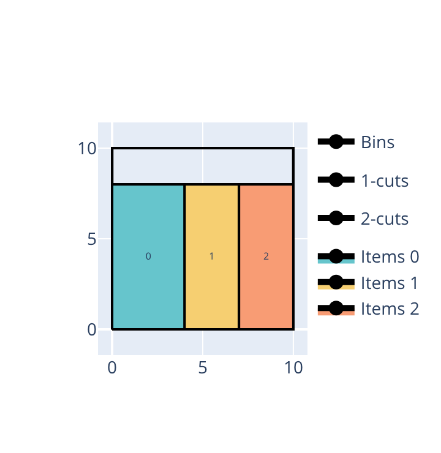

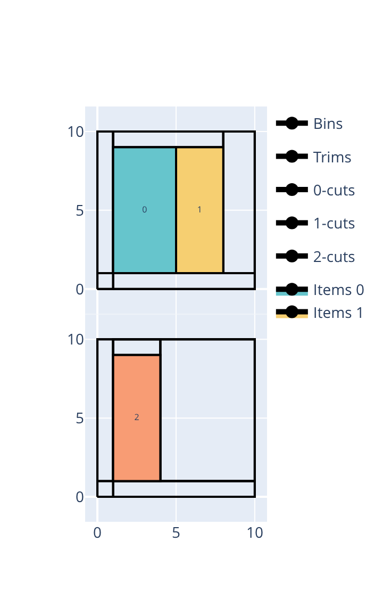

.. list-table::
   :widths: 1 1
   :header-rows: 1
   :align: center

   * - Without trims
     - With trims
   * - |rectangleguillotine_trims_no|
     - |rectangleguillotine_trims_yes|

.. example-tabs:: rectangleguillotine/trims_no rectangleguillotine/trims_yes

.. _rectangleguillotine-defects:

Defects
-------

Defects are rectangular regions of a bin where items cannot be placed. A defect is given by the position of its bottom-left corner (``x``, ``y``) and by its size (``width``, ``height``):

.. tab-set::
   :sync-group: interface

   .. tab-item:: Online solver
      :sync: web

      In the **Bin types** table, click **Add a defect** below a bin type, and fill its position (**X**, **Y**) and its size (**W**, **H**).

   .. tab-item:: JSON
      :sync: json

      In a bin type: ``"defects": [{"x": 4, "y": 4, "width": 2, "height": 2}]``.

   .. tab-item:: Python
      :sync: python

      ``instance_builder.add_defect(bin_type_id, x, y, width, height)``, where ``bin_type_id`` is returned by ``add_bin_type``.

   .. tab-item:: C++
      :sync: cpp

      ``instance_builder.add_defect(bin_type_id, x, y, width, height);``, where ``bin_type_id`` is returned by ``add_bin_type``.

The following example packs 2 copies of a 10 × 6 item into 10 × 12 bins (:code:`bin-packing` objective), stacked to fill each bin exactly. Without defects, one bin is enough. A small 2 × 2 defect in the middle of the bin, just below the join between the two items, leaves no room to shift either item out of the way: one of the two items no longer fits, so a second bin is needed.

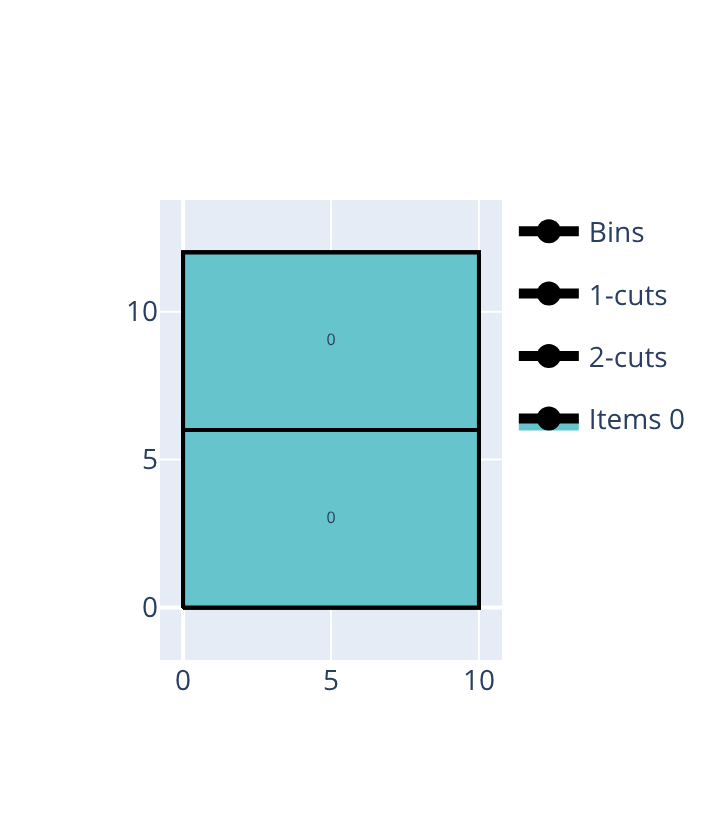

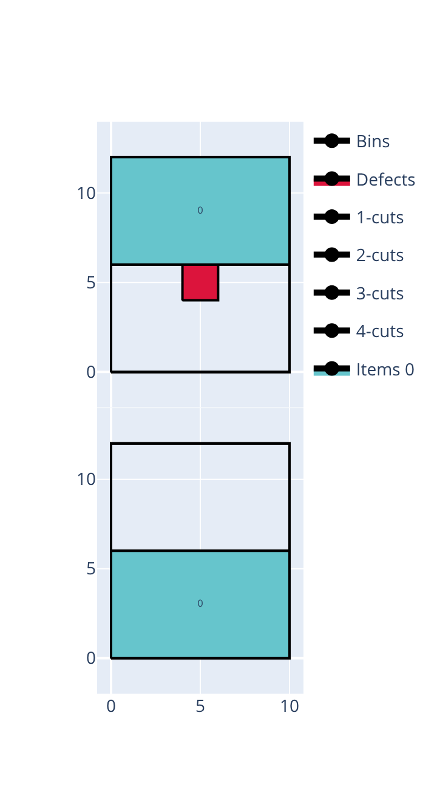

.. list-table::
   :widths: 1 1
   :header-rows: 1
   :align: center

   * - Without defects
     - With a defect
   * - |rectangleguillotine_defects_no|
     - |rectangleguillotine_defects_yes|

.. example-tabs:: rectangleguillotine/defects_no rectangleguillotine/defects_yes

.. _rectangleguillotine-cut-through-defects:

Cut through defects
-------------------

By default, a guillotine cut may not pass through a defect; it must be routed around it instead. This can be allowed:

.. tab-set::
   :sync-group: interface

   .. tab-item:: Online solver
      :sync: web

      Check **Cut through defects** below the objective.

   .. tab-item:: JSON
      :sync: json

      In the instance: ``"cut_through_defects": true``.

   .. tab-item:: Python
      :sync: python

      ``instance_builder.set_cut_through_defects(True)``

   .. tab-item:: C++
      :sync: cpp

      ``instance_builder.set_cut_through_defects(true);``

The following example packs a 5 × 5 and a 5 × 6 item into 10 × 10 bins with only 2 cutting stages (:code:`bin-packing` objective), so the two items — whose widths sum exactly to the width of the bin — must be separated by a single first-stage cut. A small 2 × 2 defect floats in the unused strip above the shorter item, without touching either item or the edges of the bin, but still straddling that cut. Allowing cuts through defects lets the solver cut straight through it, and both items fit into a single bin. Without it, that cut can no longer be made, so the two items can no longer share a bin, and a second bin is needed.

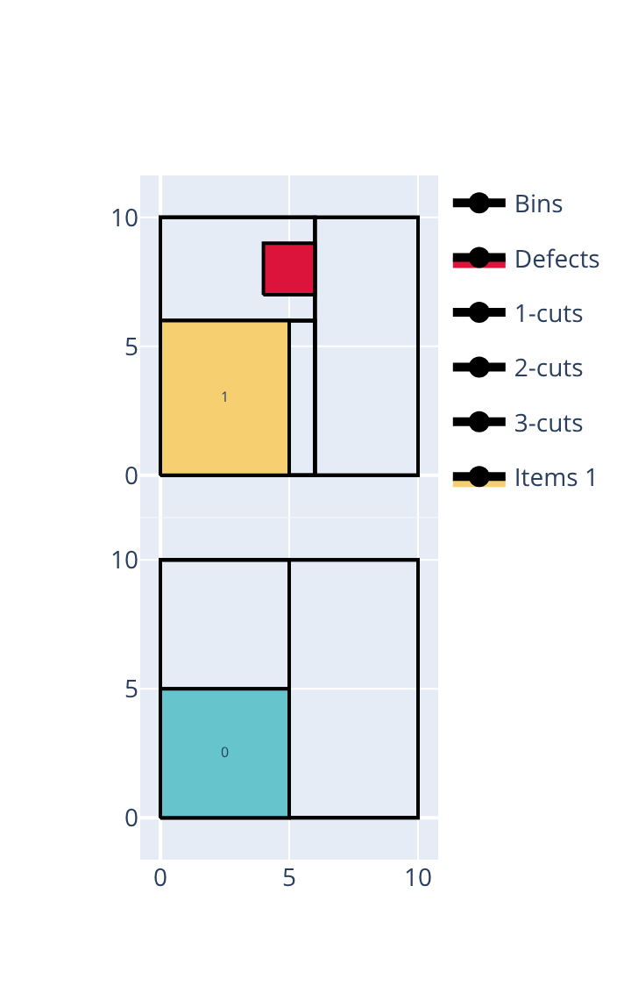

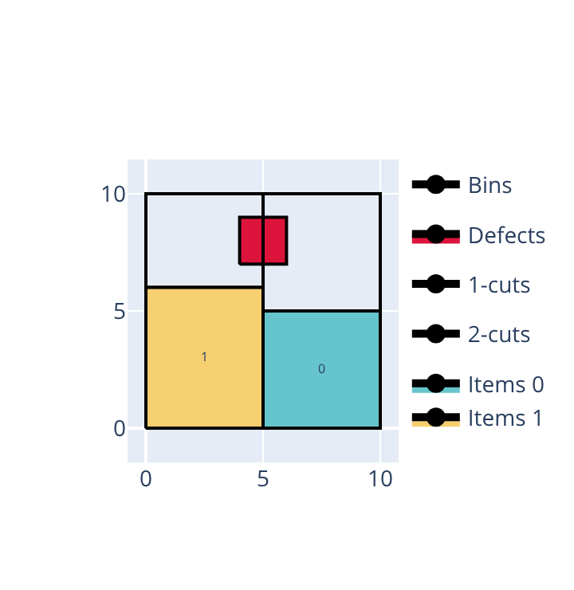

.. list-table::
   :widths: 1 1
   :header-rows: 1
   :align: center

   * - With cuts through defects
     - Without cuts through defects
   * - |rectangleguillotine_cutdefects_yes|
     - |rectangleguillotine_cutdefects_no|

.. example-tabs:: rectangleguillotine/cutdefects_yes rectangleguillotine/cutdefects_no

.. _rectangleguillotine-stacks:

Cutting sequences (stacks)
--------------------------

Items with the same stack id must be produced contiguously, in the order of their item types: all copies of an item type must be cut before moving on to the next item type of the same stack. This models a physical stack of items (e.g. glued or stapled together) that must be separated in a fixed sequence. By default, each item type forms its own stack, so no ordering constraint applies.

.. tab-set::
   :sync-group: interface

   .. tab-item:: Online solver
      :sync: web

      In the **Item types** table, click **More** on a row and fill its **Stack id**.

   .. tab-item:: JSON
      :sync: json

      In an item type: ``"stack_id": 0``.

   .. tab-item:: Python
      :sync: python

      ``instance_builder.add_item_type(width, height, stack_id=0)``

   .. tab-item:: C++
      :sync: cpp

      ``instance_builder.add_item_type(width, height, oriented, 0);``

The following example packs 4 items of width 5 into 10 × 10 bins (:code:`bin-packing` objective): two items of height 6 and 4 that together fill one 5 × 10 column, and two items of height 3 and 7 that together fill another 5 × 10 column. Without stacks, the solver is free to group the items by column and packs everything into a single bin. Splitting the items into two stacks of two — stack 0 with the items of height 6 and 7, stack 1 with the items of height 3 and 4 — pairs one item from each column in every stack, forcing each stack's two items to be produced back-to-back; since neither column can be completed without interrupting the other stack, a second bin is needed.

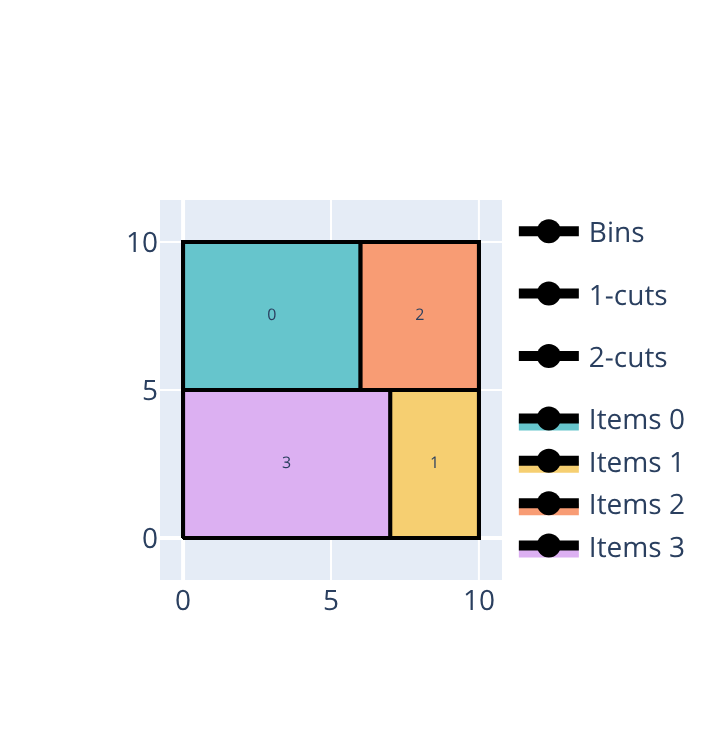

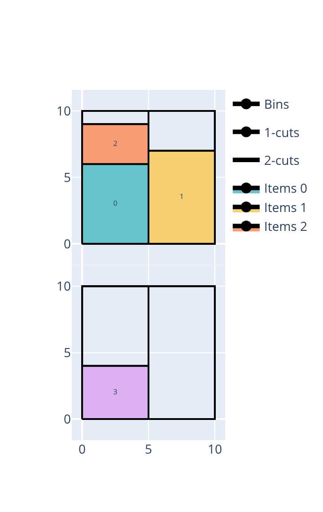

.. list-table::
   :widths: 1 1
   :header-rows: 1
   :align: center

   * - Without stacks
     - With stacks
   * - |rectangleguillotine_stacks_no|
     - |rectangleguillotine_stacks_yes|

.. example-tabs:: rectangleguillotine/stacks_no rectangleguillotine/stacks_yes

.. _rectangleguillotine-distances:

Minimum and maximum distances between cuts
------------------------------------------

* ``minimum_distance_1_cuts``: the minimum distance between two first-level (stage-1) cuts. Default: ``0``
* ``maximum_distance_1_cuts``: the maximum distance between two first-level cuts. Default: no limit (``-1``)
* ``minimum_distance_2_cuts``: the minimum distance between two second-level cuts. Default: ``0``
* ``maximum_distance_2_cuts``: the maximum distance between two second-level cuts. Default: no limit (``-1``); not allowed with 2 stages
* ``minimum_waste_length``: the minimum length of any waste piece. Default: ``0``

.. tab-set::
   :sync-group: interface

   .. tab-item:: Online solver
      :sync: web

      Fill the corresponding fields below the objective (**Minimum distance between 1-cuts**...).

   .. tab-item:: JSON
      :sync: json

      In the instance: ``"minimum_distance_1_cuts": 10``.

   .. tab-item:: Python
      :sync: python

      ``instance_builder.set_minimum_distance_1_cuts(10)``

   .. tab-item:: C++
      :sync: cpp

      ``instance_builder.set_minimum_distance_1_cuts(10);``

.. _rectangleguillotine-maximum-number-1-cuts:

Maximum number of consecutive 1-cuts
------------------------------------

The maximum number of 1-cuts in a bin. Default: no limit (``-1``); it can't be ``0``.

.. tab-set::
   :sync-group: interface

   .. tab-item:: Online solver
      :sync: web

      Fill the **Maximum number of 1-cuts** below the objective.

   .. tab-item:: JSON
      :sync: json

      In the instance: ``"maximum_number_1_cuts": 1``.

   .. tab-item:: Python
      :sync: python

      ``instance_builder.set_maximum_number_1_cuts(1)``

   .. tab-item:: C++
      :sync: cpp

      ``instance_builder.set_maximum_number_1_cuts(1);``

The following example packs 3 copies of a 3 × 10 item into 10 × 10 bins with only 2 cutting stages (:code:`bin-packing` objective). Without a limit, the 3 items are placed side by side using 2 stage-1 cuts, all in a single bin. With a maximum of 1 first-level cut, there are only 2 strips, so only 2 of the 3 items fit, and a second bin is needed for the third.

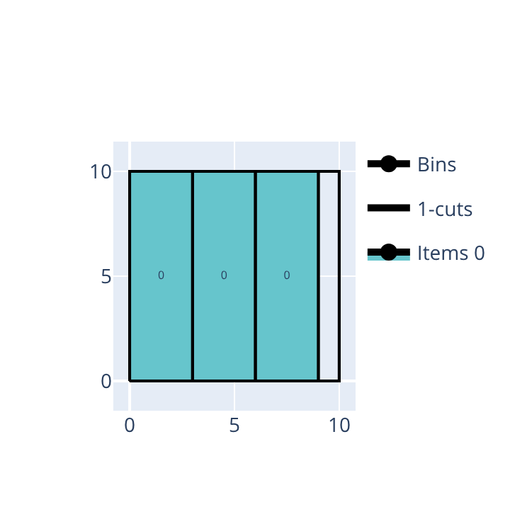

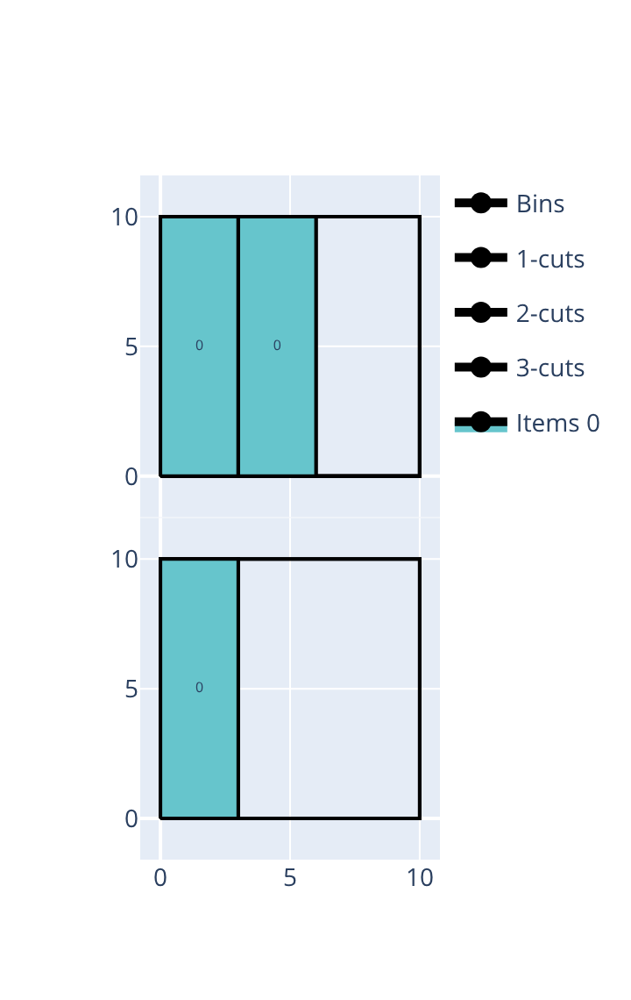

.. list-table::
   :widths: 1 1
   :header-rows: 1
   :align: center

   * - Without limit
     - At most 1 first-level cut
   * - |rectangleguillotine_maxcuts_no|
     - |rectangleguillotine_maxcuts_yes|

.. example-tabs:: rectangleguillotine/maxcuts_no rectangleguillotine/maxcuts_yes

.. _rectangleguillotine-maximum-number-2-cuts:

Maximum number of consecutive 2-cuts
------------------------------------

The maximum number of 2-cuts in a first-level sub-plate. Default: no limit (``-1``).

.. tab-set::
   :sync-group: interface

   .. tab-item:: Online solver
      :sync: web

      Fill the **Maximum number of 2-cuts** below the objective.

   .. tab-item:: JSON
      :sync: json

      In the instance: ``"maximum_number_2_cuts": 1``.

   .. tab-item:: Python
      :sync: python

      ``instance_builder.set_maximum_number_2_cuts(1)``

   .. tab-item:: C++
      :sync: cpp

      ``instance_builder.set_maximum_number_2_cuts(1);``

The following example packs 4 items (10 × 3, 10 × 3, 10 × 4 and 10 × 10) into 20 × 10 bins with vertical first-stage cuts (:code:`bin-packing` objective). A stage-1 cut splits the bin into two 10-wide strips: one holds the 10 × 10 item alone, the other stacks the three shorter items using 2 stage-2 cuts. Without a limit, all 4 items fit into a single bin. With a maximum of 1 second-level cut, there are only 2 shelves per strip, so only 2 of the 3 stacked items fit, and a second bin is needed for the third.

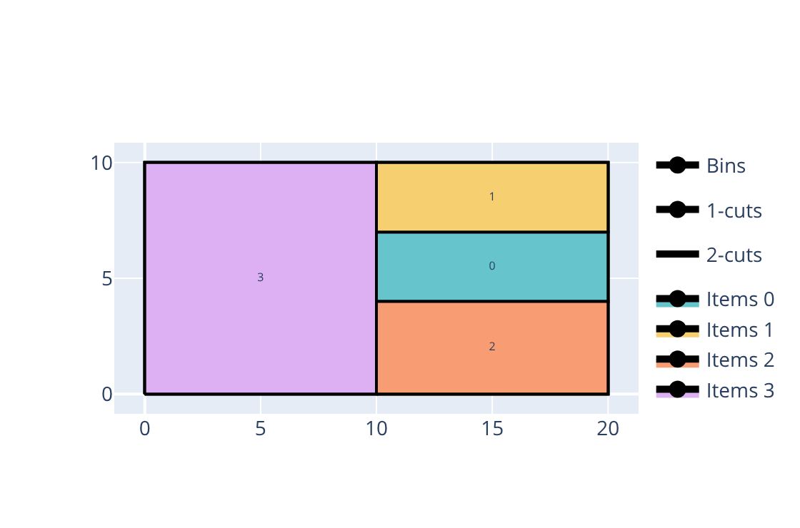

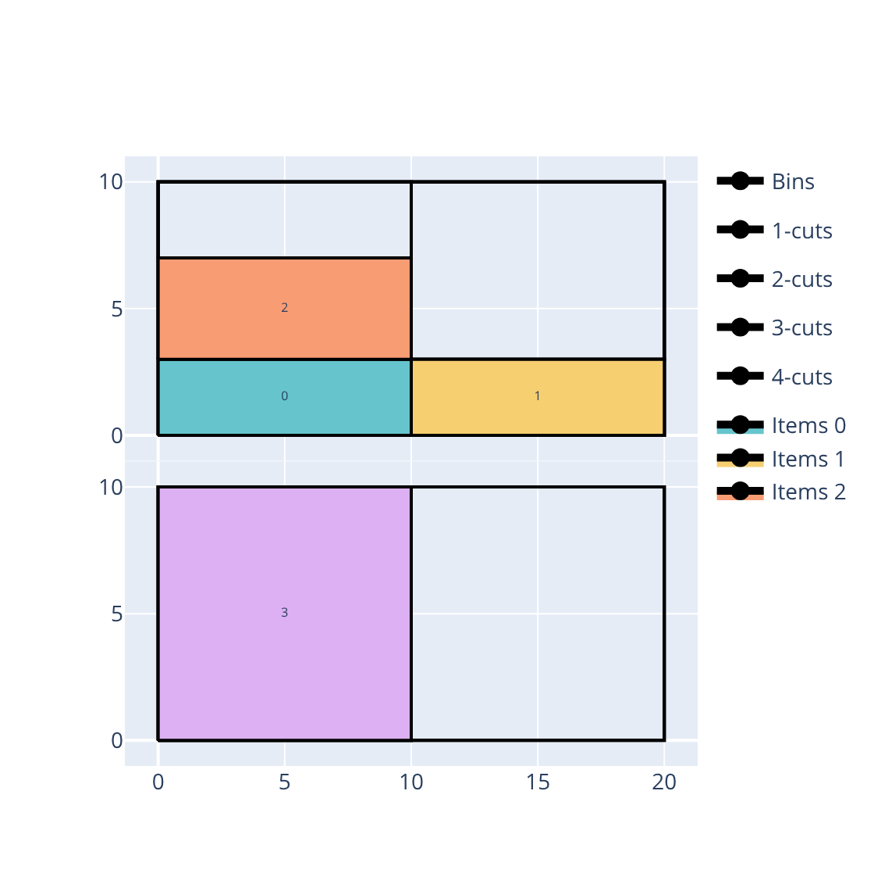

.. list-table::
   :widths: 1 1
   :header-rows: 1
   :align: center

   * - Without limit
     - At most 1 second-level cut
   * - |rectangleguillotine_maxcuts2_no|
     - |rectangleguillotine_maxcuts2_yes|

.. example-tabs:: rectangleguillotine/maxcuts2_no rectangleguillotine/maxcuts2_yes
